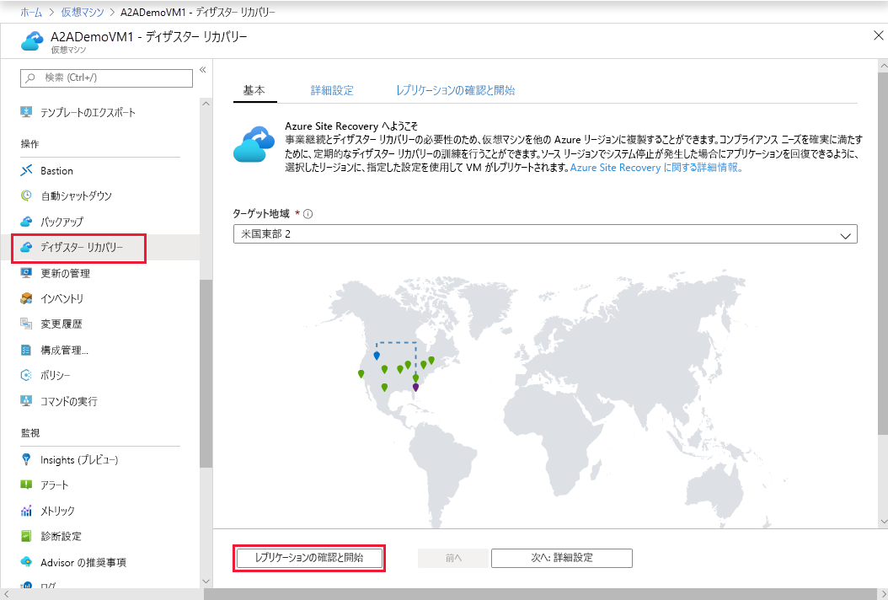
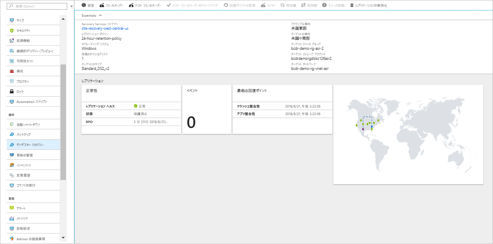
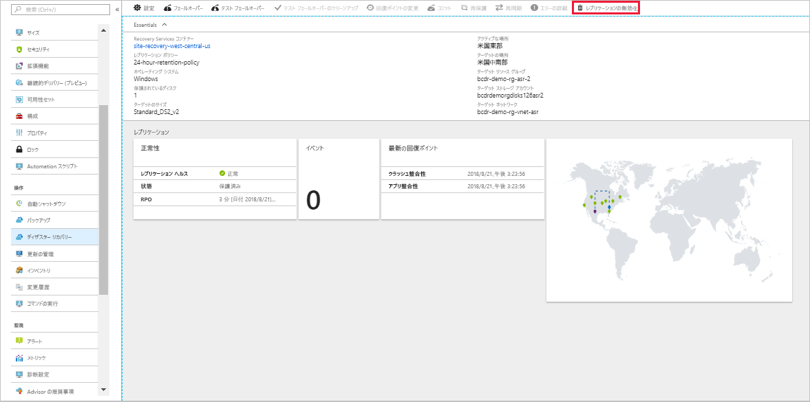

# Azure VM を別の Azure リージョンにレプリケートする

[Azure Site Recovery](site-recovery-overview.md) サービスは、計画された停止や計画外の停止の際にビジネス アプリを実行し続け、使用できるようにすることで、ビジネス継続性とディザスター リカバリー (BCDR) 戦略に貢献します。 Site Recovery は、レプリケーション、フェールオーバー、フェールバックなど、オンプレミスのマシンと Azure Virtual Machines (VM) のディザスター リカバリーを管理し、調整します。

このクイック スタートでは、Azure VM を別の Azure リージョンにレプリケートする方法について説明します。 

Azure サブスクリプションをお持ちでない場合は、開始する前に [無料アカウント](https://azure.microsoft.com/free/?WT.mc_id=A261C142F) を作成してください。

## Azure にログインする

Azure Portal (http://portal.azure.com) にログインします。

## Azure VM のレプリケーションの有効化

1. Azure Portal で **[仮想マシン]** をクリックし、レプリケートする VM を選択します。

2. **[操作]** で、**[ディザスター リカバリー]** をクリックします。
3. **[Configure disaster recovery]\(ディザスター リカバリーを構成する\)** > **[ターゲット リージョン]** で、レプリケート先のターゲット リージョンを選択します。
4. このクイック スタートでは、その他は既定の設定をそのまま使用します。
5. **[レプリケーションを有効にする]** をクリックします。 これにより VM レプリケーションを有効にするジョブが開始されます。

    

## 設定の確認

レプリケーション ジョブの完了後、レプリケーションの状態を確認し、レプリケーションの設定を変更して、デプロイをテストできます。

1. VM のメニューで、**[ディザスター リカバリー]** をクリックします。
2. レプリケーションの正常性、作成された復旧ポイント、およびマップ上のソース リージョンとターゲット リージョンを確認できます。

   

## リソースのクリーンアップ

プライマリ リージョンの VM のレプリケーションは、そのレプリケーションを無効にすると停止されます。

- ソース レプリケーションの設定は自動的にクリーンアップされます。
- VM の Site Recovery の課金も停止します。

レプリケーションを停止するには、次の手順に従います。

1. VM を選択します。
2. **[ディザスター リカバリー]** で、**[詳細]** をクリックします。
3. **[レプリケーションの無効化]** をクリックします。

   

## 次の手順

このクイック スタートでは、1 つの VM をセカンダリ リージョンにレプリケートしました。

> [!div class="nextstepaction"]
> [Azure VM のディザスター リカバリーを構成する](azure-to-azure-tutorial-enable-replication.md)
