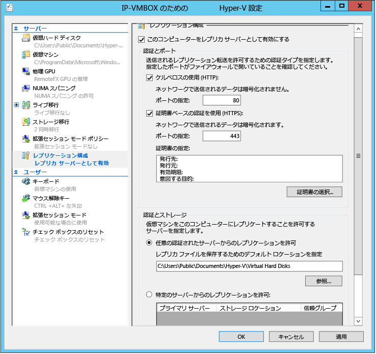

# Site Recovery の Hyper-V Capacity Planner ツールを実行する

Azure Site Recovery デプロイメントの一環として、お客様のレプリケーションと帯域幅の要件を確認する必要があります。 Hyper-V 仮想マシンのレプリケーションの場合には、この確認は Site Recovery の Hyper-V Capacity Planner を使用して行うことができます。

この記事では、Hyper-V Capacity Planner ツールの実行方法について説明します。 このツールは、[Site Recovery の容量計画](site-recovery-capacity-planner.md)に関するページを参照しながら使用してください。

## 開始する前に
プライマリ サイトの Hyper-V サーバーまたはクラスター ノードでツールを実行します。 ツールを実行するには、Hyper-V ホスト サーバーが次の要件を満たしている必要があります。

* オペレーティング システム: Windows Server 2012 または 2012 R2
* メモリ: 20 MB (最小)
* CPU: 5% オーバーヘッド (最小)
* ディスク領域: 5 MB (最小)

このツールを実行する前に、プライマリ サイトの準備を行う必要があります。 2 つのオンプレミス サイト間でレプリケートする場合に帯域幅を確認するには、レプリカ サーバーの準備も必要です。

## 手順 1: プライマリ サイトを準備します。

1. プライマリ サイトでは、レプリケートする Hyper-V VM と、それらが配置されている Hyper-V ホスト/クラスターすべてについての一覧を作成します。 ツールは複数のスタンドアロン サーバー ホストに対して、または単一のクラスターに対して実行できますが、両方に対して同時に実行することはできません。 また、ツールはオペレーティング システムごとに別々に実行する必要があります。したがって、Hyper-V サーバーに関する情報は次のようにまとめてメモする必要があります。

   * Windows Server 2012 スタンドアロン サーバー
   * Windows Server 2012 クラスター
   * Windows Server 2012 R2 スタンドアロン サーバー
   * Windows Server 2012 R2 クラスター
2. すべての Hyper-V ホストおよびクラスターで WMI へのリモート アクセスを有効にします。 次のコマンドを各サーバー/クラスターで実行して、ファイアウォール規則とユーザー アクセス許可が設定されていることを確認します。

        netsh firewall set service RemoteAdmin enable
3. 次のように、サーバーおよびクラスター上でパフォーマンスの監視を有効にします。

   * **[セキュリティの詳細]** スナップインで Windows ファイアウォールを開き、**[COM + ネットワーク アクセス (DCOM-IN)]** 受信規則と **[リモート イベントのログ管理]** グループのすべての規則を有効にします。

## 手順 2: レプリカ サーバーを準備します (オンプレミス間のレプリケーション)
Azure にレプリケートする場合、この手順は必要ありません。

1 つの Hyper-V ホストを復旧サーバーとしてセットアップすることをお勧めします。そうすれば、そのサーバーにダミーの VM をレプリケートすることで帯域幅を調べることができます。  この作業は省略しても構いませんが、ダミーのレプリケーションを行わない限り帯域幅を測定することはできません。

1. クラスター ノードをレプリカとして使用する場合は、Hyper-V レプリカ ブローカーを構成します。

   * **サーバー マネージャー**で、**[フェールオーバー クラスター マネージャー]** を開きます。
   * クラスターに接続し、クラスター名を強調表示し、**[操作]**  >  **[役割の構成]** の順にクリックし、高可用性ウィザードを開きます。
   * **[役割の選択]** で、**[Hyper-V レプリカ ブローカー]** をクリックします。 ウィザードで、**[NetBIOS 名]** とクラスターの接続ポイント (クライアント アクセス ポイントと呼ばれます) として使用する **[IP アドレス]** を指定します。 **Hyper-V レプリカ ブローカー**が構成され、クライアント アクセス ポイント名が生成されます。この名前はメモする必要があります。
   * Hyper-V レプリカ ブローカーの役割がオンラインになったこと、およびクラスターの全ノード間でフェールオーバーできることを検証します。 これを行うには、役割を右クリックし、**[移動]** をポイントして **[ノードの選択]** をクリックします。 ノードを選択し、**[OK]** をクリックします。
   * 証明書ベースの認証を使用する場合は、各クラスター ノードとクライアント アクセス ポイントのすべてに証明書がインストールされていることを確認します。
2. レプリカ サーバーを有効にします。

   * クラスターの場合は、障害クラスター マネージャーを開き、クラスターに接続し、**[役割]** をクリックして役割を選択し、**[レプリケーションの設定]**  >  **[レプリカ サーバーとしてこのクラスターを有効にする]** の順にクリックします。 クラスターをレプリカとして使用する場合は、プライマリ サイト内のクラスターにも Hyper-V レプリカ ブローカーの役割が存在する必要があります。
   * スタンドアロン サーバーの場合は、Hyper-V マネージャーを開きます。 **[操作]** ウィンドウで、有効にするサーバーの **[Hyper-V の設定]** をクリックし、**[レプリケーションの構成]** で **[レプリカ サーバーとしてこのコンピューターを有効にする]** をクリックします。
3. 認証をセットアップします。

   * **[認証とポート]** で、プライマリ サーバーを認証する方法と、認証ポートを選択します。 証明書を使用する場合は、**[証明書の選択]** をクリックしていずれかを選択します。 プライマリと復旧の両方の Hyper-V ホストが同じドメインにあるか、信頼されたドメインにある場合は、Kerberos を使用します。 ドメインが異なるか、またはワークグループのデプロイの場合は証明書を使用します。
   * **[承認と記憶域]** セクションで、**任意**の認証済み (プライマリ) サーバーにこのレプリカ サーバーに複製データを送信することを許可します。

     
   * 「**netsh http show servicestate**」を実行して、指定したプロトコル/ポートに対してリスナーが実行されていることを確認します。  
4. ファイアウォールをセットアップします。 Hyper-V のインストール時には、既定のポート (HTTPS では 443、Kerberos では 80) のトラフィックを許可するファイアウォール規則が作成されます。 次のように、これらのルールを有効にします。
  - クラスターでの証明書認証 (443): ``Get-ClusterNode | ForEach-Object {Invoke-command -computername \$\_.name -scriptblock {Enable-Netfirewallrule -displayname "Hyper-V Replica HTTPS Listener (TCP-In)"}}``
  - クラスターでの Kerberos 認証 (80): ``Get-ClusterNode | ForEach-Object {Invoke-command -computername \$\_.name -scriptblock {Enable-Netfirewallrule -displayname "Hyper-V Replica HTTP Listener (TCP-In)"}}``
  - スタンドアロン サーバーでの証明書認証: ``Enable-Netfirewallrule -displayname "Hyper-V Replica HTTPS Listener (TCP-In)"``
  - スタンドアロン サーバーでの Kerberos 認証: ``Enable-Netfirewallrule -displayname "Hyper-V Replica HTTP Listener (TCP-In)"``

## 手順 3: 容量計画ツールを実行します。
プライマリ サイトを準備し、復旧サーバーをセットアップしたら、ツールを実行できます。

1. [ダウンロード](https://www.microsoft.com/download/details.aspx?id=39057) the tool from the Microsoft ダウンロード Center.
2. いずれかのプライマリ サーバー (またはプライマリ クラスターのノード) からツールを実行します。 .exe ファイルを右クリックし、 **[管理者として実行]**を選択します。
3. **[開始する前に]** で、データを収集する期間を指定します。 代表的なデータが対象となるように、業務時間中にツールを実行することをお勧めします。 ネットワーク接続を検証するだけである場合は、数分の収集にとどめることもできます。

    
4. **[Primary site details] \(プライマリ サイトの詳細)** で、スタンドアロン ホストの場合はサーバー名または FQDN を指定し、クラスターの場合はクライアント アクセス ポイントの FQDN、クラスター名、またはクラスター内の任意のノードを指定してから、**[次へ]** をクリックします。 ツールは、それが実行されているサーバーの名前を自動的に検出します。 このツールは、指定されたサーバーについて監視できる仮想マシンを取得します。

    
5. Azure にレプリケートする場合、またはセカンダリ データ センターにレプリケートする予定でレプリカ サーバーをセットアップしていない場合は、**[Replica Site Details] \(レプリカ サイトの詳細)** の **[Skip tests involving replica site] \(レプリカ サイトに関連するテストをスキップする)** をオンにします。 セカンダリ データ センターにレプリケートする場合で、レプリカ サーバーをセットアップ済みであるときは、**[Server name (or) Hyper-V Replica Broker CAP] \(サーバー名 (または) Hyper-V レプリカ ブローカー CAP)** にスタンドアロン サーバーの FQDN またはクラスターのクライアント アクセス ポイントの FQDN を入力します。

    
6. **[Extended Replica Details] \(拡張レプリカの詳細)** の **[Skip the tests involving Extended Replica site] \(拡張レプリカ サイトに関連するテストをスキップする)** を有効にします。 これらのテストは、Site Recovery ではサポートされていません。
7. **[Choose VMs to Replicate] \(レプリケートする VM の選択)** で、ツールが **[Primary Site Details] \(プライマリ サイトの詳細)** ページで指定された設定に従ってサーバーまたはクラスターに接続し、プライマリ サーバー上で動作している VM およびディスクを表示します。 レプリケーションが既に有効になっている VM、および実行されていない VM は表示されないので注意してください。 メトリックスを収集する VM を選択します。 VHD を選択すると、VM のデータも自動的に収集されます。
8. レプリカ サーバーまたはクラスターが構成済みである場合、**[ネットワーク情報]** では、プライマリ サイトとレプリカ サイト間で使用されると考えられるおおよその WAN 帯域幅を指定し、さらに証明書認証が構成済みである場合には証明書を選択します。

    
9. **[概要]** で設定内容を確認し、**[次へ]** をクリックしてメトリックスの収集を開始します。 **[容量の計算]** ページにはツールの進行状況と状態が表示されます。 ツールの実行が完了したら、**[レポートの表示]** をクリックし、出力を確認します。 既定では、レポートとログは **%systemdrive%\Users\Public\Documents\Capacity Planner** に格納されます。

   

## 手順 4: 結果を解釈します。

重要なメトリックスは次のとおりです。 ここに一覧されていないメトリックスは無視して構いません。 Site Recovery とは関連がないからです。

### オンプレミス間のレプリケーション

* プライマリ ホストのコンピューティングとメモリに対するレプリケーションの影響
* プライマリ、復旧ホストのストレージ ディスク領域、IOPS に対するレプリケーションの影響
* デルタ レプリケーション (Mbps) に必要な帯域幅の合計
* プライマリ ホストと復旧ホストの間で観察されたネットワーク帯域幅 (Mbps)
* 2 つのホスト/クラスター間の有効な並列転送の理想的な数に関する提案

### オンプレミスから Azure へのレプリケーション

* プライマリ ホストのコンピューティングとメモリに対するレプリケーションの影響
* プライマリ ホストのストレージ ディスク領域と IOPS に対するレプリケーションの影響
* デルタ レプリケーション (Mbps) に必要な帯域幅の合計

## その他のリソース
* ツールの詳細については、ダウンロード時にツールに付属していたドキュメントを参照してください。
* ツールのチュートリアルについては、Keith Mayer の [TechNet ブログ](http://blogs.technet.com/b/keithmayer/archive/2014/02/27/guided-hands-on-lab-capacity-planner-for-windows-server-2012-hyper-v-replica.aspx)を参照してください。
* [こちら](site-recovery-performance-and-scaling-testing-on-premises-to-on-premises.md) を参照してください。

## 次のステップ

容量計画を完了すると、Site Recovery のデプロイを始めることができます。

* [VMM クラウドの Hyper-V VM を Azure にレプリケートする](site-recovery-vmm-to-azure.md)
* [Hyper-V VM (VMM なし) を Azure にレプリケートする](site-recovery-hyper-v-site-to-azure.md)
* [VMM サイト間で Hyper-V VM をレプリケートする](site-recovery-vmm-to-vmm.md)

