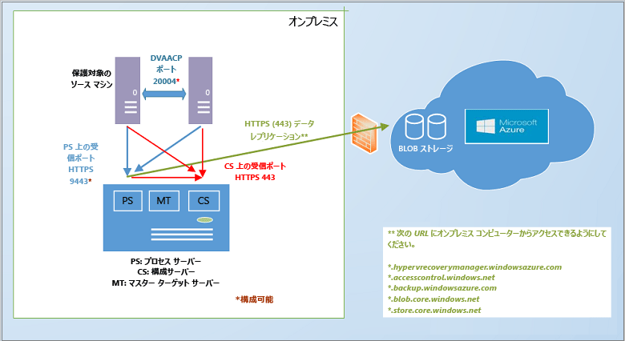
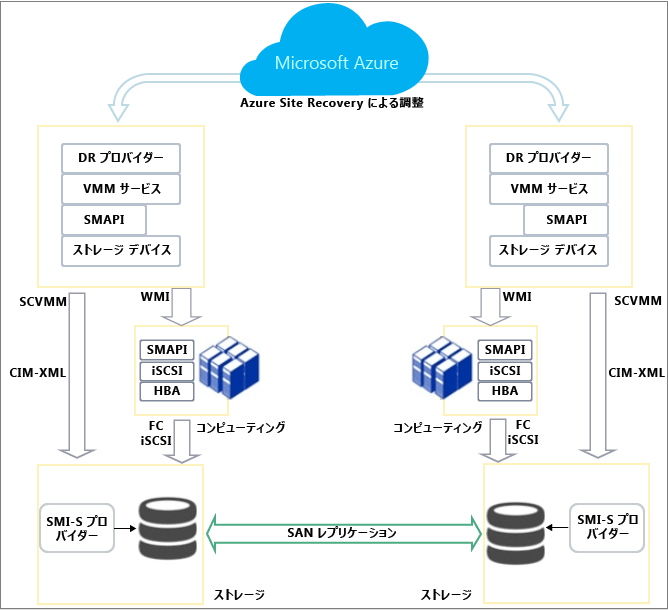

# Azure Site Recovery のしくみ
この記事では、Azure Site Recovery サービスの基になるアーキテクチャと、それを機能させるためのコンポーネントについて説明します。

コメントや質問はこの記事の末尾、または [Azure Recovery Services フォーラム](https://social.msdn.microsoft.com/forums/azure/home?forum=hypervrecovmgr)で投稿してください。

## 概要
組織には、予定されたダウンタイムおよび予定外のダウンタイム時にアプリ、ワークロード、およびデータの実行と利用可能な状態を維持し、できるだけ早く通常の動作状態に復旧させる方法を決定する BCDR の戦略が必要です。 BCDR 戦略は、災害発生時にビジネス データを安全かつ回復可能な状態に維持し、ワークロードが継続的に利用可能な状態に保たれるようなものである必要があります。

Site Recovery とは、クラウド (Azure) またはセカンダリ データセンターへのオンプレミスの物理サーバーおよび仮想マシンのレプリケーションを統制することで BCDR 戦略を支援する Azure サービスです。 プライマリ ロケーションで障害が発生した場合は、セカンダリ ロケーションにフェールオーバーしてアプリとワークロードの可用性を維持します。 プライマリの場所が通常の動作に戻ると、その場所にフェールバックします。 詳細については、「 [Site Recovery とは](site-recovery-overview.md)

## Azure ポータルの Site Recovery
Azure には、リソースの作成と操作に関して、Azure Resource Manager モデルとクラシック サービス管理モデルという 2 種類の[デプロイメント モデル](../resource-manager-deployment-model.md)があります。 また、ポータルも 2 つあります。クラシック デプロイメント モデルをサポートする [Azure クラシック ポータル](https://manage.windowsazure.com/)と、両方のデプロイメント モデルをサポートする [Azure Portal](https://portal.azure.com) です。

このクラシック ポータルと Azure ポータルの両方で Site Recovery を使用することができます。 Azure クラシック ポータルでは、クラシック サービス管理モデルで Site Recovery をサポートできます。 Azure ポータルでは、クラシック モデルまたは Resource Manager デプロイメント モデルをサポートできます。 [こちら](site-recovery-overview.md#site-recovery-in-the-azure-portal) をご覧ください。

この記事の情報は、クラシック ポータルと Azure ポータルの両方のデプロイに当てはまります。 違いについては、該当する箇所で説明します。

## デプロイメント シナリオ
Site Recovery は、次のようなさまざまなシナリオで、レプリケーションを調整するためにデプロイできます。

* **VMware 仮想マシンをレプリケートする**: オンプレミスの VMware 仮想マシンを Azure またはセカンダリ データセンターにレプリケートできます。
* * **物理マシンをレプリケートする**: Windows または Linux を実行している物理マシンを Azure またはセカンダリ データセンターにレプリケートできます。 物理マシンをレプリケートするためのプロセスは、VMware VM をレプリケートするためのプロセスとほとんど同じです。
* **(VMM を使用しない) Hyper-V VM をレプリケートする**: VMM で管理されていない Hyper-V VM を Azure にレプリケートできます。
* **System Center VMM クラウドで管理されている Hyper-V VM をレプリケートする**: VMM クラウド内で Hyper-V ホスト サーバーを実行しているオンプレミス Hyper-V 仮想マシンを Azure またはセカンダリ データセンターにレプリケートできます。 標準の Hyper-V レプリカか SAN レプリケーションを使用してレプリケートできます。
* **VM を移行する**: Site Recovery を使用して、リージョン間で [Azure IaaS VM を移行](site-recovery-migrate-azure-to-azure.md)したり、Azure IaaS VM に [AWS Windows インスタンスを移行](site-recovery-migrate-aws-to-azure.md)したりできます。 現時点では移行のみがサポートされています。そのため、これらの VM をフェールオーバーすることはできますが、フェールバックすることはできません。

Site Recovery は、これらの VM と物理サーバーで実行されているほとんどのアプリをレプリケートできます。 サポートされるアプリの概要については、「 [Azure Site Recovery で保護できるワークロード](site-recovery-workload.md)

## Azure へのレプリケート: VMware 仮想マシンまたは Windows/Linux 物理サーバー
Site Recovery を使用して VMware VM をレプリケートする方法は複数あります。

* **Azure ポータルを使用する**- Azure ポータルで Site Recovery をデプロイしている場合は、クラシック サービス マネージャー ストレージまたは Resource Manager に VM をフェールオーバーできます。 Azure ポータルで VMware VM をレプリケートすると、Azure でクラシック ストレージまたは Resource Manager ストレージにレプリケートできるなど、多数の利点が得られます。 [詳細情報](site-recovery-vmware-to-azure.md)。
* **クラシック ポータルを使用する** - クラシック ポータルの強化されたエクスペリエンスを使用して Site Recovery をデプロイできます。 クラシック ポータルでの新規デプロイでは、常にこのエクスペリエンスを使用してください。 このデプロイでは、VM のフェールオーバー先に Azure のクラシック ストレージのみを指定でき、Resource Manager にはフェールオーバーできません。 [詳細情報](site-recovery-vmware-to-azure-classic.md)。 クラシック ポータルでは、[従来のエクスペリエンス](site-recovery-vmware-to-azure-classic-legacy.md)で VMware レプリケーションをセットアップすることもできます。 新規デプロイでは、このエクスペリエンスを使用しないでください。  既に従来のエクスペリエンスを使用してデプロイしている場合は、強化されたデプロイに[移行する方法](site-recovery-vmware-to-azure-classic-legacy.md#migrate-to-the-enhanced-deployment)を確認してください。

Site Recovery をデプロイして VMware VM/物理サーバーをレプリケートするためのアーキテクチャ要件は、Azure ポータルと Azure クラシック ポータル (強化バージョン) とでほとんど同じですが、いくつか異なる点があります。

* Azure ポータルでデプロイする場合は、Resource Manager ベースのストレージにレプリケートし、フェールオーバー後の Azure VM の接続に Resource Manager ネットワークを使用できます。
* Azure ポータルでデプロイする場合は、ストレージとして LRS と GRS の両方がサポートされます。 クラシック ポータルでは、GRS が必須です。
* Azure ポータルでのデプロイ プロセスは簡素化されており、クラシック ポータルよりわかりやすくなっています。

次のものが必要です。

* **Azure アカウント**: Microsoft Azure アカウントが必要です。
* **Azure Storage**: レプリケートしたデータを格納するための Azure ストレージ アカウントが必要です。 クラシック アカウントか Resource Manager ストレージ アカウントを使用できます。 Azure ポータルでデプロイする場合は、LRS と GRS のどちらのアカウントでも使用できます。 レプリケートされたデータは Azure Storage に格納され、フェールオーバーが発生すると、Azure VM はスピンアップされます。
* **Azure ネットワーク**: Azure VM がフェールオーバーで作成された場合に接続する Azure 仮想ネットワークが必要です。 Azure ポータルでは、クラシック サービス マネージャー モデルと Resource Manager モデルのどちらで作成されたネットワークも使用できます。
* **オンプレミスの構成サーバー**: 構成サーバーなどの Site Recovery コンポーネントを実行するオンプレミスの Windows Server 2012 R2 マシンが必要です。 VMware VM をレプリケートする場合は、高可用性 VMware VM を使用する必要があります。 物理サーバーをレプリケートする場合は、物理マシンを使用できます。 次の Site Recovery コンポーネントがマシンにインストールされます。
  * **構成サーバー**: オンプレミス環境と Azure との間の通信を調整し、データのレプリケーションと復旧を管理します。
  * **プロセス サーバー**: レプリケーション ゲートウェイとして機能します。 プロセス サーバーは保護されたソース マシンからレプリケーション データを受信し、キャッシュ、圧縮、および暗号化を使用して最適化してから、データを Azure Storage に送信します。 また、保護されたマシンへのモビリティ サービスのプッシュ インストールを処理し、VMware VM の自動検出を実行します。 デプロイメントの拡大に合わせて、増大するレプリケーション トラフィックの処理を実行する独立した専用プロセス サーバーを追加できます。
  * **マスター ターゲット サーバー**: Azure からのフェールバック中にレプリケーション データを処理します。
* **レプリケート対象の VMware VM/物理サーバー**: Azure にレプリケートする各マシンに、モビリティ サービス コンポーネントがインストールされている必要があります。 このサービスによって、マシン上のデータの書き込みがキャプチャされ、プロセス サーバーに転送されます。 モビリティ サービス コンポーネントは、手動でインストールするか、マシンのレプリケーションを有効にするときにプロセス サーバーによって自動でプッシュしてインストールすることができます。
* **vSPhere ホスト/vCenter サーバー**: VMware VM を実行する 1 つ以上の vSPhere ホスト サーバーが必要です。 これらのホストを管理するために vCenter サーバーをデプロイすることをお勧めします。
* **フェールバック**: 次のものが必要です。
  * **物理マシン間のフェールバックはサポートされていません**: そのため、物理サーバーを Azure にフェールオーバーした後でフェールバックする場合は、VMware VM にフェールバックする必要があります。 物理サーバーにはフェールバックできません。 フェールバック先の Azure VM が必要になります。構成サーバーを VMware VM としてデプロイしていない場合は、別のマスター ターゲット サーバーを VMware VM としてセットアップする必要があります。 これは、マスター ターゲット サーバーが VMware ストレージとのやり取りと接続を通じてディスクを VMware VM に復元する必要があるために必要です。
  * * **Azure 上の一時的なプロセス サーバー**: フェールオーバー後に Azure からフェールバックする場合は、Azure からのレプリケーションを処理するために、プロセス サーバーとして構成された Azure VM をセットアップする必要があります。 この VM は、フェールバックの完了後に削除できます。
  * **VPN 接続**: フェールバックするには、Azure ネットワークからオンプレミス サイトへの VPN 接続 (または Azure ExpressRoute) をセットアップする必要があります。
  * **独立したオンプレミス マスター ターゲット サーバー**: オンプレミスのマスター ターゲット サーバーによって、フェールバックが処理されます。 マスター ターゲット サーバーは、既定では管理サーバーにインストールされますが、大量のトラフィックをフェールバックする場合は、この目的用にオンプレミスのマスター ターゲット サーバーをセットアップする必要があります。

**全般的なアーキテクチャ**

**デプロイ コンポーネント**

**フェールバック**

* [詳細情報](site-recovery-vmware-to-azure.md#azure-prerequisites) をご覧ください。
* [詳細情報](site-recovery-vmware-to-azure-classic.md#before-you-start-deployment) をご覧ください。
* Azure Portal でのフェールバックについては、[こちら](site-recovery-failback-azure-to-vmware.md)で詳細を確認してください。
* クラシック ポータルでのフェールバックについては、[こちら](site-recovery-failback-azure-to-vmware-classic.md)で詳細を確認してください。

## Azure へのレプリケート: VMM で管理されていない Hyper-V VM
System Center VMM で管理されていない Hyper-V VM を Site Recovery を使用して Azure にレプリケートできます。手順は次のとおりです。

* **Azure ポータルを使用する**- Azure ポータルで Site Recovery をデプロイしている場合は、クラシック ストレージまたは Resource Manager に VM をフェールオーバーできます。 [詳細情報](site-recovery-hyper-v-site-to-azure.md)
* **クラシック ポータルを使用する**- クラシック ポータルで Site Recovery をデプロイできます。 このデプロイでは、VM のフェールオーバー先に Azure のクラシック ストレージのみを指定でき、Resource Manager にはフェールオーバーできません。 [詳細情報](site-recovery-hyper-v-site-to-azure-classic.md)

2 つのデプロイメントのアーキテクチャは、次の点を除いてほぼ同じです。

* Azure ポータルでデプロイする場合は、Resource Manager ストレージにレプリケートし、フェールオーバー後の Azure VM の接続に Resource Manager ネットワークを使用できます。
* Azure ポータルでのデプロイ プロセスは簡素化されており、クラシック ポータルよりわかりやすくなっています。

次のものが必要です。

* **Azure アカウント**: Microsoft Azure アカウントが必要です。
* **Azure Storage**: レプリケートしたデータを格納するための Azure ストレージ アカウントが必要です。 Azure ポータルでは、クラシック アカウントか Resource Manager ストレージ アカウントを使用できます。 クラシック ポータルで使用できるのは、クラシック アカウントのみです。 レプリケートされたデータは Azure Storage に格納され、フェールオーバーが発生すると Azure VM が作成されます。
* **Azure ネットワーク**: Azure VM がフェールオーバー後に作成された場合に接続する Azure ネットワークが必要です。
* **Hyper-V ホスト**: 1 つ以上の Windows Server 2012 R2 Hyper-V ホスト サーバーが必要です。 Site Recovery のデプロイ中に、ホストに Azure Site Recovery プロバイダーと Microsoft Azure Recovery Services エージェントをインストールします。
* **Hyper-V VM**: Hyper-V ホスト サーバー上に 1 つ以上の VM が必要です。 Site Recovery のデプロイ時に、Hyper-V ホストに Azure Site Recovery プロバイダーと Azure Recovery Services エージェントをインストールします。 Provider は、インターネット経由で Site Recovery サービスを使用してレプリケーションを調整および統制します。 エージェントは、HTTPS 443 でデータ レプリケーション データを処理します。 プロバイダーとエージェントの両方からの通信は、セキュリティで保護され、暗号化されます。 Azure Storage 内のレプリケートされたデータも暗号化されます。

**全般的なアーキテクチャ**

* [詳細情報](site-recovery-hyper-v-site-to-azure.md#azure-prerequisites) をご覧ください。
* [詳細情報](site-recovery-hyper-v-site-to-azure-classic.md#azure-prerequisites) をご覧ください。

## Azure へのレプリケート: VMM で管理された Hyper-V VM
VMM クラウド内の Hyper-V VM を Site Recovery を使用して Azure にレプリケートできます。手順は次のとおりです。

* **Azure ポータルを使用する**- Azure ポータルで Site Recovery をデプロイしている場合は、クラシック ストレージまたは Resource Manager に VM をフェールオーバーできます。 [詳細情報](site-recovery-vmm-to-azure.md)
* **クラシック ポータルを使用する**- クラシック ポータルで Site Recovery をデプロイできます。 このデプロイでは、VM のフェールオーバー先に Azure のクラシック ストレージのみを指定でき、Resource Manager にはフェールオーバーできません。 [詳細情報](site-recovery-vmm-to-azure-classic.md)

2 つのデプロイメントのアーキテクチャは、次の点を除いてほぼ同じです。

* Azure ポータルでデプロイする場合は、Resource Manager ベースのストレージにレプリケートし、フェールオーバー後の Azure VM の接続に Resource Manager ネットワークを使用できます。
* Azure ポータルでのデプロイ プロセスは簡素化されており、クラシック ポータルよりわかりやすくなっています。

次のものが必要です。

* **Azure アカウント**: Microsoft Azure アカウントが必要です。
* **Azure Storage**: レプリケートしたデータを格納するための Azure ストレージ アカウントが必要です。 Azure ポータルでは、クラシック アカウントか Resource Manager ストレージ アカウントを使用できます。 クラシック ポータルで使用できるのは、クラシック アカウントのみです。 レプリケートされたデータは Azure Storage に格納され、フェールオーバーが発生すると Azure VM が作成されます。
* **Azure ネットワーク**: Azure VM がフェールオーバー後に作成された場合に適切なネットワークに接続されるようにネットワーク マッピングをセットアップする必要があります。
* **VMM サーバー**: System Center 2012 R2 を実行するオンプレミス VMM サーバーが 1 つ以上必要です。1 つ以上のプライベート クラウドを使用してセットアップする必要があります。 Azure ポータルでデプロイする場合は、ネットワーク マッピングを構成できるように、論理ネットワークと VM ネットワークをセットアップする必要があります。 クラシック ポータルでは、これを省略できます。  VM ネットワークは、クラウドに関連付けられた論理ネットワークにリンクされている必要があります。
* **Hyper-V ホスト**: VMM クラウド内に 1 つ以上の Windows Server 2012 R2 Hyper-V ホスト サーバーが必要です。
* **Hyper-V VM**: Hyper-V ホスト サーバー上に 1 つ以上の VM が必要です。

**全般的なアーキテクチャ**

* [詳細情報](site-recovery-vmm-to-azure.md#azure-requirements) をご覧ください。
* [詳細情報](site-recovery-vmm-to-azure-classic.md#before-you-start) をご覧ください。

## セカンダリ サイトへのレプリケート: VMware 仮想マシンまたは物理サーバー
VMware VM または物理サーバーをセカンダリ サイトにレプリケートするには、Azure Site Recovery サブスクリプションに含まれている InMage Scout をダウンロードします。 Azure ポータルまたは Azure クラシック ポータルからダウンロードできます。

各サイトでコンポーネント サーバー (構成、プロセス、マスター ターゲット) をセットアップし、レプリケートするマシンに統合エージェントをインストールします。 初期レプリケーションの後、各マシン上のエージェントによって、差分レプリケーションの変更がプロセス サーバーに送信されます。 プロセス サーバーは、このデータを最適化して、セカンダリ サイト上のマスター ターゲット サーバーに転送します。 構成サーバーでは、レプリケーション プロセスを管理します。

次のものが必要です。

**Azure アカウント**: InMage Scout を使用してこのシナリオをデプロイします。 InMage Scout を入手するには、Azure サブスクリプションが必要です。 Site Recovery コンテナーを作成した後で、InMage Scout をダウンロードし、最新の更新プログラムをインストールして、デプロイメントをセットアップします。
**プロセス サーバー (プライマリ サイト)**: キャッシュ、圧縮、およびデータの最適化を処理できるように、プライマリ サイトでプロセス サーバーのコンポーネントをセットアップします。 プロセス サーバーでは、保護するマシンへの統合エージェントのプッシュ インストールも処理します。
**VMware ESX/ESXi および vCenter サーバー (プライマリ サイト)**: VMware VM を保護する場合、ハイパーバイザーを管理するために、VMware EXS/ESXi ハイパーバイザーと、必要に応じて VMware vCenter サーバーが必要です。

* **VM/物理サーバー (プライマリ サイト)**: 保護対象の VMware VM または Windows/Linux 物理サーバーに、統合エージェントがインストールされている必要があります。 Unified Agent は、マスター ターゲット サーバーとして動作するマシンにもインストールされます。 エージェントはすべてのコンポーネント間の通信プロバイダーとして機能します。
* * **構成サーバー (セカンダリ サイト)**: 構成サーバーは最初にインストールするコンポーネントです。管理 Web サイトまたは vContinuum コンソールのどちらかを使用してデプロイを管理、構成、および監視できるようにセカンダリ サイトにインストールします。 デプロイメントに含まれる構成サーバーが 1 つのみなので、Windows Server 2012 R2 を実行するマシンにインストールする必要があります。
* **vContinuum サーバー (セカンダリ サイト)**: 構成サーバーと同じ場所 (セカンダリ サイト) にインストールされます。 保護対象の環境を管理および監視するためのコンソールを提供します。 既定のインストールでは、vContinuum サーバーが 1 つ目のマスター ターゲット サーバーとなり、統合エージェントがインストールされます。
* **マスター ターゲット サーバー (セカンダリ サイト)**: マスター ターゲット サーバーは、レプリケートされたデータを保持します。 プロセス サーバーからデータを受信して、セカンダリ サイトにレプリカ マシンを作成し、データのリテンション期間ポイントを保持します。 必要のあるマスター ターゲット サーバーの数は、保護するマシンの数によって異なります。 プライマリ サイトにフェールバックする場合は、そこにもマスター ターゲット サーバーが必要です。

**全般的なアーキテクチャ**

## セカンダリ サイトへのレプリケート: VMM で管理された Hyper-V VM
System Center VMM で管理されていない Hyper-V VM を Site Recovery を使用してセカンダリ データセンターにレプリケートできます。手順は次のとおりです。

* **Azure ポータルを使用する**- Azure ポータルで Site Recovery をデプロイしている場合。 [詳細情報](site-recovery-hyper-v-site-to-azure.md)
* **クラシック ポータルを使用する**- クラシック ポータルで Site Recovery をデプロイできます。 [詳細情報](site-recovery-hyper-v-site-to-azure-classic.md)

2 つのデプロイメントのアーキテクチャは、次の点を除いてほぼ同じです。

* Azure ポータルでデプロイする場合は、ネットワーク マッピングをセットアップする必要があります。 クラシック ポータルの場合は、これを省略できます。
* Azure ポータルでのデプロイ プロセスは簡素化されており、クラシック ポータルよりわかりやすくなっています。
* * Azure クラシック ポータルでデプロイする場合は、 [ストレージ マッピング](site-recovery-storage-mapping.md) を利用できます。

次のものが必要です。

* **Azure アカウント**: Microsoft Azure アカウントが必要です。
* **VMM サーバー**: プライマリ サイトとセカンダリ サイトにそれぞれ VMM サーバーをデプロイし、それぞれに少なくとも 1 つの VMM プライベート クラウドを含めることをお勧めします。 このサーバーは、最新の更新プログラムがインストールされた System Center 2012 SP1 以降を実行し、インターネットに接続している必要があります。 クラウドには、Hyper-V 機能プロファイルが設定されている必要があります。 VMM サーバーに Azure Site Recovery プロバイダーをインストールします。 Provider は、インターネット経由で Site Recovery サービスを使用してレプリケーションを調整および統制します。 プロバイダーと Azure の間の通信は、セキュリティで保護され、暗号化されます。
* **Hyper-V サーバー**: Hyper-V ホスト サーバーがプライマリおよびセカンダリの VMM クラウドにデプロイされている必要があります。 ホスト サーバーは、最新の更新プログラムがインストールされた Windows Server 2012 以降を実行し、インターネットに接続している必要があります。 オンプレミスの Hyper-V ホスト サーバーとセカンダリ Hyper-V ホスト サーバーとの間で Kerberos または証明書認証を使用して LAN または VPN 経由で、データがレプリケートされます。  
* **保護されたマシン**: ソース Hyper-V ホスト サーバーに、保護対象の VM を少なくとも 1 つデプロイする必要があります。

**全般的なアーキテクチャ**

* [詳細情報](site-recovery-vmm-to-vmm.md#azure-prerequisites) をご覧ください。
* * [詳細情報](site-recovery-vmm-to-vmm-classic.md#before-you-start) をご覧ください。

## SAN レプリケーションを使用したセカンダリ サイトへのレプリケート: VMM で管理された Hyper-V VM
VMM クラウドで管理されている Hyper-V VM を、Azure クラシック ポータルで SAN レプリケーションを使用してセカンダリ サイトにレプリケートできます。 このシナリオは現在、新しい Azure ポータルではサポートされていません。

このシナリオでは、Site Recovery をデプロイする際に Azure Site Recovery Provider を VMM サーバーにインストールします。 Provider は、インターネット経由で Site Recovery サービスを使用してレプリケーションを調整および統制します。 プライマリ ストレージ アレイとセカンダリ ストレージ アレイとの間で同期 SAN レプリケーションによって、データがレプリケートされます。

次のものが必要です。

**Azure アカウント**: Azure サブスクリプションが必要です。

* **SAN アレイ**: プライマリ VMM サーバーで管理されている [サポートされた SAN アレイ](http://social.technet.microsoft.com/wiki/contents/articles/28317.deploying-azure-site-recovery-with-vmm-and-san-supported-storage-arrays.aspx) 。 SAN は、セカンダリ サイトの別の SAN アレイとネットワーク インフラストラクチャを共有します。
* **VMM サーバー**: プライマリ サイトとセカンダリ サイトにそれぞれ VMM サーバーをデプロイし、それぞれに少なくとも 1 つの VMM プライベート クラウドを含めることをお勧めします。 このサーバーは、最新の更新プログラムがインストールされた System Center 2012 SP1 以降を実行し、インターネットに接続している必要があります。 クラウドには、Hyper-V 機能プロファイルが設定されている必要があります。
* **Hyper-V サーバー**: プライマリおよびセカンダリの VMM クラウドにある Hyper-V ホスト サーバー。 ホスト サーバーは、最新の更新プログラムがインストールされた Windows Server 2012 以降を実行し、インターネットに接続している必要があります。
* **保護されたマシン**: ソース Hyper-V ホスト サーバーに、保護対象の VM を少なくとも 1 つデプロイする必要があります。

**SAN レプリケーション アーキテクチャ**

[詳細情報](site-recovery-vmm-san.md#before-you-start) をご覧ください。

### オンプレミスの
## Hyper-V 保護のライフ サイクル
次のワークフローでは、Hyper-V 仮想マシンを保護、レプリケート、およびフェールオーバーするプロセスを示します。

1. **保護の有効化**: Site Recovery コンテナーをセットアップし、VMM クラウドまたは Hyper-V サイトのレプリケーション設定を構成し、VM の保護を有効にします。 **保護の有効化**と呼ばれるジョブは、開始されると、**[ジョブ]** タブで監視することができます。 このジョブは、まずマシンが前提条件を満たしていることを確認します。次に、構成された設定を使用して Azure へのレプリケーションをセットアップする [CreateReplicationRelationship](https://msdn.microsoft.com/library/hh850036.aspx) メソッドを呼び出します。 **保護の有効化**ジョブは、[StartReplication](https://msdn.microsoft.com/library/hh850303.aspx) メソッドも呼び出して、完全な VM レプリケーションを初期化します。
2. **初期レプリケーション**: 仮想マシンのスナップショットが取得され、仮想ハード ディスクが、Azure またはセカンダリ データセンターにすべてコピーされるまで、1 つずつレプリケートされます。 この所要時間は、VM サイズ、ネットワーク帯域幅、および初期レプリケーション方法によって異なります。 初期レプリケーションの進行中にディスクの変更が発生した場合、Hyper-V レプリカ レプリケーション トラッカーは、Hyper-V レプリケーション ログ (.hrl) を該当するディスクと同じフォルダーに配置して、それらの変更を追跡します。 各ディスクには関連付けられた .hrl ファイルが存在し、これらはセカンダリ ストレージに送信されます。 初期レプリケーションの進行中は、スナップショットおよびログ ファイルによってディスク リソースが消費されるので注意してください。 初期レプリケーションが終了すると、VM のスナップショットは削除され、ログ内の差分ディスク変更が同期およびマージされます。
3. **保護の最終処理**: 初期レプリケーションが終了すると、**保護の最終処理**ジョブによって、ネットワークなどのレプリケーション後の設定が構成され、仮想マシンが保護されます。 Azure にレプリケートする場合は、仮想マシンの設定を微調整して、いつでもフェールオーバーできるようにしておくことが必要なことがあります。 この時点で、テスト フェールオーバーを実行して、すべてが想定通りに動作しているかを確認できます。
4. **レプリケーション**: 初期レプリケーション後は、レプリケーションの設定に従って差分の同期が開始されます。
   * **レプリケーションの失敗**: 差分レプリケーションに失敗した場合、完全なレプリケーションが帯域幅または時間の観点からコスト高になるときは、再同期が実行されます。 たとえば、.hrl ファイルがディスク サイズの 50% に達した場合、VM には再同期のマークが付けられます。 再同期では、ソースとターゲットの仮想マシンのチェックサムを計算して差分のみを送信することで、送信されるデータの量が最小限に抑えられます。 再同期が完了すると、差分レプリケーションが再開されます。 既定では再同期は業務時間外に自動的に実行するようにスケジュールされますが、手動で仮想マシンを再同期することもできます。
   * **レプリケーション エラー**: レプリケーション エラーが発生した場合に備えて、組み込み再試行があります。 認証エラーや承認エラーなど回復できないエラーである場合、またはレプリカ マシンが無効な状態にある場合、再試行は行われません。 ネットワーク エラーなどの回復可能なエラーの場合、またはディスクの空き領域やメモリが少ない場合は、再試行が実行されます。回数を重ねるごとに再試行間隔は長くなります (1、2、4、8、10 分と長くなり、その後は 30 分ごとに行われる)。
5. **予定されたフェールオーバーまたは予定外のフェールオーバー**: 必要に応じて、予定されたフェールオーバーまたは予定外のフェールオーバーを実行できます。 予定されたフェールオーバーを実行する場合、データが決して失われないように、ソース側の VM はシャット ダウンされます。 レプリカ VM は、作成後、コミット保留中の状態になります。 SAN を使用してレプリケートする場合 (自動的にコミットされる) を除き、レプリカ VM をコミットしてフェールオーバーを完了させる必要があります。 プライマリ サイトが起動され稼働状態になると、フェールバックが実行される可能性があります。 Azure にレプリケートした場合、レプリケーションの反転は自動的に行われます。 それ以外の場合は、レプリケーションの反転を手動で開始してください。

## 次のステップ
[デプロイメントの準備をする](site-recovery-best-practices.md)

<!--HONumber=Nov16_HO2-->

