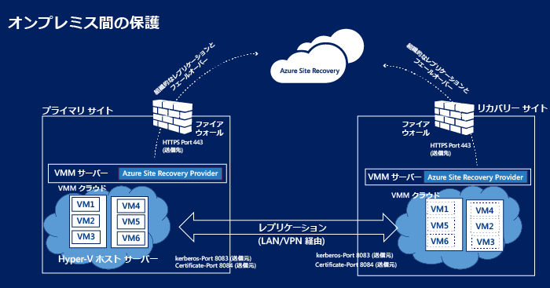
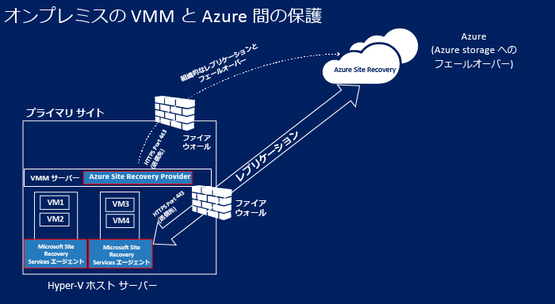
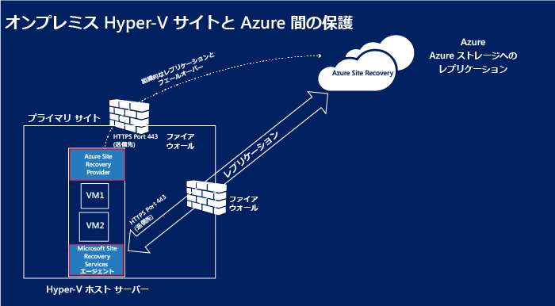
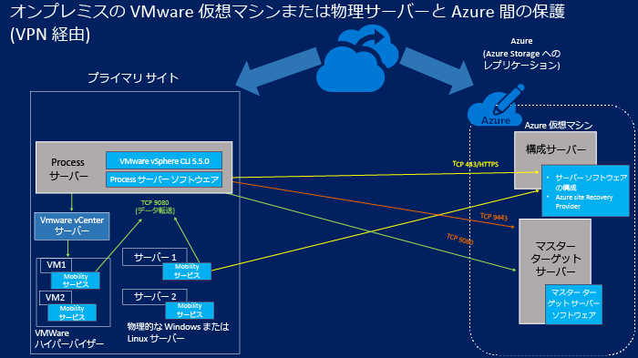
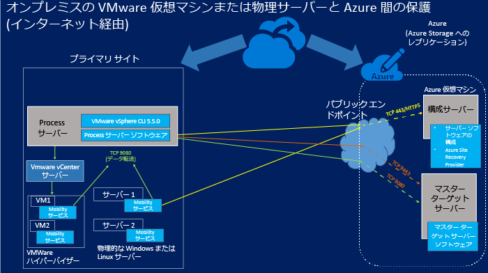

<properties
	pageTitle="Site Recovery コンポーネント" 
	description="Site Recovery コンポーネントの概要と管理方法について説明します" 
	services="site-recovery"
	documentationCenter=""
	authors="rayne-wiselman"
	manager="jwhit"
	editor=""/>

<tags
	ms.service="site-recovery"
	ms.workload="backup-recovery"
	ms.tgt_pltfrm="na"
	ms.devlang="na"
	ms.topic="article"
	ms.date="07/09/2015"
	ms.author="raynew"/>

# Site Recovery コンポーネント

Azure Site Recovery は、仮想マシンと物理サーバーのレプリケーション、フェールオーバー、復旧を調整してビジネス継続性と障害復旧 (BCDR) 戦略に貢献します。コンピューターを Azure に、またはオンプレミスのセカンダリ データ センターにレプリケートできます。[概要についてはこちら](site-recovery-overview.md)を参照してください。

ここでは、サーバーと仮想マシンにインストールされる Site Recovery コンポーネントについて説明します。

この記事について質問がある場合は、[Azure Recovery Services フォーラム](https://social.msdn.microsoft.com/forums/azure/home?forum=hypervrecovmgr)に投稿してください。

## 概要

Site Recovery コンポーネントは、保護シナリオによって異なる部分があります。

### VMM を使用する 2 つのデータセンター間の保護

**シナリオ** | **説明** | **必須コンポーネント** | **詳細**
--- | --- | --- | ---
Azure Site Recovery をデプロイして、2 つのデータセンター間で仮想マシンをレプリケートする | 
各データセンターに VMM サーバーがあります

各 VMM サーバーに、1 つ以上の Hyper-V ホスト サーバーと保護する仮想マシンを含むプライベート クラウドがあります
 | Azure Site Recovery Providor は両方の VMM サーバーにインストールされます | 
Hyper-V ホスト サーバーまたは保護対象の仮想マシンにインストールされるコンポーネントはありません

VMM サーバー上の Azure Site Recovery Provider は、HTTPS 443 上で Site Recovery サービスと通信して保護を調整します

Hyper-V ホスト サーバー間のレプリケーションは、インターネット上で Kerberos と証明書認証を使用し、ポート 8083 と 8084 で行われます。

### VMM と、データ センターおよび Azure 間の保護

**シナリオ** | **説明** | **必須コンポーネント** | **詳細**
--- | --- | --- | ---
Azure Site Recovery をデプロイして、データセンターと Azure 間で仮想マシンをレプリケートする | 
オンプレミス データセンターに VMM サーバーがあり、1 つ以上の Hyper-V ホスト サーバーと保護する仮想マシンを含むプライベート クラウドがあります
 | 
Azure Site Recovery Provider は VMM サーバーにインストールされます

Microsoft Recovery Services エージェントはソース Hyper-V ホスト サーバーにインストールされます
 | 
保護対象の仮想マシンにインストールされるコンポーネントはありません

VMM サーバー上の Azure Site Recovery Provider は、HTTPS 443 上で Site Recovery サービスと通信して保護を調整します

ソース Hyper-V ホスト サーバー上で実行されている Microsoft Recovery Services エージェントと Azure 間のレプリケーションは、HTTPS 443 上で行われます。

###  Hyper-V と Azure 間の保護

**シナリオ** | **説明** | **必須コンポーネント** | **詳細**
--- | --- | --- | ---
Azure Site Recovery をデプロイして、データセンターと Azure 間で仮想マシンをレプリケートする | 
オンプレミス データセンターには、1 つ以上の Hyper-V ホスト サーバーと保護する仮想マシンがあります

構成時に、これらの 1 つ以上の Hyper-V ホスト サーバーを含む Hyper-V サイトを定義します
 | 
1 回のコンポーネントのインストールで、Azure Site Recovery Provider と Microsoft Recovery Services エージェントの両方が Hyper-V ホスト サーバーにインストールされます
 | 
デプロイに VMM サーバーはありません

保護対象の仮想マシンにインストールされるコンポーネントはありません

Hyper-V ホスト サーバー上の Azure Site Recovery Provider は、HTTPS 443 上で Site Recovery サービスと通信して保護を調整します

ソース Hyper-V ホスト サーバー上で実行されている Microsoft Recovery Services エージェントと Azure 間のレプリケーションは、HTTPS 443 上で行われます。

### オンプレミス物理サーバーまたは VMware 仮想マシンと、Azure 間の保護 

このシナリオでは、レプリケーション方法が 2 つあります。

- VPN 接続経由 (Azure ExpressRoute またはサイト間 VPN の使用)
- インターネット上のセキュリティで保護された接続経由

#### VPN サイト間接続 (または ExpressRoute) 経由

オンプレミス サーバーの通信は、構成およびマスター ターゲット仮想マシンが接続されている Azure 仮想ネットワーク上の内部ポートに送信されます。

#### インターネット経由

オンプレミス サーバーからのすべての通信は、構成サーバー仮想マシンおよびマスター ターゲット サーバー仮想マシン用の Azure クラウド サービス上のマップされているパブリック エンドポイントに送信されます。仮想マシンをデプロイすると、エンドポイントが動的に作成されます。

#### ポート

**コンポーネント** | **ポート** | **詳細** 
--- | --- | --- | ---
**プロセス サーバー** |9080 | レプリケーションのデータが、保護対象のコンピューターから、TCP 9080 上でプロセス サーバーに送信されます。
**構成サーバー** | HTTPS/443 | レプリケーションのメタデータが、保護されているコンピューターで実行されているモビリティ サービスから、ポート 443 上で構成サーバーに送信されます。
 | HTTPS/443 | 構成サーバーは、コンピューターの保護を調整します。プロセス サーバーは、443 上で構成サーバーと通信します。または、マップされているパブリック エンドポイントと通信して、管理および制御情報を受信します。 
 | 9443 | フェールバックの方向で、vContinuum ツールが、ポート 9443 上で構成サーバーのコントロールとメタデータを要求します (図には非記載)
 | 5986 | PowerShell でのリモート管理は、ポート 5986 を使用します (図には非記載)
 | 3389 | 3389 を使用した構成サーバーとの RDP 接続 (図には非記載)
**マスター ターゲット サーバー** | 80 | プロセス サイトは、レプリケーション トラフィックに関する通信を 9080 上でマスター ターゲット サーバーに送信します
 | HTTP/443 | プロセス サーバーは、HTTP または 443 (VPN) 上でマスター ターゲット サーバーにデータをレプリケートします
 | HTTP/443 | プロセス サーバーは、HTTP または 443 (VPN) 上でマスター ターゲット サーバーにデータをレプリケートします
**ファイアウォール規則** | | 
モビリティ サービスのプッシュ インストールが正常に実行されるには、保護対象コンピューターのファイアウォールで、ファイルとプリンターの共有および Windows Management Instrumentation を許可するように構成します。

保護するコンピューターのファイアウォール規則で、構成サーバーに到達できるようにします。

フェールオーバー後にインターネット上で Azure 仮想マシンに接続するには、コンピューターのファイアウォール規則で、インターネット上の リモート デスクトップ接続を許可します。Azure でフェールオーバーした Linux コンピューターに接続するには、Secure Shell サービスがシステムで自動的に開始されるように設定します。また、ファイアウォール規則で ssh 接続を許可します。

## Site Recovery コンポーネント

**コンポーネント** | **詳細** | **インストール** | **デプロイ シナリオ**
--- | --- | --- | ---
**VMM 用 Azure Site Recovery Provider** | VMM サーバーと Site Recovery サービス間の通信を処理します。 | VMM サーバーにインストールされます | 2 つの VMM 間または VMM サイトと Azure 間に保護をセットアップするときに使用されます
**Hyper-V 用 Azure Site Recovery Provider** | VMM がデプロイされていないときに、Hyper-V ホストと Site Recovery サービス間の通信を処理します。 | Hyper-V ホスト サーバーにインストールされます | Hyper-V サイトと Azure 間に保護をセットアップするときに使用されます。   
**Microsoft Recovery Services エージェント** | Hyper-V ホスト サーバーと Site Recovery サービス間の通信を処理します | Hyper-V ホスト サーバーにインストールされます | 
Hyper-V サイトと Azure 間に保護をセットアップするときに使用されます。

Hyper-V 用 Azure Site Recovery Provider と Microsoft Recovery Services エージェントの両方を含む 1 つのプロバイダーをダウンロードします。

**プロセス サーバー/フェールバック プロセス サーバー** | 
Azure のマスター ターゲット サーバーに送信する前に、保護対象の VMWare コンピューターまたは Windows/Linux 物理サーバーのデータを最適化します

VMWare 仮想マシンまたは物理サーバーでモビリティ サービスのプッシュ インストールを行います

VMWare 仮想マシンの自動検出を実行します。
 
フェールバック プロセス サーバー: レプリケーションをフェールバック プロセス サーバーに適用する前に、データの最適化に関する最初のポイントのみ
 | 
Windows Server 2012 R2 以降を実行するオンプレミス サーバーにインストールされます

フェールバック プロセス サーバー: Standard A4 サイズ Azure 仮想マシンで実行されます
 | 
オンプレミス物理サーバーまたは VMWare 仮想マシンと、Azure 間に保護をセットアップするときに使用されます。

フェールバック プロセス サーバー: Azure からオンプレミスへのフェールバックに使用されます

**モビリティ サービス** | 保護対象のコンピューターの変更をキャプチャし、オンプレミス プロセス サーバーに通信して、Azure にレプリケーションします。 | 保護するオンプレミス VMWare 仮想マシンまたは物理サーバーにインストールされます| オンプレミス物理サーバーまたは VMware 仮想マシンと、Azure 間の保護を設定するときに使用されます。
**マスター ターゲット サーバー/フェールバック マスター ターゲット サーバー** | 
保護対象コンピューターのレプリケートされたデータを、Azure ストレージ アカウントで BLOB 記憶域に作成された接続済み VHD を使用して保存します

フェールバック マスター ターゲット サーバー: Azure でフェールオーバーした仮想マシンのレプリケーション データを保存します。フェールバックでレプリケーションの反転が有効な場合、データは、選択されているデータ ストアに作成された VMDK に保存されます。
 | 
Windows Server 2012 R2 ギャラリー イメージに基づく Windows サーバー (Windows コンピューターを保護する場合)、または OpenLogic CentOS 6.6 ギャラリー イメージに基づく Linux サーバー (Linux コンピューターを保護する場合) の Azure 仮想マシンとしてインストールされます

Standard A3 と Standard D14 という 2 つのサイズ オプションを使用できます

フェールバック マスター ターゲット サーバー: VMWare 仮想マシン上で実行されます。コンピューターがフェールバックされるホストと同じホストにプロビジョニングされます。
| 
オンプレミス物理サーバーまたは VMWare 仮想マシンと、Azure 間に保護をセットアップするときに使用されます。

フェールバック マスター ターゲット サーバー: Azure からオンプレミスにフェールオーバーした仮想マシンのフェールバックに使用されます

**構成サーバー** | 
保護されているコンピューター、プロセス サーバー、Azure のマスター ターゲット サーバー間の通信を調整します

レプリケーションをセットアップし、フェールオーバーが発生したときに Azure で復旧を調整します
 | Site Recovery と同じ Azure サブスクリプションで、Azure Standard A3 仮想マシンにインストールされます。 | オンプレミス物理サーバーまたは VMware 仮想マシンと、Azure 間の保護を設定するときに使用されます。

## コンポーネントのデプロイの計画

### Azure Site Recovery Provider

Providerは、VMM サーバー、Hyper-V ホスト サーバー (デプロイに VMM サーバーがない場合)、または構成サーバーで実行されます。暗号化された HTTPS 接続を使用して、インターネット上で Site Recovery サービスに接続します。以下の点に注意してください。

- Provider から Site Recovery への接続を除き、特定のファイアウォールを追加する必要はありません。
- プロキシ サーバーを使用して、プロバイダーを実行するサーバーをインターネットに接続する場合、既存のプロキシ設定を使用するか、カスタム プロキシを指定できます。
- プロキシでは、ファイアウォール経由の次のアドレスを許可します。

	-  *.accesscontrol.windows.net-  .backup.windowsazure.com
	-  *.blob.core.windows.net-  *.store.core.windows.net	
- ファイアウォールに IP アドレスベースの規則がある場合、構成サーバーから、「[Azure データ センターの IP の範囲](https://www.microsoft.com/download/details.aspx?id=41653)」に記載されている IP アドレスへの通信と、HTTP (443) の通信を許可します。使用する予定がある Azure リージョンと米国西部の IP アドレスの範囲をホワイトリストに登録する必要があります。
- VMM を対象にして Site Recovery をデプロイし、カスタム プロキシを使用する場合、VMM の RunAs アカウント (DRAProxyAccount) が、Site Recovery ポータルからカスタム プロキシの設定で指定したプロキシの資格情報を使用して、自動的に作成されます。このアカウントを正しく認証できるように、プロキシ サーバーを設定する必要があります。
- Hyper-V ホスト サーバーにインストールされているプロバイダーからプロキシに送信されるプロキシ トラフィックを使用する場合、HTTP 上で送信する必要があります。

### Microsoft Recovery Services エージェント

エージェントは、暗号化された HTTPS 接続を使用して、インターネット上で Site Recovery サービスに接続します。ファイアウォールの例外を指定する必要はありません。

### VMWare または物理サーバー保護用のコンポーネント

#### マスター ターゲット サーバー

- マスター ターゲット サーバーには、Azure Standard A4 または D14 仮想マシンを使用できます。
- Standard A4 マスター ターゲットでは、各仮想マシンに 16 個のデータ ディクショナリを追加できます (データ ディスクごとに最大 1023 GB)。
- Standard D14 マスター ターゲットでは、各仮想マシンに 32 個のデータ ディクショナリを追加できます (データ ディスクごとに最大 1023 GB)。
- Standard D14 サイズのマスター ターゲット サーバーは、15 個を超えるディスクを接続するサーバーを保護する場合にのみ必要です。その他すべての構成では、Standard A4 サイズのマスター ターゲット サーバーをデプロイできます。
- マスター ターゲット サーバーに接続されているディスクの 1 つはリテンション期間ドライブとして予約されています。Azure Site Recovery では、リテンション期間ウィンドウを定義し、保護されたマシンをこのウィンドウ内の回復ポイントに復旧できます。リテンション期間ドライブには、ウィンドウの継続期間中に発生したディスクの変更ジャーナルが保持されます。その結果、レプリケーションに使用できる最大ディスクは、A4 から 15 に、D14 から 31 に減ります。

#### プロセス サーバー 

- プロセス サーバーは、ディスク ベースのキャッシュを使用します。C:/ にキャッシュ用の十分な空き領域があることを確認してください。キャッシュのサイズ変更は、保護しているマシンのデータ変更率の影響を受けます。中規模のデプロイでは、通常、600 GB のキャッシュ ディレクトリ サイズを推奨します。
- 保護されたマシンのデータ変更率が、既存のプロセス サーバーの能力を超過している場合は、追加のプロセス サーバーをデプロイする必要があります。
- デプロイをスケーリングするには、複数のプロセス サーバーとマスター ターゲット サーバーを追加します。既存のマスター ターゲット サーバーに十分な空きディスクがない場合は、2 つ目のマスター ターゲット サーバーをデプロイする必要があります。
-  プロセス サーバーとマスター ターゲット サーバーには、1 対 1 のマッピングは必要ありません。最初のプロセス サーバーを 2 つ目のマスター ターゲット サーバーを使用してデプロイすることができ、それ以降も同様にデプロイできます。

#### 構成サーバー

- Azure Site Recovery Windows Server 2012 R2 ギャラリー イメージに基づいた構成サーバー用の Standard A3 仮想マシンがサブスクリプションに作成されます。新しいクラウド サービスの最初のインスタンスとして作成され、予約されたパブリック IP アドレスが割り当てられます。
- インストール パス (英字のみ)。

#### モビリティ サービス

VMware 仮想マシンまたは物理サーバーにインストールします。コンピューターとサーバーは、次の要件に準拠する必要があります。

- **Windows サーバー**:
	-  64 ビット オペレーティング システム: Windows Server 2012 R2、Windows Server 2012、または Windows Server 2008 R2 SP1 以降が必要です。
	-  ホスト名、マウント ポイント、デバイス名、Windows のシステム パス (例: C:\\Windows) (英語のみ)。
	-  C:\\ ドライブ上のオペレーティング システム。
	-  基本ディスクのみがサポートされます。ダイナミック ディスクはサポートされません。

- **Linux サーバー**:
	- サポートされる 64 ビット オペレーティング システム: Centos 6.4、6.5、6.6、Red Hat 互換カーネルまたは Unbreakable Enterprise Kernel リリース 3 (UEK3) を実行している Oracle Enterprise Linux 6.4、6.5、SUSE Linux Enterprise Server 11 SP3。
	- 保護されたコンピューターの /etc/hosts ファイルには、ローカル ホスト名を、すべての NIC に関連付けられた IP アドレスにマップするエントリが含まれます。
	- ホスト名、マウント ポイント、デバイス名、および Linux システム パスとファイル名 (例: /etc/; /usr) (英語のみ)。
	-  次のサポートされる記憶域: ファイル システム: EXT3、ETX4、ReiserFS、XFS/Multipath software-Device Mapper (multipath)/Volume manager: LVM2。HP CCISS コントローラー ストレージを使用する物理サーバーはサポートされていません。

これらのコンポーネントの計画の詳細については、[こちらの記事](site-recovery-vmware-to-azure.md)の容量計画のセクションを参照してください。

## コンポーネントを最新に保つ

**コンポーネント** | **更新する方法** 
--- | --- 

**VMM 用 Azure Site Recovery Provider**

**Azure Recovery Services エージェント**
 | 

**初回インストール**: [クイック スタート] ページから最新バージョンをインストールします

**使用中**: Site Recovery のダッシュボードから最新バージョン (と旧バージョン) をダウンロードできます。また、Microsoft Updates を使用している場合、最新バージョンの Provider とエージェントがサーバーに自動的にインストールされます。

**プロセス サーバー**

**構成サーバー**

**マスター ターゲット サーバー**
 | Site Recovery ダッシュボードで更新プログラムを確認します。 
**モビリティ サービス** | 
保護する各コンピューターに最新のモビリティ サービスの更新プログラムをインストールします。

最新の更新プログラムをダウンロードできます。

[Windows](http://download.microsoft.com/download/7/C/7/7C70CA53-2D8E-4FE0-BD85-8F7A7A8FA163/Microsoft-ASR_UA_8.3.0.0_Windows_GA_03Jul2015_release.exe)

[RHELP6-64](http://download.microsoft.com/download/B/4/5/B45D1C8A-C287-4339-B60A-70F2C7EB6CFE/Microsoft-ASR_UA_8.3.0.0_RHEL6-64_GA_03Jul2015_release.tar.gz)

[OL6-64](http://download.microsoft.com/download/9/4/8/948A2D75-FC47-4DED-B2D7-DA4E28B9E339/Microsoft-ASR_UA_8.3.0.0_OL6-64_GA_03Jul2015_release.tar.gz)

[SLES11-SP3-64](http://download.microsoft.com/download/6/A/2/6A22BFCD-E978-41C5-957E-DACEBD43B353/Microsoft-ASR_UA_8.3.0.0_SLES11-SP3-64_GA_03Jul2015_release.tar.gz)

また、プロセス サーバーが最新の状態であることを確認した後に、プロセス サーバーの C:\\pushinstallsvc\\repository フォルダーから最新バージョンのモビリティ サービスをダウンロードできます
  

## 次のステップ

デプロイ シナリオに合わせてコンポーネントを構成します。[詳細情報](site-recovery-overview.md)。

<!---HONumber=July15_HO2-->