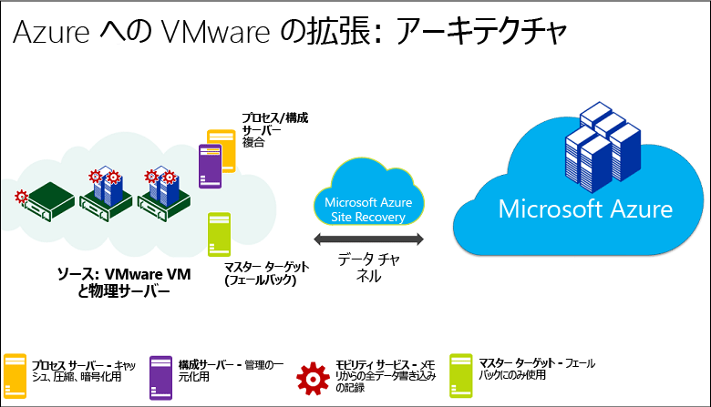
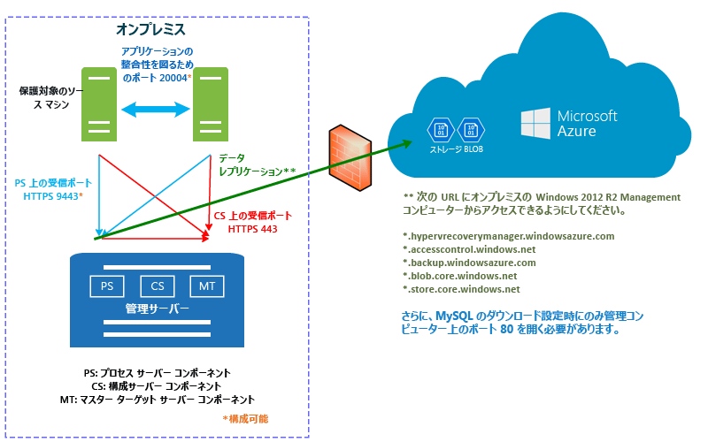
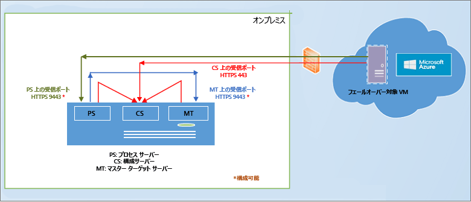
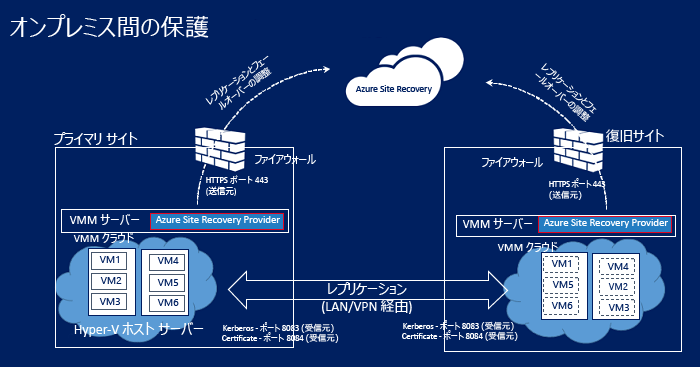

# Azure Site Recovery のしくみ

この記事では、[Azure Site Recovery](site-recovery-overview.md) サービスの基になるアーキテクチャと、それを機能させるためのコンポーネントについて説明します。

コメントはこの記事の末尾、または [Azure Recovery Services フォーラム](https://social.msdn.microsoft.com/forums/azure/home?forum=hypervrecovmgr)で投稿してください。

## Azure へのレプリケート

以下のものを Azure にレプリケートすることができます。

- **VMware**: [サポートされているホスト](site-recovery-support-matrix-to-azure.md#support-for-datacenter-management-servers)上で実行されているオンプレミス VMware VM。 [サポートされているオペレーティング システム](site-recovery-support-matrix-to-azure.md#support-for-replicated-machine-os-versions)を実行している VMware VM をレプリケートできます。
- **Hyper-V**: [サポートされているホスト](site-recovery-support-matrix-to-azure.md#support-for-datacenter-management-servers)上で実行されているオンプレミス Hyper-V VM。
- **物理マシン**: [サポートされているオペレーティング システム](site-recovery-support-matrix-to-azure.md#support-for-replicated-machine-os-versions)上で Windows または Linux を実行しているオンプレミス物理サーバー。 [Hyper-V および Azure でサポートされている](https://technet.microsoft.com/en-us/windows-server-docs/compute/hyper-v/supported-windows-guest-operating-systems-for-hyper-v-on-windows)任意のゲスト オペレーティング システムを実行している Hyper-V VM をレプリケートできます。

## VMware から Azure

VMware VM を Azure にレプリケートするために必要なものを次に示します。

領域 | コンポーネント | 詳細
--- | --- | ---
**Azure** | Azure では、Azure アカウント、Azure ストレージ アカウント、および Azure ネットワークが必要です。 | ストレージとネットワークには、Resource Manager アカウントまたはクラシック アカウントを指定できます。    レプリケートされたデータはストレージ アカウントに格納され、オンプレミス サイトからのフェールオーバーが発生したときにそのレプリケートされたデータで Azure VM が作成されます。 Azure VM は、作成時に Azure 仮想ネットワークに接続します。
**構成サーバー** | 単一の管理サーバー (VMWare VM) が、すべてのオンプレミス コンポーネント (構成サーバー、プロセス サーバー、マスター ターゲット サーバー) を実行します | 構成サーバーは、オンプレミスと Azure の間の通信を調整し、データのレプリケーションを管理します。
 **プロセス サーバー**:  | 構成サーバーに既定でインストールされます。 | レプリケーション ゲートウェイとして機能します。 レプリケーション データを受信し、そのデータをキャッシュ、圧縮、暗号化によって最適化して、Azure Storage に送信します。   また、プロセス サーバーは保護されたマシンへのモビリティ サービスのプッシュ インストールを処理し、VMware VM の自動検出を実行します。   デプロイメントの拡大に合わせて、増大するレプリケーション トラフィックの処理を実行する独立した専用プロセス サーバーを追加できます。
 **マスター ターゲット サーバー** | 既定で、オンプレミスの構成サーバーにインストールされます。 | Azure からのフェールバック中にレプリケーション データを処理します。   フェールバックのトラフィックの量が多い場合は、フェールバック用に別のマスター ターゲット サーバーをデプロイすることができます。
**VMware サーバー** | VMware VM は vSphere ESXi サーバー上でホストされます。vCenter サーバーでホストを管理することをおすすめします。 | VMware サーバーは Recovery Services コンテナーに追加します。   I
**レプリケートされたマシン** | レプリケートする各 VMware VM にモビリティ サービスがインストールされます。 このサービスは、各マシンに手動でインストールすることも、プロセス サーバーからのプッシュ インストールでインストールすることもできます。

**図 1: VMware から Azure へのコンポーネント**

### レプリケーション プロセス

1. Azure コンポーネント、Recovery Services コンテナーなどのデプロイをセットアップします。 このコンテナーでは、レプリケーションのソースとターゲットの指定、構成サーバーのセットアップ、VMware サーバーの追加、レプリケーション ポリシーの作成、モビリティ サービスのデプロイ、レプリケーションの有効化、テスト フェールオーバーの実行を行います。
2.  マシンがレプリケーション ポリシーに従ってレプリケートを開始し、データの初回コピーが Azure Storage にレプリケートされます。
4. Azure への差分変更のレプリケーションは、初期レプリケーションの終了後に開始されます。 マシンの追跡された変更は .hrl ファイルに保持されます。
    - レプリケートするマシンは、レプリケーション管理のために、受信ポート HTTPS 443 で構成サーバーと通信します。
    - レプリケートするマシンは、受信ポート HTTPS 9443 でレプリケーション データをプロセス サーバーに送信します (構成可能)。
    - 構成サーバーは、送信ポート HTTPS 443 経由で Azure によるレプリケーション管理を調整します。
    - プロセス サーバーは、ソース マシンからデータを受信し、そのデータを最適化して暗号化し、送信ポート 443 を介して Azure Storage に送信します。
    - マルチ VM 整合性を有効にすると、レプリケーション グループ内のマシンは、ポート 20004 を介して相互に通信します。 フェールオーバー時にクラッシュ整合性復旧ポイントとアプリ整合性復旧ポイントを共有するレプリケーション グループに複数のマシンをグループ化する場合にマルチ VM が使用されます。 これは、これらのマシンが同じワークロードを実行していて、一貫性を持たせる必要がある場合に役立ちます。
5. トラフィックは、インターネット経由で Azure Storage のパブリック エンドポイントにレプリケートされます。 また、Azure ExpressRoute の[パブリック ピアリング](https://docs.microsoft.com/en-us/azure/expressroute/expressroute-circuit-peerings#public-peering)を使用することもできます。 オンプレミス サイトから Azure へのサイト間 VPN を介したトラフィックのレプリケートはサポートされていません。

**図 2: VMware から Azure へのレプリケーション**

### フェールオーバーとフェールバック

1. テスト フェールオーバーが想定どおりに動作することを確認した後、必要に応じて、Azure への計画されていないフェールオーバーを実行することができます。 計画フェールオーバーはサポートされていません。
2. 単一のマシンをフェールオーバーするか、複数の VM をフェールオーバーするための[復旧計画](site-recovery-create-recovery-plans.md)を作成することができます。
3. フェールオーバーを実行すると、レプリカ VM が Azure に作成されます。 フェールオーバーをコミットして、レプリカの Azure VM からワークロードへのアクセスを開始します。
4. プライマリ オンプレミス サイトが再度使用可能になると、フェールバックできます。 フェールバック インフラストラクチャをセットアップし、セカンダリ サイトからプライマリへのマシンのレプリケートを開始して、セカンダリ サイトから計画外フェールオーバーを実行します。 このフェールオーバーをコミットすると、データがオンプレミスに戻るため、Azure へのレプリケーションをもう一度有効にする必要があります。 [詳細情報](site-recovery-failback-azure-to-vmware.md)

フェールバックの要件がいくつかあります。

- **Azure 上の一時的なプロセス サーバー**: フェールオーバー後に Azure からフェールバックする場合は、Azure からのレプリケーションを処理するために、プロセス サーバーとして構成された Azure VM をセットアップする必要があります。 この VM は、フェールバックの完了後に削除できます。
- **VPN 接続**: フェールバックするには、Azure ネットワークからオンプレミス サイトへの VPN 接続 (または Azure ExpressRoute) をセットアップする必要があります。
- **独立したオンプレミス マスター ターゲット サーバー**: オンプレミスのマスター ターゲット サーバーによって、フェールバックが処理されます。 マスター ターゲット サーバーは、既定では管理サーバーにインストールされますが、大量のトラフィックをフェールバックする場合は、この目的用にオンプレミスのマスター ターゲット サーバーをセットアップする必要があります。
- **フェールバック ポリシー**: オンプレミスにもう一度レプリケートするには、フェールバック ポリシーが必要です。 これは、レプリケーション ポリシーを作成したときに自動的に作成されます。

**図 3: VMware/物理マシンのフェールバック**

## 物理から Azure

オンプレミスの物理サーバーを Azure にレプリケートするときも、[VMware から Azure](#vmware-replication-to-azure) への場合と同じコンポーネントとプロセスが使用されますが、次の違いに注意してください。

- 構成サーバーとして、VMware VM ではなく物理サーバーを使用することができます。
- フェールバック用にオンプレミスの VMware インフラストラクチャが必要になります。 物理マシンにはフェールバックできません。

## Hyper-V から Azure

Hyper-V VM を Azure にレプリケートするために必要なものを次に示します。

**領域** | **コンポーネント** | **詳細**
--- | --- | ---
**Azure** | Azure では、Microsoft Azure アカウント、Azure ストレージ アカウント、Azure ネットワークが必要です。 | ストレージとネットワークには、Resource Manager ベースのアカウントまたはクラシック アカウントを指定できます。   レプリケートされたデータはストレージ アカウントに格納され、オンプレミス サイトからのフェールオーバーが発生したときにそのレプリケートされたデータで Azure VM が作成されます。   Azure VM は、作成時に Azure 仮想ネットワークに接続します。
**VMM サーバー** | VMM クラウドに配置されている Hyper-V ホスト | Hyper-V ホストが VMM クラウドで管理されている場合は、VMM サーバーを Recovery Services コンテナーに登録します。   VMM サーバーで、Azure とのレプリケーションの調整のために、Site Recovery Provider をインストールします。   ネットワーク マッピングを構成するには、論理ネットワークと VM ネットワークをセットアップする必要があります。 VM ネットワークは、クラウドに関連付けられた論理ネットワークにリンクされている必要があります。
**Hyper-V ホスト** | Hyper-V サーバーは、VMM サーバーがあってもなくてもデプロイできます。 | VMM サーバーがない場合は、インターネット経由でレプリケーションを Site Recovery と調整するために、Site Recovery Provider がホストにインストールされます。 VMM サーバーがある場合は、Provider がホストではなく VMM サーバーにインストールされます。   Recovery Services エージェントは、データのレプリケーションを処理するために、ホストにインストールされます。   プロバイダーとエージェントの両方からの通信は、セキュリティで保護され、暗号化されます。 Azure Storage 内のレプリケートされたデータも暗号化されます。
**Hyper-V VM** | Hyper-V ホスト サーバー上に&1; つ以上の VM が必要です。 | VM に明示的にインストールする必要があるものはありません

### レプリケーション プロセス

1. Azure コンポーネントを設定します。 Site Recovery のデプロイを開始する前に、ストレージ アカウントとネットワーク アカウントを設定することをお勧めします。
2. Site Recovery 用のレプリケーション サービス コンテナーを作成し、次のようにコンテナーの設定を構成します。
    - ソースとターゲットの設定。 VMM クラウドで Hyper-V ホストを管理していない場合、ターゲット用に Hyper-V サイト コンテナーを作成し、そのコンテナーに Hyper-V ホストを追加します。 Hyper-V ホストが VMM で管理されている場合、ソースは VMM クラウドになります。 ターゲットは Azure です。
    - Azure Site Recovery プロバイダーと Microsoft Azure Recovery Services エージェントのインストール。 VMM がある場合、プロバイダーは VMM にインストールされ、エージェントは各 Hyper-V ホストにインストールされます。 VMM がない場合は、プロバイダーとエージェントの両方が各ホストにインストールされます。
    - Hyper-V サイトまたは VMM クラウドのレプリケーション ポリシーを作成します。 このポリシーは、そのサイトまたはクラウド内のホストに存在するすべての VM に適用されます。
    - Hyper-V VM のレプリケーションを有効にします。 初期レプリケーションは、レプリケーション ポリシーの設定に従って実行されます。
4. データ変更は追跡され、初期レプリケーションの終了後に Azure への差分変更のレプリケーションが開始されます。 アイテムの追跡された変更は .hrl ファイルに保持されます。
5. テスト フェールオーバーを実行して、すべて問題なく動作していることを確認します。

### フェールオーバーとフェールバックのプロセス

1. 計画または計画外[フェールオーバー](site-recovery-failover.md)をオンプレミスの Hyper-V VM から Azure に実行できます。 予定されたフェールオーバーを実行する場合、データが決して失われないように、ソース側の VM はシャット ダウンされます。
2. 単一のマシンをフェールオーバーするか、複数のマシンのフェールオーバーを調整するための[復旧計画](site-recovery-create-recovery-plans.md)を作成することができます。
4. フェールオーバーを実行すると、Azure に作成されたレプリカ VM が表示されるようになります。 必要に応じて、VM にパブリック IP アドレスを割り当てることができます。
5. その後、フェールオーバーをコミットして、レプリカの Azure VM からワークロードへのアクセスを開始します。
6. プライマリ オンプレミス サイトが再度使用可能になると、[フェールバック](site-recovery-failback-from-azure-to-hyper-v.md)できます。 Azure からプライマリ サイトへの計画フェールオーバーを開始します。 計画フェールオーバーの場合、データが失われないように、同じ VM と別の場所のどちらにフェールバックするかを選択し、Azure とオンプレミスの間で変更を同期することができます。 VM がオンプレミスで作成されたら、フェールオーバーをコミットします。

**図 4: Hyper-V サイトから Azure へのレプリケーション**

**図 5: VMM クラウド内の Hyper-V から Azure へのレプリケーション**

## セカンダリ サイトへのレプリケート

以下のものをセカンダリ サイトにレプリケートすることができます。

- **VMware**: [サポートされているホスト](site-recovery-support-matrix-to-sec-site.md#on-premises-servers)上で実行されているオンプレミス VMware VM。 [サポートされているオペレーティング システム](site-recovery-support-matrix-to-sec-site.md#support-for-replicated-machine-os-versions)を実行している VMware VM をレプリケートできます。
- **物理マシン**: [サポートされているオペレーティング システム](site-recovery-support-matrix-to-sec-site.md#support-for-replicated-machine-os-versions)上で Windows または Linux を実行しているオンプレミス物理サーバー。
- **Hyper-V**: VMM クラウドで管理されている、[サポートされている Hyper-V ホスト](site-recovery-support-matrix-to-sec-site.md#on-premises-servers)上で実行されているオンプレミス Hyper-V VM。 [サポートされているホスト](site-recovery-support-matrix-to-azure.md#support-for-datacenter-management-servers)。 [Hyper-V および Azure でサポートされている](https://technet.microsoft.com/en-us/windows-server-docs/compute/hyper-v/supported-windows-guest-operating-systems-for-hyper-v-on-windows)任意のゲスト オペレーティング システムを実行している Hyper-V VM をレプリケートできます。

## VMware/物理をセカンダリ サイトに

InMage Scout を使用して、VMware VM または物理サーバーをセカンダリ サイトにレプリケートします。

### コンポーネント

**領域** | **コンポーネント** | **詳細**
--- | --- | ---
**Azure** | InMage Scout。 | InMage Scout を入手するには、Azure サブスクリプションが必要です。   Recovery Services コンテナーを作成した後、InMage Scout をダウンロードし、最新の更新プログラムをインストールして、デプロイを設定します。
**プロセス サーバー** | プライマリ サイトにあります。 | キャッシュ、圧縮、データ最適化を処理するプロセス サーバーをデプロイします。   プロセス サーバーでは、保護するマシンへの統合エージェントのプッシュ インストールも処理します。
**構成サーバー** | セカンダリ サイトにあります。 | 構成サーバーは、管理 Web サイトまたは vContinuum コンソールを使用して、デプロイを管理、構成、監視します。
**vContinuum サーバー** | 省略可能。 構成サーバーと同じ場所にインストールされます。 | 保護対象の環境を管理および監視するためのコンソールを提供します。
**マスター ターゲット サーバー** | セカンダリ サイトにあります。 | マスター ターゲット サーバーは、レプリケートされたデータを保持します。 プロセス サーバーからデータを受信して、セカンダリ サイトにレプリカ マシンを作成し、データのリテンション期間ポイントを保持します。   必要のあるマスター ターゲット サーバーの数は、保護するマシンの数によって異なります。   プライマリ サイトにフェールバックする場合は、そこにもマスター ターゲット サーバーが必要です。 統合エージェントはこのサーバーにインストールされます。
**VMware ESX/ESXi と vCenter サーバー** |  VM は、ESX/ESXi ホストでホストされます。 ホストは vCenter サーバーで管理されます。 | VMware VM をレプリケートするには、VMware インフラストラクチャが必要です。
**VM/物理サーバー** |  VMware VM にインストールされた統合エージェントと、レプリケートする物理サーバー。 | エージェントはすべてのコンポーネント間の通信プロバイダーとして機能します。

### レプリケーション プロセス

1. 各サイトでコンポーネント サーバー (構成、プロセス、マスター ターゲット) をセットアップし、レプリケートするマシンに統合エージェントをインストールします。
2. 初期レプリケーションの後、各マシン上のエージェントによって、差分レプリケーションの変更がプロセス サーバーに送信されます。
3. プロセス サーバーは、このデータを最適化して、セカンダリ サイト上のマスター ターゲット サーバーに転送します。 構成サーバーでは、レプリケーション プロセスを管理します。

**図 6: VMware から VMware へのレプリケーション**

## Hyper-V をセカンダリ サイトに

Hyper-V VM をセカンダリ サイトにレプリケートするために必要なものを次に示します。

**領域** | **コンポーネント** | **詳細**
--- | --- | ---
**Azure** | Microsoft Azure のアカウントが必要です。 |
**VMM サーバー** | プライマリ サイトに&1; つの VMM サーバーを配置し、セカンダリ サイトにもう&1; つの VMM サーバーを配置することをお勧めします | 各 VMM サーバーは、インターネットに接続している必要があります。   各サーバーには、Hyper-V 機能プロファイルが設定されている VMM プライベート クラウドが少なくとも&1; つ必要です。   VMM サーバーに Azure Site Recovery プロバイダーをインストールします。 Provider は、インターネット経由で Site Recovery サービスを使用してレプリケーションを調整および統制します。 プロバイダーと Azure の間の通信は、セキュリティで保護され、暗号化されます。
**Hyper-V サーバー** |  プライマリおよびセカンダリ VMM クラウドの&1; つ以上の Hyper-V ホスト サーバー。   サーバーはインターネットに接続している必要があります。   プライマリ Hyper-V ホスト サーバーとセカンダリ Hyper-V ホスト サーバーとの間で Kerberos または証明書認証を使用して LAN または VPN 経由で、データがレプリケートされます。  
**Hyper-V VM** | ソース Hyper-V ホスト サーバー上にあります。 | ソース ホスト サーバーには、レプリケートする VM が少なくとも&1; つ必要です。

### レプリケーション プロセス

1. Azure アカウントを設定します。
2. Site Recovery 用のレプリケーション サービス コンテナーを作成し、次のようにコンテナーの設定を構成します。

    - レプリケーション ソースとターゲット (プライマリ サイトとセカンダリ サイト)。
    - Azure Site Recovery プロバイダーと Microsoft Azure Recovery Services エージェントのインストール。 プロバイダーは VMM サーバーにインストールされ、エージェントは各 Hyper-V ホストにインストールされます。
    - ソース VMM クラウドのレプリケーション ポリシーを作成します。 このポリシーは、クラウド内のホストに存在するすべての VM に適用されます。
    - Hyper-V VM のレプリケーションを有効にします。 初期レプリケーションは、レプリケーション ポリシーの設定に従って実行されます。
4. データ変更は追跡され、初期レプリケーションの終了後に差分変更のレプリケーションが開始されます。 アイテムの追跡された変更は .hrl ファイルに保持されます。
5. テスト フェールオーバーを実行して、すべて問題なく動作していることを確認します。

**図 7: VMM から VMM へのレプリケーション**

### フェールオーバーとフェールバック

1. 計画または計画外[フェールオーバー](site-recovery-failover.md)をオンプレミス サイト間で実行できます。 予定されたフェールオーバーを実行する場合、データが決して失われないように、ソース側の VM はシャット ダウンされます。
2. 単一のマシンをフェールオーバーするか、複数のマシンのフェールオーバーを調整するための[復旧計画](site-recovery-create-recovery-plans.md)を作成することができます。
4. セカンダリ サイトへの計画外フェールオーバーを実行すると、フェールオーバー後に、セカンダリの場所のマシンの保護またはレプリケーションが有効になりません。 計画フェールオーバーを実行した場合は、フェールオーバー後に、セカンダリの場所のマシンが保護されます。
5. その後、フェールオーバーをコミットして、レプリカ VM からワークロードへのアクセスを開始します。
6. プライマリ サイトが再度使用可能になったら、レプリケーションの反転を開始して、セカンダリ サイトからプライマリ サイトにレプリケートします。 レプリケーションの反転により、仮想マシンは保護された状態になりますが、セカンダリ データセンターは引き続きアクティブな場所です。
7. プライマリ サイトをもう一度アクティブな場所にするには、セカンダリからプライマリへの計画フェールオーバーを開始し、続いて別のレプリケーションの反転を実行します。

## 次のステップ

- HYPER-V レプリケーション ワークフローの詳細については[こちら](site-recovery-hyper-v-azure-architecture.md)を参照してください。
- [前提条件を確認する](site-recovery-prereq.md)

