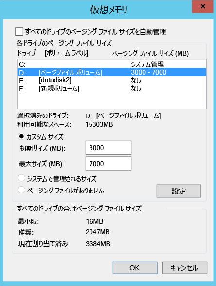
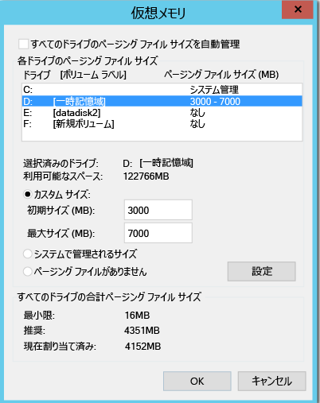
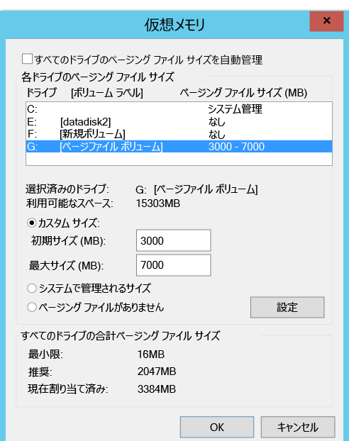
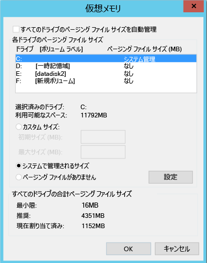

#レプリケーションからディスクを除外する
この記事では、レプリケーションからディスクを除外して、レプリケーションによって消費される帯域幅や、レプリケーション先でそのようなディスクによって使用されるリソースを最小限に抑える方法について説明します。 この機能は、VMware から Azure へのレプリケーションと Hyper-V から Azure へのレプリケーションで利用できます。

##前提条件

既定では、マシンのすべてのディスクがレプリケートされます。 **VMware から Azure** へのレプリケーションでディスクを除外するには、レプリケーションを有効にする前に、モビリティ サービスを手動でコンピューターにインストールしておく必要があります。

## レプリケーションからディスクを除外する理由
レプリケーションからディスクを除外する必要性は、多くの場合、次の理由から生じます。

1. 頻繁に変更されるデータが存在するものの重要度が低いか、レプリケートする必要がない。

2. そのような変更頻度の高いデータをレプリケートしなければ、ストレージ リソースとネットワーク リソースを節約できる。

##一般的なシナリオ
変更頻度の高いデータとしてすぐに思い付く例として、ページ ファイルの書き込みや Microsoft SQL Server の tempdb の書き込みが挙げられます。そのようなデータは、除外の対象としてうってつけです。ワークロードとストレージ サブシステムによっては、ページ ファイルの変更が膨大な量に上る可能性があります。 ただし、そのようなデータをプライマリ サイトから Azure にレプリケートするには、多くのリソースが必要となります。 したがって&1; つの仮想ディスクに OS とページ ファイルの両方を含む VM のレプリケーションは、次の方法で最適化することができます。

1. 1 つの仮想ディスクを&2; つ (OS 用とページ ファイル用) に分割します。
2. ページ ファイル用のディスクをレプリケーションから除外します。

同様に、Microsoft SQL Server で tempdb ファイルとシステム データベース ファイルを同じディスクに格納している場合は、次の方法で最適化することができます。

1. システム データベースと tempdb を&2; つの異なるディスクに格納します。
2. tempdb ディスクをレプリケーションから除外します。

##レプリケーションからディスクを除外する方法

###VMware から Azure
Azure Site Recovery ポータルから [[レプリケーションを有効にする](site-recovery-vmware-to-azure.md#enable-replication)] のワークフローに従って VM を保護します。 [レプリケーションを有効にする] の 4 番目の手順には、レプリケーションからディスクを除外するために使用できる **[レプリケートするディスク]** という列があります。 既定では、すべてのディスクが選択されています。 レプリケーションから除外するディスクの選択を解除し、手順に従ってレプリケーションを有効にしてください。 

    
    
>[!NOTE]
> 
> * 除外できるのは、モビリティ サービスが既にインストールされているディスクだけです。 モビリティ サービスは手動でインストールする必要があります (モビリティ サービスのインストールは、レプリケーションを有効にした後に、必ずプッシュ機構を使用して行う必要があるため)。
> * レプリケーションから除外できるのは、ベーシック ディスクだけです。 OS ディスクまたはダイナミック ディスクは除外できません。
> * レプリケーションが有効になった後で、レプリケーション用のディスクを追加または削除することはできません。 ディスクを追加または除外する場合は、マシンの保護を無効にし、再度有効にする必要があります。
> * アプリケーションが動作するために必要なディスクを除外した場合、Azure へのフェールオーバー後、レプリケートされたアプリケーションを実行できるように、Azure でディスクを手動で作成する必要があります。 別の方法として、Azure Automation を復旧計画に組み込んで、マシンのフェールオーバー時にディスクを作成することもできます。
> * Window VM: Azure で手動で作成したディスクはフェールバックされません。 たとえば、3 つのディスクをフェールオーバーし、Azure VM に直接&2; つのディスクを作成した場合、フェールオーバーされた&3; つのディスクだけがフェールバックされます。 オンプレミスから Azure へのフェールバックまたは再保護に、手動で作成されたディスクを含めることはできません。
> * Linux VM: Azure に手動で作成したディスクはフェールバックされます。 たとえば、3 つのディスクをフェールオーバーし、Azure で&2; つのディスクを直接作成した場合、5 つのディスクがすべてフェールバックされます。 手動で作成したディスクは、フェールバックから除外できません。
> 

###Hyper-V から Azure
Azure Site Recovery ポータルから [[レプリケーションを有効にする](site-recovery-hyper-v-site-to-azure.md#step-6-enable-replication)] のワークフローに従って VM を保護します。 [レプリケーションを有効にする] の 4 番目の手順には、レプリケーションからディスクを除外するために使用できる **[レプリケートするディスク]** という列があります。 既定では、すべてのディスクがレプリケーションの対象として選択されています。 レプリケーションから除外するディスクの選択を解除し、手順に従ってレプリケーションを有効にしてください。 

    
>[!NOTE]
> 
> * レプリケーションから除外できるのは、ベーシック ディスクだけです。 OS ディスクを除外することはできないため、ダイナミック ディスクの除外はお勧めしません。 ASR は、ゲスト VM 内でどの VHD ディスクがベーシック ディスクまたはダイナミック ディスクであるかを特定できません。  依存するダイナミック ボリューム ディスクすべてが除外されていない場合、フェールオーバー VM 上の障害が発生したディスクとそのディスク上のデータにアクセスできないため、保護されたダイナミック ディスクになります。    
> * レプリケーションが有効になった後で、レプリケーション用のディスクを追加または削除することはできません。 ディスクを追加または除外する場合は、VM の保護を無効にし、再度有効にする必要があります。
> * アプリケーションが動作するために必要なディスクを除外した場合、Azure へのフェールオーバー後、レプリケートされたアプリケーションを実行できるように、Azure でディスクを手動で作成する必要があります。 別の方法として、Azure Automation を復旧計画に組み込んで、マシンのフェールオーバー時にディスクを作成することもできます。
> * Azure に手動で作成したディスクはフェールバックされません。 たとえば、3 つのディスクをフェールオーバーし、Azure VM に直接&2; つのディスクを作成した場合、フェールオーバーされた&3; つのディスクだけが Azure から Hyper-V にフェールバックされます。 Hyper-V から Azure へのフェールバックまたはレプリケーションの反転に、手動で作成されたディスクを含めることはできません。
 

##ディスク除外のエンド ツー エンド シナリオ
ディスク除外機能について理解を深めるために、2 つのシナリオを考えてみましょう。

1. SQL Server の tempdb 用ディスク
2. ページ ファイル用ディスク

###SQL Server の tempdb 用ディスクの除外
除外できる tempdb が存在する SQL Server 仮想マシンを考えてみましょう。

VM の名前は SalesDB で、ソース VM 上のディスクは次のとおりです。

**ディスク名** | **ゲスト OS ディスク番号** | **ドライブ文字** | **ディスクに格納されているデータの種類**
--- | --- | --- | ---
DB-Disk0-OS | DISK0 | C:\ | OS ディスク
DB-Disk1| Disk1 | D:\ | SQL システム データベースとユーザー データベース&1;
DB-Disk2 (保護対象から除外するディスク) | Disk2 | E:\ | 一時ファイル
DB-Disk3 (保護対象から除外するディスク) | Disk3 | F:\ | SQL tempdb データベース (フォルダーのパスは F:\MSSQL\Data\) --> フェールオーバーの前にフォルダーのパスをメモしておくこと
DB-Disk4 | Disk4 |G:\ |ユーザー データベース&2;

この VM の "Disk2" と "Disk3" はその性質上、データの変更が一時的であるため、その&2; つのディスクについてはレプリケーションから除外して、SalesDB の VM を保護することにします。 Azure Site Recovery はこれらのディスクをレプリケートしません。そのため、フェールオーバーが発生した場合、Azure 上のフェールオーバー VM にも、これらのディスクは存在しません。

フェールオーバー後、Azure VM には次のディスクが存在します。

**ゲスト OS ディスク番号** | **ドライブ文字** | **ディスクに格納されているデータの種類**
--- | --- | ---
DISK0 |    C:\ | OS ディスク
Disk1 |    E:\ | 一時記憶域 (このディスクは Azure によって追加され、利用可能な最初のドライブ文字が割り当てられます)
Disk2 | D:\ | SQL システム データベースとユーザー データベース&1;
Disk3 | G:\ | ユーザー データベース&2;

Disk2 と Disk3 は SalesDB VM から除外されたため、利用可能な最初のドライブ文字は E: となります。 一時的な記憶域のボリュームには、Azure によって E: が割り当てられます。 レプリケート対象のディスクについては、いずれもドライブ文字は変化しません。

SQL の tempdb ディスクとして使用されていた Disk3 (tempdb フォルダーのパスは F:\MSSQL\Data\) はレプリケーションから除外され、フェールオーバー VM では利用できません。 その結果、SQL サービスは停止状態となります。SQL サービスには F:\MSSQL\Data パスが必要であるためです。

このパスは&2; とおりの方法で作成できます。

1. 新しいディスクを追加し、tempdb フォルダーのパスを割り当てます。
2. 既にある一時記憶域ディスクを tempdb フォルダー パスに使用します。

####新しいディスクを追加する場合

1. フェールオーバーの前に、SQL の tempdb.mdf と tempdb.ldf のパスをメモします。
2. Azure Portal から、フェールオーバー VM に新しいディスクを追加します。レプリケーション元の SQL tempdb ディスク (Disk3) と同じかそれ以上のサイズを確保してください。
3. Azure VM にログインします。 ディスク管理 (diskmgmt.msc) コンソールから、新しく追加したディスクを初期化してフォーマットします。
4. SQL tempdb ディスクに使用されていたものと同じドライブ文字を割り当てます (F:)。
5. F: ボリューム (F:\MSSQL\Data) に tempdb フォルダーを作成します。
6. サービス コンソールから SQL サービスを開始します。

####既存の一時記憶域ディスクを SQL tempdb フォルダー パスに使用する場合

1. コマンド ライン コンソールを開きます。
2. コマンド ライン コンソールから SQL Server を回復モードで実行します。

        Net start MSSQLSERVER /f / T3608

3. 次の sqlcmd を実行して tempdb のパスを新しいパスに変更します。

        sqlcmd -A -S SalesDB        **Use your SQL DBname**
        USE master;        
        GO        
        ALTER DATABASE tempdb        
        MODIFY FILE (NAME = tempdev, FILENAME = 'E:\MSSQL\tempdata\tempdb.mdf');
        GO        
        ALTER DATABASE tempdb        
        MODIFY FILE (NAME = templog, FILENAME = 'E:\MSSQL\tempdata\templog.ldf');        
        GO

4. Microsoft SQL Server サービスを停止します。

        Net stop MSSQLSERVER
5. Microsoft SQL Server サービスを開始します。

        Net start MSSQLSERVER

一時記憶域ディスクについては、次の Azure ガイドラインを参照してください。

* Azure VM で SSD を使用した SQL Server TempDB とバッファー プール拡張機能の保存
* Azure Virtual Machines における SQL Server のパフォーマンスに関するベスト プラクティス

###Azure からオンプレミスへのフェールバック
最終的に、Azure からオンプレミス (VMware または Hyper-V ホスト) にフェールオーバーを行ったとき、一体どのディスクがレプリケートされるのかを整理してみましょう。 Azure に手動で作成したディスクはレプリケートされません。 たとえば、3 つのディスクをフェールオーバーし、Azure VM に直接&2; つのディスクを作成した場合、フェールオーバーされた&3; つのディスクだけがフェールバックされます。 オンプレミスから Azure へのフェールバックまたは再保護に、手動で作成されたディスクを含めることはできません。 また、一時記憶域ディスクもオンプレミスにはレプリケートされません。

####元の場所へのフェールバック (OLR: Original Location Recovery)

上の例では、Azure VM のディスク構成は次のようになります。

**ゲスト OS ディスク番号** | **ドライブ文字** | **ディスクに格納されているデータの種類** 
--- | --- | --- 
DISK0 | C:\ | OS ディスク
Disk1 |    E:\ | 一時記憶域 (このディスクは Azure によって追加され、利用可能な最初のドライブ文字が割り当てられます)
Disk2 |    D:\ | SQL システム データベースとユーザー データベース&1;
Disk3 |    G:\ | ユーザー データベース&2;

####VMware から Azure
元の場所へのフェールバックを実行したとき、フェールバック VM のディスク構成に、除外されたディスクは含まれません。 つまり VMware から Azure へのレプリケーションで除外されたディスクは、フェールバック VM では利用できなくなります。 

Azure からオンプレミスの VMware に対して計画されたフェールオーバーを実行した場合、VMWare VM (元の場所) のディスク構成は次のようになります。

**ゲスト OS ディスク番号** | **ドライブ文字** | **ディスクに格納されているデータの種類** 
--- | --- | --- 
DISK0 | C:\ | OS ディスク
Disk1 |    D:\ | SQL システム データベースとユーザー データベース&1;
Disk2 |    G:\ | ユーザー データベース&2;

####Hyper-V から Azure
元の場所へのフェールバックを実行したとき、フェールバック VM のディスク構成は、Hyper-V で使用されていた元の VM のディスク構成がそのまま引き継がれます。 つまり Hyper-V サイトから Azure へのレプリケーションで除外されたディスクが、フェールバック VM では利用できるようになります。

Azure からオンプレミスの Hyper-V に対して計画されたフェールオーバーを実行した場合、Hyper-V VM (元の場所) のディスク構成は次のようになります。

**ディスク名** | **ゲスト OS ディスク番号** | **ドライブ文字** | **ディスクに格納されているデータの種類**
--- | --- | --- | ---
DB-Disk0-OS | DISK0 |    C:\ | OS ディスク
DB-Disk1 | Disk1 | D:\ | SQL システム データベースとユーザー データベース&1;
DB-Disk2 (除外されたディスク) | Disk2 | E:\ | 一時ファイル
DB-Disk3 (除外されたディスク) | Disk3 | F:\ | SQL tempdb データベース (フォルダーのパスは F:\MSSQL\Data\)
DB-Disk4 | Disk4 | G:\ | ユーザー データベース&2;

####ページング ファイルのディスクを除外する

除外できるページ ファイル ディスクが存在する仮想マシンを考えてみましょう。
次の&2; つのケースがあります。

####ケース 1: ページ ファイルが D: ドライブ上で構成されている
ディスク構成:

**ディスク名** | **ゲスト OS ディスク番号** | **ドライブ文字** | **ディスクに格納されているデータの種類**
--- | --- | --- | ---
DB-Disk0-OS | DISK0 | C:\ | OS ディスク
DB-Disk1 (保護対象から除外するディスク) | Disk1 | D:\ | pagefile.sys
DB-Disk2 | Disk2 | E:\ | ユーザー データ 1
DB-Disk3 | Disk3 | F:\ | ユーザー データ 2

ソース VM におけるページ ファイルの設定:

    

VMware から Azure または Hyper-V から Azure に VM をフェールオーバーした後の Azure VM のディスク構成:
**ディスク名** | **ゲスト OS ディスク番号** | **ドライブ文字** | **ディスクに格納されているデータの種類**
--- | --- | --- | ---
DB-Disk0-OS | DISK0 | C:\ | OS ディスク
DB-Disk1 | Disk1 | D:\ | 一時記憶域 –> pagefile.sys
DB-Disk2 | Disk2 | E:\ | ユーザー データ 1
DB-Disk3 | Disk3 | F:\ | ユーザー データ 2

Disk1 (D:) は既に除外され、利用可能な最初のドライブ文字は D: であるため、一時記憶域ボリュームには Azure によって D: が割り当てられます。  Azure VM 上で D: が利用できるため、VM のページ ファイルの設定はそのまま引き継がれます。

Azure VM におけるページ ファイルの設定:

####ケース 2: ページ ファイルが他のドライブ (D: 以外のドライブ) 上で構成されている

ソース VM のディスク構成:

**ディスク名** | **ゲスト OS ディスク番号** | **ドライブ文字** | **ディスクに格納されているデータの種類**
--- | --- | --- | ---
DB-Disk0-OS | DISK0 | C:\ | OS ディスク
DB-Disk1 (保護対象から除外するディスク) | Disk1 | G:\ | pagefile.sys
DB-Disk2 | Disk2 | E:\ | ユーザー データ 1
DB-Disk3 | Disk3 | F:\ | ユーザー データ 2

オンプレミスの VM におけるページ ファイルの設定:

VMware/Hyper-V から Azure に VM をフェールオーバーした後の Azure VM のディスク構成:

**ディスク名**| **ゲスト OS ディスク番号**| **ドライブ文字** | **ディスクに格納されているデータの種類**
--- | --- | --- | ---
DB-Disk0-OS | DISK0  |C:\ |OS ディスク
DB-Disk1 | Disk1 | D:\ | 一時記憶域 –> pagefile.sys
DB-Disk2 | Disk2 | E:\ | ユーザー データ 1
DB-Disk3 | Disk3 | F:\ | ユーザー データ 2

利用可能な最初のドライブ文字は D: であるため、一時記憶域ボリュームには Azure によって D: が割り当てられます。 レプリケート対象のディスクについては、いずれもドライブ文字は変化しません。 G: のディスクは利用できないため、ページ ファイルには C: ドライブが使用されます。

Azure VM におけるページ ファイルの設定:

## 次のステップ
デプロイをセットアップし、実行状態にできたら、各種フェールオーバーの [詳細を確認](site-recovery-failover.md) します。

