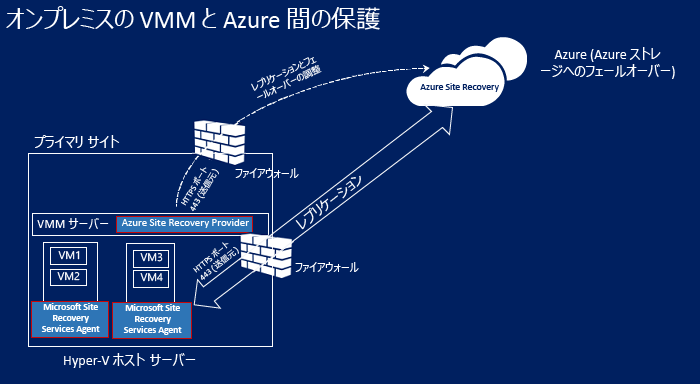
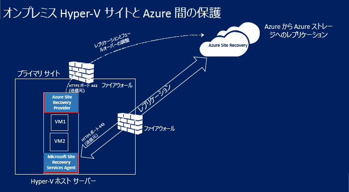
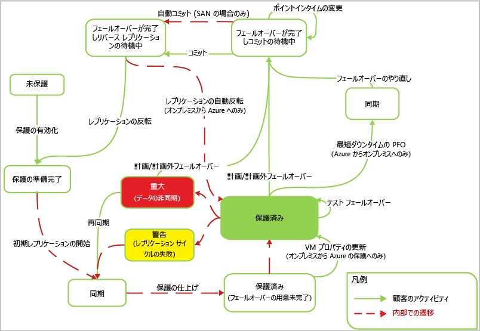

# Azure への Hyper-V レプリケーションのしくみ

この記事を読むと、[Azure Site Recovery](site-recovery-overview.md) サービスを使用した Azure への Hyper-V レプリケーションのアーキテクチャとワークフローを理解することができます。

コメントはこの記事の末尾、または [Azure Recovery Services フォーラム](https://social.msdn.microsoft.com/forums/azure/home?forum=hypervrecovmgr)で投稿してください。

以下のものを Azure にレプリケートすることができます。
- **VMM がある Hyper-V**: System Center Virtual MAchine Manager (VMM) クラウドで管理されているオンプレミス Hyper-V ホストに配置されている VM。 ホストは、[サポートされているオペレーティング システム](site-recovery-support-matrix-to-azure.md#support-for-datacenter-management-servers)のうちのどれを実行していてもかまいません。 [Hyper-V および Azure でサポートされている](https://technet.microsoft.com/en-us/windows-server-docs/compute/hyper-v/supported-windows-guest-operating-systems-for-hyper-v-on-windows)任意のゲスト オペレーティング システムを実行している Hyper-V VM をレプリケートできます。
- **VMM がない Hyper-V**: VMM クラウドで管理されていない Hyper-V ホスト上に配置されているオンプレミス VM。 ホストは、[サポートされているオペレーティング システム](site-recovery-support-matrix-to-azure.md#support-for-replicated-machine-os-versions)のうちのどれを実行してもかまいません。 [Hyper-V および Azure でサポートされている](https://technet.microsoft.com/en-us/windows-server-docs/compute/hyper-v/supported-windows-guest-operating-systems-for-hyper-v-on-windows)任意のゲスト オペレーティング システムを実行している Hyper-V VM をレプリケートできます。

## アーキテクチャ コンポーネント

**領域** | **コンポーネント** | **詳細**
--- | --- | ---
**Azure** | Azure では、Microsoft Azure アカウント、Azure ストレージ アカウント、Azure ネットワークが必要です。 | ストレージとネットワークには、Resource Manager ベースのアカウントまたはクラシック アカウントを指定できます。   レプリケートされたデータはストレージ アカウントに格納され、オンプレミス サイトからのフェールオーバーが発生したときにそのレプリケートされたデータで Azure VM が作成されます。   Azure VM は、作成時に Azure 仮想ネットワークに接続します。
**VMM サーバー** | VMM クラウドに配置されている Hyper-V ホスト | Hyper-V ホストが VMM クラウドで管理されている場合は、VMM サーバーを Recovery Services コンテナーに登録します。   VMM サーバーで、Azure とのレプリケーションの調整のために、Site Recovery Provider をインストールします。   ネットワーク マッピングを構成するには、論理ネットワークと VM ネットワークをセットアップする必要があります。 VM ネットワークは、クラウドに関連付けられた論理ネットワークにリンクされている必要があります。
**Hyper-V ホスト** | Hyper-V サーバーは、VMM サーバーがあってもなくてもデプロイできます。 | VMM サーバーがない場合は、インターネット経由でレプリケーションを Site Recovery と調整するために、Site Recovery Provider がホストにインストールされます。 VMM サーバーがある場合は、Provider がホストではなく VMM サーバーにインストールされます。   Recovery Services エージェントは、データのレプリケーションを処理するために、ホストにインストールされます。   プロバイダーとエージェントの両方からの通信は、セキュリティで保護され、暗号化されます。 Azure Storage 内のレプリケートされたデータも暗号化されます。
**Hyper-V VM** | Hyper-V ホスト サーバー上に&1; つ以上の VM が必要です。 | VM に明示的にインストールする必要があるものはありません

## デプロイメントの手順

1. **Azure**: Azure コンポーネントをセットアップします。 Site Recovery のデプロイを開始する前に、ストレージ アカウントとネットワーク アカウントを設定することをお勧めします。
2. **コンテナー**: Site Recovery 用の Recovery Services コンテナーを作成し、コンテナー設定 (ソース設定およびターゲット設定の構成、レプリケーション ポリシーのセットアップ、レプリケーションの有効化など) を構成します。
3. **ソースとターゲット**:
    - **VMM クラウドの Hyper-V ホスト**: ソース設定の指定の一環として、VMM サーバーに Azure Site Recovery Provider をダウンロードおよびインストールし、各 Hyper-V ホストに Azure Recovery Services エージェントをダウンロードおよびインストールします。 ソースは VMM サーバーになります。 ターゲットは Azure です。
    - VMM がない Hyper-V ホスト: ソース設定を指定するときに、各 Hyper-V ホストに Provider とエージェントをダウンロードおよびインストールします。 デプロイ中にホストを Hyper-V サイトに集め、このサイトをソースとして指定します。 ターゲットは Azure です。

    
    

4. **レプリケーション ポリシー**: Hyper-V サイトまたは VMM クラウドのレプリケーション ポリシーを作成します。 このポリシーは、そのサイトまたはクラウド内のホストに存在するすべての VM に適用されます。
5. **レプリケーションの有効化**: Hyper-V VM のレプリケーションを有効にします。 初期レプリケーションは、レプリケーション ポリシーの設定に従って実行されます。 データ変更は追跡され、初期レプリケーションの終了後に Azure への差分変更のレプリケーションが開始されます。 アイテムの追跡された変更は .hrl ファイルに保持されます。
6. **テスト フェールオーバー**: テスト フェールオーバーを実行して、すべてが想定どおりに動作していることを確認します。

デプロイの詳細については、以下を参照してください。
- [Azure への Hyper-V VM レプリケーションの概要 (VMM がある場合)](site-recovery-vmm-to-azure.md)
- [Azure への Hyper-V VM レプリケーションの概要 (VMM がない場合)](site-recovery-hyper-v-site-to-azure.md)

## Hyper-V レプリケーションのワークフロー

### 保護を有効にする

1. Hyper-V VM の保護を有効にした後、Azure Portal またはオンプレミスで、**保護の有効化**が始まります。
2. このジョブは、マシンが前提条件を満たしていることを確認してから、構成された設定を使用してレプリケーションをセットアップするために、[CreateReplicationRelationship](https://msdn.microsoft.com/library/hh850036.aspx) を呼び出します。
3. ジョブが [StartReplication](https://msdn.microsoft.com/library/hh850303.aspx) メソッドを呼び出して初期レプリケーションを開始し、完全 VM レプリケーションを初期化して、VM の仮想ディスクを Azure に送信します。
4. ジョブは **[ジョブ]** タブで監視できます。
        
        

### 初期レプリケーション

1. 初期レプリケーションがトリガーされると、[Hyper-V VM スナップショット](https://technet.microsoft.com/library/dd560637.aspx)が作成されます。
2. 仮想ハード ディスクは、すべてが Azure にコピーされるまで、1 つずつレプリケートされます。 VM サイズとネットワーク帯域幅によっては、しばらく時間がかかる場合があります。 ネットワーク使用量の最適化については、 [Azure 保護ネットワークの帯域幅使用量のオンプレミスでの管理方法](https://support.microsoft.com/kb/3056159)に関するページを参照してください。
3. 初期レプリケーションの進行中にディスクの変更が発生した場合、Hyper-V レプリカ レプリケーション トラッカーはそれらの変更を Hyper-V レプリケーション ログ (.hrl) として追跡します。 これらのファイルは、ディスクと同じフォルダーに配置されます。 各ディスクには関連付けられた .hrl ファイルが存在し、これらはセカンダリ ストレージに送信されます。
4. 初期レプリケーションの進行中は、スナップショットおよびログ ファイルによってディスク リソースが消費されます。
5. 初期レプリケーションが完了すると、VM スナップショットは削除されます。 ログの差分ディスク変更は、親ディスクに同期され、マージされます。

### 保護の最終処理

1. 初期レプリケーションが終了すると、"**バーチャル マシンの保護の最終処理**" ジョブによって、ネットワークなどのレプリケーション後の設定が構成され、仮想マシンが保護されます。
    
2. Azure にレプリケートする場合は、仮想マシンの設定を微調整して、いつでもフェールオーバーできるようにしておくことが必要な場合があります。 この時点で、テスト フェールオーバーを実行して、すべてが想定通りに動作しているかを確認できます。

### 差分レプリケーション

1. 初期レプリケーション後は、レプリケーションの設定に従って差分の同期が開始されます。
2. Hyper-V レプリカのレプリケーション トラッカーは、仮想ハード ディスクへの変更を .hrl ファイルとして追跡します。 レプリケーション用に構成された各ディスクには、関連付けられた .hrl ファイルがあります。 このログは、初期レプリケーションの完了後、顧客のストレージ アカウントに送信されます。 ログが Azure に送信される間、プライマリ ディスクでの変更は、同じディレクトリ内の別のログ ファイルで追跡されます。
3. 初期レプリケーションおよび差分レプリケーション中は、VM ビューで VM を監視できます。 [詳細情報](site-recovery-monitoring-and-troubleshooting.md#monitor-replication-health-for-virtual-machines)。  

### レプリケーションの同期

1. 差分レプリケーションに失敗した場合、完全なレプリケーションが帯域幅または時間の観点からコスト高になるときは、VM に再同期のマークが付けられます。 たとえば、.hrl ファイルがディスク サイズの 50% に達した場合、VM には再同期のマークが付けられます。
2.  再同期では、ソースとターゲットの仮想マシンのチェックサムを計算して差分データのみを送信することで、送信されるデータの量が最小限に抑えられます。 再同期では、ソース ファイルとターゲット ファイルを固定チャンクに分割する固定ブロック チャンク アルゴリズムが使用されます。 チャンクごとにチェックサムを生成し、比較することによって、ソース側のどのブロックをターゲットに適用すべきかが判断されます。
3. 再同期が完了すると、通常の差分レプリケーションが再開されます。 既定では再同期は業務時間外に自動的に実行するようにスケジュールされますが、手動で仮想マシンを再同期することもできます。 たとえば、ネットワークの停止など、なんらかの機能不全が発生した場合は、再同期を再開することができます。 そのためには、ポータルで VM を選択し、**[再同期]** を選択します。

    

### 再試行

レプリケーション エラーが発生した場合に備えて、組み込み再試行があります。 このロジックは、次の&2; つのカテゴリに分類できます。

**カテゴリ** | **詳細**
--- | ---
**回復不可能なエラー** | 再試行は行われません。 VM の状態が **[重大]** になり、管理者による操作が必要になります。 たとえば、VHD チェーンの破損、レプリカ VM の無効な状態、ネットワーク認証エラー、承認エラー、VM 未検出エラー (スタンドアロン Hyper-V サーバーの場合) などのエラーがあります
**回復可能なエラー** | レプリケーション間隔ごとに、再試行が行われます。再試行の間隔は、最初の試行が開始された後、指数関数的バックオフを使用して、1、2、4、8、および 10 分ずつ長くなります。 エラーが解決しない場合は、30 分ごとに再試行してください。 エラーの例として、ネットワーク エラー、ディスク領域不足エラー、メモリ不足状態などがあります |

## 保護と回復のライフサイクル

## 次のステップ

- [デプロイの前提条件の確認](site-recovery-prereq.md)
- 以下のトラブルシューティング:
    - [保護の監視とトラブルシューティング](site-recovery-monitoring-and-troubleshooting.md)
    - [Microsoft サポートからの支援](site-recovery-monitoring-and-troubleshooting.md#reach-out-for-microsoft-support)
    - [よくあるエラーと解決方法](site-recovery-monitoring-and-troubleshooting.md#common-azure-site-recovery-errors-and-their-resolutions)

