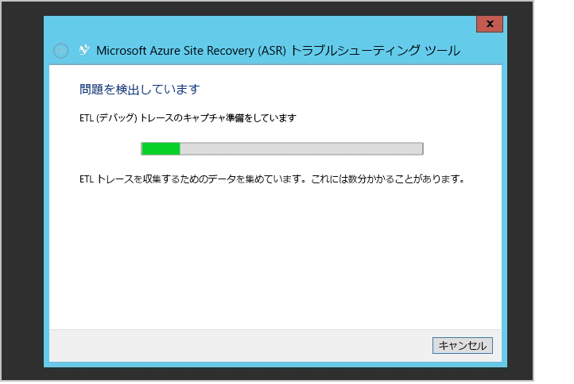

# 仮想マシンおよび物理サーバーの保護の監視とトラブルシューティング
この監視とトラブルシューティング ガイドでは、Azure Site Recovery のレプリケーション正常性を追跡する方法とトラブルシューティング手法について説明します。

## コンポーネントの理解
### オンプレミスと Azure の間のレプリケーションのための VMware 仮想マシンまたは物理サーバーのサイトのデプロイ
オンプレミスの VMware 仮想マシンまたは物理サーバーと Azure の間のデータベース回復を設定するには、構成サーバー、マスター ターゲット サーバー、およびプロセス サーバーの各コンポーネントを、仮想マシン上またはサーバー上に設定する必要があります。 ソース サーバーの保護を有効にすると、Azure Site Recovery は Microsoft Azure App Service の Mobile Apps 機能をインストールします。 オンプレミスで障害が発生してソース サーバーが Azure にフェールオーバーされた後、ユーザーは、Azure のプロセス サーバーとオンプレミスのマスター ターゲット サーバーをセットアップして、オンプレミスのソース サーバーを再構築する必要があります。

### オンプレミス サイト間のレプリケーションのための Virtual Machine Manager サイトのデプロイ
2 つのオンプレミスの場所の間にデータベース復旧を設定するには、Azure Site Recovery プロバイダーをダウンロードして、Virtual Machine Manager サーバーにインストールする必要があります。 Azure Portal からトリガーされるすべての操作がオンプレミスの操作に確実に変換されるためには、プロバイダーはインターネットに接続できる必要があります。

### オンプレミス サイトの場所と Azure の間のレプリケーションのための Virtual Machine Manager サイトのデプロイ
オンプレミスの場所と Azure の間でデータベース復旧を設定するときは、Azure Site Recovery プロバイダーをダウンロードして、Virtual Machine Manager サーバーにインストールする必要があります。 また、各 Hyper-V ホストに Azure Recovery Services エージェントをインストールする必要があります。 詳しくは[こちらをご覧ください](site-recovery-hyper-v-azure-architecture.md)。

### オンプレミスの場所と Azure の間のレプリケーションのための Hyper-V サイトのデプロイ
このプロセスは、Virtual Machine Manager のデプロイに似ています。 唯一の違いは、Azure Site Recovery プロバイダーと Azure Recovery Services エージェントを Hyper-V ホスト自体にインストールする必要があることです。 [詳細情報](site-recovery-hyper-v-azure-architecture.md)。 で作成できます。

## 構成、保護、復旧操作の監視
Azure Site Recovery のすべての操作が **[ジョブ]** タブの下で監査され、追跡されます。 構成、保護、復旧でエラーが発生した場合は、**[ジョブ]** タブで障害を探します。

![[ジョブ] タブの [失敗] フィルター](media/site-recovery-monitoring-and-troubleshooting/image3.png)

**[ジョブ]** タブで障害が見つかったら、そのジョブをクリックし、**[エラーの詳細]** をクリックします。

![[エラーの詳細] ボタン](media/site-recovery-monitoring-and-troubleshooting/image4.png)

エラーの詳細は問題の考えられる原因と推奨措置を特定するために役立ちます。

前の例では、保護構成が失敗する原因は進行中の別の操作であると考えられます。 推奨に基づいて問題を解決し、**[再起動]** をクリックして操作を再開します。

![[ジョブ] タブの [再起動] ボタン](media/site-recovery-monitoring-and-troubleshooting/image6.png)

**[再起動]** オプションが使用できない操作もあります。 操作に **[再起動]** オプションがない場合は、オブジェクトに戻り、もう一度操作を実行します。 **[キャンセル]** ボタンを使用して、進行中のジョブを取り消すことができます。

![[キャンセル] ボタン](media/site-recovery-monitoring-and-troubleshooting/image7.png)

## 仮想マシンのレプリケーションの正常性の監視
Azure Portal を使用して、各保護対象エンティティの Azure Site Recovery プロバイダーをリモート監視できます。 **[保護された項目]** をクリックし、**[Vmm クラウド]** または **[保護グループ]** をクリックします。 **[Vmm クラウド]** タブは、Virtual Machine Manager に基づくデプロイのみに使用できます。 その他のシナリオでは、保護対象エンティティは **[保護グループ]** タブに表示されます。

![[VMM クラウド] オプションと [保護グループ] オプション](media/site-recovery-monitoring-and-troubleshooting/image8.png)

対応するクラウドまたは保護グループの下にある保護対象エンティティをクリックすると、使用可能なすべての操作が下のウィンドウに表示されます。

前のスクリーンショットでは、仮想マシンの正常性は **[重大]** です。 下部にある **[エラーの詳細]** ボタンをクリックして、エラーを表示できます。 **[考えられる原因]** と **[推奨]** を基にして、問題を解決します。

![[エラーの詳細] ボタン](media/site-recovery-monitoring-and-troubleshooting/image10.png)

![[エラーの詳細] ダイアログ ボックスの [エラー] と [推奨]](media/site-recovery-monitoring-and-troubleshooting/image11.png)

> [!NOTE]
> アクティブな操作が進行中であるか、失敗した場合は、先に述べたように、**[ジョブ]** ビューに移動して、特定のジョブのエラーを確認します。
>
>

## オンプレミスの Hyper-V に関する問題のトラブルシューティング
オンプレミス Hyper-V マネージャー コンソールに接続し、仮想マシンを選択し、レプリケーション正常性を確認します。

この場合、**[レプリケーションの正常性]** は **[重大]** です。 仮想マシンを右クリックし、**[レプリケーション]** > **[レプリケーションの正常性の表示]** をクリックして詳細を表示します。

仮想マシンのレプリケーションが一時停止した場合は、仮想マシンを右クリックして、**[レプリケーション]** > **[レプリケーションの再開]** の順にクリックします。

仮想マシンがクラスター内またはスタンドアロン コンピューター内の新しい Hyper-V ホストを移行していて、Hyper-V ホストが Azure Site Recovery によって構成されている場合は、仮想マシンのレプリケーションが影響を受けることはありません。 新しい Hyper-V ホストがすべての前提条件を満たし、Azure Site Recovery を使用して構成されていることを確認します。

### イベント ログ
| イベント ソース | 詳細 |
| --- |:--- |
| **Applications and Service Logs/Microsoft/VirtualMachineManager/Server/Admin** (Virtual Machine Manager サーバー) |Virtual Machine Manager のさまざまな問題のトラブルシューティングに役立つログを提供します。 |
| **Applications and Service Logs/MicrosoftAzureRecoveryServices/Replication** (Hyper-V ホスト) |Microsoft Azure Recovery Services Agent のさまざまな問題の解決に役立つログを提供します。    |
| **Applications and Service Logs/Microsoft/Azure Site Recovery/Provider/Operational** (Hyper-V ホスト) |Microsoft Azure Site Recovery Service のさまざまな問題の解決に役立つログを提供します。    |
| **Applications and Service Logs/Microsoft/Windows/Hyper-V-VMMS/Admin** (Hyper-V ホスト) |Hyper-V 仮想マシンの管理に関するさまざまな問題の解決に役立つログを提供します。    |

### Hyper-V レプリケーションのログ記録のオプション
Hyper-V のレプリケーションに関連するすべてのイベントは Applications and Services Logs\\Microsoft\\Windows にある Hyper-V-VMMS\\Admin ログに記録されます。 さらに、Hyper-V 仮想マシン管理サービスの分析ログを有効にできます。 このログを有効にするには、最初にイベント ビューアーに 分析ログとデバッグ ログを表示する必要があります。 イベント ビューアーを開き、**[表示]** > **[分析およびデバッグ ログの表示]** をクリックします。

![[分析およびデバッグ ログの表示] オプション](media/site-recovery-monitoring-and-troubleshooting/image14.png)

分析ログは **[Hyper-V-VMMS]** の下に表示されます。

**[操作]** ウィンドウで **[ログを有効にする]** をクリックします。 有効にすると、**[パフォーマンス モニター]** の **[データ コレクター セット]** の下に **[イベント トレース セッション]** として表示されます。

![[パフォーマンス モニター] ツリーの [イベント トレース セッション]](media/site-recovery-monitoring-and-troubleshooting/image16.png)

収集された情報を表示するには、最初に、ログを無効にしてトレース セッションを停止します。 ログを保存し、イベント ビューアーで再度開くか、または他のツールを使用して必要に応じて変換します。

## Microsoft のサポートを得る
### ログ コレクション
Virtual Machine Manager のサイト保護については、「[Azure Site Recovery log collection using Support Diagnostics Platform (SDP) Tool](http://social.technet.microsoft.com/wiki/contents/articles/28198.asr-data-collection-and-analysis-using-the-vmm-support-diagnostics-platform-sdp-tool.aspx)」 (VMM Support Diagnostics Platform (SDP) ツールを使用した Azure Site Recovery のログの収集) を参照して、必要なログを収集してください。

Hyper-V のサイト保護の場合は、[ツール](https://dcupload.microsoft.com/tools/win7files/DIAG_ASRHyperV_global.DiagCab)をダウンロードして Hyper-V ホストで実行し、ログを収集してください。

VMware/物理サーバーのシナリオの場合は、「[Azure Site Recovery Log Collection for VMware and Physical site protection](http://social.technet.microsoft.com/wiki/contents/articles/30677.azure-site-recovery-log-collection-for-vmware-and-physical-site-protection.aspx)」 (VMware および物理サイトの保護の場合の Azure Site Recovery のログの収集) を参照して、必要なログを収集してください。

このツールは、%LocalAppData%\ElevatedDiagnostics の下のランダムな名前のサブフォルダーに、ローカルにログを収集します。

### サポート チケットを開く
Azure Site Recovery のサポート チケットを発行するには、Azure サポート (URL: <http://aka.ms/getazuresupport>) にアクセスします。

## サポート技術情報の記事
* [How to preserve the drive letter for protected virtual machines that are failed over or migrated to Azure (Azure にフェールオーバーまたは移行されている、保護された仮想マシンのドライブ文字を保持する方法)](http://support.microsoft.com/kb/3031135)
* [How to manage on-premises to Azure protection network bandwidth usage (オンプレミスと Azure 間の保護ネットワークの帯域幅使用量を管理する方法)](https://support.microsoft.com/kb/3056159)
* [Azure Site Recovery: 仮想マシンの保護を有効にしようとしたときの "クラスター リソースは見つかりませんでした" エラー](http://support.microsoft.com/kb/3010979)
* [Hyper-V レプリケーションを理解してトラブルシューティングするためのガイド](http://social.technet.microsoft.com/wiki/contents/articles/21948.hyper-v-replica-troubleshooting-guide.aspx)

## Azure Site Recovery の一般的なエラーとその解決策
一般的なエラーとその解決策を以下に示します。 それぞれのエラーについては、個別の Wiki ページに記載されています。

### 全般
* 新しい [ジョブが失敗し、「操作が進行中です」というエラーが表示されます。エラー 505、514、532。](http://social.technet.microsoft.com/wiki/contents/articles/32190.azure-site-recovery-jobs-failing-with-error-an-operation-is-in-progress-error-505-514-532.aspx)
* 新規 [ジョブが失敗し、「サーバーがインターネットに接続されていません」というエラーが表示されます。エラー 25018。](http://social.technet.microsoft.com/wiki/contents/articles/32192.azure-site-recovery-jobs-failing-with-error-server-isn-t-connected-to-the-internet-error-25018.aspx)

### セットアップ
* [内部エラーにより、Virtual Machine Manager サーバーを登録できない。エラーの詳細については、Site Recovery ポータルのジョブ ビューを参照してください。サーバーを登録するには、もう一度セットアップを実行します。](http://social.technet.microsoft.com/wiki/contents/articles/25570.the-vmm-server-cannot-be-registered-due-to-an-internal-error-please-refer-to-the-jobs-view-in-the-site-recovery-portal-for-more-details-on-the-error-run-setup-again-to-register-the-server.aspx)
* [Hyper-V Recovery Manager コンテナーへの接続を確立できない。プロキシ設定を確認するか、後でもう一度実行してください。](http://social.technet.microsoft.com/wiki/contents/articles/25571.a-connection-cant-be-established-to-the-hyper-v-recovery-manager-vault-verify-the-proxy-settings-or-try-again-later.aspx)

### 構成
* [保護グループを作成できない: サーバーの一覧を取得中にエラーが発生する。](http://blogs.technet.com/b/somaning/archive/2015/08/12/unable-to-create-the-protection-group-in-azure-site-recovery-portal.aspx)
* [Hyper-V ホスト クラスターに少なくとも&1; つの静的なネットワーク アダプターが含まれているか、DHCP を使用するように接続されたアダプターが構成されていない。](http://social.technet.microsoft.com/wiki/contents/articles/25498.hyper-v-host-cluster-contains-at-least-one-static-network-adapter-or-no-connected-adapters-are-configured-to-use-dhcp.aspx)
* [操作を完了するための、Virtual Machine Manager のアクセス許可がない。](http://social.technet.microsoft.com/wiki/contents/articles/31110.vmm-does-not-have-permissions-to-complete-an-action.aspx)
* [保護を構成するときに、サブスクリプション内のストレージ アカウントを選択できない。](http://social.technet.microsoft.com/wiki/contents/articles/32027.can-t-select-the-storage-account-within-the-subscription-while-configuring-protection.aspx)

### 保護
* 新規 [保護の有効化に失敗し、「仮想マシンの保護を構成できません」というエラーが表示されます。エラー 60007、40003。](http://social.technet.microsoft.com/wiki/contents/articles/32194.azure-site-recovery-enable-protection-failing-with-error-protection-couldn-t-be-configured-for-the-virtual-machine-error-60007-40003.aspx)
* 新規 [保護の有効化に失敗し、「仮想マシンの保護を有効にできません」というエラーが表示されます。エラー 70094。](http://social.technet.microsoft.com/wiki/contents/articles/32195.azure-site-recovery-enable-protection-failing-with-error-protection-couldn-t-be-enabled-for-the-virtual-machine-error-70094.aspx)
* 新規 [ライブ マイグレーション エラー 23848 - 仮想マシンはタイプ "ライブ" を使用して移動します。これにより、仮想マシンの回復保護の状態が壊れる可能性があります。](http://social.technet.microsoft.com/wiki/contents/articles/32021.live-migration-error-23848-the-virtual-machine-is-going-to-be-moved-using-type-live-this-could-break-the-recovery-protection-status-of-the-virtual-machine.aspx)
* [エージェントがホスト コンピューターにインストールされていないため、保護の有効化が失敗する。](http://social.technet.microsoft.com/wiki/contents/articles/31105.enable-protection-failed-since-agent-not-installed-on-host-machine.aspx)
* [コンピューティング リソースが少ないため、レプリカ仮想マシンに適したホストが見つからない。](http://social.technet.microsoft.com/wiki/contents/articles/25501.a-suitable-host-for-the-replica-virtual-machine-can-t-be-found-due-to-low-compute-resources.aspx)
* [論理ネットワークに接続されていないため、レプリカ仮想マシンに適したホストが見つからない。](http://social.technet.microsoft.com/wiki/contents/articles/25502.a-suitable-host-for-the-replica-virtual-machine-can-t-be-found-due-to-no-logical-network-attached.aspx)
* [レプリカのホスト コンピューターに接続できない。接続を確立できない。](http://social.technet.microsoft.com/wiki/contents/articles/31106.cannot-connect-to-the-replica-host-machine-connection-could-not-be-established.aspx)

### 復旧
* Virtual Machine Manager がホストの操作を完了できない。
  * [仮想マシンの選択した復旧ポイントにフェールオーバーする。一般的なアクセス拒否エラー。](http://social.technet.microsoft.com/wiki/contents/articles/25504.fail-over-to-the-selected-recovery-point-for-virtual-machine-general-access-denied-error.aspx)
  * [Hyper-V が仮想マシンの選択した回復ポイントへのフェールオーバーに失敗した。操作が中止された。最新の復旧ポイントを実行してください。(0x80004004)。](http://social.technet.microsoft.com/wiki/contents/articles/25503.hyper-v-failed-to-fail-over-to-the-selected-recovery-point-for-virtual-machine-operation-aborted-try-a-more-recent-recovery-point-0x80004004.aspx)
  * サーバーとの接続を確立できない (0x00002EFD)。
    * [Hyper-V で仮想マシンのレプリケーションの反転を有効にできない。](http://social.technet.microsoft.com/wiki/contents/articles/25505.a-connection-with-the-server-could-not-be-established-0x00002efd-hyper-v-failed-to-enable-reverse-replication-for-virtual-machine.aspx)
    * [Hyper-V で仮想マシンのレプリケーションを有効にできない。](http://social.technet.microsoft.com/wiki/contents/articles/25506.a-connection-with-the-server-could-not-be-established-0x00002efd-hyper-v-failed-to-enable-replication-for-virtual-machine-virtual-machine.aspx)
  * [仮想マシンのフェールオーバーをコミットできない。](http://social.technet.microsoft.com/wiki/contents/articles/25508.could-not-commit-failover-for-virtual-machine.aspx)
* [計画フェールオーバーの準備ができていない仮想マシンが、復旧計画に含まれている。](http://social.technet.microsoft.com/wiki/contents/articles/25509.the-recovery-plan-contains-virtual-machines-which-are-not-ready-for-planned-failover.aspx)
* [仮想マシンの計画フェールオーバーの準備ができていない。](http://social.technet.microsoft.com/wiki/contents/articles/25507.the-virtual-machine-isn-t-ready-for-planned-failover.aspx)
* [仮想マシンが実行されていなく、電源が入っていない。](http://social.technet.microsoft.com/wiki/contents/articles/25510.virtual-machine-is-not-running-and-is-not-powered-off.aspx)
* [帯域外操作が仮想マシンで発生し、フェールオーバーのコミットに失敗した。](http://social.technet.microsoft.com/wiki/contents/articles/25507.the-virtual-machine-isn-t-ready-for-planned-failover.aspx)
* [テスト フェールオーバー]
  * [テスト フェールオーバーが進行中であるため、フェールオーバーを開始できない。](http://social.technet.microsoft.com/wiki/contents/articles/31111.failover-could-not-be-initiated-since-test-failover-is-in-progress.aspx)
* 新規 仮想マシンまたはその仮想マシンが属しているサブネットに関連付けられたネットワーク セキュリティ グループの構成設定により、"PreFailoverWorkflow タスクの WaitForScriptExecutionTaskTimeout がタイムアウトしました" でフェールオーバーがタイムアウトしました。 詳細については、 ["PreFailoverWorkflow タスクの WaitForScriptExecutionTaskTimeout がタイムアウトしました"](https://aka.ms/troubleshoot-nsg-issue-azure-site-recovery) に関するページを参照してください。

### 構成サーバー、プロセス サーバー、マスター ターゲット
* [PS/CS が VM としてホストされている ESXi ホストが、Purple Screen of Death の画面を表示して失敗する。](http://social.technet.microsoft.com/wiki/contents/articles/31107.vmware-esxi-host-experiences-a-purple-screen-of-death.aspx)

### リモート デスクトップのフェールオーバー後のトラブルシューティング
* 多くのお客様が、Azure でフェールオーバー後の仮想マシンへの接続について、問題に直面しています。 [仮想マシンへの RDP 接続におけるトラブルシューティングに関するドキュメントを使用してください](http://social.technet.microsoft.com/wiki/contents/articles/31666.troubleshooting-remote-desktop-connection-after-failover-using-asr.aspx)。

#### Resource Manager 仮想マシンでのパブリック IP の追加
ポータルの **[接続]** ボタンが淡色表示され、Express Route やサイト間 VPN 接続で Azure に接続されていない場合は、仮想マシンを作成してパブリック IP アドレスを割り当ててからリモート デスクトップ/共有シェルを使用する必要があります。 その後、仮想マシンのネットワーク インターフェイスでパブリック IP を追加できます。  

