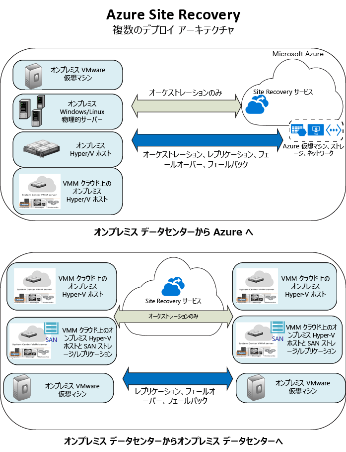

<properties
	pageTitle="Site Recovery とは | Microsoft Azure" 
	description="Azure Site Recovery サービスの概要と、サービスをデプロイする方法について説明します。" 
	services="site-recovery" 
	documentationCenter="" 
	authors="rayne-wiselman" 
	manager="jwhit" 
	editor=""/>

<tags 
	ms.service="site-recovery" 
	ms.devlang="na"
	ms.topic="get-started-article"
	ms.tgt_pltfrm="na"
	ms.workload="storage-backup-recovery" 
	ms.date="02/22/2016" 
	ms.author="raynew"/>

#  Site Recovery とは

Azure Site Recovery へようこそ。 この記事では、まず、Site Recovery サービスの簡単な概要と、Site Recovery がビジネス継続性と障害復旧 (BCDR) 戦略にどのように貢献するのかについて説明します。

Azure には、リソースの作成と操作に関して 2 種類のデプロイ モデルがあります。[リソース マネージャー デプロイ モデルとクラシック デプロイ モデル](../resource-manager-deployment-model.md)です。この記事は、両方のモデルに当てはまります。最新のデプロイメントでは、リソース マネージャー モデルを使用することをお勧めします。

## 概要

組織の BCDR 戦略において重要となるのは、計画済みおよび計画外の停止が発生した場合に企業のワークロードとアプリを継続して実行する方法を見極めることです。

Site Recovery は、ワークロードとアプリのレプリケーション、フェールオーバー、および復旧を調整して、1 次拠点がダウンした場合に 2 次拠点からワークロードとアプリを利用できるようにすることで、その方法の実現に役立ちます。

## Site Recovery を使用する理由 

Site Recovery のビジネス上のメリットを次に示します。

- **BCDR 戦略を簡素化** - Site Recovery では、1 か所から複数のビジネス ワークロードとアプリのレプリケーション、フェールオーバー、および復旧を簡単に処理できます。Site recovery はレプリケーションとフェールオーバーを調整しますが、アプリケーション データをインターセプトすることや、そのデータに関する情報を持つことはありません。
- **柔軟なレプリケーション機能を提供** - Site Recovery を使用すると、Hyper-V 仮想マシン、VMware 仮想マシン、および Windows または Linux の物理サーバーで実行されているワークロードをレプリケートできます。 
- **簡単なフェールオーバーと復旧** - Site Recovery では、実稼働環境に影響を与えずに障害復旧の演習をサポートするテスト フェールオーバーを実行できます。また、予期された停止の場合はデータ損失ゼロの計画されたフェールオーバーを実行し、予期しない停止の場合は (レプリケーションの頻度に応じた) 最小限のデータ損失で計画外のフェールオーバーを実行することもできます。フェールオーバー後は、プライマリ サイトにフェールバックできます。Site Recovery に用意されている復旧計画には、多層アプリケーションのフェールオーバーと復旧をカスタマイズできるように、スクリプトや Azure Automation ブックが含まれています。 
- **セカンダリ データセンターを排除** - オンプレミスのセカンダリ サイトまたは Azure にレプリケートできます。障害復旧のためのレプリケーション先として Azure を使用すると、セカンダリ サイトの管理に伴うコストと手間が削減され、レプリケートされたデータは元の復元性を十分に備えた状態で Azure Storage に格納されます。
- **既存の BCDR テクノロジと統合** - Site Recovery は、その他のアプリケーションの BCDR 機能と連携します。たとえば、Site Recovery を使用すると、企業のワークロードの SQL Server バックエンドを保護でき、SQL Server AlwaysOn による可用性グループのフェールオーバーの管理のネイティブ サポートが提供されます。 

## レプリケート対象

Site Recovery のレプリケート対象の概要を次に示します。

**REPLICATE** | **レプリケート元** | **レプリケート先** | **記事**
---|---|---|---
VMware VM 上で実行されているワークロード | オンプレミスの VMware サーバー | Azure Storage | [デプロイする](site-recovery-vmware-to-azure-classic.md)
VMware VM 上で実行されているワークロード | オンプレミスの VMware サーバー | セカンダリの VMware サイト | [デプロイする](site-recovery-vmware-to-vmware.md) 
Hyper-V VM 上で実行されているワークロード | VMM クラウド内のオンプレミスの Hyper-V ホスト サーバー | Azure Storage | [デプロイする](site-recovery-vmm-to-azure.md)
Hyper-V VM 上で実行されているワークロード | VMM クラウド内のオンプレミスの Hyper-V ホスト サーバー | セカンダリの VMM サイト | [デプロイする](site-recovery-vmm-to-vmm.md)
Hyper-V VM 上で実行されているワークロード | VMM クラウド内のオンプレミス Hyper-V ホスト サーバーと SAN ストレージ| SAN ストレージを使用するセカンダリ VMM サイト | [デプロイする](site-recovery-vmm-san.md)
Hyper-V VM 上で実行されているワークロード | オンプレミスの Hyper-V サイト (VMM なし) | Azure Storage | [デプロイする](site-recovery-hyper-v-site-to-azure.md)
Windows または Linux の物理サーバーで実行されているワークロード | オンプレミスの物理サーバー | Azure Storage | [デプロイする](site-recovery-vmware-to-azure-classic.md)
Windows または Linux の物理サーバーで実行されているワークロード | オンプレミスの物理サーバー | セカンダリ データセンター | [デプロイする](site-recovery-vmware-to-vmware.md) 

## 保護できるワークロードとは

Site Recovery は、障害が発生した場合にワークロードとアプリが一貫した方法で引き続き実行されるように、アプリケーション対応の BCDR に役立ちます。Site Recovery で提供されるものは次のとおりです。

- **アプリケーションの整合性スナップショット** - 単一層または N 層のアプリに適したアプリケーションの整合性スナップショットを使用したレプリケーション。**近同期レプリケーション** - レプリケーション頻度は Hyper-V や VMware の連続レプリケーションではわずか 30 秒間です。**SQL Server AlwaysOn との統合** - Site Recovery での復旧計画で可用性グループのフェールオーバーを管理できます。 
- **柔軟な復旧計画** - 外部スクリプト、手動操作、Azure Automation Runbook を使用して復旧計画を作成およびカスタマイズし、1 回のクリックでアプリケーション スタック全体を復旧できるようにします。
- **Automation ライブラリ** - 豊富な Azure Automation ライブラリには、運用環境ですぐに使える、アプリケーション固有のスクリプトが用意されています。これらのスクリプトは、ダウンロードして Site Recovery と統合できます。 -**簡単なネットワーク管理** — Site Recovery と Azure での高度なネットワーク管理により、IP アドレスの予約、ロード バランサーの構成、効率的なネットワーク切り替え用の Azure Traffic Manager の統合など、アプリケーションのネットワーク要件が簡略化されます。

## 次のステップ

- 詳細については、「[Azure Site Recovery で保護できるワークロード](site-recovery-workload.md)」を参照してください。
- Site Recovery のアーキテクチャの詳細については、「[Azure Site Recovery のしくみ](site-recovery-components.md)」を参照してください。
 

<!---HONumber=AcomDC_0316_2016-->