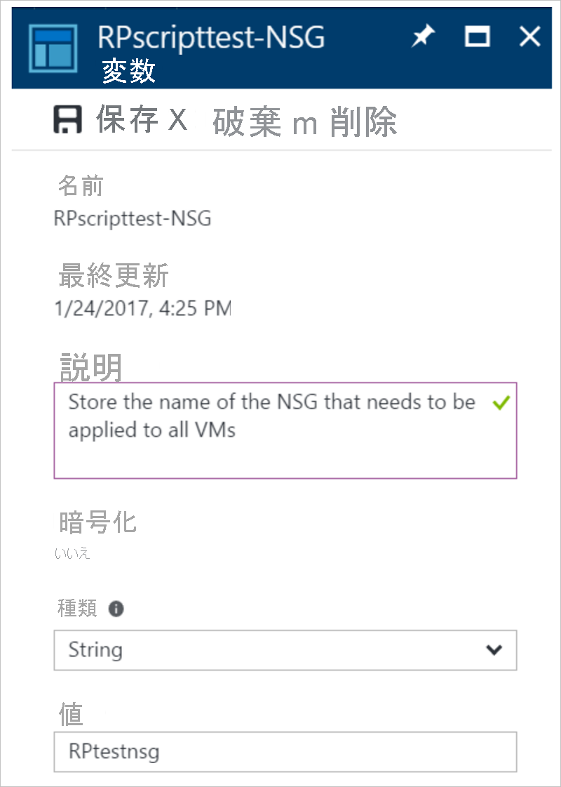
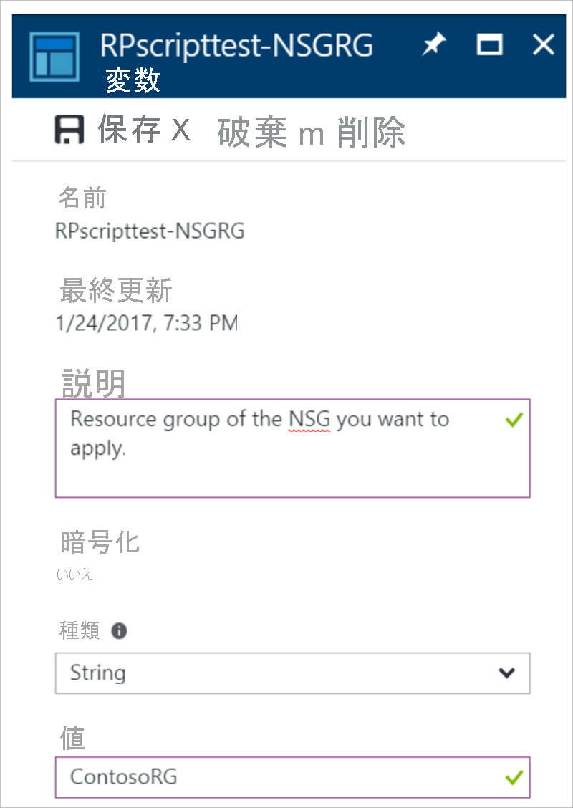
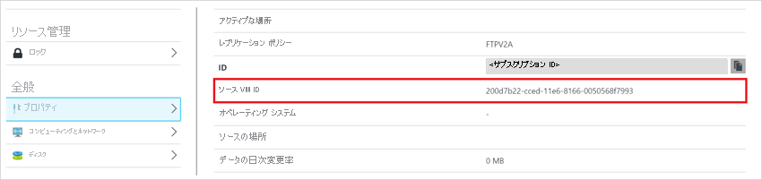

# <a name="add-azure-automation-runbooks-to-recovery-plans"></a>復旧計画に Azure Automation Runbook を追加する
この記事では、復旧計画の拡張に役立てるために Azure Site Recovery と Azure Automation をどのように統合するかについて説明します。 復旧計画では、Site Recovery で保護される VM の復旧を調整できます。 復旧計画は、セカンダリ クラウドへのレプリケーションと Azure へのレプリケーションの両方に対して機能します。 復旧計画はまた、復旧を**常に正確で**、**繰り返し可能**、さらに**自動化される**ようにするのにも役立ちます。 VM を Azure にフェールオーバーする場合、Azure Automation との統合によって復旧計画が拡張されます。 それを使用して、強力な自動化タスクを提供する Runbook を実行できます。

Azure Automation が初めての場合は、[サインアップ](https://azure.microsoft.com/services/automation/)し、[サンプル スクリプトをダウンロード](https://azure.microsoft.com/documentation/scripts/)できます。 詳細について、および[復旧計画](./site-recovery-create-recovery-plans.md)を使用して Azure への復旧を調整する方法を学習するには、「[Azure Site Recovery](https://azure.microsoft.com/services/site-recovery/)」を参照してください。

この記事では、復旧計画に Azure Automation Runbook を統合する方法について説明します。 ここでは、以前は手動の介入を必要とした基本的なタスクを自動化する例を使用します。 また、複数手順の復旧を 1 回のクリックでの復旧アクションに変換する方法についても説明します。

## <a name="customize-the-recovery-plan"></a>復旧計画のカスタマイズ
1. **Site Recovery** 復旧計画リソース ブレードに移動します。 この例では、復旧用に復旧計画に 2 つの VM が追加されています。 Runbook の追加を開始するには、**[カスタマイズ]** タブをクリックします。

    ![[カスタマイズ] ボタンをクリックします。](media/site-recovery-runbook-automation-new/essentials-rp.png)


2. **[Group 1: Start] \(グループ 1: 開始)** を右クリックしてから、**[Add post action] \(事後アクションを追加する)** を選択します。

    ![[Group 1: Start] \(グループ 1: 開始) の右クリックおよび事後アクションの追加](media/site-recovery-runbook-automation-new/customize-rp.png)

3. **[Choose a script] \(スクリプトを選択する)** をクリックします。

4. **[Update action] \(アクションの更新)** ブレードで、スクリプトに **Hello World** という名前を付けます。

    ![[Update action]\ (アクションの更新) ブレード](media/site-recovery-runbook-automation-new/update-rp.png)

5. Automation アカウント名を入力します。
    >[!NOTE]
    > Automation アカウントは、任意の Azure リージョン内に存在できます。 Automation アカウントは、Azure Site Recovery コンテナーと同じサブスクリプション内に存在する必要があります。

6. Automation アカウントで、Runbook を選択します。 この Runbook は、最初のグループの復旧後、復旧計画の実行中に実行されるスクリプトです。

7. スクリプトを保存するには、**[OK]** をクリックします。 このスクリプトは **[グループ 1: 後の手順]** に追加されます。

    


## <a name="considerations-for-adding-a-script"></a>スクリプトを追加するための考慮事項

* **手順を削除する**か、または**スクリプトを更新する**オプションの場合は、スクリプトを右クリックします。
* スクリプトは、オンプレミスのマシンから Azure へのフェールオーバー中に Azure 上で実行できます。 また、Azure からオンプレミスのマシンへのフェールバック中にも、シャットダウンの前にプライマリ サイトのスクリプトとして Azure 上で実行できます。
* スクリプトの実行時に、復旧計画のコンテキストが挿入されます。 次の例は、コンテキスト変数を示しています。

    ```
            {"RecoveryPlanName":"hrweb-recovery",

            "FailoverType":"Test",

            "FailoverDirection":"PrimaryToSecondary",

            "GroupId":"1",

            "VmMap":{"7a1069c6-c1d6-49c5-8c5d-33bfce8dd183":

                    { "SubscriptionId":"7a1111111-c1d6-49c5-8c5d-111ce8dd183",

                    "ResourceGroupName":"ContosoRG",

                    "CloudServiceName":"pod02hrweb-Chicago-test",

                    "RoleName":"Fabrikam-Hrweb-frontend-test",

                    "RecoveryPointId":"TimeStamp"}

                    }

            }
    ```

    次の表は、コンテキスト内の各変数の名前と説明を示しています。

    | **変数名** | **説明** |
    | --- | --- |
    | RecoveryPlanName |実行される計画の名前。 この変数は、復旧計画名に基づいて異なるアクションを実行するのに役立ちます。 また、スクリプトを再利用することもできます。 |
    | FailoverType |フェールオーバーがテスト フェールオーバー、計画されたフェールオーバー、計画されていないフェールオーバーのいずれであるかを指定します。 |
    | FailoverDirection |プライマリ サイトまたはセカンダリ サイトのどちらへの復旧かを指定します。 |
    | GroupID |復旧計画が実行されている場合、その計画内のグループ番号を識別します。 |
    | VmMap |グループ内のすべての VM の配列。 |
    | VMMap キー |VM ごとの一意キー (GUID)。 これは、VM の Azure Virtual Machine Manager (VMM) ID と同じです (該当する場合)。 |
    | SubscriptionId |VM が作成されたときの Azure サブスクリプション ID。 |
    | RoleName |復旧されている Azure VM の名前。 |
    | CloudServiceName |VM が作成されたときの Azure クラウド サービス名。 |
    | ResourceGroupName|VM が作成されたときの Azure リソース グループ名。 |
    | RecoveryPointId|VM が復旧されるときのタイムスタンプ。 |

* Automation アカウントに次のモジュールが含まれていることを確認してください。
    * AzureRM.profile
    * AzureRM.Resources
    * AzureRM.Automation
    * AzureRM.Network
    * AzureRM.Compute

モジュールはすべて、互換性のあるバージョンである必要があります。 すべてのモジュールに互換性があるようにするための簡単な方法は、すべてのモジュールの最新バージョンを使用することです。

### <a name="access-all-vms-of-the-vmmap-in-a-loop"></a>VMMap のすべての VM にループでアクセスする
Microsoft VMMap のすべての VM にわたってループ処理するには、次のコードを使用します。

```
$VMinfo = $RecoveryPlanContext.VmMap | Get-Member | Where-Object MemberType -EQ NoteProperty | select -ExpandProperty Name
$vmMap = $RecoveryPlanContext.VmMap
 foreach($VMID in $VMinfo)
 {
     $VM = $vmMap.$VMID                
             if( !(($VM -eq $Null) -Or ($VM.ResourceGroupName -eq $Null) -Or ($VM.RoleName -eq $Null))) {
         #this check is to ensure that we skip when some data is not available else it will fail
 Write-output "Resource group name ", $VM.ResourceGroupName
 Write-output "Rolename " = $VM.RoleName
     }
 }

```

> [!NOTE]
> スクリプトがブート グループへの事前アクションである場合、リソース グループ名とロール名の値は空です。 これらの値は、そのグループの VM がフェールオーバーで成功した場合にのみ設定されます。 このスクリプトは、ブート グループの事後アクションです。

## <a name="use-the-same-automation-runbook-in-multiple-recovery-plans"></a>複数の復旧計画で同じ Automation Runbook を使用する

外部変数を使用することによって、複数の復旧計画で 1 つのスクリプトを使用できます。 [Azure Automation 変数 ](../automation/automation-variables.md) を使用すると、復旧計画の実行のために渡すことのできるパラメーターを格納できます。 この変数へのプレフィックスとして復旧計画名を追加することにより、復旧計画ごとの個別の変数を作成できます。 次に、これらの変数をパラメーターとして使用します。 スクリプトを変更しなくてもパラメーターを変更できますが、それによってスクリプトの動作が変更されます。

### <a name="use-a-simple-string-variable-in-a-runbook-script"></a>Runbook スクリプトで単純な文字列変数を使用する

この例では、スクリプトはネットワーク セキュリティ グループ (NSG) の入力を受け取り、それを復旧計画の VM に適用します。

スクリプトでどの復旧計画が実行されているかを検出するには、復旧計画のコンテキストを使用します。

```
workflow AddPublicIPAndNSG {
    param (
          [parameter(Mandatory=$false)]
          [Object]$RecoveryPlanContext
    )

    $RPName = $RecoveryPlanContext.RecoveryPlanName
```

既存の NSG を適用するには、NSG 名と NSG リソース グループ名がわかっている必要があります。 これらの変数を復旧計画スクリプトへの入力として使用します。 これを行うには、Automation アカウント アセット内に 2 つの変数を作成します。 パラメーターを作成している復旧計画の名前を変数名へのプレフィックスとして追加します。

1. NSG の名前を格納するための変数を作成します。 復旧計画の名前を使用して、この変数名にプレフィックスを追加します。

    

2. NSG のリソース グループ名を格納するための変数を作成します。 復旧計画の名前を使用して、この変数名にプレフィックスを追加します。

    


3.  このスクリプトでは、次の参照コードを使用して変数値を取得します。

    ```
    $NSGValue = $RecoveryPlanContext.RecoveryPlanName + "-NSG"
    $NSGRGValue = $RecoveryPlanContext.RecoveryPlanName + "-NSGRG"

    $NSGnameVar = Get-AutomationVariable -Name $NSGValue
    $RGnameVar = Get-AutomationVariable -Name $NSGRGValue
    ```

4.  この NSG をフェールオーバーされた VM のネットワーク インターフェイスに適用するには、これらの変数を Runbook で使用します。

    ```
    InlineScript {
    if (($Using:NSGname -ne $Null) -And ($Using:NSGRGname -ne $Null)) {
            $NSG = Get-AzureRmNetworkSecurityGroup -Name $Using:NSGname -ResourceGroupName $Using:NSGRGname
            Write-output $NSG.Id
            #Apply the NSG to a network interface
            #$vnet = Get-AzureRmVirtualNetwork -ResourceGroupName TestRG -Name TestVNet
            #Set-AzureRmVirtualNetworkSubnetConfig -VirtualNetwork $vnet -Name FrontEnd `
            #  -AddressPrefix 192.168.1.0/24 -NetworkSecurityGroup $NSG
        }
    }
    ```

このスクリプトを再利用できるように、復旧計画ごとに独立した変数を作成します。 復旧計画名を使用してプレフィックスを追加します。 このシナリオのための完全なエンド ツー エンドのスクリプトを作成するには、「[Add a public IP and NSG to VMs during test failover of a Site Recovery recovery plan (Site Recovery 復旧計画のテスト フェールオーバー中に VM にパブリック IP および NSG を追加する)](https://gallery.technet.microsoft.com/Add-Public-IP-and-NSG-to-a6bb8fee)」を参照してください。


### <a name="use-a-complex-variable-to-store-more-information"></a>複合変数を使用してより多くの情報を格納する

特定の VM 上でパブリック IP を有効にするための 1 つのスクリプトが必要なシナリオを考えてみます。 別のシナリオでは、(すべての VM 上ではなく) さまざまな VM 上で異なる NSG を適用することもできます。 どの復旧計画にも再利用可能なスクリプトを作成できます。 各復旧計画には、可変数の VM が存在できます。 たとえば、SharePoint の復旧には 2 つのフロントエンドがあります。 基本的な基幹業務 (LOB) アプリケーションには 1 つのフロントエンドしかありません。 復旧計画ごとに個別の変数を作成することはできません。

次の例では、新しい手法を使用し、Azure Automation アカウント アセット内に[複合変数](https://docs.microsoft.com/powershell/module/servicemanagement/azure/set-azureautomationvariable)を作成します。 これは、複数の値を指定することによって行います。 次の手順を完了するには、Azure PowerShell を使用する必要があります。

1. PowerShell で、Azure サブスクリプションにサインインします。

    ```
    Connect-AzureRmAccount
    $sub = Get-AzureRmSubscription -Name <SubscriptionName>
    $sub | Select-AzureRmSubscription
    ```

2. パラメーターを格納するには、復旧計画の名前を使用して複合変数を作成します。

    ```
    $VMDetails = @{"VMGUID"=@{"ResourceGroupName"="RGNameOfNSG";"NSGName"="NameOfNSG"};"VMGUID2"=@{"ResourceGroupName"="RGNameOfNSG";"NSGName"="NameOfNSG"}}
        New-AzureRmAutomationVariable -ResourceGroupName <RG of Automation Account> -AutomationAccountName <AA Name> -Name <RecoveryPlanName> -Value $VMDetails -Encrypted $false
    ```

3. この複合変数では、**VMDetails** は保護された VM の VM ID です。 VM ID を取得するには、Azure Portal でその VM のプロパティを表示します。 次のスクリーンショットは、2 つの VM の詳細を格納する変数を示しています。

    

4. この変数は Runbook で使用します。 示されている VM GUID が復旧計画のコンテキスト内に見つかった場合は、その VM 上で NSG を適用します。

    ```
    $VMDetailsObj = Get-AutomationVariable -Name $RecoveryPlanContext.RecoveryPlanName
    ```

4. Runbook で、復旧計画のコンテキストの各 VM をループ処理します。 この VM が **$VMDetailsObj** 内に存在するかどうかを確認します。 存在する場合は、その変数のプロパティにアクセスして NSG を適用します。

    ```
        $VMinfo = $RecoveryPlanContext.VmMap | Get-Member | Where-Object MemberType -EQ NoteProperty | select -ExpandProperty Name
        $vmMap = $RecoveryPlanContext.VmMap

        foreach($VMID in $VMinfo) {
            Write-output $VMDetailsObj.value.$VMID

            if ($VMDetailsObj.value.$VMID -ne $Null) { #If the VM exists in the context, this will not b Null
                $VM = $vmMap.$VMID
                # Access the properties of the variable
                $NSGname = $VMDetailsObj.value.$VMID.'NSGName'
                $NSGRGname = $VMDetailsObj.value.$VMID.'NSGResourceGroupName'

                # Add code to apply the NSG properties to the VM
            }
        }
    ```

異なる復旧計画に対して同じスクリプトを使用できます。 復旧計画に対応する値を別の変数に格納することによって、異なるパラメーターを入力します。

## <a name="sample-scripts"></a>サンプルのスクリプト

サンプル スクリプトを Automation アカウントにデプロイするには、**[Azure へのデプロイ]** ボタンをクリックします。

[](https://aka.ms/asr-automationrunbooks-deploy)

別の例として、次の動画を参照してください。 これは、2 層 WordPress アプリケーションを Azure に復旧する方法を示しています。


> [!VIDEO https://channel9.msdn.com/Series/Azure-Site-Recovery/One-click-failover-of-a-2-tier-WordPress-application-using-Azure-Site-Recovery/player]


## <a name="additional-resources"></a>その他のリソース
* [Azure Automation サービスの実行アカウント](../automation/automation-create-runas-account.md)
* [Azure Automation の概要](http://msdn.microsoft.com/library/azure/dn643629.aspx "Azure Automation の概要")
* [Azure Automation のサンプル スクリプト](http://gallery.technet.microsoft.com/scriptcenter/site/search?f\[0\].Type=User&f\[0\].Value=SC%20Automation%20Product%20Team&f\[0\].Text=SC%20Automation%20Product%20Team "Azure Automation のサンプル スクリプト")

## <a name="next-steps"></a>次の手順
フェールオーバーの実行については、[こちら](site-recovery-failover.md)を参照してください。
