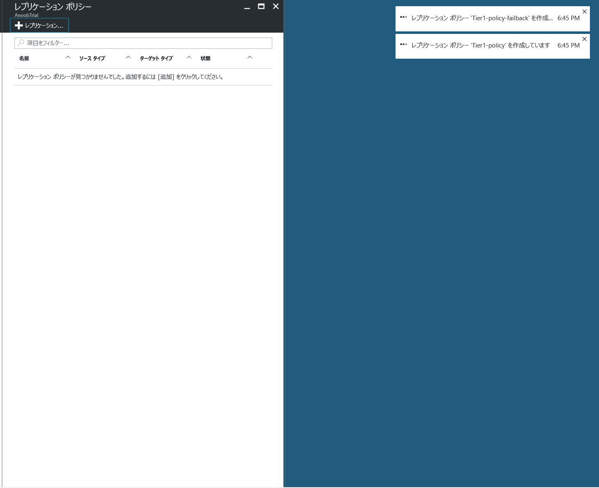
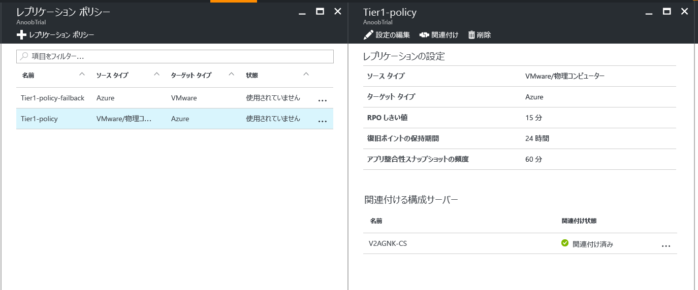
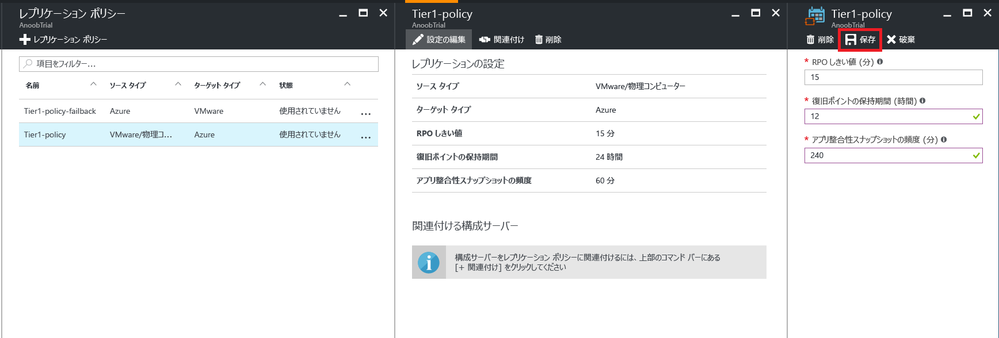

# VMware から Azure へのレプリケーション ポリシーの管理

## レプリケーション ポリシーを作成する

1. **[管理]** > **[Site Recovery インフラストラクチャ]** を選択します。
2. **[For VMware and Physical machines (VMware と物理マシン用)]** の **[レプリケーション ポリシー]** を選択します。
3. **[+レプリケーション ポリシー]** を選択します。

      

4. ポリシー名を入力します。

5. **[RPO しきい値]** で、RPO の制限を指定します。 継続的なレプリケーションがこの制限を超えると、アラートが生成されます。
6. **[復旧ポイントのリテンション期間]** で、各復旧ポイントのリテンション期間の長さ (時間単位) を指定します。 保護されたマシンは、このリテンション期間内のどのポイントにでも復旧できます。

    > [!NOTE]
    > Premium Storage にレプリケートされたマシンでは、最大 24 時間のリテンション期間がサポートされます。 Standard Storage にレプリケートされたマシンでは、最大 72 時間のリテンション期間がサポートされます。

    > [!NOTE]
    > フェールバック用のレプリケーション ポリシーは、自動的に作成されます。

7. **[アプリ整合性スナップショットの頻度]** で、アプリケーション整合性スナップショットを含む復旧ポイントの作成頻度 (分単位) を指定します。

8. **[OK]**をクリックします。 30 ～ 60 秒でポリシーが作成されます。

## 構成サーバーをレプリケーション ポリシーに関連付ける
1. 構成サーバーを関連付けるレプリケーション ポリシーを選択します。
2. **[関連付け]** をクリックします。

3. サーバーの一覧から [構成サーバー] を選択します。
4. **[OK]**をクリックします。 1 ～&2; 分で構成サーバーが関連付けられます。

## レプリケーション ポリシーを編集する
1. レプリケーション設定を編集するレプリケーション ポリシーを選択します。

2. **[Edit Settings]**をクリックします。

3. 必要に応じて設定を変更します。
4. **[保存]**をクリックします。 そのレプリケーション ポリシーを使用している VM の数に応じて、2 ～&5; 分でポリシーが保存されます。

## 構成サーバーとレプリケーション ポリシーの関連付けを解除する
1. 構成サーバーを関連付けるレプリケーション ポリシーを選択します。
2. **[関連付けの解除]** をクリックします。
3. サーバーの一覧から [構成サーバー] を選択します。
4. **[OK]**をクリックします。 1 ～&2; 分で構成サーバーの関連付けが解除されます。

    > [!NOTE]
    > そのポリシーを使用してレプリケートされた項目が&1; つでもある場合は、構成サーバーの関連付けを解除することはできません。 構成サーバーの関連付けを解除する前に、そのポリシーを使用してレプリケートされた項目がないことを確認してください。

## レプリケーション ポリシーを削除する

1. 削除するレプリケーション ポリシーを選択します。
2. [ **削除**] をクリックします。 30 ～ 60 秒でポリシーが削除されます。

    > [!NOTE]
    > 関連付けられている構成サーバーが&1; つでもある場合は、レプリケーション ポリシーを削除することはできません。 ポリシーを削除する前に、そのポリシーを使用してレプリケートされた項目がないことを確認し、関連付けられているすべての構成サーバーを削除してください。

