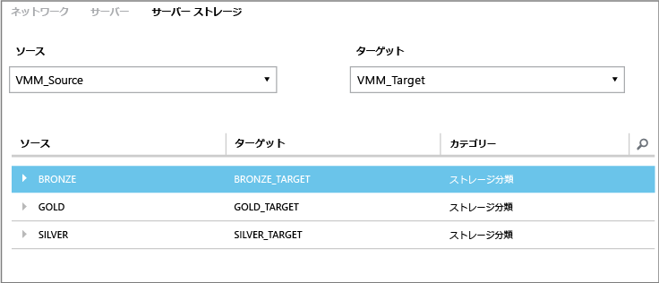
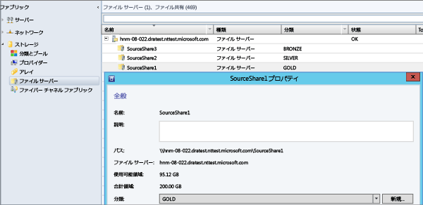

<properties
	pageTitle="Site Recovery の記憶域マッピング"
	description="Azure Site Recovery は、オンプレミスに配置されている仮想マシンと物理サーバーの Azure またはセカンダリ オンプレミス サイトへのレプリケーション、フェールオーバー、および復旧を調整します。"
	services="site-recovery"
	documentationCenter=""
	authors="rayne-wiselman"
	manager="jwhit"
	editor=""/>

<tags
	ms.service="site-recovery"
	ms.devlang="na"
	ms.topic="get-started-article"
	ms.tgt_pltfrm="na"
	ms.workload="storage-backup-recovery"
	ms.date="05/08/2015"
	ms.author="raynew"/>

# Site Recovery の記憶域マッピング

Azure Site Recovery は、仮想マシンと物理サーバーのレプリケーション、フェールオーバー、復旧を調整してビジネス継続性と障害復旧 (BCDR) 戦略に貢献します。可能なデプロイ シナリオについては、「[Site Recovery Overview (Site Recovery の概要)](site-recovery-overview.md)」 を参照してください。

## この記事の内容

記憶域マッピングは、Site Recovery デプロイの重要な要素です。記憶域マッピングにより、記憶域を最大限に活用できます。この記事では、記憶域マッピングについて説明し、記憶域マッピングのしくみの理解に役立つ例を示します。

質問がある場合は、[Azure Recovery Services フォーラム](https://social.msdn.microsoft.com/forums/azure/home?forum=hypervrecovmgr)に投稿してください。

## 概要

記憶域マッピングを設定する方法は、Site Recovery デプロイ シナリオによって異なります。

- **オンプレミス間 (Hyper-V レプリカを使用したレプリケーション)** - 次のことを行うために、ソースとターゲットの VMM サーバーの記憶域分類をマップします。

	- **レプリカ仮想マシンのターゲット記憶域の特定** - 仮想マシンは、選択した記憶域ターゲット (SMA 共有またはクラスター共有ボリューム (CSV)) にレプリケートされます。
	- **レプリカ仮想マシンの配置** - 記憶域マッピングを使用して、Hyper-V ホスト サーバーにレプリカ仮想マシンを最適に配置します。レプリカ仮想マシンは、マップされた記憶域分類にアクセスできるホストに配置されます。
	- **記憶域マッピングなし** - 記憶域マッピングを構成しない場合、仮想マシンは、レプリカ仮想マシンに関連付けられている Hyper-V ホスト サーバーで指定された既定の記憶域の場所にレプリケートされます。

- **オンプレミス間 (SAN を使用したレプリケーション)** - 次のことを行うために、ソースとターゲットの VMM サーバーの記憶域配列プールをマップします。
	- **ターゲット記憶域プールの特定** - 記憶域マッピングにより、レプリケーション グループ内の LUN が、マップされたターゲット記憶域プールにレプリケートされます。

## 記憶域分類

ソースとターゲットの VMM サーバーの記憶域分類間でマップするか、2 つのサイトが同じ VMM サーバーによって管理されている場合は、1 つの VMM サーバーの記憶域分類間でマップします。マッピングが適切に構成され、レプリケーションが有効になっていると、1 次拠点の仮想マシンの仮想ハード ディスクが、マップされたターゲットの場所の記憶域にレプリケートされます。以下の点に注意してください。

- 記憶域分類は、ソースとターゲットのクラウドに配置されたホスト グループで使用できる必要があります。
- - 分類のストレージの種類は同じでなくてもかまいません。たとえば、SMB 共有が含まれているソース分類を、CSV が含まれているターゲット分類にマップすることができます。
- 詳細については、「[How to create storage classifications in VMM (VMM で記憶域分類を作成する方法)](https://technet.microsoft.com/library/gg610685.aspx)」をご覧ください。

## 例

VMM で分類が適切に構成されている場合、記憶域マッピング中にソースとターゲットの VMM サーバーを選択すると、ソース分類とターゲット分類が表示されます。ニューヨークとシカゴの 2 つの拠点がある組織での記憶域のファイル共有と分類の例を以下に示します。

**場所** | **VMM サーバー** | **ファイル共有 (ソース)** | **分類 (ソース)** | **マップ先** | **ファイル共有 (ターゲット)**
---|---|--- |---|---|---
ニューヨーク | VMM_Source| SourceShare1 | GOLD | GOLD_TARGET | TargetShare1
 | | SourceShare2 | SILVER | SILVER_TARGET | TargetShare2
 | | SourceShare3 | BRONZE | BRONZE_TARGET | TargetShare3
シカゴ | VMM_Target | | GOLD_TARGET | マッピングなし |
| | | SILVER_TARGET | マッピングなし |
 | | | BRONZE_TARGET | マッピングなし

Site Recovery ポータルの **[リソース]** ページの **[サーバー記憶域]** タブでこれらを構成しました。

この例の場合: GOLD 記憶域 (SourceShare1) で仮想マシンのレプリカ仮想マシンを作成すると、レプリカ仮想マシンは GOLD_TARGET 記憶域 (TargetShare1) にレプリケートされます。SILVER 記憶域 (SourceShare2) で仮想マシンのレプリカ仮想マシンを作成すると、レプリカ仮想マシンは SILVER_TARGET 記憶域 (TargetShare2) にレプリケートされます。その他も同様です。

実際のファイル共有と、VMM でそれらに割り当てられた分類は次のようになります。

## 複数の記憶域の場所

ターゲット分類が複数の SMB 共有または CSV に割り当てられている場合、仮想マシンを保護するときに、最適な記憶域の場所が自動的に選択されます。指定された分類で適切なターゲット記憶域が使用できない場合、Hyper-V ホストで指定された既定の記憶域の場所を使用して、レプリカ仮想ハード ディスクが配置されます。

この例の記憶域分類とクラスター共有ボリュームの設定を次の表に示します。

**場所** | **分類** | **関連付けられた記憶域**
---|---|---
ニューヨーク | GOLD | 
C:\ClusterStorage\SourceVolume1

\FileServer\SourceShare1

 | SILVER | 
C:\ClusterStorage\SourceVolume2

\FileServer\SourceShare2

シカゴ | GOLD_TARGET | 
C:\ClusterStorage\TargetVolume1

\FileServer\TargetShare1

 | SILVER_TARGET| 
C:\ClusterStorage\TargetVolume2

\FileServer\TargetShare2

この例の環境で仮想マシン (VM1 ～ VM5) の保護を有効にしたときの動作を次の表にまとめます。

**仮想マシン** | **ソース記憶域** | **ソース分類** | **マップされたターゲット記憶域**
---|---|---|---
VM1 | C:\ClusterStorage\SourceVolume1 | GOLD | 
C:\ClusterStorage\SourceVolume1

\\FileServer\SourceShare1

Both GOLD_TARGET

VM2 | \FileServer\SourceShare1 | GOLD | 
C:\ClusterStorage\SourceVolume1

\FileServer\SourceShare1
 
Both GOLD_TARGET

VM3 | C:\ClusterStorage\SourceVolume2 | SILVER | 
C:\ClusterStorage\SourceVolume2

\FileServer\SourceShare2

VM4 | \FileServer\SourceShare2 | SILVER |
C:\ClusterStorage\SourceVolume2

\FileServer\SourceShare2

Both SILVER_TARGET

VM5 | C:\ClusterStorage\SourceVolume3 | 該当なし | マッピングを構成していないので、Hyper-V ホストの既定の記憶域の場所が使用されます。

## 次のステップ

記憶域マッピングについて理解を深めたので、[ベスト プラクティス](site-recovery-best-practices.md)を読み、デプロイの準備をします。
 

<!---HONumber=July15_HO4-->