# VMM クラウドの Hyper-V 仮想マシンを Azure にレプリケートする
> [!div class="op_single_selector"]
> * [Azure Portal](site-recovery-vmm-to-azure.md)
> * [PowerShell - Resource Manager](site-recovery-vmm-to-azure-powershell-resource-manager.md)
> * [クラシック ポータル](site-recovery-vmm-to-azure-classic.md)
> * [PowerShell - クラシック](site-recovery-deploy-with-powershell.md)
>
>

Azure Site Recovery サービスは、仮想マシンと物理サーバーのレプリケーション、フェールオーバー、復旧を調整してビジネス継続性と障害復旧 (BCDR) 戦略に貢献します。 コンピューターを Azure に、またはオンプレミスのセカンダリ データ センターにレプリケートできます。 簡単な概要については、「 [Site Recovery とは](site-recovery-overview.md)

## 概要
この記事では、Site Recovery をデプロイすることで、VMM プライベート クラウドに配置されている Hyper-V ホスト サーバーの Hyper-V 仮想マシンを Azure にレプリケートする方法について説明します。

この記事には、シナリオの前提条件が含まれています。また、Site Recovery コンテナーを設定する方法、ソース VMM サーバーに Azure Site Recovery プロバイダーをインストールする方法、このコンテナーにサーバーを登録する方法、Azure ストレージ アカウントを追加する方法、Hyper-V ホスト サーバーに Azure Recovery Services エージェントをインストールする方法、保護されるすべての仮想マシンに適用される VMM クラウドの保護設定を構成する方法、およびこれらの仮想マシンの保護を有効にする方法についても説明しています。 すべてが正しく動作していることを確認するために、最後にフェールオーバーをテストします。

コメントや質問はこの記事の末尾、または [Azure Recovery Services フォーラム](https://social.msdn.microsoft.com/forums/azure/home?forum=hypervrecovmgr)で投稿してください。

## アーキテクチャ
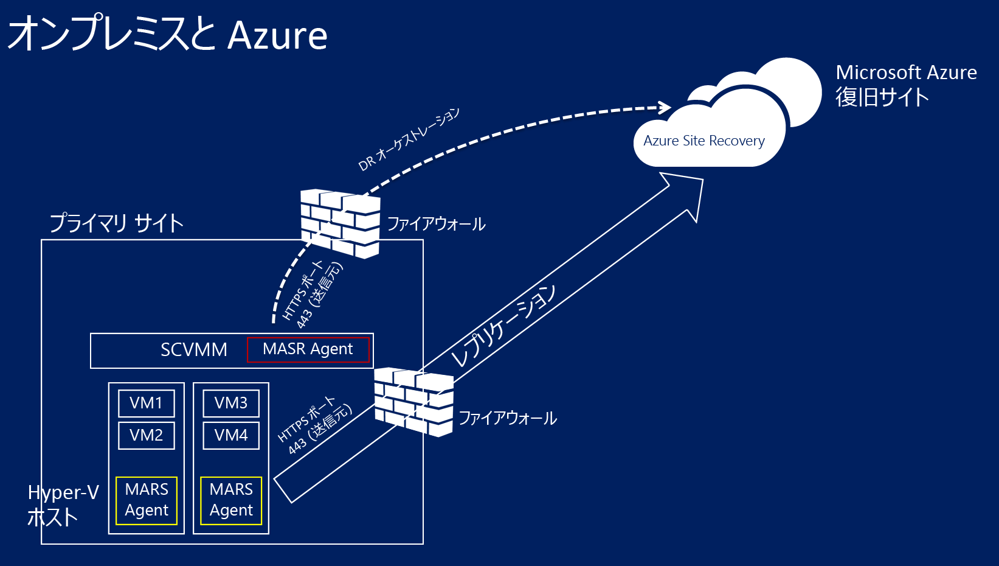

* Azure Site Recovery プロバイダーは Site Recovery のデプロイ中に VMM にインストールされます。VMM サーバーは Site Recovery コンテナーに登録されます。 このプロバイダーは、Site Recovery と通信してレプリケーションのオーケストレーションを処理します。
* Azure Recovery Services エージェントは Site Recovery のデプロイ中に Hyper-V ホスト サーバーにインストールされます。 Azure ストレージへのデータ レプリケーションを処理します。

## Azure の前提条件
Azure で必要なものを次に示します。

| **前提条件** | **詳細** |
| --- | --- |
| **Azure アカウント** |[Microsoft Azure](https://azure.microsoft.com/) のアカウントが必要です。 アカウントがなくても、 [無料試用版](https://azure.microsoft.com/pricing/free-trial/)を使用できます。 [こちら](https://azure.microsoft.com/pricing/details/site-recovery/) をご覧ください。 |
| **Azure Storage** |レプリケートしたデータを格納するには Azure ストレージ アカウントが必要になります。 レプリケートされたデータは Azure Storage に格納され、フェールオーバーが発生すると、Azure VM はスピンアップされます。   [Standard 地理冗長ストレージ アカウント](../storage/storage-redundancy.md#geo-redundant-storage)が必要です。 アカウントは Site Recovery サービスと同じリージョンである必要があり、同じサブスクリプションに関連付けられている必要があります。 Premium ストレージ アカウントへのレプリケーションは現在サポートされていないため、使用しないでください。  Azure Storage については、[こちら](../storage/storage-introduction.md)をご覧ください。 |
| **Azure ネットワーク** |フェールオーバーが発生した場合に Azure VM が接続する Azure 仮想ネットワークが必要です。 Azure の仮想ネットワークは、Site Recovery コンテナーと同じリージョンに置かれている必要があります。 |

## オンプレミスの前提条件
オンプレミスで必要なものを次に示します。

| **前提条件** | **詳細** |
| --- | --- |
| **VMM** |少なくとも 1 台の VMM サーバーを、物理または仮想スタンドアロン サーバーとして、または仮想クラスターとしてデプロイする必要があります。   VMM サーバーでは、最新の累積的な更新プログラムがインストールされている System Center 2012 R2 が実行されている必要があります。  VMM サーバーに少なくとも 1 つのクラウドが構成されている必要があります。  保護するソース クラウドには、1 つ以上の VMM ホスト グループが含まれている必要があります。  VMM クラウドのセットアップの詳細については、Keith Mayer のブログの [System Center 2012 SP1 VMM でのプライベート クラウドの作成に関するチュートリアル](http://blogs.technet.com/b/keithmayer/archive/2013/04/18/walkthrough-creating-private-clouds-with-system-center-2012-sp1-virtual-machine-manager-build-your-private-cloud-in-a-month.aspx)を参照してください。 |
| **Hyper-V** |VMM クラウド内に 1 つ以上の Hyper-V ホスト サーバーまたはクラスターが必要です。 ホスト サーバーは 1 つ以上の VM を備えている必要があります。   Hyper-V サーバーは、Hyper-V ロールを持つ **Windows Server 2012 R2** 以降か、**Microsoft Hyper-V Server 2012 R2** で実行され、最新の更新プログラムがインストールされている必要があります。  保護対象の VM が含まれる Hyper-V サーバーは、VMM クラウドに配置する必要があります。  クラスターで Hyper-V を実行している場合に、静的 IP アドレス ベースのクラスターが存在すると、クラスター ブローカーが自動的に作成されません。 クラスター ブローカーを手動で構成する必要があります。 詳細については、[Aidan Finn のブログ記事](https://www.petri.com/use-hyper-v-replica-broker-prepare-host-clusters)を参照してください。 |
| **保護されたマシン** | 保護する VM は [Azure の要件](site-recovery-support-matrix-to-azure.md#failed-over-azure-vm-requirements)を満たしている必要があります。 |

## ネットワーク マッピングの前提条件
仮想マシンを Azure ネットワーク マッピングで保護する場合、ソース VMM サーバー上の VM ネットワークとターゲットの Azure ネットワークをマップして以下を実現します。

* 同じネットワーク上でフェールオーバーするすべてのマシンは、どの復旧計画に含まれていても、相互に接続できる。
* ターゲット Azure ネットワークでネットワーク ゲートウェイをセットアップすると、仮想マシンを他のオンプレミス仮想マシンに接続できる。
* ネットワーク マッピングを構成しない場合、Azure へのフェールオーバー後、同じ復旧計画でフェールオーバーする仮想マシンのみ相互に接続できる。

ネットワーク マッピングをデプロイする場合は、以下のことが必要になります。

* ソース VMM サーバー上の保護する仮想マシンが VM ネットワークに接続している。 そのネットワークは、クラウドに関連付けられた論理ネットワークにリンクされている必要があります。
* レプリケートされた仮想マシンがフェールオーバー後に接続できる Azure ネットワーク。 フェールオーバー時にこのネットワークを選択します。 ネットワークは Azure Site Recovery サブスクリプションと同じリージョンにある必要があります。

VMM でネットワークを準備します。

   * [論理ネットワークを設定](https://technet.microsoft.com/library/jj721568.aspx)します。
   * [VM ネットワークを設定](https://technet.microsoft.com/library/jj721575.aspx)します。

## ステップ 1: Site Recovery コンテナーを作成する
1. 登録する VMM サーバーから [管理ポータル](https://portal.azure.com) にサインインします。
2. **[Data Services]** > **[Recovery Services]** > **[Site Recovery コンテナー]** をクリックします。
3. **[新規作成]**  >  **[簡易作成]** の順にクリックします。
4. **[名前]**ボックスに、コンテナーを識別する表示名を入力します。
5. **[リージョン]**ボックスで、コンテナーのリージョンを選択します。 サポートされているリージョンを確認するには、「 [Azure Site Recovery Pricing Details (Azure Site Recovery の料金の詳細)](https://azure.microsoft.com/pricing/details/site-recovery/)」で利用可能地域をご覧ください。
6. **[コンテナーの作成]**をクリックします。

    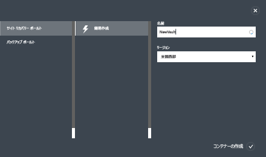

ステータス バーを確認して、コンテナーが正常に作成されたことを確かめます。 メイン [復旧サービス] ページで、コンテナーは **[アクティブ]** と表示されています。

## ステップ 2: コンテナー登録キーを生成する
コンテナーの登録キーを生成します。 Azure Site Recovery プロバイダーをダウンロードして VMM サーバーにインストールした後で、このキーを使用して、VMM サーバーをコンテナーに登録します。

1. **[復旧サービス]** ページで、コンテナーをクリックして [クイック スタート] ページを開きます。 [クイック スタート] は、アイコンを使っていつでも開くことができます。

    ![[クイック スタート] アイコン](./media/site-recovery-vmm-to-azure-classic/qs-icon.png)
2. ドロップダウン リストで、 **[オンプレミスの VMM サイトと Microsoft Azure 間]**を選択します。
3. **[VMM サーバーの準備]** で、**[登録キーの生成]** ファイルをクリックします。 キー ファイルは自動的に生成され、生成後 5 日間有効です。 VMM サーバーから Azure ポータルにアクセスしていない場合は、このファイルをサーバーにコピーする必要があります。

    ![[登録キー]](./media/site-recovery-vmm-to-azure-classic/register-key.png)

## ステップ 3: Azure Site Recovery プロバイダーをインストールする
1. **[クイック スタート]** > **[VMM サーバーの準備]** で、**[VMM サーバーにインストールする Microsoft Azure Site Recovery プロバイダーのダウンロード]** をクリックして、最新バージョンのプロバイダー インストール ファイルを取得します。
2. ソース VMM サーバーでこのファイルを実行します。

   > [!NOTE]
   > プロバイダーを初めてインストールするときに、VMM がクラスターにデプロイされている場合は、プロバイダーをアクティブなノードにインストールします。インストールが終了したら、VMM サーバーをコンテナーに登録します。 次に、プロバイダーを他のノードにインストールします。 プロバイダーをアップグレードする場合は、すべてのノードでアップグレードする必要があります。これは、すべてのノードで同じバージョンのプロバイダーを実行する必要があるためです。
   >
   >
3. インストーラーによって前提条件チェックが実行され、プロバイダーのセットアップを開始するために VMM サービスを停止するアクセス許可が要求されます。 セットアップが完了すると、VMM サービスは自動的に再起動されます。 VMM クラスターにインストールしている場合は、クラスター ロールを停止するよう求められます。
4. **[Microsoft Update]** で、アップデートの内容を設定できます。 この設定を行うことで、設定した Microsoft Update のポリシーに従って、プロバイダーの有効な更新がインストールされます。

    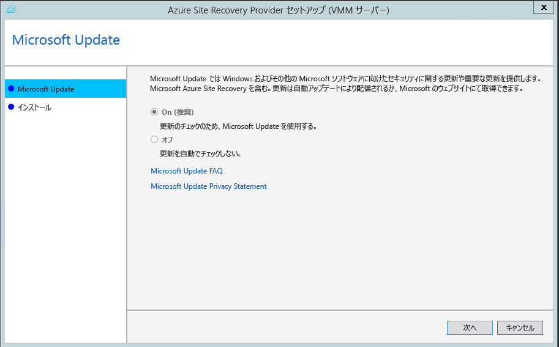
5. プロバイダーのインストール場所は、**<SystemDrive>\Program Files\Microsoft System Center 2012 R2\Virtual Machine Manager\bin** に設定されています。 **[インストール]**をクリックします。

   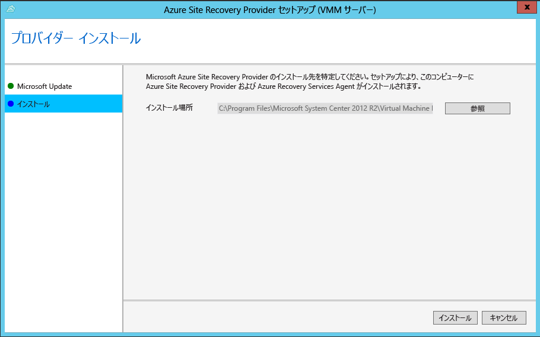
6. プロバイダーがインストールされたら、 **[登録]** をクリックしてサーバーをコンテナーに登録します。

    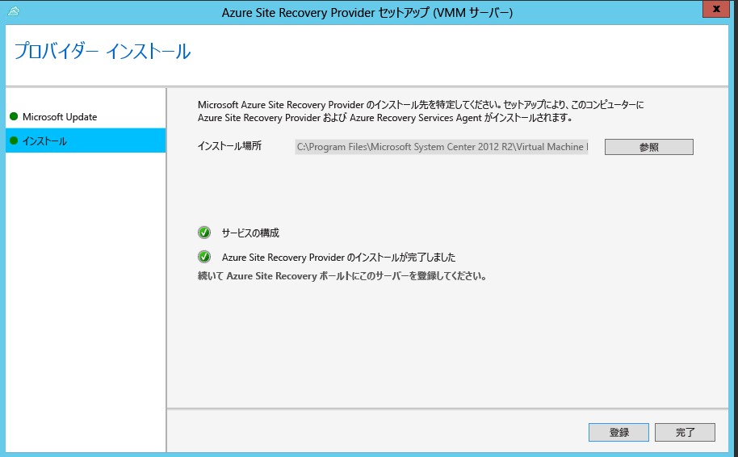
7. **[コンテナー名]**で、サーバーが登録されるコンテナーの名前を確認します。 *[次へ]*をクリックします。

    
8. **[インターネット接続]** で、VMM サーバーで実行中のプロバイダーがインターネットに接続する方法を指定します。 **[Connect with existing proxy settings (既存のプロキシ設定を使用して接続する)]** を選択して、サーバー上に構成されている既定のインターネット接続設定を使用します。

    

   * カスタム プロキシを使用する場合は、プロバイダーをインストールする前に設定する必要があります。 カスタム プロキシ設定を構成すると、プロキシの接続を確認するためのテストが実施されます。
   * カスタム プロキシを使用する場合、または既定のプロキシで認証が必要な場合、プロキシのアドレスやポートなどの詳細を入力する必要があります。
   * VMM サーバーと Hyper-V ホストから次の URL にアクセスできる必要があります。
     * *.hypervrecoverymanager.windowsazure.com
     * *.accesscontrol.windows.net
     * *.backup.windowsazure.com
     * *.blob.core.windows.net
     * *.store.core.windows.net
   * 「 [Azure Datacenter の IP 範囲](https://www.microsoft.com/download/confirmation.aspx?id=41653) 」に記載されている IP アドレスと HTTPS (443) プロトコルを許可します。 使用を計画している Azure リージョンの IP の範囲と米国西部の IP の範囲をホワイトリストに登録する必要があります。
   * カスタム プロキシを使用する場合、指定されたプロキシの資格情報を使用して VMM RunAs アカウント (DRAProxyAccount) が自動的に作成されます。 このアカウントが正しく認証されるようにプロキシ サーバーを構成します。 VMM RunAs アカウントの設定は VMM コンソールで変更できます。 変更するには、**[設定]** ワークスペースを開いて **[セキュリティ]** を展開し、**[実行アカウント]** をクリックします。その後、DRAProxyAccount のパスワードを変更します。 新しい設定を有効にするには、VMM サービスを再起動する必要があります。
9. **[登録キー]**で、Azure Site Recovery からダウンロードして VMM サーバーにコピーした登録キーを選択します。
10. 暗号化設定は、VMM クラウド内の Hyper-V VM を Azure にレプリケートする場合のみ使用されます。 セカンダリ サイトにレプリケートする場合は使用されません。
11. **[サーバー名]**に、コンテナーで VMM サーバーを識別する表示名を入力します。 クラスター構成で、VMM クラスターのロール名を指定します。
12. **[クラウド メタデータの同期]** で、VMM サーバー上のすべてのクラウドのメタデータをコンテナーと同期するかどうかを選択します。 この操作は、各サーバーで 1 回のみ実行する必要があります。 すべてのクラウドを同期したくない場合は、この設定をオフのままにして、VMM コンソールのクラウドのプロパティで各クラウドを個別に同期できます。
13. **[次へ]** をクリックしてプロセスを完了します。 登録後に、VMM サーバーからのメタデータが、Azure Site Recovery によって取得されます。 サーバーは、コンテナーの **[サーバー]** ページの **[VMM サーバー]** タブに表示されます。

    

登録後に、VMM サーバーからのメタデータが、Azure Site Recovery によって取得されます。 サーバーは、コンテナーの **[サーバー]** ページの **[VMM サーバー]** タブに表示されます。

### コマンド ラインを使用したインストール
Azure Site Recovery プロバイダーは、次のコマンド ラインを使用してインストールすることもできます。 このメソッドを使用すると、Windows Server 2012 R2 の Server Core にプロバイダーをインストールできます。

1. プロバイダーのインストール ファイルと登録キーをフォルダーにダウンロードします。 たとえば、C:\ASR です。
2. System Center Virtual Machine Manager サービスを停止します。
3. 管理者特権のコマンド プロンプトから、以下のコマンドでプロバイダーのインストーラーを抽出します。

        C:\Windows\System32> CD C:\ASR
        C:\ASR> AzureSiteRecoveryProvider.exe /x:. /q
4. 次のようにプロバイダーをインストールします。

        C:\ASR> setupdr.exe /i
5. 次のようにプロバイダーを登録します。

        CD C:\Program Files\Microsoft System Center 2012 R2\Virtual Machine Manager\bin
        C:\Program Files\Microsoft System Center 2012 R2\Virtual Machine Manager\bin\> DRConfigurator.exe /r  /Friendlyname <friendly name of the server> /Credentials <path of the credentials file> /EncryptionEnabled <full file name to save the encryption certificate>       

ここで、パラメーターは次のとおりです。

* **/Credentials** : 登録キー ファイルが配置されている場所を指定する必須パラメーターです。  
* **/Friendlyname** : Azure Site Recovery ポータルに表示される、Hyper-V ホスト サーバーの名前を表す必須パラメーターです。
* **/EncryptionEnabled**: 省略可能。Azure で仮想マシンを暗号化 (保存暗号化) する場合に指定します。 ファイル名には **.pfx** 拡張子が必要です。
* **/proxyAddress**: 省略可能。プロキシ サーバーのアドレスを指定します。
* **/proxyport**: 省略可能。プロキシ サーバーのポートを指定します。
* **/proxyUsername**: 省略可能。プロキシのユーザー名を指定します。
* **/proxyPassword**: 省略可能。プロキシ パスワードを指定します。  

## ステップ 4: Azure のストレージ アカウントを作成する
1. Azure ストレージ アカウントがない場合は、 **[Azure ストレージ アカウントの追加]** をクリックしてアカウントを作成します。
2. geo レプリケーションを有効にしてアカウントを作成します。 アカウントは Azure Site Recovery サービスと同じリージョンにあり、同じサブスクリプションに関連付けられている必要があります。

    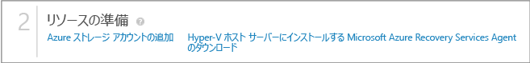

> [!NOTE]
> Site Recovery のデプロイ用のストレージ アカウントについては、同じサブスクリプション内のリソース グループ間またはサブスクリプション間での[ストレージ アカウントの移行](../azure-resource-manager/resource-group-move-resources.md)はサポートされていません。
>
>

## ステップ 5: Azure Recovery Services エージェントをインストールする
VMM クラウド内の各 Hyper-V ホスト サーバーに Azure Recovery Services エージェントをインストールします。

1. **[クイック スタート]** > **[Download Azure Site Recovery Services Agent and install on hosts (Azure Site Recovery Services エージェントをダウンロードしてホストにインストールする)]** をクリックして、最新バージョンのエージェントのインストール ファイルを取得します。

    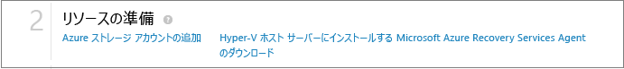
2. 各 Hyper-V ホスト サーバーでインストール ファイルを実行します。
3. **[前提条件の確認]** ページで **[次へ]** をクリックします。 不足している前提条件があると自動的にインストールされます。

    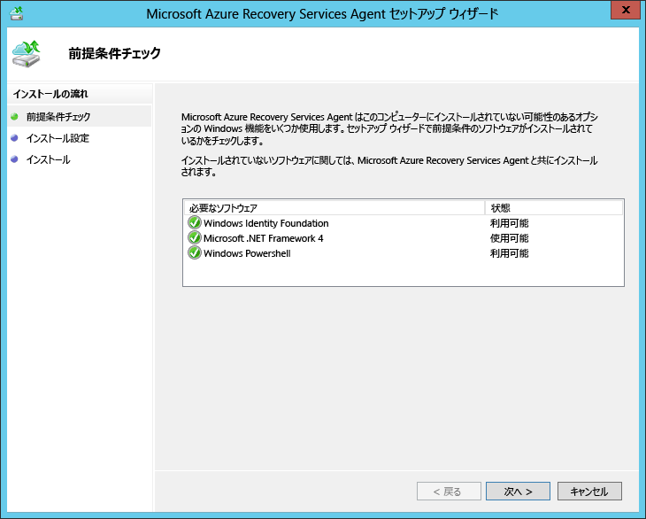
4. **[Installation Settings (インストールの設定)]** ページで、エージェントのインストール先を指定し、バックアップのメタデータがインストールされるキャッシュの場所を選択します。 その後、 **[インストール]**をクリックします。
5. インストールが完了したら、 **[閉じる]** をクリックしてウィザードを完了します。

    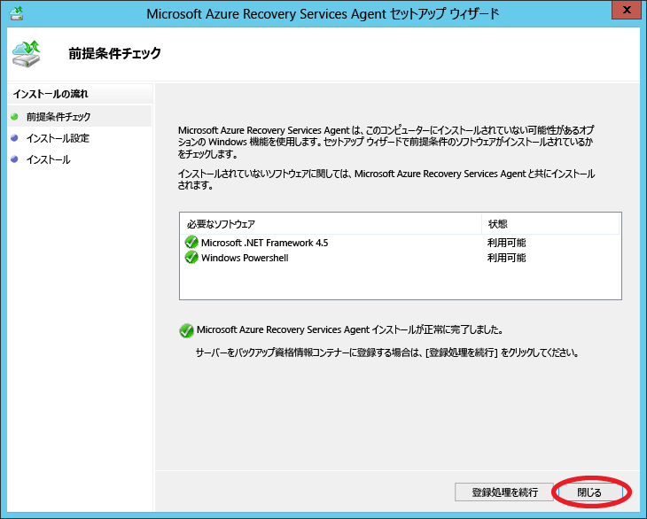

### コマンド ラインを使用したインストール
Microsoft Azure Recovery Services エージェントは、コマンド ラインで次のコマンドを使用してインストールすることもできます。

    marsagentinstaller.exe /q /nu

## ステップ 6: クラウドの保護設定を構成する
VMM サーバーが登録されると、クラウドの保護設定を構成することができます。 プロバイダーのインストール時に **[コンテナーとのクラウド データの同期]** を有効にしたので、VMM サーバー上のすべてのクラウドが、資格情報コンテナーの <b>[保護された項目]</b> タブに表示されます。

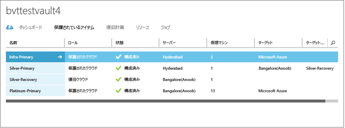

1. [クイック スタート] ページで、 **[VMM クラウドの保護の設定]**をクリックします。
2. **[保護された項目]** タブで、構成するクラウドをクリックし、**[構成]** タブに移動します。
3. **ターゲット** select **[Azure]**」を参照してください。
4. **[ストレージ アカウント]** で、レプリケーションに使用する Azure ストレージ アカウントを選択します。
5. **[格納データの暗号化]** を **[オフ]** に設定します。 この設定は、オンプレミス サイトと Azure 間のレプリケーション時にデータを暗号化する必要があることを指定します。
6. **[コピーの頻度]** では、既定の設定をそのまま使用します。 この値は、ソースとターゲットの場所の間でデータを同期する頻度を指定します。
7. **[保持する復旧ポイント]**で、既定の設定をそのまま使用します。 既定値である 0 を使用する場合は、プライマリ仮想マシンに対応する最新の復旧ポイントのみが、レプリカのホスト サーバーに格納されます。
8. **[アプリケーションの整合性スナップショットの頻度]**では、既定の設定をそのまま使用します。 この値は、スナップショットを作成する頻度を指定します。 スナップショットは、ボリューム シャドウ コピー サービス (VSS) を使用して、スナップショットを作成するときにアプリケーションを一貫性のある状態に保ちます。  値を設定する場合は、構成する追加の復旧ポイント数よりも少ない値にしてください。
9. **[レプリケーションの開始時刻]**で、Azure へのデータの初期レプリケーションを開始する時刻を指定します。 Hyper-V ホスト サーバーのタイムゾーンが使用されます。 初期レプリケーションはピーク時以外にスケジュールすることをお勧めします。

    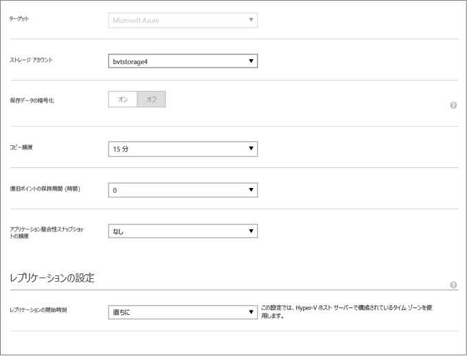

この設定を保存すると、ジョブが作成され、これを **[ジョブ]** タブで監視できます。 VMM ソース クラウド内のすべての Hyper-V ホスト サーバーは、レプリケーション用に構成されます。

保存後は、クラウド設定は **[構成]** タブで変更できます。 ターゲットの場所またはターゲットのストレージ アカウントを変更するには、クラウド構成を削除してから、クラウドを再構成する必要があります。 ストレージ アカウントを変更する場合は、ストレージ アカウントの修正後に保護を有効にした仮想マシンにのみ、その変更が適用されることに注意してください。 既存の仮想マシンは新しいストレージ アカウントに移行されません。

## ステップ 7: ネットワーク マッピングを構成する
ネットワーク マッピングを開始する前に、ソース VMM サーバー上の仮想マシンが VM ネットワークに接続されていることを確認してください。 さらに、1 つまたは複数の Azure Virtual Network を作成します。 複数の VM ネットワークを 1 つの Azure ネットワークにマップできることに注意してください。

1. [クイック スタート] ページで、 **[ネットワークのマップ]**をクリックします。
2. **[ネットワーク]** タブの **[ソースの場所]** で、ソース VMM サーバーを選択します。 **[ターゲットの場所]** で、Azure を選択します。
3. **ソース** ネットワークには、VMM サーバーに関連付けられている VM ネットワークの一覧が表示されます。 **ターゲット** ネットワークには、サブスクリプションに関連付けられている Azure ネットワークが表示されます。
4. ソースの VM ネットワークを選択して、 **[マップ]**をクリックします。
5. **[ターゲット ネットワークの選択]** ページで、ターゲットとして使用する Azure ネットワークを選択します。
6. チェック マークをクリックして、マッピング処理を完了します。

    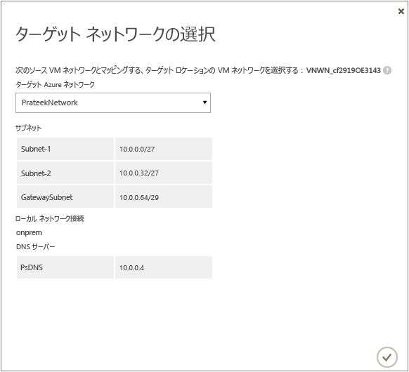

設定を保存すると、マッピングの進行状況を追跡するジョブが起動します。進行状況は [ジョブ] タブで監視することができます。 ソースの VM ネットワークに対応する既存のレプリカの全仮想マシンが、ターゲットの Azure ネットワークに接続します。 ソースの VM ネットワークに接続する新しい仮想マシンは、レプリケーション後、マップされた Azure ネットワークに接続します。 既存のマッピングを新しいネットワークで変更すると、レプリカの仮想マシンは新しい設定で接続されます。

ターゲット ネットワークに複数のサブネットがあり、そのサブネットのいずれかが、ソースの仮想マシンが配置されているサブネットと同じ名前である場合、フェールオーバー後、レプリカの仮想マシンはそのターゲット サブネットに接続することに注意してください。 ターゲットのサブネットで名前が一致するものがなければ、仮想マシンはネットワークの最初のサブネットに接続されます。

> [!NOTE]
> Site Recovery のデプロイ用のネットワークでは、同じサブスクリプション内のリソース グループ間またはサブスクリプション間での[ネットワークの移行](../azure-resource-manager/resource-group-move-resources.md)はサポートされていません。
>
>

## ステップ 8: 仮想マシンの保護を有効化する
サーバー、クラウド、およびネットワークを正しく構成した後で、クラウド内の仮想マシンの保護を有効にすることができます。 以下の点に注意してください。

* 仮想マシンは [Azure 要件](site-recovery-support-matrix-to-azure.md#failed-over-azure-vm-requirements)を満たしている必要があります。
* オペレーティング システムとオペレーティング システム ディスクの保護を有効にするには、仮想マシンにプロパティを設定する必要があります。 仮想マシン テンプレートを使用して VMM 内で仮想マシンを作成する際に、プロパティを設定できます。 また、仮想マシンのプロパティの **[全般]** タブと **[ハードウェア構成]** タブで既存の仮想マシンに対してこれらのプロパティを設定することもできます。 VMM でこれらのプロパティを設定していない場合は、Azure Site Recovery ポータルで構成できます。

    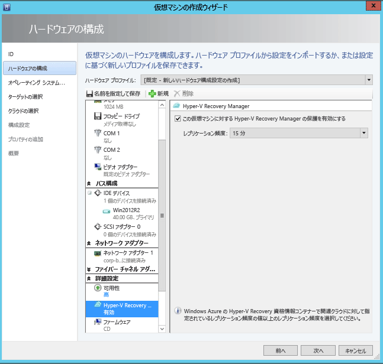

    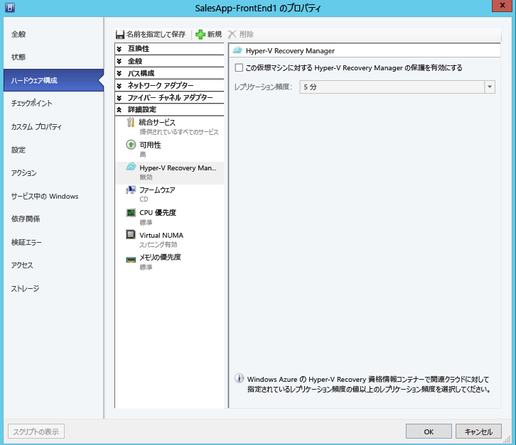

1. 保護を有効にするには、仮想マシンが配置されているクラウドの **[仮想マシン]** タブで、**[保護を有効にする]** > **[仮想マシンの追加]** をクリックします。
2. クラウド内の仮想マシンのリストから、保護する仮想マシンを選択します。

    ![[仮想マシンの保護の有効化]](./media/site-recovery-vmm-to-azure-classic/select-vm.png)

    **[ジョブ]** タブで、**[保護を有効にする]** アクション (初期レプリケーションなど) の進捗状況を確認します。 保護の **最終処理** のジョブが実行されると、仮想マシンは、フェールオーバーを実行できる状態になります。 保護が有効され仮想マシンが複製されると、Azure でそれらの状態を表示できます。

    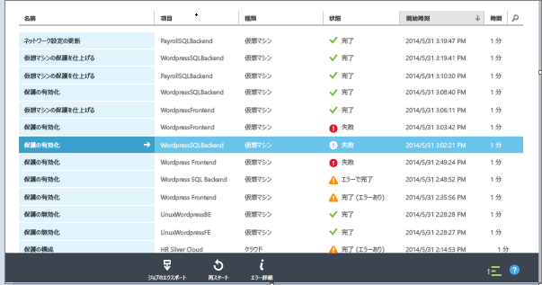

1. 仮想マシンのプロパティを確認し、必要に応じて変更します。

    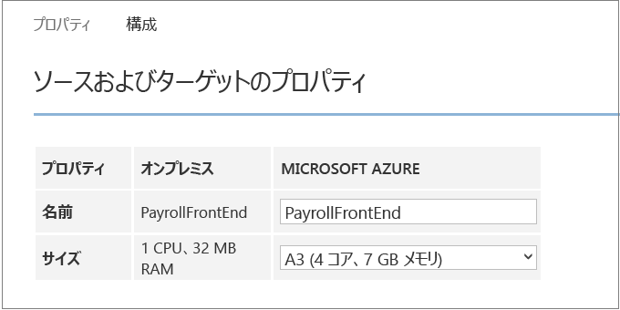
2. 仮想マシンのプロパティの **[構成]** タブでは、次のネットワークのプロパティを変更できます。

* **ターゲット仮想マシンのネットワーク アダプターの数** - ネットワーク アダプターの数は、ターゲット仮想マシンに指定したサイズによって異なります。 仮想マシンのサイズ別のサポートされているアダプターの数については、 [仮想マシン サイズの仕様](../virtual-machines/linux/sizes.md) に関するページを参照してください。 仮想マシンのサイズを変更し、設定を保存すると、次回 **[構成]** ページを開いたときに、ネットワーク アダプターの数が変更されます。 ターゲット仮想マシンのネットワーク アダプターの数は、ソース仮想マシン上のネットワーク アダプターの最小数と、選択した仮想マシンのサイズでサポートされているネットワーク アダプターの最大数です。

  * ソース マシン上のネットワーク アダプターの数が、ターゲット マシンのサイズに許可されているアダプターの数以下の場合、ターゲットのアダプターの数は、ソースと同じになります。
  * ソース仮想マシン用のアダプターの数が、ターゲットのサイズに許可されている数を超える場合は、ターゲットの最大サイズが使用されます。
  * たとえば、ソース マシンに 2 つのネットワーク アダプターがあり、ターゲット マシンのサイズが 4 つをサポートしている場合は、ターゲット マシンのアダプターの数は、2 つになります。 ソース マシンに 2 つのアダプターがあるが、サポートされているターゲット サイズで 1 つしかサポートしていない場合、ターゲット マシンのアダプターの数は 1 つだけになります。     
* **ターゲット仮想マシンのネットワーク** - 仮想マシンの接続先となるネットワークは、ソース仮想マシンのネットワークのネットワーク マッピングによって決まります。 ソース仮想マシンに 1 つ以上のネットワーク アダプターが含まれており、ソース ネットワークがターゲットの別のネットワークにマップされている場合、ターゲット ネットワークのいずれかを選択する必要があります。
* **各ネットワーク アダプターのサブネット** - ネットワーク アダプターごとに、フェールオーバーされた仮想マシンが接続するサブネットを選択できます。
* **ターゲット IP アドレス** - ソース仮想マシンのネットワーク アダプターが静的 IP アドレスを使用するように構成されている場合、ターゲット仮想マシンの IP アドレスを指定できます。 フェールオーバー後、この機能を使用してソース仮想マシンの IP アドレスを保持します。 IP アドレスが指定されていない場合は、フェールオーバー時に使用可能な IP アドレスがネットワーク アダプターに指定されます。 ターゲット IP アドレスを指定しても、Azure で稼働している別の仮想マシンで既に使用されている場合、フェールオーバーは失敗します。  

    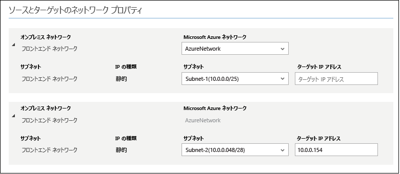

> [!NOTE]
> 静的 IP アドレスの Linux 仮想マシンはサポートされていません。
>
>

## 展開をテスト
デプロイをテストするために、1 台の仮想マシンに対するテスト フェールオーバーを実行することや、複数の仮想マシンで構成される復旧計画を作成して、その計画のテスト フェールオーバーを実行することができます。  

テスト フェールオーバーは、孤立したネットワークでフェールオーバーと復旧のシミュレーションを実行します。 以下の点に注意してください。

* フェールオーバー後に Azure でリモート デスクトップを使用して仮想マシンに接続する場合は、テストのフェールオーバーを実行する前に、仮想マシンのリモート デスクトップ接続を有効にします。
* フェールオーバー後、パブリック IP アドレスを使用して、Azure VM にリモート デスクトップで接続します。 この接続では、パブリック アドレスを使用する仮想マシンの接続を妨げるドメイン ポリシーを使用していないことを確認してください。

> [!NOTE]
> Azure へのフェールオーバーを実行するときに最適なパフォーマンスを得るために、VM に Azure エージェントがインストールされていることを確認します。 これにより、起動が高速化され、トラブルシューティングに役立ちます。 [Linux エージェント](https://github.com/Azure/WALinuxAgent)または [Windows エージェント](http://go.microsoft.com/fwlink/?LinkID=394789)をダウンロードします。
>
>

### 復旧計画の作成
1. **[復旧計画]** タブで、新しい計画を追加します。 名前を指定し、**[ソースの種類]** として **[VMM]**、**[ソース]** としてソース VMM サーバーを指定します。 ターゲットは Azure になります。

    ![[復旧計画の作成]](./media/site-recovery-vmm-to-azure-classic/recovery-plan1.png)
2. **[Virtual Machines の選択]** ページで、復旧計画に追加する仮想マシンを選択します。 これらの仮想マシンは、復旧計画の既定のグループ "グループ 1" に追加されます。 最大 100 台の仮想マシンを 1 つの復旧計画でテストしています。

* 仮想マシンを計画に追加する前に、仮想マシンのプロパティを検証する場合は、仮想マシンが配置されているクラウドの [プロパティ] ページで仮想マシンをクリックします。 仮想マシンのプロパティは VMM コンソールでも構成できます。
* 表示されるすべての仮想マシンは、保護が有効になっています。 一覧には、保護が有効で、初期レプリケーションが完了している仮想マシンと、保護が有効だが、初期レプリケーションが保留中の仮想マシンの両方が含まれています。 初期レプリケーションが完了したマシンのみ、復旧計画の一環としてフェールオーバーできます。

    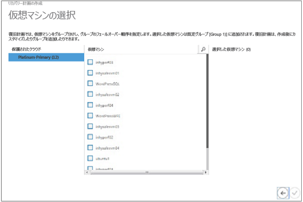

復旧計画が作成されると、 **[復旧計画]** タブにその計画が表示されます。 [Azure Automation Runbook](site-recovery-runbook-automation.md) を復旧計画に追加して、フェールオーバー中のアクションを自動化することもできます。

### テスト フェールオーバーの実行
Azure へのテスト フェールオーバーを実行する方法は 2 つあります。

* **Azure ネットワークを使用しないテスト フェールオーバー**— この種のテスト フェールオーバーでは、仮想マシンが Azure で正しく動作することを確認します。 フェールオーバー後、仮想マシンはどの Azure ネットワークにも接続しません。
* **Azure ネットワークを使用するテスト フェールオーバー**- この種のフェールオーバーでは、レプリケーション環境全体が正しく動作することと、フェールオーバーされた仮想マシンが指定したターゲットの Azure ネットワークに接続されることを確認します。 サブネットの処理については、テスト フェールオーバーでは、テストの仮想マシンのサブネットはレプリカの仮想マシンのサブネットに基づいて決定されます。 これは、レプリカの仮想マシンのサブネットが、ソースの仮想マシンのサブネットに基づいている通常のレプリケーションとは異なります。

Azure ターゲット ネットワークを指定せずに、保護が有効になっている仮想マシンの Azure へのテスト フェールオーバーを実行する場合は、特に準備は必要ありません。 ターゲット Azure ネットワークを指定してテスト フェールオーバーを実行するには、Azure 運用ネットワークから独立した新しい Azure ネットワークを作成する必要があります (Azure で新しいネットワークを作成する場合の既定の動作)。 詳細については、 [テスト フェールオーバーの実行](site-recovery-failover.md) 方法に関するページを参照してください。

また、レプリケートされた仮想マシンのインフラストラクチャを正常に動作するように設定する必要があります。 たとえば、ドメイン コントローラーと DNS を含む仮想マシンは、Azure Site Recovery を使用して Azure にレプリケート可能で、テスト フェールオーバーを使用して、テスト ネットワーク内に作成できます。 詳細については、 [Active Directory 用のテスト フェールオーバーの考慮事項](site-recovery-active-directory.md#test-failover-considerations) を参照してください。

テスト フェールオーバーを実行するには、次の手順に従います。

1. **[復旧計画]** タブで、計画を選択し、**[テスト フェールオーバー]** をクリックします。
2. **[テスト フェールオーバーの確認]** ページで、**[なし]** または特定の Azure ネットワークを選択します。  [なし] を選択した場合、テスト フェールオーバーでは、仮想マシンが Azure に正しくレプリケートされたかどうかは確認されますが、レプリケーションのネットワーク構成は確認されないことに注意してください。

    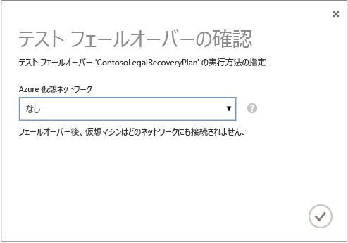
3. クラウドのデータ暗号化が有効になっていて、クラウドのデータ暗号化を有効にするオプションをオンにした場合、 **[暗号化キー]** で、VMM サーバーにプロバイダーをインストールしたときに発行された証明書を選択します。
4. **[ジョブ]** タブで、フェールオーバーの進行状況を追跡できます。 仮想マシンのテスト レプリカも Azure ポータルで確認できます。 オンプレミスのネットワークから、仮想マシンへのアクセスをセットアップすると、仮想マシンへのリモート デスクトップ接続を開始できます。
5. フェールオーバーが **[テストの完了]** フェーズに達したら、**[テストの完了]** をクリックして、テスト フェールオーバーを終了します。 **[ジョブ]** タブまでドリルダウンし、フェールオーバーの進行状況と状態を追跡して、必要な操作を実行します。
6. フェールオーバー後、Azure Portal で仮想マシンのテスト レプリカを確認できます。 オンプレミスのネットワークから、仮想マシンへのアクセスをセットアップすると、仮想マシンへのリモート デスクトップ接続を開始できます。 以下の手順を実行します。

   1. 仮想マシンが正常に起動することを確認します。
   2. フェールオーバー後に Azure でリモート デスクトップを使用して仮想マシンに接続する場合は、テストのフェールオーバーを実行する前に、仮想マシンのリモート デスクトップ接続を有効にします。 また、仮想マシンに RDP エンドポイントを追加する必要があります。 [Azure Automation Runbook](site-recovery-runbook-automation.md) を活用して、このことを行うことができます。
   3. フェールオーバー後、リモート デスクトップでパブリック IP アドレスを使用して Azure の仮想マシンに接続する場合、パブリック アドレスを使用して仮想マシンに接続することを妨げるドメイン ポリシーがないことを確認します。
7. テストが完了したら、以下の手順を実行します。

   * **[テスト フェールオーバーが完了しました]**をクリックします。 テスト環境をクリーンアップして、自動的に電源をオフにし、テスト仮想マシンを削除します。
   * **[メモ]** をクリックして、テスト フェールオーバーに関連する監察結果をすべて記録し、保存します。

## 次のステップ
[復旧計画の設定](site-recovery-create-recovery-plans.md)と[フェールオーバー](site-recovery-failover.md)について学習します。

