<properties
	pageTitle="オンプレミスの VMM サイトと Azure 間の保護の設定"
	description="Azure Site Recovery は、オンプレミスの VMM クラウドに配置された Hyper-V 仮想マシンの Azure へのレプリケーション、フェイルオーバー、および回復を調整します。"
	services="site-recovery"
	documentationCenter=""
	authors="rayne-wiselman"
	manager="jwhit"
	editor="tysonn"/>

<tags
	ms.service="site-recovery"
	ms.workload="backup-recovery"
	ms.tgt_pltfrm="na"
	ms.devlang="na"
	ms.topic="hero-article"
	ms.date="11/18/2015"
	ms.author="raynew"/>

#  オンプレミスの VMM サイトと Azure 間の保護の設定

## 概要

Azure Site Recovery は、さまざまなデプロイ シナリオでの仮想マシンのレプリケーション、フェールオーバー、復旧を調整してビジネス継続性と障害復旧 (BCDR) 戦略に貢献します。デプロイ シナリオのすべての一覧については、「[Azure Site Recovery の概要](site-recovery-overview.md)」を参照してください。

このシナリオのガイドでは、Site Recovery をデプロイして、VMM プライベート クラウドにデプロイされている Hyper-V ホスト サーバー上の仮想マシンで実行されているワークロードの保護を調整および自動化する方法について説明します。このシナリオでは、仮想マシンはプライマリ VMM サイトから Azure に Hyper-V Replica を使用してレプリケートされます。

ガイドには、シナリオの前提条件が含まれています。また、Site Recovery コンテナーを設定する方法、ソース VMM サーバーに Azure Site Recovery プロバイダーをインストールする方法、このコンテナーにサーバーを登録する方法、Azure ストレージ アカウントを追加する方法、Hyper-V ホスト サーバーに Azure Recovery Services エージェントをインストールする方法、保護されるすべての仮想マシンに適用される VMM クラウドの保護設定を構成する方法、およびこれらの仮想マシンの保護を有効にする方法についても説明しています。すべてが正しく動作していることを確認するために、最後にフェールオーバーをテストします。

このシナリオの設定時に問題が発生した場合は、[Azure Recovery Services フォーラム](http://go.microsoft.com/fwlink/?LinkId=313628)に質問を投稿してください。

## 開始する前に

次の前提条件を満たしていることを確認してください。
### Azure の前提条件

- [Microsoft Azure](https://azure.microsoft.com/) のアカウントが必要です。お持ちでない場合は、[無料試用版](http://aka.ms/try-azure)で作業を開始してください。また、[Azure Site Recovery Manager の価格](http://go.microsoft.com/fwlink/?LinkId=378268)に関するページも参照してください。
- Azure にレプリケートしたデータを格納するために Azure ストレージ アカウントが必要になります。アカウントでは geo レプリケーションを有効にする必要があります。アカウントは Azure Site Recovery サービスと同じリージョンである必要があり、同じサブスクリプションに関連付けられている必要があります。Azure Storage のセットアップの詳細については、「[Microsoft Azure Storage の概要](http://go.microsoft.com/fwlink/?LinkId=398704)」を参照してください。
- 保護する仮想マシンが Azure 要件に準拠していることを確認する必要があります。詳細については、[仮想マシンのサポートに関するページ](https://msdn.microsoft.com/library/azure/dn469078.aspx#BKMK_E2A)を参照してください。

### VMM の前提条件
- System Center 2012 R2 で実行される VMM サーバーが必要です。
- 保護する仮想マシンを含むすべての VMM サーバーが Azure Site Recovery プロバイダーを実行している必要があります。このプロバイダーは Azure Site Recovery のデプロイ時にインストールされます。
- 保護する VMM サーバーにクラウドが少なくとも 1 つ必要です。このクラウドには以下のものが含まれている必要があります。
	- 1 つ以上の VMM ホスト グループ。
	- 各ホスト グループ内に 1 つ以上の Hyper-V ホスト サーバーまたはクラスター。
	- ソース Hyper-V サーバー上に配置された 1 つ以上の仮想マシン。仮想マシンは世代 1 にする必要があります。
- VMM クラウドの設定について理解を深めます。
	- プライベート VMM クラウドの詳細については、[System Center 2012 R2 VMM のプライベート クラウドの新機能に関するページ](http://go.microsoft.com/fwlink/?LinkId=324952)および [VMM 2012 とクラウドに関するページ](http://go.microsoft.com/fwlink/?LinkId=324956)を参照してください。
	- [VMM クラウド ファブリックの構成に関するページ](https://msdn.microsoft.com/library/azure/dn469075.aspx#BKMK_Fabric)を参照してください。
	- クラウド ファブリック要素の配置後、プライベート クラウドの作成について、「[VMM でのプライベート クラウドの作成](http://go.microsoft.com/fwlink/?LinkId=324953)」および「[チュートリアル: System Center 2012 SP1 VMM でのプライベート クラウドの作成](http://go.microsoft.com/fwlink/?LinkId=324954)」を参照してください。

### Hyper-V の前提条件

- ホスト Hyper-V サーバーは、少なくとも Hyper-V ロールを持つ Windows Server 2012 R2 を実行しており、最新の更新プログラムがインストールされている必要があります。
- クラスターで Hyper-V を実行している場合に、静的 IP アドレス ベースのクラスターが存在すると、クラスター ブローカーが自動的に作成されません。クラスター ブローカーを手動で構成する必要があります。手順については、「[Hyper-V レプリカ ブローカーを構成する](http://social.technet.microsoft.com/wiki/contents/articles/18792.configure-replica-broker-role-cluster-to-cluster-replication.aspx)」を参照してください。
- 保護を管理するすべての Hyper-V ホスト サーバーまたはクラスターが VMM クラウドに属している必要があります。

次の図は、Azure Site Recovery でオーケストレーションやレプリケーションに使用される、さまざまな通信チャネルと通信ポートを示しています。

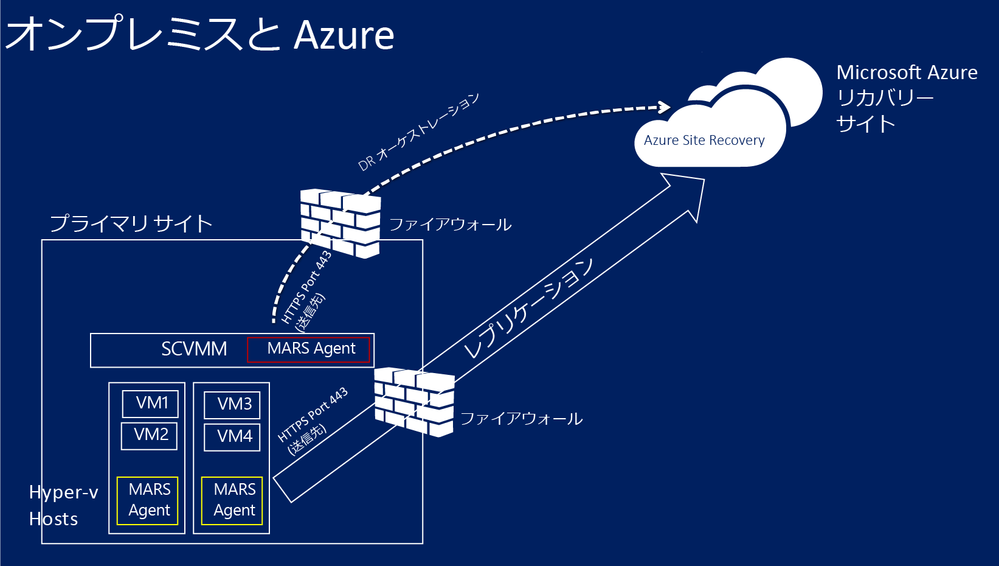

### ネットワーク マッピングの前提条件
仮想マシンを Azure ネットワーク マッピングで保護する場合、ソース VMM サーバー上の VM ネットワークとターゲットの Azure ネットワークをマップして以下を実現します。

- 同じネットワーク上でフェールオーバーするすべてのマシンは、どの復旧計画に含まれていても、相互に接続できる。
- ターゲットの Azure ネットワークでネットワーク ゲートウェイをセットアップすると、仮想マシンを他のオンプレミスの仮想マシンに接続できる。
- ネットワーク マッピングを構成しない場合、Azure へのフェールオーバー後、同じ復旧計画でフェールオーバーする仮想マシンのみ相互に接続できる。

ネットワーク マッピングをデプロイする場合は、以下のことが必要になります。

- ソース VMM サーバー上の保護する仮想マシンが VM ネットワークに接続している。そのネットワークは、クラウドに関連付けられた論理ネットワークにリンクされている必要があります。
- レプリケートされた仮想マシンがフェールオーバー後に接続できる Azure ネットワーク。フェールオーバー時にこのネットワークを選択します。ネットワークは Azure Site Recovery サブスクリプションと同じリージョンである必要があります。
- ネットワーク マッピングについての理解を深める。
	- [VMM での論理ネットワークの構成](http://go.microsoft.com/fwlink/?LinkId=386307)
	- [VMM での VM ネットワークとゲートウェイの構成](http://go.microsoft.com/fwlink/?LinkId=386308)
	- [Azure における仮想ネットワークの構成および監視](http://go.microsoft.com/fwlink/?LinkId=402555)

## ステップ 1: Site Recovery コンテナーを作成する

1. 登録する VMM サーバーから[管理ポータル](https://portal.azure.com)にサインインします。

2. [
3. *[Data Services]* をクリックし、*[Recovery Services]* を展開し、*[Site Recovery コンテナー]*クリックします。*
3. *[新規作成]*、*[簡易作成]* の順にクリックします。

4. *[名前]* ボックスに、コンテナーを識別する表示名を入力します。

5. *[リージョン]* ボックスで、コンテナーのリージョンを選択します。利用可能なリージョンには、東アジア、西ヨーロッパ、米国西部、米国東部、北ヨーロッパ、東南アジアが含まれています。
6. *[コンテナーの作成]* をクリックします。

	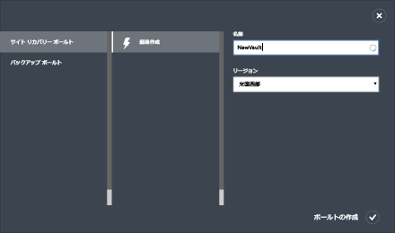

ステータス バーを確認して、資格情報コンテナーが正常に作成されたことを確かめます。コンテナーは、Recovery Services のメイン ページに *[アクティブ]* として表示されます。

## ステップ 2: コンテナー登録キーを生成する

コンテナーの登録キーを生成します。Azure Site Recovery プロバイダーをダウンロードして VMM サーバーにインストールした後で、このキーを使用して、VMM サーバーをコンテナーに登録します。

1. *[Recovery Services]* ページで、コンテナーをクリックして [クイック スタート] ページを開きます。[クイック スタート] は、アイコンを使っていつでも開くことができます。

	![[クイック スタート] アイコン](./media/site-recovery-vmm-to-azure/ASRE2AVMM_QuickStartIcon.png)

2. ドロップダウン リストで、**[オンプレミスの VMM サイトと Microsoft Azure 間]** を選択します。
3. **[VMM サーバーの準備]** で、**[登録キーの生成]** ファイルをクリックします。キー ファイルは自動的に生成され、生成後 5 日間有効です。VMM サーバーから Azure ポータルにアクセスしていない場合は、このファイルをサーバーにコピーする必要があります。

	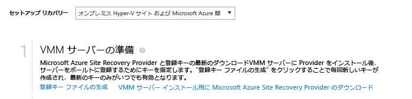

## ステップ 3: Azure Site Recovery プロバイダーをインストールする

4. *[クイック スタート]* ページの **[VMM サーバーの準備]** で、*[VMM サーバーへのインストール用の Microsoft Azure Site Recovery プロバイダーのダウンロード]* をクリックして、最新バージョンのプロバイダー インストール ファイルを取得します。

2. ソース VMM サーバーでこのファイルを実行します。プロバイダーを初めてインストールするときに、VMM がクラスターにデプロイされている場合は、プロバイダーをアクティブなノードにインストールします。インストールが終了したら、VMM サーバーをコンテナーに登録します。次に、プロバイダーを他のノードにインストールします。プロバイダーをアップグレードする場合は、すべてのノードでアップグレードする必要があります。これは、すべてのノードで同じバージョンのプロバイダーを実行する必要があるためです。

3. インストーラーによっていくつかの**前提条件チェック**が実行され、プロバイダーのセットアップを開始するために VMM サービスを停止するアクセス許可が要求されます。セットアップが完了すると、VMM サービスは自動的に再起動されます。VMM クラスターにインストールしている場合は、クラスター ロールを停止するよう求められます。

4. **[Microsoft Update]** で、アップデートの内容を設定できます。この設定を行うことで、設定した Microsoft Update のポリシーに従って、プロバイダーの有効な更新がインストールされます。

	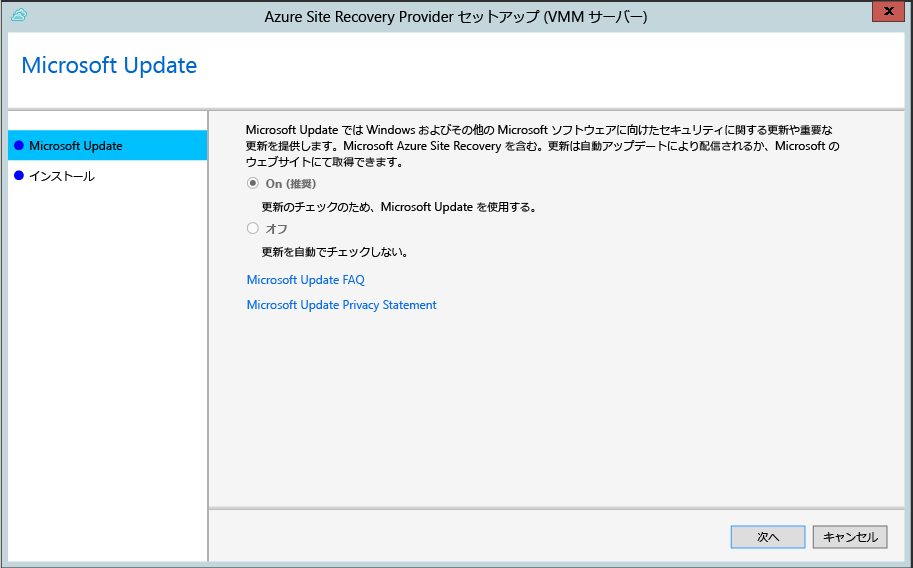

1.  インストール場所は、**<SystemDrive>\\Program Files\\Microsoft System Center 2012 R2\\Virtual Machine Manager\\bin** に設定されています。[インストール] ボタンをクリックすると、プロバイダーのインストールが開始されます。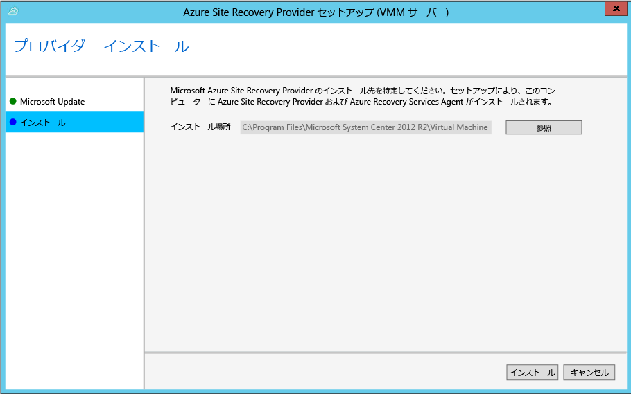

1. プロバイダーのインストール後は、[登録] ボタンをクリックしてサーバーをコンテナーに登録します。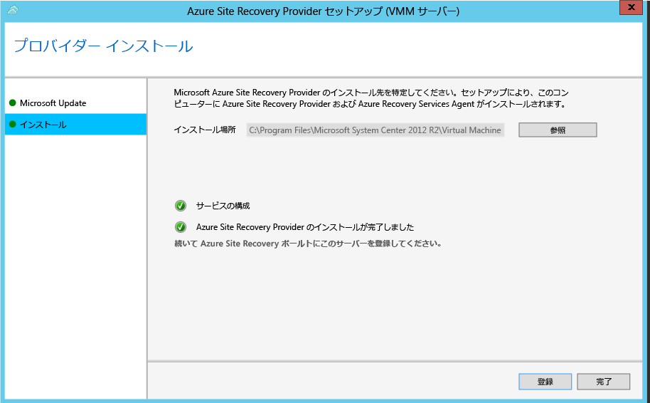

5. **[インターネット接続]** で、VMM サーバーで実行中のプロバイダーがインターネットに接続する方法を指定します。*[既定のシステム プロキシ設定を使用]* を選択して、サーバー上に構成されている既定のインターネット接続設定を使用します。

	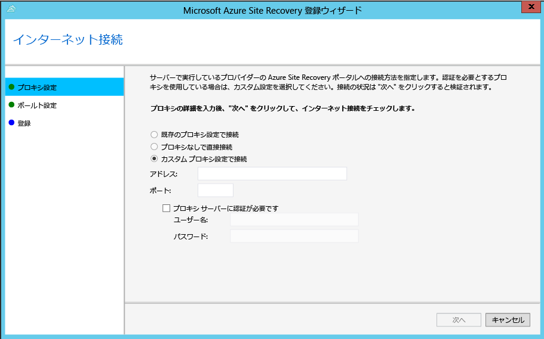 - カスタム プロキシを使用する場合は、プロバイダーをインストールする前に設定する必要があります。カスタム プロキシの設定を構成すると、プロキシの接続を確認するためのテストが実行されます。- カスタム プロキシを使用する場合、または既定のプロキシで認証が必要な場合は、プロキシのアドレスやポートなど、プロキシの詳細を入力する必要があります。- 次の URL は、VMM サーバーと、Hyper-V ホストからアクセスできる必要があります。 - *.hypervrecoverymanager.windowsazure.com - *.accesscontrol.windows.net - *.backup.windowsazure.com - *.blob.core.windows.net - *.store.core.windows.net - 「[Azure Datacenter の IP 範囲](https://www.microsoft.com/download/details.aspx?id=41653)」および HTTPS (443) プロトコルで説明されている IP アドレスを許可します。使用を計画している Azure リージョンの IP の範囲と米国西部の IP の範囲をホワイトリストに登録する必要があります。

	- カスタム プロキシを使用する場合、指定されたプロキシの資格情報を使用して VMM RunAs アカウント (DRAProxyAccount) が自動的に作成されます。このアカウントが正しく認証されるようにプロキシ サーバーを構成します。VMM RunAs アカウントの設定は VMM コンソールで変更できます。変更するには、[設定] ワークスペースを開いて [セキュリティ] を展開し、[実行アカウント] をクリックします。その後、DRAProxyAccount のパスワードを変更します。新しい設定を有効にするには、VMM サービスを再起動する必要があります。

6. **[登録キー]** で、Azure Site Recovery からダウンロードして VMM サーバーにコピーした登録キーを選択します。
7. **[コンテナー名]** で、サーバーが登録されるコンテナーの名前を確認します。*[次へ]* をクリックします。

	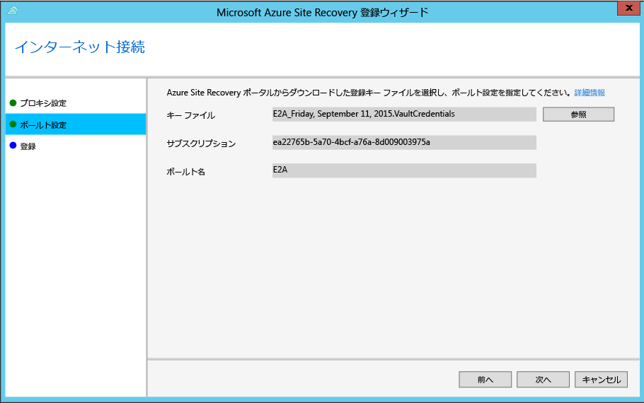

9. データの暗号化用に自動的に生成された SSL 証明書を保存する場所を指定できます。この証明書は、Azure Site Recovery ポータル内で Azure によって保護されているクラウドのデータ暗号化が有効な場合に使用されます。この証明書を安全な場所に保管します。Azure へのフェールオーバーを実行する際に、暗号化されたデータの暗号化を解除するために、この証明書を選択します。

	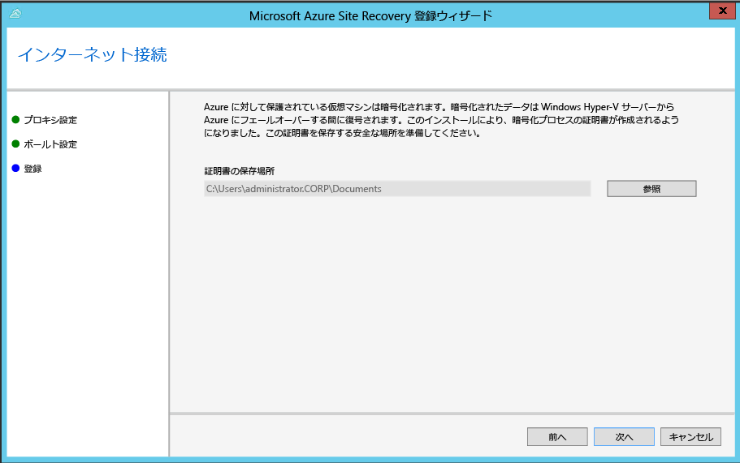

8. **[サーバー名]** に、コンテナーで VMM サーバーを識別する表示名を入力します。クラスター構成で、VMM クラスターのロール名を指定します。

8. **[初期クラウド メタデータ]** 同期で、VMM サーバー上のすべてのクラウドのメタデータをコンテナーと同期するかどうか選択します。この操作は、各サーバーで 1 回のみ実行する必要があります。すべてのクラウドを同期したくない場合は、この設定をオフのままにして、VMM コンソールのクラウドのプロパティで各クラウドを個別に同期できます。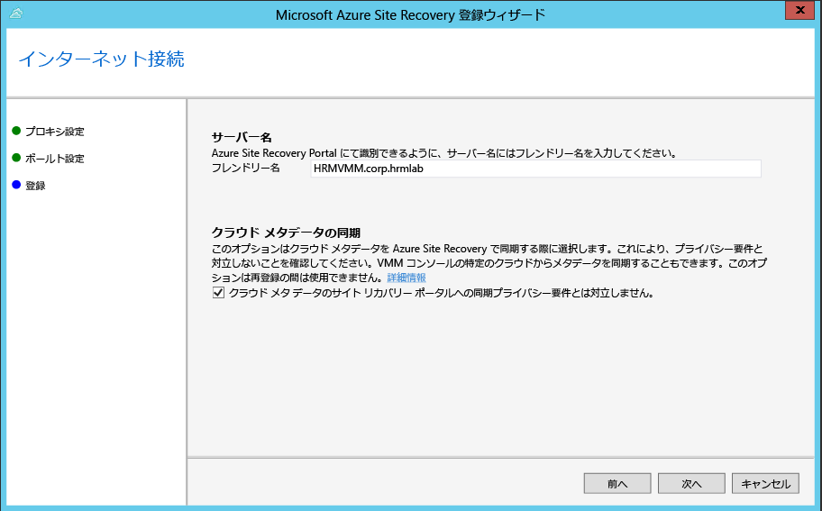

8. *[次へ]* をクリックしてプロセスを完了します。登録後に、VMM サーバーからのメタデータが、Azure Site Recovery によって取得されます。サーバーは、コンテナーの **[サーバー]** ページの *[VMM サーバー]* タブに表示されます。

>[AZURE.NOTE] Azure Site Recovery プロバイダーは、次のコマンド ラインを使用してインストールすることもできます。このメソッドを使用すると、Windows Server 2012 R2 の Server CORE にプロバイダーをインストールできます。

1. プロバイダーのインストール ファイルと登録キーを C:\\ASR などのフォルダーにダウンロードします。
1. System Center Virtual Machine Manager サービスを停止します。
1. **管理者**特権でコマンド プロンプトから次のコマンドを実行して、プロバイダーのインストーラーを抽出します。

    	C:\Windows\System32> CD C:\ASR
    	C:\ASR> AzureSiteRecoveryProvider.exe /x:. /q
1. 次のコマンドを実行して、プロバイダーをインストールします。

		C:\ASR> setupdr.exe /i
1. 次のコマンドを実行して、プロバイダーを登録します。

    	CD C:\Program Files\Microsoft System Center 2012 R2\Virtual Machine Manager\bin
    	C:\Program Files\Microsoft System Center 2012 R2\Virtual Machine Manager\bin> DRConfigurator.exe /r  /Friendlyname <friendly name of the server> /Credentials <path of the credentials file> /EncryptionEnabled <full file name to save the encryption certificate>       

  
#### コマンド ラインのインストール パラメーター一覧

 - **/Credentials**: 登録キー ファイルが配置されている場所を指定する必須パラメーターです。  
 - **/Friendlyname**: Azure Site Recovery ポータルに表示される、Hyper-V ホスト サーバーの名前を表す必須パラメーターです。
 - **/EncryptionEnabled**: 省略可能。VMM から Azure へのシナリオで、Azure にある仮想マシンの暗号化が必要な場合にのみ使用する必要があります。拡張子が **.pfx** のファイル名を指定してください。
 - **/proxyAddress**: 省略可能。プロキシ サーバーのアドレスを指定します。
 - **/proxyport**: 省略可能。プロキシ サーバーのポートを指定します。
 - **/proxyUsername**: 省略可能。プロキシのユーザー名を指定します (認証が必要なプロキシの場合)。
 - **/proxyPassword**: 省略可能。プロキシ サーバーの認証に使用するパスワードを指定します (認証が必要なプロキシの場合)。  

## ステップ 4: Azure のストレージ アカウントを作成する

Azure ストレージ アカウントがない場合は、**[Azure ストレージ アカウントの追加]** をクリックします。アカウントでは geo レプリケーションを有効にする必要があります。アカウントは Azure Site Recovery サービスと同じリージョンである必要があり、同じサブスクリプションに関連付けられている必要があります。

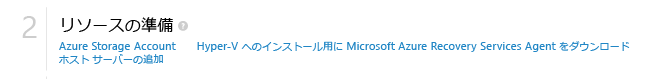

## ステップ 5: Azure Recovery Services エージェントをインストールする

保護する VMM クラウドに配置されている Hyper-V ホスト サーバーごとに、Azure Recovery Services Agent をインストールします。

1. [クイック スタート] ページで、<b>[Azure Site Recovery Services エージェントをダウンロードしてホストにインストールする]</b> をクリックして、最新バージョンのエージェントのインストール ファイルを取得します。

	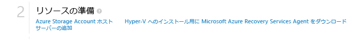

2. 保護する VMM クラウドに配置されている Hyper-V ホスト サーバーごとにインストール ファイルを実行します。
3. **[前提条件のチェック]** ページで <b>[次へ]</b> をクリックします。不足している前提条件があると自動的にインストールされます。

	

4. **[インストール設定]** ページでエージェントのインストール先を指定し、バックアップのメタデータがインストールされるキャッシュの場所を選択します。その後、 <b>[インストール]</b> をクリックします。
5. インストールが完了したら、**[閉じる]** ボタンをクリックしてインストールを完了します。
	
	

>[AZURE.NOTE] Microsoft Azure Recovery Services エージェントは、コマンド ラインで次のコマンドを使用してインストールできます。
>
	marsagentinstaller.exe /q /nu

## ステップ 6: クラウドの保護設定を構成する

VMM サーバーが登録されると、クラウドの保護設定を構成することができます。プロバイダーのインストール時に **[コンテナーとのクラウド データの同期]** を有効にしたので、VMM サーバー上のすべてのクラウドが、資格情報コンテナーの <b>[保護された項目]</b> タブに表示されます。

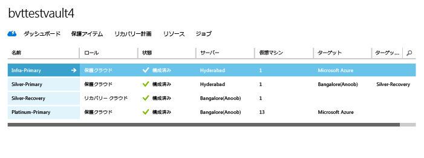

1. [クイック スタート] ページで、**[VMM クラウドの保護の設定]** をクリックします。
2. **[保護された項目]** タブで、構成するクラウドをクリックし、**[構成]** タブに移動します。
3. <b>[ターゲット]</b> で、<b>[Microsoft Azure]</b> を選択します。
4. <b>[ストレージ アカウント]</b> で、仮想マシンのレプリケートに使用する Azure ストレージ アカウントを選択します。
5. <b>[格納データの暗号化]</b> を <b>[オフ]</b> に設定します。この設定は、オンプレミスのサイトと Azure 間のレプリケートでデータを暗号化する必要があることを指定します。
6. <b>[コピーの頻度]</b> では、既定の設定をそのまま使用します。この値は、ソースとターゲットの場所の間でデータが同期される頻度を指定します。
7. <b>[保持する復旧ポイント]</b> では、既定の設定をそのまま使用します。既定値である 0 を使用する場合は、プライマリ仮想マシンに対応する最新の復旧ポイントのみが、レプリカのホスト サーバーに格納されます。
8. <b>[アプリケーションの整合性スナップショットの頻度]</b> では、既定の設定をそのまま使用します。この値は、スナップショットを作成する頻度を指定します。スナップショットは、ボリューム シャドウ コピー サービス (VSS) を使用して、スナップショットを作成するときにアプリケーションを一貫性のある状態に保ちます。値を設定する場合は、構成する追加の復旧ポイント数よりも少ない値にしてください。
9. <b>[レプリケーションの開始時刻]</b> で、Azure へのデータの初期レプリケーションを開始する時刻を指定します。Hyper-V ホスト サーバーのタイムゾーンが使用されます。初期レプリケーションはピーク時以外にスケジュールすることをお勧めします。

	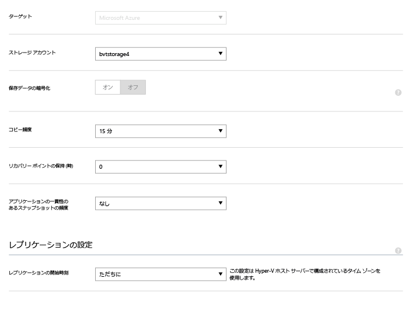

この設定を保存すると、ジョブが作成され、これを <b>[ジョブ]</b> タブで監視できます。VMM ソース クラウド内のすべての Hyper-V ホスト サーバーは、レプリケーション用に構成されます。

保存後は、クラウド設定は <b>[構成]</b> タブで変更できます。ターゲットの場所またはターゲットのストレージ アカウントを変更するには、クラウド構成を削除してから、クラウドを再構成する必要があります。ストレージ アカウントを変更する場合は、ストレージ アカウントの修正後に保護を有効にした仮想マシンにのみ、その変更が適用されることに注意してください。既存の仮想マシンは新しいストレージ アカウントに移行されません。

## ステップ 7: ネットワーク マッピングを構成する
ネットワーク マッピングを開始する前に、ソース VMM サーバー上の仮想マシンが VM ネットワークに接続されていることを確認してください。さらに、1 つまたは複数の Azure Virtual Network を作成します。複数の VM ネットワークを 1 つの Azure ネットワークにマップできることに注意してください。

1. [クイック スタート] ページで、**[ネットワークのマップ]** をクリックします。
2. **[ネットワーク]** タブの **[ソースの場所]** で、ソース VMM サーバーを選択します。**[ターゲットの場所]** で、Azure を選択します。
3. **ソース** ネットワークには、VMM サーバーに関連付けられている VM ネットワークの一覧が表示されます。**ターゲット** ネットワークには、サブスクリプションに関連付けられている Azure ネットワークが表示されます。
4. ソースの VM ネットワークを選択して、**[マップ]** をクリックします。
5. **[ターゲット ネットワークの選択]** ページで、ターゲットとして使用する Azure ネットワークを選択します。
6. チェック マークをクリックして、マッピング処理を完了します。

	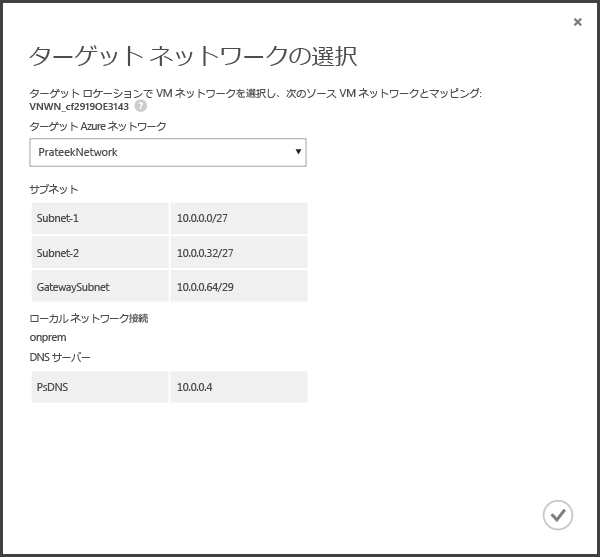

設定を保存すると、マッピングの進行状況を追跡するジョブが起動します。進行状況は [ジョブ] タブで監視することができます。ソースの VM ネットワークに対応する既存のレプリカの全仮想マシンが、ターゲットの Azure ネットワークに接続します。ソースの VM ネットワークに接続する新しい仮想マシンは、レプリケーション後、マップされた Azure ネットワークに接続します。既存のマッピングを新しいネットワークで変更すると、レプリカの仮想マシンは新しい設定で接続されます。

ターゲット ネットワークに複数のサブネットがあり、そのサブネットのいずれかが、ソースの仮想マシンが配置されているサブネットと同じ名前である場合、フェールオーバー後、レプリカの仮想マシンはそのターゲット サブネットに接続することに注意してください。ターゲットのサブネットで名前が一致するものがなければ、仮想マシンはネットワークの最初のサブネットに接続されます。

## ステップ 8: 仮想マシンの保護を有効化する

サーバー、クラウド、およびネットワークを正しく構成した後で、クラウド内の仮想マシンの保護を有効にすることができます。以下の点に注意してください。

- 仮想マシンは Azure 要件を満たしている必要があります。計画ガイドの「<a href="http://go.microsoft.com/fwlink/?LinkId=402602">前提条件とサポート</a>」で確認してください。
- オペレーティング システムとオペレーティング システム ディスクの保護を有効にするには、仮想マシンにプロパティを設定する必要があります。仮想マシン テンプレートを使用して VMM 内で仮想マシンを作成する際に、プロパティを設定できます。また、仮想マシンのプロパティの **[全般]** タブと **[ハードウェア構成]** タブで既存の仮想マシンに対してこれらのプロパティを設定することもできます。VMM でこれらのプロパティを設定していない場合は、Azure Site Recovery ポータルで構成できます。

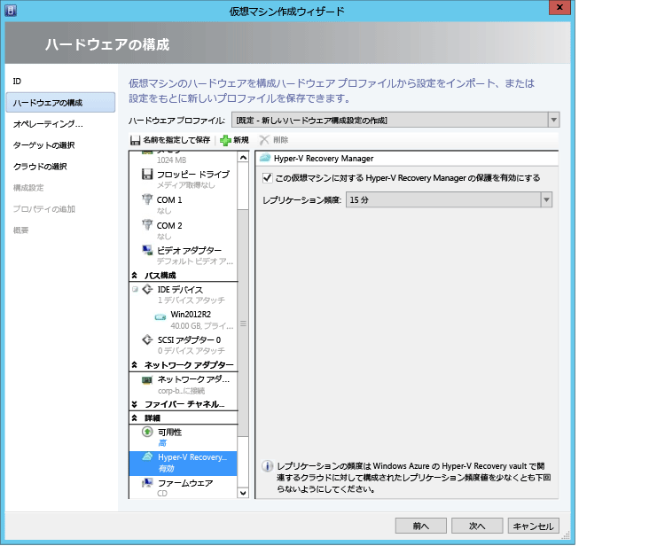

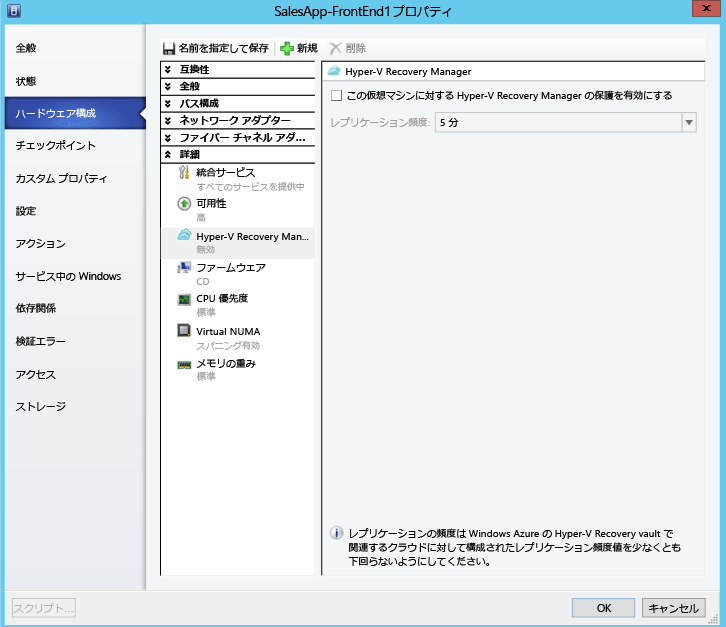

1. 保護を有効にするために、仮想マシンが配置されているクラウドの <b>[Virtual Machines]</b> タブで、<b>[保護を有効にする]</b> をクリックしてから <b>[仮想マシンを追加する]</b> を選択します。
2. クラウド内の仮想マシンのリストから、保護する仮想マシンを選択します。

	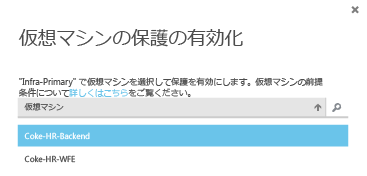

	**[ジョブ]** タブで、保護の有効化のアクション (初期レプリケーションなど) の進捗状況を確認します。保護の最終処理のジョブが実行されると、仮想マシンは、フェールオーバーを実行できる状態になります。保護が有効され仮想マシンが複製されると、Azure でそれらの状態を表示できます。

	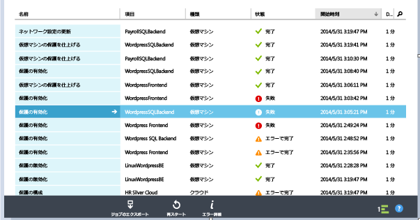

3. 仮想マシンのプロパティを確認し、必要に応じて変更します。

	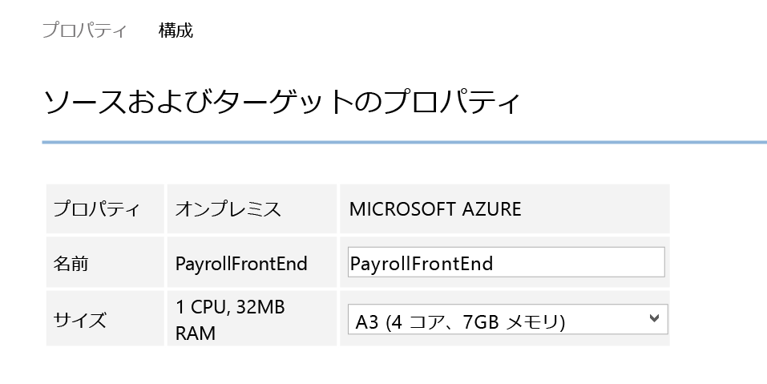

4. 仮想マシンのプロパティの [構成] タブでは、次のネットワークのプロパティを変更することができます。

	1.  ターゲット仮想マシンのネットワーク アダプターの数: ネットワーク アダプターの数は、ターゲット仮想マシンに指定したサイズによって異なります。仮想マシンのサイズでサポートされている NIC の数については、「[仮想マシン サイズの仕様](../virtual-machines/virtual-machines-size-specs.md#size-tables)」を参照してください。 

		仮想マシンのサイズを変更して、その設定を保存すると、次回 **[構成]** ページを開いたときにネットワーク アダプターの数が変わります。ターゲット仮想マシンのネットワーク アダプターの数は、最小でソース仮想マシン上のネットワーク アダプター数、最大で選択した仮想マシンのサイズでサポートされているネットワーク アダプター数となります。次に説明します。

		- ソース マシン上のネットワーク アダプターの数が、ターゲット マシンのサイズに許可されているアダプターの数以下の場合、ターゲットのアダプターの数は、ソースと同じになります。
		- ソース仮想マシン用のアダプターの数が、ターゲットのサイズに許可されている数を超える場合は、ターゲットの最大サイズが使用されます。
		- たとえば、ソース マシンに 2 つのネットワーク アダプターがあり、ターゲット マシンのサイズが 4 つをサポートしている場合は、ターゲット マシンのアダプターの数は、2 つになります。ソース マシンに 2 つのアダプターがあるが、サポートされているターゲット サイズで 1 つしかサポートしていない場合、ターゲット マシンのアダプターの数は 1 つだけになります。 	

	1. ターゲット仮想マシンの数 - 仮想マシンが接続するネットワークは、ソース仮想マシンのネットワークのネットワーク マッピングによって決まります。仮想マシンに 1 つ以上のネットワーク アダプターが含まれており、ソース ネットワークがターゲットの別のネットワークにマップされている場合、ユーザーはターゲット ネットワークのいずれかを選択する必要があります。

	1. 各ネットワーク アダプターのサブネット - ユーザーはネットワーク アダプターごとに、フェールオーバーされた仮想マシンが接続するサブネットを選択できます。

	1. ターゲット IP - ソース仮想マシンのネットワーク アダプターが静的 IP を使用するように構成されている場合、ユーザーはターゲット仮想マシンの IP を指定することができます。ユーザーはこの機能を使用して、フェールオーバー後に、ソース仮想マシンの IP を保持することができます。IP が指定されていない場合は、フェールオーバー時に使用可能な IP がネットワーク アダプターに指定されます。ユーザーが指定したターゲット IP が、Azure で実行されている他の仮想マシンですでに使用されている場合は、フェールオーバーが失敗します。

		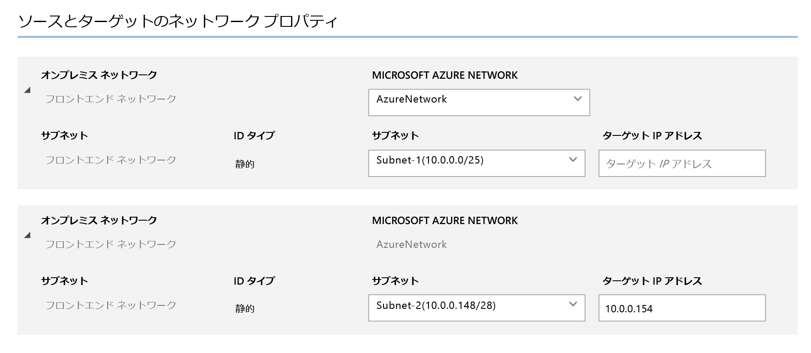

>[AZURE.NOTE] 静的 IP アドレスを使用する Linux 仮想マシンはサポートされていません。

## デプロイのテスト
デプロイをテストするために、1 台の仮想マシンに対するテスト フェールオーバーを実行することや、複数の仮想マシンで構成される復旧計画を作成して、その計画のテスト フェールオーバーを実行することができます。テスト フェールオーバーは、孤立したネットワークでフェールオーバーと復旧のシミュレーションを実行します。以下の点に注意してください。

- フェールオーバー後に Azure でリモート デスクトップを使用して仮想マシンに接続する場合は、テストのフェールオーバーを実行する前に、仮想マシンのリモート デスクトップ接続を有効にします。
- フェールオーバー後、パブリック IP アドレスを使用して、Azure の仮想マシンにリモート デスクトップで接続します。この接続では、パブリック アドレスを使用する仮想マシンの接続を妨げるドメイン ポリシーを使用していないことを確認してください。

### 復旧計画の作成

1. **[復旧計画]** タブで、新しい計画を追加します。名前を指定し、**[ソースの種類]** として **[VMM]**、 **[ソース]** としてソースの VMM サーバーを指定します。ターゲットは Azure になります。

	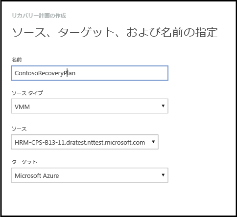

2. **[Virtual Machines の選択]** ページで、復旧計画に追加する仮想マシンを選択します。これらの仮想マシンは、復旧計画の既定のグループ "グループ 1" に追加されます。最大 100 台の仮想マシンを 1 つの復旧計画でテストしています。

	- 仮想マシンを計画に追加する前に、仮想マシンのプロパティを検証する場合は、仮想マシンが配置されているクラウドの [プロパティ] ページで仮想マシンをクリックします。仮想マシンのプロパティは VMM コンソールでも構成できます。
	- 表示されるすべての仮想マシンは、保護が有効になっています。一覧には、保護が有効で、初期レプリケーションが完了している仮想マシンと、保護が有効だが、初期レプリケーションが保留中の仮想マシンの両方が含まれています。初期レプリケーションが完了したマシンのみ、復旧計画の一環としてフェールオーバーできます。そのため、復旧計画のフェールオーバーを開始する前に、この計画に含まれている仮想マシンの初期レプリケーションの状態を確認してください。

	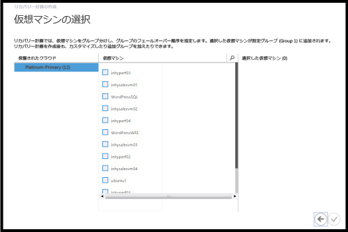

復旧計画が作成されると、 **[復旧計画]** タブにその計画が表示されます。[Azure Automation Runbook](site-recovery-runbook-automation.md) を復旧計画に追加して、フェールオーバー時の操作を自動化することもできます。

### テスト フェールオーバーの実行

Azure へのテスト フェールオーバーを実行する方法は 2 つあります。

- Azure ネットワークを使用しないテスト フェールオーバー — この種のテスト フェールオーバーでは、仮想マシンが Azure で正しく動作することを確認します。フェールオーバー後、仮想マシンはどの Azure ネットワークにも接続しません。
- Azure ネットワークを使用するテスト フェールオーバー — この種のフェールオーバーでは、レプリケーション環境全体が正しく動作することと、フェールオーバーされた仮想マシンが指定したターゲットの Azure ネットワークに接続されることを確認します。サブネットの処理については、テスト フェールオーバーでは、テストの仮想マシンのサブネットはレプリカの仮想マシンのサブネットに基づいて決定されます。これは、レプリカの仮想マシンのサブネットが、ソースの仮想マシンのサブネットに基づいている通常のレプリケーションとは異なります。

Azure ターゲット ネットワークを指定せずに、保護が有効になっている仮想マシンの Azure へのテスト フェールオーバーを実行する場合は、特に準備は必要ありません。ターゲット Azure ネットワークを指定してテスト フェールオーバーを実行するには、Azure 運用ネットワークから独立した新しい Azure ネットワークを作成する必要があります (Azure で新しいネットワークを作成する場合の既定の動作)。詳細については、[テスト フェールオーバーの実行](site-recovery-failover.md#run-a-test-failover)方法に関するページを参照してください。

また、レプリケートされた仮想マシンのインフラストラクチャを正常に動作するように設定する必要があります。たとえば、ドメイン コントローラーと DNS を含む仮想マシンは、Azure Site Recovery を使用して Azure にレプリケート可能で、テスト フェールオーバーを使用して、テスト ネットワーク内に作成できます。詳細については、[Active Directory 用のテスト フェールオーバーの考慮事項](site-recovery-active-directory.md#considerations-for-test-failover)を参照してください。

テスト フェールオーバーを実行するには、次の手順に従います。

1. **[復旧計画]** タブで、計画を選択し、**[テスト フェールオーバー]** をクリックします。
1. **[テスト フェールオーバーの確認]** ページで、**[なし]** または特定の Azure ネットワークを選択します。[なし] を選択した場合、テスト フェールオーバーでは、仮想マシンが Azure に正しくレプリケートされたかどうかは確認されますが、レプリケーションのネットワーク構成は確認されないことに注意してください。

	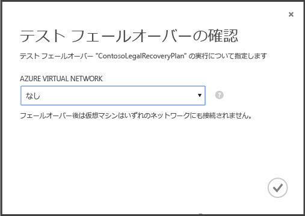

1. クラウドのデータ暗号化が有効になっていて、クラウドのデータ暗号化を有効にするオプションをオンにした場合、**[暗号化キー]** で、VMM サーバーにプロバイダーをインストールしたときに発行された証明書を選択します。
1. **[ジョブ]** タブで、フェールオーバーの進行状況を追跡できます。仮想マシンのテスト レプリカも Azure ポータルで確認できます。オンプレミスのネットワークから、仮想マシンへのアクセスをセットアップすると、仮想マシンへのリモート デスクトップ接続を開始できます。
1. フェールオーバーが **[テストの完了]** フェーズに達したら、**[テストの完了]** をクリックして、テスト フェールオーバーを終了します。**[ジョブ]** タブまでドリルダウンし、フェールオーバーの進行状況と状態を追跡して、必要な操作を実行します。
1. フェールオーバー後、Azure ポータルで仮想マシンのテスト レプリカを確認できます。オンプレミスのネットワークから、仮想マシンへのアクセスをセットアップすると、仮想マシンへのリモート デスクトップ接続を開始できます。以下の点に注意してください。

    1. 仮想マシンが正常に起動することを確認します。
    1. フェールオーバー後に Azure でリモート デスクトップを使用して仮想マシンに接続する場合は、テストのフェールオーバーを実行する前に、仮想マシンのリモート デスクトップ接続を有効にします。また、仮想マシンに RDP エンドポイントを追加する必要もあります。[Azure Automation Runbook](site-recovery-runbook-automation.md) を活用して、このことを行うことができます。
    1. フェールオーバー後、リモート デスクトップでパブリック IP アドレスを使用して Azure の仮想マシンに接続する場合、パブリック アドレスを使用して仮想マシンに接続することを妨げるドメイン ポリシーがないことを確認します。

1.  テストが完了したら、以下の手順を実行します。
	- **[テスト フェールオーバーが完了しました]** をクリックします。テスト環境をクリーンアップして、自動的に電源をオフにし、テスト仮想マシンを削除します。
	- **[メモ]** をクリックして、テスト フェールオーバーに関連する監察結果をすべて記録し、保存します。

## アクティビティを監視する

*[ジョブ]* タブと *[ダッシュボード]* を使用して、Azure Site Recovery コンテナーで実行されるメイン ジョブを表示して監視できます。これには、クラウドに対する保護の構成、仮想マシンに対する保護の有効化と無効化、フェールオーバー (計画済み、計画外、またはテスト) の実行、計画されていないフェールオーバーのコミットが含まれます。

*[ジョブ]* タブからは、ジョブの表示、ジョブの詳細とエラーの表示、特定の条件に一致するジョブを取得するジョブ クエリの実行、ジョブの Excel へのエクスポート、失敗したジョブの再開を行うことができます。

*[ダッシュボード]* からは、最新バージョンのプロバイダーとエージェントのインストール ファイルのダウンロード、コンテナーの構成情報の取得、コンテナーによって管理されている保護対象の仮想マシンの数の確認、最近のジョブの確認、コンテナー証明書の管理、仮想マシンの再同期を行うことができます。

ジョブの操作とダッシュボードの詳細については、「<a href="http://go.microsoft.com/fwlink/?LinkId=398534">Operations and Monitoring Guide (運用と監視ガイド)</a>」を参照してください。

##次のステップ
<UL>
<LI>完全な運用環境で Azure Site Recovery の計画とデプロイを実行するには、「<a href="http://go.microsoft.com/fwlink/?LinkId=321294">Azure Site Recovery 計画ガイド</a>」と「<a href="http://go.microsoft.com/fwlink/?LinkId=321295">Azure Site Recovery デプロイ ガイド</a>」を参照してください。</LI>

<LI>ご不明な点やご質問などがありましたら、<a href="http://go.microsoft.com/fwlink/?LinkId=313628">Azure Recovery Services フォーラム</a>にアクセスしてください。</LI> </UL>

<!---HONumber=AcomDC_0204_2016-->