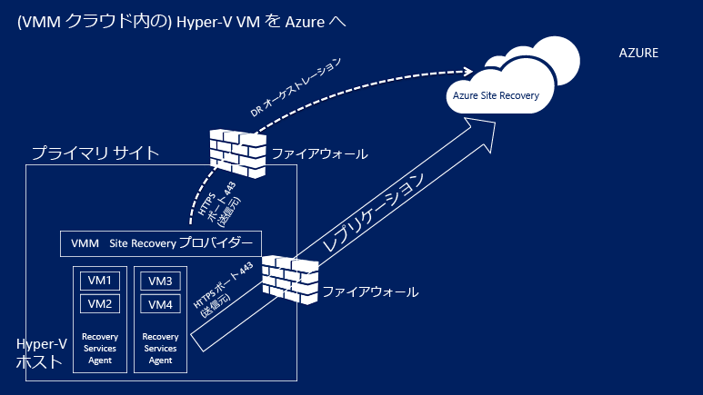
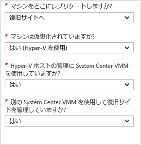

# Azure Portal を使用して VMM クラウド内の Hyper-V 仮想マシンを Azure にレプリケートする
> * [Azure Portal](site-recovery-vmm-to-azure.md)
> * [Azure クラシック](site-recovery-vmm-to-azure-classic.md)
> * [PowerShell Resource Manager](site-recovery-vmm-to-azure-powershell-resource-manager.md)
> * [PowerShell クラシック](site-recovery-deploy-with-powershell.md)
>
>

Azure Site Recovery サービスへようこそ。

Site Recovery は、ビジネス継続性と障害復旧 (BCDR) の戦略に貢献する Azure サービスです。 Site Recovery では、クラウド (Azure) またはセカンダリ データセンターへのオンプレミスの物理サーバーと仮想マシンのレプリケーションを調整します。 プライマリ ロケーションで障害が発生した場合は、セカンダリ ロケーションにフェールオーバーしてアプリとワークロードの可用性を維持します。 プライマリの場所が通常の動作に戻ると、その場所にフェールバックします。 詳細については、「 [Azure Site Recovery とは](site-recovery-overview.md)

この記事では、System Center VMM クラウドで管理されているオンプレミスの Hyper-V 仮想マシンを、Azure Portal の Azure Site Recovery を使用して Azure にレプリケートする方法について説明します。

この記事に関するコメントがありましたら、下から投稿してください。 技術的な質問については、 [Azure Recovery Services フォーラム](https://social.msdn.microsoft.com/forums/azure/home?forum=hypervrecovmgr)に投稿してください。

## クイック リファレンス
完全なデプロイを行う場合、この記事のすべての手順を実行することをお勧めします。 ただし、時間が足りない場合のために、簡単な概要を示します。

| **領域** | **詳細** |
| --- | --- |
| **デプロイ シナリオ** |Azure Portal を使用して、VMM クラウドの Hyper-V VM を Azure にレプリケートする |
| **オンプレミスの要件** |1 つ以上のクラウドを使用して System Center 2012 R2 で実行されている、1 つ以上の VMM サーバー。   クラウドには、1 つ以上の VMM ホスト グループが含まれている必要があります。   Hyper-V ロールを持つ Windows Server 2012 R2 または Microsoft Hyper-V Server 2012 R2 が実行されており、最新の更新プログラムがインストールされている、クラウド上にある少なくとも 1 つの Hyper-V サーバー。   VMM サーバーと Hyper-V ホストにはインターネット接続が必要です。また、直接またはプロキシ経由で特定の URL にアクセスできる必要があります。 [詳細については、こちらをご覧ください](#on-premises-prerequisites)。 |
| **オンプレミスの制限事項** |HTTPS ベースのプロキシはサポートされていません |
| **プロバイダー/エージェント** |レプリケートする VM には Azure Site Recovery プロバイダーが必要です。   Hyper-V ホストには Recovery Services エージェントが必要です。   これらはデプロイ中にインストールします。 |
|  **Azure の要件** |Azure アカウント   Recovery Services コンテナー   コンテナー リージョンの LRS または GRS ストレージ アカウント   Standard ストレージ アカウント   コンテナー リージョンの Azure 仮想ネットワーク。 [詳細については、こちらをご覧ください](#azure-prerequisites)。 |
|  **Azure の制限事項** |GRS を使用する場合、ログ記録には別の LRS アカウントが必要になります。   Azure Portal で作成されたストレージ アカウントは、同じまたは異なるサブスクリプションのリソース グループ間で移動できません。    Premium Storage はサポートされていません。   Site Recovery に使用されている Azure ネットワークは、同じまたは異なるサブスクリプションのリソース グループ間で移動できません。 
|  **VM レプリケーション** |[VM は Azure の前提条件に準拠している必要があります](site-recovery-best-practices.md#azure-virtual-machine-requirements)。  
|  **レプリケーションの制限事項** |静的 IP アドレスを使用して Linux を実行している VM はレプリケートできません。   特定のディスクをレプリケーションから除外することはできますが、OS ディスクを除外することはできません。
| **デプロイの手順** |1. Azure の準備 (サブスクリプション、ストレージ、ネットワーク)、2. オンプレミスの準備 (VMM とネットワーク マッピング)、3. Recovery Services コンテナーの作成、4. VMM と Hyper-V ホストの設定、5. レプリケーション設定の構成、6. レプリケーションの有効化、7. レプリケーションとフェールオーバーのテスト。 |

## Azure ポータルの Site Recovery

Azure には、リソースの作成と操作に関して、[Azure Resource Manager とクラシックの](../resource-manager-deployment-model.md) 2 種類のデプロイメント モデルがあります。 Azure のポータルも、Azure クラシック ポータルと Azure Portal の 2 種類があります。 この記事では、Azure Portal でデプロイする方法について説明します。

この記事では、合理的なデプロイ操作を実現する Azure Portal でデプロイする方法について説明します。 既存のコンテナーを保持する場合は、クラシック ポータルを使用できます。 クラシック ポータルを使用して、新しいコンテナーを作成することはできません。

## ビジネス用途の Site Recovery

組織には、予定されたダウンタイムと予定外のダウンタイムの間にアプリとデータの実行と利用可能な状態を維持し、できるだけ早く通常の動作状態に復旧させる方法を決定する BCDR の戦略が必要です。 Site Recovery でできることを次に示します。

* Hyper-V VM で実行されているビジネス アプリのオフサイト保護。
* レプリケーション、フェールオーバー、復旧の一元的な設定、管理、監視。
* Azure への簡単なフェールオーバーと、Azure からオンプレミス サイトの Hyper-V ホスト サーバーへのフェールバック (復元)。
* 階層化されたアプリケーション ワークロードをまとめてフェールオーバーできるように複数の VM が含まれた復旧計画。

## シナリオのアーキテクチャ
シナリオの構成要素を次に示します。

* **VMM サーバー**: 1 つ以上のクラウドとオンプレミス VMM サーバー。
* **Hyper-V ホストまたはクラスター**: VMM クラウドで管理されている Hyper-V ホスト サーバーまたはクラスター。
* **Azure Site Recovery プロバイダーと Recovery Services エージェント**: デプロイする際、VMM サーバーに Azure Site Recovery プロバイダーをインストールし、Hyper-V ホスト サーバーに Microsoft Azure Recovery Services エージェントをインストールします。 VMM サーバー上のプロバイダーは、HTTPS 443 経由で Site Recovery と通信して、オーケストレーションをレプリケートします。 Hyper-V ホスト サーバー上のエージェントは、既定では HTTPS 443 経由で Azure Storage にデータをレプリケートします。
* **Azure**: Azure サブスクリプション、レプリケートされたデータを格納するための Azure ストレージ アカウント、および Azure VM がフェールオーバー後にネットワークに接続されように Azure 仮想ネットワークが必要です。

## Azure の前提条件
Azure で必要なものを次に示します。

| **前提条件** | **詳細** |
| --- | --- |
| **Azure アカウント** |[Microsoft Azure](http://azure.microsoft.com/) のアカウントが必要です。 アカウントがなくても、 [無料試用版](https://azure.microsoft.com/pricing/free-trial/)を使用できます。 [こちら](https://azure.microsoft.com/pricing/details/site-recovery/) をご覧ください。 |
| **Azure Storage** |レプリケートしたデータを格納するために、Standard Azure ストレージ アカウントが必要です。 LRS または GRS ストレージ アカウントを使用できます。 地域的障害が発生した場合やプライマリ リージョンが復旧できない場合にデータの復元性を確保できるように、GRS をお勧めします。 [詳細情報](../storage/storage-redundancy.md)。 アカウントは、Recovery Services コンテナーと同じリージョンにある必要があります。  Premium Storage はサポートされていません。   レプリケートされたデータは Azure Storage に格納され、フェールオーバーが発生すると Azure VM が作成されます。    Azure Storage については、[こちら](../storage/storage-introduction.md)をご覧ください。 |
| **Azure ネットワーク** |フェールオーバーが発生した場合に Azure VM が接続する Azure 仮想ネットワークが必要です。 ネットワークは、Recovery Services コンテナーと同じリージョンにある必要があります。 |

## オンプレミスの前提条件
オンプレミスで必要となるものを次に示します。

| **前提条件** | **詳細** |
| --- | --- |
| **VMM** |1 つまたは複数の VMM サーバーが System Center 2012 R2 で実行されていること。 各 VMM サーバーに 1 つ以上のクラウドが構成されている必要があります。 クラウドには以下のものが含まれている必要があります。   1 つ以上の VMM ホスト グループ。   各ホスト グループ内に 1 つ以上の Hyper-V ホスト サーバーまたはクラスター。  [VMM クラウドの設定](http://social.technet.microsoft.com/wiki/contents/articles/2729.how-to-create-a-cloud-in-vmm-2012.aspx)について理解を深めます。 |
| **Hyper-V** |Hyper-V ホスト サーバーは、Hyper-V ロールを持つ **Windows Server 2012 R2** 以降か、**Microsoft Hyper-V Server 2012 R2** が実行され、最新の更新プログラムがインストールされている必要があります。   Hyper-V サーバーに 1 つ以上の VM が含まれている必要があります。   レプリケート対象の VM を含む Hyper-V ホスト サーバーまたはクラスターは、VMM クラウドで管理する必要があります。  Hyper-V サーバーは、直接、またはプロキシを経由して、インターネットに接続します。  Hyper-V サーバーには、記事 [2961977](https://support.microsoft.com/kb/2961977) で説明されている修正プログラムをインストールする必要があります。  Azure へのデータ レプリケーションを行うには、Hyper-V ホスト サーバーがインターネットにアクセスできることが必要です。 |
| **プロバイダーとエージェント** |Azure Site Recovery をデプロイする際に、VMM サーバーに Azure Site Recovery プロバイダーをインストールし、Hyper-V ホストに Recovery Services エージェントをインストールします。 プロバイダーとエージェントは、直接またはプロキシを使用して、インターネット経由で Azure に接続する必要があります。 HTTPS ベースのプロキシはサポートされていません。 VMM サーバーおよび Hyper-V ホスト上のプロキシ サーバーは、以下へのアクセスを許可する必要があります。    ``*.accesscontrol.windows.net``   ``*.backup.windowsazure.com``   ``*.hypervrecoverymanager.windowsazure.com``   ``*.store.core.windows.net``   ``*.blob.core.windows.net``   ``https://www.msftncsi.com/ncsi.txt``   ``time.windows.com``   ``time.nist.gov``   VMM サーバーに IP アドレスベースのファイアウォール規則がある場合、規則で Azure との通信を許可していることを確認します。   [Azure データセンターの IP の範囲](https://www.microsoft.com/download/confirmation.aspx?id=41653)と HTTPS (443) ポートを許可します。   ご利用のサブスクリプションの Azure リージョンと米国西部の IP アドレス範囲を許可します。   |

## 保護対象のマシンの前提条件
| **前提条件** | **詳細** |
| --- | --- |
| **保護対象の VM** |VM をフェールオーバーする前に、Azure VM に割り当てられる名前が [Azure の前提条件](site-recovery-best-practices.md#azure-virtual-machine-requirements)に準拠していることを確認してください。 名前は、VM のレプリケーションを有効にした後で変更できます。    保護対象のマシン上の個々のディスク容量が 1023 GB 以下である必要があります。 VM は最大 64 個のディスク (従って最大 64 TB) に対応できます。   共有ディスク ゲスト クラスターはサポートされていません。   Unified Extensible Firmware Interface (UEFI) ブート/拡張ファームウェア インターフェイス (EFI) ブートはサポートされていません。   ソース VM に NIC チーミングがある場合、Azure へのフェールオーバー後に単一の NIC に変換されます。  静的 IP アドレスを持ち、Linux を実行している Hyper-V VM は保護できません。 |

## デプロイの準備をする
デプロイを準備するには、次の手順に従います。

1. [Azure ネットワークをセットアップする](#set-up-an-azure-network) 。
2. [Azure Storage アカウントを設定](#set-up-an-azure-storage-account) します。
3. [VMM サーバーを準備する](#prepare-the-vmm-server) 。
4. [ネットワーク マッピングを準備する](#prepare-for-network-mapping)。 Site Recovery のデプロイ時にネットワーク マッピングを構成できるように、ネットワークをセットアップする。

### Azure ネットワークをセットアップする
フェールオーバー後に作成された Azure VM の接続先となる Azure ネットワークが必要です。

* ネットワークは、Recovery Services コンテナーと同じリージョンにある必要があります。
* フェールオーバーされた Azure VM に使用するリソース モデルに応じて、Azure ネットワークを [Resource Manager モード](../virtual-network/virtual-networks-create-vnet-arm-pportal.md)または[クラシック モード](../virtual-network/virtual-networks-create-vnet-classic-pportal.md)でセットアップします。
* ネットワークをセットアップしてから、以下の作業を開始することをお勧めします。 行わない場合は、Site Recovery のデプロイ中に行う必要があります。
Site Recovery に使用されている Azure ネットワークは、同じまたは異なるサブスクリプション内で[移動](../azure-resource-manager/resource-group-move-resources.md)できないことに注意してください。

### Azure Storage アカウントを設定
* Azure にレプリケートされたデータを保持するために Standard Azure ストレージ アカウントが必要になります。 アカウントは、Recovery Services コンテナーと同じリージョンにある必要があります。
* フェールオーバーされた Azure VM に使用するリソース モデルに応じて、アカウントを [Resource Manager モード](../storage/storage-create-storage-account.md)または[クラシック モード](../storage/storage-create-storage-account-classic-portal.md)でセットアップします。
* アカウントをセットアップしてから、以下の作業を開始することをお勧めします。 行わない場合は、Site Recovery のデプロイ中に行う必要があります。
- Site Recovery で使用されているストレージ アカウントは、同じまたは異なるサブスクリプション内で[移動](../azure-resource-manager/resource-group-move-resources.md)できないことに注意してください。

### VMM サーバーを準備する
* VMM サーバーが [前提条件](#on-premises-prerequisites)に準拠しているかどうかを確認します。
* Site Recovery のデプロイ時に、VMM サーバー上のすべてのクラウドを Azure ポータルで使用できるようにするかを指定できます。 特定のクラウドのみをポータルに表示する場合は、そのための設定を VMM 管理コンソールで対象クラウドに対して有効にできます。

### ネットワーク マッピングを準備する
Site Recovery のデプロイ中にネットワーク マッピングをセットアップする必要があります。 ネットワーク マッピングは、ソースの VMM VM ネットワークとターゲットの Azure ネットワークを対応付けることで、以下のことを実現します。

* 同じネットワーク上でフェールオーバーするマシンは、同じ方法や同じ復旧計画でフェールオーバーされなかった場合でも、相互に接続できます。
* ターゲットの Azure ネットワークにネットワーク ゲートウェイをセットアップすると、Azure 仮想マシンがオンプレミスの仮想マシンに接続できます。
* ネットワーク マッピングをセットアップするには、次の準備が必要です。

  * ソース Hyper-V ホスト サーバー上の VM が VMM VM ネットワークに接続されていることを確認します。 そのネットワークは、クラウドに関連付けられた論理ネットワークにリンクされている必要があります。
  *  [前述](#set-up-an-azure-network)
* [ネットワーク マッピングのしくみ](site-recovery-network-mapping.md) を理解します。

## Recovery Services コンテナーを作成する
1. [Azure ポータル](https://portal.azure.com)にサインインします。
2. **[新規]**  >  **[管理]**  >  **[Recovery Services]** をクリックします。 または、**[参照]** > **[Recovery Services** コンテナー] > **[追加]** の順にクリックします。

    
3. **[名前]**に、コンテナーを識別するフレンドリ名を入力します。 複数のサブスクリプションがある場合は、いずれかを選択します。
4. [リソース グループを作成](../azure-resource-manager/resource-group-template-deploy-portal.md)するか、既存のリソース グループを選択します。 Azure リージョンを指定します。 マシンは、このリージョンにレプリケートされます。 サポートされているリージョンを確認するには、「 [Azure Site Recovery Pricing Details (Azure Site Recovery の価格の詳細)](https://azure.microsoft.com/pricing/details/site-recovery/)
5. ダッシュボードからコンテナーにすばやくアクセスするには、**[ダッシュボードにピン留めする]** > **[コンテナーの作成]** をクリックします。

    

新しいコンテナーは、**[ダッシュボード]** > **[すべてのリソース]** と、メインの **[Recovery Services コンテナー]** ブレードに表示されます。

## 作業開始

Site Recovery に用意されている [使用の開始] エクスペリエンスを利用すると、最小限の時間でデプロイできます。 [作業の開始] によって前提条件が確認され、Site Recovery のデプロイ手順が適切な順序で説明されます。

レプリケートするマシンの種類とレプリケート先を選択します。 また、オンプレミス サーバー、Azure ストレージ アカウント、およびネットワークをセットアップします。 さらに、レプリケーション ポリシーを作成し、キャパシティ プランニングを実施します。 インフラストラクチャの準備ができたら、VM のレプリケーションを有効にします。 特定のマシンのフェールオーバーを実行することも、複数のマシンをフェールオーバーする復旧計画を作成することもできます。

[作業の開始] では、まず、Site Recovery をデプロイする方法を選択します。 作業の開始フローは、レプリケーションの要件によって多少変化します。

## ステップ 1: 保護の目標を選択する
レプリケートの対象とレプリケート先を選択します。

1. **[Recovery Services コンテナー]** ブレードでコンテナーを選択し、**[設定]** をクリックします。
2. **[作業の開始]** で、**[Site Recovery]** > **[手順 1: インフラストラクチャを準備する]** > **[保護の目標]** の順にクリックします。

    
3. **[保護の目標]** で、**[To Azure (Azure へ)]** を選択し、**[Yes, with Hyper-V (はい、Hyper-V を使用する)]** を選択します。 Hyper-V ホストと復旧サイトの管理に VMM を使用しているかどうかの確認に対して、 **[はい]** を選択します。 次に、 **[OK]**をクリックします

    

## ステップ 2: ソース環境をセットアップする
Azure Site Recovery プロバイダーを VMM サーバーにインストールし、サーバーをコンテナーに登録します。 Azure Recovery Services エージェントを Hyper-V ホストにインストールします。

1. **[手順 2: インフラストラクチャを準備する]** > **[ソース]** の順にクリックします。

    
2. **[ソースの準備]** で **[+ VMM]** をクリックして、VMM サーバーを追加します。

    
3. **[サーバーの追加]** ブレードで、**[サーバーの種類]** に **System Center VMM サーバー**が表示され、その VMM サーバーが[前提条件と URL 要件](#on-premises-prerequisites)を満たしていることを確認します。
4. Azure Site Recovery プロバイダーのインストール ファイルをダウンロードします。
5. 登録キーをダウンロードします。 セットアップを実行する際に、これが必要になります。 キーは生成後 5 日間有効です。

    
6. VMM サーバーに Azure Site Recovery プロバイダーをインストールします。

### Azure Site Recovery プロバイダーのセットアップ
1. プロバイダーのセットアップ ファイルを実行します。
2. **[Microsoft Update]** で更新プログラムを登録すると、Microsoft Update ポリシーに従ってプロバイダーの更新プログラムがインストールされます。
3. **[インストール]** で、プロバイダーの既定のインストール先をそのまま使用するか、インストール先を変更して、**[インストール]** をクリックします。

    
4. インストールの完了後、**[登録]** をクリックして、VMM サーバーをコンテナーに登録します。
5. **[資格情報コンテナー設定]** ページで **[参照]** をクリックし、コンテナー キー ファイルを選択します。 Azure Site Recovery サブスクリプションとコンテナー名を指定します。

    
6. **[インターネット接続]**で、VMM サーバーで実行中のプロバイダーがインターネット経由で Site Recovery に接続する方法を指定します。

   * プロバイダーから直接接続するように指定する場合は、**[プロキシを使用せずに直接 Azure Site Recovery に接続する]** を選択します。
   * 既存のプロキシに認証が必要な場合、またはカスタム プロキシを使用する場合は、**[プロキシ サーバーを使用して Azure Site Recovery に接続する]** を選択します。
   * カスタム プロキシを使用する場合には、アドレス、ポート、資格情報を指定します。
   * プロキシを使用している場合は、[前提条件](#on-premises-prerequisites)に記載されている URL をあらかじめ許可しておく必要があります。
   * カスタム プロキシを使用する場合、指定されたプロキシの資格情報を使用して VMM RunAs アカウント (DRAProxyAccount) が自動的に作成されます。 このアカウントが正しく認証されるようにプロキシ サーバーを構成します。 VMM RunAs アカウントの設定は VMM コンソールで変更できます。 **[設定]** で、**[セキュリティ]** > **[実行アカウント]** の順に展開し、DRAProxyAccount のパスワードを変更します。 新しい設定を有効にするには、VMM サービスを再起動する必要があります。

     
7. データの暗号化用に自動的に生成された SSL 証明書を保存する場所を、既定のまま使用するか変更します。 この証明書は、Azure Site Recovery ポータル内で Azure によって保護されているクラウドのデータ暗号化が有効な場合に使用されます。 この証明書を安全な場所に保管します。 Azure へのフェールオーバーを実行する際に、データの暗号化が有効になっている場合の暗号化解除にこれが必要になります。
8. **[サーバー名]**に、コンテナーで VMM サーバーを識別する表示名を入力します。 クラスター構成で、VMM クラスターのロール名を指定します。
9. VMM サーバー上のすべてのクラウドのメタデータをコンテナーと同期する場合は、**[Sync cloud metadata (クラウド メタデータの同期)]** を有効にします。 この操作は、各サーバーで 1 回のみ実行する必要があります。 すべてのクラウドを同期したくない場合は、この設定をオフのままにして、VMM コンソールのクラウドのプロパティで各クラウドを個別に同期できます。 **[登録]** をクリックしてプロセスを完了します。

    
10. 登録が開始されます。 登録が完了すると、コンテナーの **[設定]** > **[サーバー]** ブレードに、サーバーが表示されます。

#### Azure Site Recovery プロバイダーのコマンド ライン インストール
Azure Site Recovery プロバイダーは、コマンド ラインからインストールできます。 この方法を使用すると、Windows Server 2012 R2 の Server Core にプロバイダーをインストールできます。

1. プロバイダーのインストール ファイルと登録キーをフォルダーにダウンロードします。 たとえば、C:\ASR です。
2. 管理者特権のコマンド プロンプトで次のコマンドを実行して、プロバイダーのインストーラーを抽出します。

            C:\Windows\System32> CD C:\ASR
            C:\ASR> AzureSiteRecoveryProvider.exe /x:. /q
3. 次のコマンドを実行して、コンポーネントをインストールします。

            C:\ASR> setupdr.exe /i
4. 次のコマンドを実行して、サーバーをコンテナーに登録します。

        CD C:\Program Files\Microsoft System Center 2012 R2\Virtual Machine Manager\bin
        C:\Program Files\Microsoft System Center 2012 R2\Virtual Machine Manager\bin\> DRConfigurator.exe /r  /Friendlyname <friendly name of the server> /Credentials <path of the credentials file> /EncryptionEnabled <full file name to save the encryption certificate>       

各値の説明:

* **/Credentials**: 登録キー ファイルが配置されている場所を指定する必須パラメーターです。  
* **/Friendlyname**: Azure Site Recovery ポータルに表示される、Hyper-V ホスト サーバーの名前を表す必須パラメーターです。
* * **/EncryptionEnabled**: 省略可能。VMM クラウド内の Hyper-V VM を Azure にレプリケートする場合に指定します。 Azure で仮想マシンを暗号化するかどうかを指定します (保存時の暗号化)。 ファイル名の拡張子が **.pfx** であることを確認してください。 既定では、暗号化は無効になっています。
* **/proxyAddress**: 省略可能。プロキシ サーバーのアドレスを指定します。
* **/proxyport**: 省略可能。プロキシ サーバーのポートを指定します。
* **/proxyUsername**: 省略可能。プロキシのユーザー名を指定します (認証が必要なプロキシの場合)。
* **/proxyPassword**: 省略可能。プロキシ サーバーでの認証に使用するパスワードを指定します (認証が必要なプロキシの場合)。

### Hyper-V ホストへの Azure Recovery Services エージェントのインストール
1. プロバイダーのセットアップが完了したら、Azure Recovery Services エージェントのインストール ファイルをダウンロードする必要があります。 VMM クラウド内の各 Hyper-V サーバーでセットアップを実行します。

    
2. **[前提条件の確認]** で **[次へ]** をクリックします。 不足している前提条件があると自動的にインストールされます。

    
3. **[インストール設定]** で、インストール先とキャッシュの場所を既定のまま使用するか変更します。 利用可能な記憶域が 5 GB 以上あるドライブにキャッシュを構成できますが、キャッシュ ドライブには 600 GB 以上の空き領域を確保することをお勧めします。 その後、 **[インストール]**をクリックします。
4. インストールが完了したら、 **[閉じる]** をクリックして終了します。

    

#### Azure Site Recovery Services エージェントのコマンド ライン インストール
Microsoft Azure Recovery Services エージェントは、コマンド ラインで次のコマンドを使用してインストールできます。

     marsagentinstaller.exe /q /nu

#### Hyper-V ホストから Site Recovery へのインターネット プロキシ アクセスをセットアップする
Hyper-V ホストで実行されている Recovery Services エージェントは、VM のレプリケーションのために、Azure へのインターネット アクセスが必要です。 プロキシを介してインターネットにアクセスしている場合は、次のようにセットアップします。

1. Hyper-V ホストの Microsoft Azure Backup MMC スナップインを開きます。 既定では、Microsoft Azure Backup のショートカットが、デスクトップか C:\Program Files\Microsoft Azure Recovery Services Agent\bin\wabadmin にあります。
2. スナップインで **[プロパティの変更]** をクリックします。
3. **[プロキシの構成]** タブで、プロキシ サーバーの情報を指定します。

    
4. [前提条件](#on-premises-prerequisites)に記載されている URL にエージェントが到達できることを確認します。

## ステップ 3: ターゲット環境をセットアップする
レプリケーションに使用する Azure ストレージ アカウントと、フェールオーバー後に Azure VM が接続する Azure ネットワークを指定します。

1. **[インフラストラクチャの準備]** > **[ターゲット]** の順にクリックし、フェールオーバーされた仮想マシンを作成するサブスクリプションとリソース グループを選択します。 Azure で、フェールオーバーされた仮想マシンに使用するデプロイ モデル (クラシックまたはリソース管理) を選択します。

    

2. Site Recovery によって、互換性のある Azure ストレージ アカウントとネットワークが 1 つ以上あるかどうかが確認されます。
    

4. まだストレージ アカウントを作成しておらず、Resource Manager を使用して作成する場合は、**[+ ストレージ アカウント]** をクリックしてインラインで作成します。  **[ストレージ アカウントの作成]** ブレードで、アカウント名、種類、サブスクリプション、場所を指定します。 アカウントは、Recovery Services コンテナーと同じ場所にある必要があります。

   

   以下の点に注意してください。

   * クラシック モデルを使用してストレージ アカウントを作成する場合は、Azure Portal で作成できます。 [詳細情報](../storage/storage-create-storage-account-classic-portal.md)
   * レプリケートされたデータに Premium ストレージ アカウントを使用している場合は、オンプレミスのデータの継続的な変更をキャプチャするレプリケーション ログを格納するために、追加の Standard ストレージ アカウントをセットアップします。
5. まだ Azure ネットワークを作成しておらず、Resource Manager を使用して作成する場合は、**[+ ネットワーク]** をクリックしてインラインで作成します。 **[仮想ネットワークの作成]** ブレードで、ネットワーク名、アドレス範囲、サブネットの詳細、サブスクリプション、場所を指定します。 ネットワークは、Recovery Services コンテナーと同じ場所にある必要があります。

   

   クラシック モデルを使用してネットワークを作成する場合は、Azure Portal で作成できます。 [詳細情報](../virtual-network/virtual-networks-create-vnet-classic-pportal.md)。

### ネットワーク マッピングの構成
* [こちら](#prepare-for-network-mapping) をご覧ください。 [こちら](site-recovery-network-mapping.md) をご覧ください。
* VMM サーバー上の仮想マシンが VM ネットワークに接続されており、1 つ以上の Azure 仮想ネットワークが作成されていることを確認してください。 1 つの Azure ネットワークに対して複数の VM ネットワークをマップできます。

マッピングは次のように構成します。

1. **[設定]** > **[Site Recovery Infrastructure (Site Recovery インフラストラクチャ)]** > **[ネットワーク マッピング]** > **[ネットワーク マッピング]** の順にクリックし、**[+ ネットワーク マッピング]** アイコンをクリックします。

    
2. **[ネットワーク マッピングの追加]** で、ソース VMM サーバーを選択し、ターゲットとして **[Azure]** を選択します。
3. サブスクリプションとフェールオーバー後のデプロイメント モデルを確認します。
4. **[ソース ネットワーク]**で、VMM サーバーに関連付けられている一覧から、マップするソースのオンプレミス VM ネットワークを選択します。
5. **[ターゲット ネットワーク]**で、レプリカの Azure VM が作成されたときに配置される Azure ネットワークを選択します。 次に、 **[OK]**をクリックします

    

ネットワーク マッピングが開始されると、次のように動作します。

* ソースの VM ネットワーク上の既存の VM は、マッピングが開始されるとターゲット ネットワークに接続します。 ソースの VM ネットワークに接続する新しい VM は、レプリケーションが実行されると、マップされた Azure ネットワークに接続します。
* 既存のネットワーク マッピングを変更すると、レプリカの仮想マシンは新しい設定を使用して接続します。
* ターゲット ネットワークに複数のサブネットがあり、そのサブネットのいずれかが、ソースの仮想マシンが配置されているサブネットと同じ名前である場合、フェールオーバー後、レプリカの仮想マシンはそのターゲット サブネットに接続します。
* ターゲットのサブネットで名前が一致するものがなければ、仮想マシンはネットワークの最初のサブネットに接続します。

## ステップ 4: レプリケーション設定をセットアップする
1. 新しいレプリケーション ポリシーを作成するには、**[インフラストラクチャの準備]** > **[レプリケーションの設定]** > **[+ 作成と関連付け]** の順にクリックします。

    
2. **[ポリシーの作成と関連付け]**で、ポリシー名を指定します。
3. **[コピーの頻度]**で、初期レプリケーションの後、差分データをレプリケートする頻度 (30 秒ごと、5 分ごと、または 15 分ごと) を指定します。
4. **[復旧ポイントの保持期間]**で、各復旧ポイントのリテンション期間の長さを時間単位で指定します。 保護されたマシンはこの期間内のどのポイントにも復旧できます。
5. **[アプリ整合性スナップショットの頻度]** で、アプリケーション整合性スナップショットを含む復旧ポイントの作成頻度 (1 ～ 12 時間) を指定します。 Hyper-V では 2 種類のバックアップを使用します。1 つは標準バックアップで、仮想マシン全体の増分バックアップを実行します。もう 1 つは、アプリケーション整合性スナップショットで、仮想マシン内部のアプリケーション データの特定の時点のスナップショットを作成します。 アプリケーション整合性スナップショットでは、ボリューム シャドウ コピー サービス (VSS) を使用して、スナップショットを作成するときにアプリケーションを一貫性のある状態に保ちます。 アプリケーション整合性スナップショットを有効にすると、ソースの仮想マシンで実行するアプリケーションのパフォーマンスに影響があります。 設定する値は、追加で構成する復旧ポイントの数より少ない数にしてください。
6. **[初期レプリケーションの開始時刻]**で、初期レプリケーションを開始する時刻を指定します。 レプリケーションはご利用のインターネット帯域幅で行われるため、トラフィックの多い時間帯を避けるようにスケジュールを設定することをお勧めします。
7. **[Azure に格納されるデータの暗号化]**で、Azure ストレージに格納されるデータを暗号化するかどうかを指定します。 次に、 **[OK]**をクリックします

    
8. 新しいポリシーを作成すると、自動的に VMM クラウドに関連付けられます。 **[OK]**をクリックします。 追加の VMM クラウド (およびその内部にある VM) を、このレプリケーション ポリシーに関連付けるには、**[設定]** > **[レプリケーション]** > ポリシー名 > **[Associate VMM Cloud (VMM クラウドを関連付ける)]** の順に選択します。

    

## ステップ 5: キャパシティ プランニング
基本的なインフラストラクチャのセットアップが完了したので、キャパシティ プランニングを行い、追加のリソースが必要かどうかを検討できます。

Site Recovery が備えている Capacity Planner を使用して、ソース環境、Site Recovery のコンポーネント、ネットワーク、ストレージに適切なリソースを割り当てることができます。 このキャパシティ プランニング ツールは、VM、ディスク、およびストレージの平均数に基づく見積もりを使用するクイック モードか、ワークロード レベルで数値を入力する詳細モードで実行できます。 開始する前に次の操作を実行してください。

* VM、VM あたりのディスク数、ディスクあたりのストレージなど、レプリケーション環境の情報を収集する。
* レプリケートされたデータの 1 日の変更 (チャーン) 率を見積もる。 この見積もりには、 [Capacity Planner for Hyper-V Replica](https://www.microsoft.com/download/details.aspx?id=39057) が役立ちます。

1. **[ダウンロード]** をクリックしてツールをダウンロードし、実行する。 [こちらの記事をご覧ください](site-recovery-capacity-planner.md) 。
2. 作業が完了したら、**[Have you run the Capacity Planner? (Capacity Planner を実行しましたか?)]** で **[はい]** を選択する。

   

### ネットワーク帯域幅に関する考慮事項
Capacity Planner を使用して、レプリケーション (初期レプリケーションとその後の差分レプリケーション) に必要な帯域幅を計算できます。 レプリケーションの帯域幅の使用量を制御する方法には、いくつかのオプションがあります。

* **帯域幅のスロットル**: セカンダリ サイトにレプリケートされる Hyper-V トラフィックは特定の Hyper-V ホストを通過します。 このホスト サーバーの帯域幅をスロットルできます。
* **帯域幅の微調整**: いくつかのレジストリ キーを使用して、レプリケーションに使用される帯域幅に影響を与えることができます。

#### 帯域幅のスロットル
1. Hyper-V ホスト サーバーの Microsoft Azure Backup MMC スナップインを開きます。 既定では、Microsoft Azure Backup のショートカットが、デスクトップか C:\Program Files\Microsoft Azure Recovery Services Agent\bin\wabadmin にあります。
2. スナップインで **[プロパティの変更]** をクリックします。
3. **[調整]** タブで、**[バックアップ操作用のインターネット使用帯域幅の調整を有効にする]** チェック ボックスをオンにし、勤務時間用と勤務時間外用の制限値を設定します。 有効な範囲は、1 秒あたり 512 Kbps ～ 102 Mbps です。

    

[Set-OBMachineSetting](https://technet.microsoft.com/library/hh770409.aspx) コマンドレットを使用して、スロットルを設定することもできます。 サンプルを次に示します。

    $mon = [System.DayOfWeek]::Monday
    $tue = [System.DayOfWeek]::Tuesday
    Set-OBMachineSetting -WorkDay $mon, $tue -StartWorkHour "9:00:00" -EndWorkHour "18:00:00" -WorkHourBandwidth  (512*1024) -NonWorkHourBandwidth (2048*1024)

**Set-OBMachineSetting -NoThrottle** は、スロットルが不要であることを示します。

#### ネットワーク帯域幅に影響を与える
**UploadThreadsPerVM** レジストリ値を使用して、ディスクのデータ転送 (初期レプリケーションまたは差分レプリケーション) に使用されるスレッドの数を制御できます。 値を大きくすると、レプリケーションに使用されるネットワーク帯域幅が増加します。 **DownloadThreadsPerVM** レジストリ値では、フェールバック時にデータ転送に使用されるスレッドの数を指定できます。

1. レジストリで、**HKEY_LOCAL_MACHINE\SOFTWARE\Microsoft\Windows Azure Backup\Replication** に移動します。

   * 値 **UploadThreadsPerVM** を変更して (キーが存在しない場合は作成して)、ディスクのレプリケーションに使用されるスレッドを制御できます。
   * 値 **DownloadThreadsPerVM** を変更して (キーが存在しない場合は作成して)、Azure からのフェールバック トラフィックに使用されるスレッドを制御できます。
2. 既定値は 4 ですが、 "プロビジョニング超過" 状態のネットワークの場合、このレジストリ キーを既定値から変更する必要があります。 最大値は 32 です。 トラフィックを監視して値を最適化できます。

## ステップ 6: レプリケーションを有効にする

レプリケーションを有効にするには、次の手順に従います。

1. **[手順 2: アプリケーションをレプリケートする]** > **[ソース]** の順にクリックします。 レプリケーションを初めて有効にした後は、コンテナーで **[+ レプリケート]** をクリックして、追加のマシンのレプリケーションを有効にします。

    
2. **[ソース]** ブレードで、VMM サーバーと、Hyper-V ホストが配置されているクラウドを選択します。 次に、 **[OK]**をクリックします

    
3. **[ターゲット]** で、サブスクリプション、フェールオーバー後のデプロイメント モデル、レプリケートされたデータに使用するストレージ アカウントを選択します。

    
4. 使用するストレージ アカウントを選択します。 現在所有しているのと異なるストレージ アカウントを使用する場合は、[ストレージ アカウントを作成](#set-up-an-azure-storage-account)できます。 Resource Manager モデルを使用してストレージ アカウントを作成するには、 **[新規作成]**をクリックします。 クラシック モデルを使用してストレージ アカウントを作成する場合は、[Azure Portal](../storage/storage-create-storage-account-classic-portal.md) で作成できます。 次に、 **[OK]**をクリックします
5. フェールオーバー後に作成された Azure VM が接続する Azure ネットワークとサブネットを選択します。 保護の対象として選択したすべてのマシンにネットワーク設定を適用する場合は、**[選択したマシン用に今すぐ構成します。]** を選択します。 マシンごとに Azure ネットワークを選択する場合は、**[後で構成する]** を選択します。 現在所有しているのと異なるネットワークを使用する場合は、[ネットワークを作成](#set-up-an-azure-network)できます。 Resource Manager モデルを使用してネットワークを作成するには、**[新規作成]** をクリックします。 クラシック モデルを使用してネットワークを作成する場合は、[Azure Portal](../virtual-network/virtual-networks-create-vnet-classic-pportal.md) で作成できます。 該当する場合は、サブネットを選択します。 次に、 **[OK]**をクリックします
6. **[仮想マシン]** > **[仮想マシンの選択]** で、レプリケートする各マシンをクリックして選択します。 選択できるのは、レプリケーションを有効にできるマシンのみです。 次に、 **[OK]**をクリックします

    
7. **[プロパティ]** > **[プロパティの構成]** で、選択した VM のオペレーティング システムと OS ディスクを選択します。 既定では、VM のすべてのディスクがレプリケーションの対象として選択されています。 レプリケーションからディスクを除外して、不要なデータを Azure にレプリケートする際の帯域幅使用量を削減することもできます。 たとえば、一時的なデータや、マシンまたはアプリケーションを再起動するたびに更新されるデータ (pagefile.sys や Microsoft SQL Server tempdb など) が保存されたディスクをレプリケーションから除外できます。 ディスクをレプリケーションから除外するには、ディスクの選択を解除します。 Azure VM の名前 (ターゲット名) が [Azure 仮想マシンの要件](site-recovery-best-practices.md#azure-virtual-machine-requirements)に準拠していることを確認し、必要に応じて変更します。 次に、 **[OK]**をクリックします 後で追加のプロパティを設定できます。

    
    
    >[!NOTE]
    > 
    > * レプリケーションから除外できるのは、ベーシック ディスクだけです。 OS ディスクを除外することはできないため、ダイナミック ディスクの除外はお勧めしません。 ASR は、ゲスト VM 内でどの VHD ディスクがベーシック ディスクまたはダイナミック ディスクであるかを特定できません。  依存するダイナミック ボリューム ディスクすべてが除外されていない場合、フェールオーバー VM 上の障害が発生したディスクとそのディスク上のデータにアクセスできないため、保護されたダイナミック ディスクになります。   
    > * レプリケーションが有効になった後で、レプリケーション用のディスクを追加または削除することはできません。 ディスクを追加または除外する場合は、VM の保護を無効にし、再度有効にする必要があります。
    > * アプリケーションが動作するために必要なディスクを除外した場合、Azure へのフェールオーバー後、レプリケートされたアプリケーションを実行できるように、Azure でディスクを手動で作成する必要があります。 別の方法として、Azure Automation を復旧計画に組み込んで、マシンのフェールオーバー時にディスクを作成することもできます。
    > * Azure で手動で作成したディスクはフェールバックされません。 たとえば、3 つのディスクをフェールオーバーし、Azure VM に直接 2 つのディスクを作成した場合、フェールオーバーされた 3 つのディスクだけが Azure から Hyper-V にフェールバックされます。 Hyper-V から Azure へのフェールバックまたはレプリケーションの反転に、手動で作成されたディスクを含めることはできません。
    >
    >
    

8. **[レプリケーションの設定]**  >  **[レプリケーション設定の構成]** で、保護対象の VM に適用するレプリケーション ポリシーを選択します。 次に、 **[OK]**をクリックします レプリケーション ポリシーを変更するには、**[設定]**  >  **[レプリケーション ポリシー]**、ポリシー名、**[設定の編集]** の順にクリックします。 適用する変更は、既にレプリケートしているマシンと、新しいマシンに使用されます。

   

**[設定]** > **[ジョブ]** > **[Site Recovery ジョブ]** の順にクリックして、**保護の有効化**ジョブの進行状況を追跡できます。 **保護の最終処理**ジョブが実行されると、マシンはフェールオーバーできる状態になります。

### VM プロパティを表示して管理する
ソース マシンのプロパティを確認することをお勧めします。 Azure VM の名前は、 [Azure 仮想マシンの要件](site-recovery-best-practices.md#azure-virtual-machine-requirements)に準拠している必要があります。

1. **[設定]** > **[保護されたアイテム]** > **[レプリケートされたアイテム]** の順にクリックし、マシンを選択すると、その詳細が表示されます。

    
2. **[プロパティ]** で、VM のレプリケーションとフェールオーバーの情報を確認できます。

    
3. **[コンピューティングとネットワーク]** > **[コンピューティングのプロパティ]** で、Azure VM の名前とターゲットのサイズを指定できます。 必要に応じて、 [Azure の要件](site-recovery-best-practices.md#azure-virtual-machine-requirements) に準拠するように名前を変更します。 Azure VM に割り当てられているターゲット ネットワーク、サブネット、IP アドレスに関する情報を表示し、変更することもできます。 以下の点に注意してください。

   * ターゲット IP アドレスを設定できます。 アドレスを指定しなかった場合、フェールオーバーされたマシンで DHCP が使用されます。 フェールオーバーで使用できないアドレスが設定された場合、フェールオーバーは失敗します。 テスト フェールオーバー ネットワークのアドレスを利用できる場合、テスト フェールオーバーに同じターゲット IP アドレスを使用できます。
   * ネットワーク アダプターの数は、次に示すように、ターゲット仮想マシンに指定したサイズによって異なります。

     * ソース マシン上のネットワーク アダプターの数が、ターゲット マシンのサイズに許可されているアダプターの数以下の場合、ターゲットのアダプターの数は、ソースと同じになります。
     * ソース仮想マシン用のアダプターの数が、ターゲットのサイズに許可されている数を超える場合は、ターゲットの最大サイズが使用されます。
     * たとえば、ソース マシンに 2 つのネットワーク アダプターがあり、ターゲット マシンのサイズが 4 つをサポートしている場合は、ターゲット マシンのアダプターの数は、2 つになります。 ソース マシンに 2 つのアダプターがあるものの、サポートされているターゲット サイズで 1 つしかサポートされていない場合、ターゲット マシンのアダプターの数は 1 つのみになります。     
     * VM に複数のネットワーク アダプターがある場合は、すべて同じネットワークに接続されます。

     
4. **[ディスク]** で、レプリケートされる VM のオペレーティング システム ディスクとデータ ディスクを確認できます。

## ステップ 7: デプロイをテストする
デプロイをテストするために、単一の仮想マシンに対して、または 1 つ以上の仮想マシンを含む復旧計画に対してテスト フェールオーバーを実行できます。

### フェールオーバーを準備する
* テスト フェールオーバーを実行する場合は、Azure 実稼働用ネットワークから分離された Azure ネットワークを新しく作成することをお勧めします。 これは Azure で新しいネットワークを作成する場合の既定の動作です。 [こちら](site-recovery-failover.md#run-a-test-failover) をご覧ください。
* Azure へのフェールオーバーを実行するときに最適なパフォーマンスを得るには、保護されたマシンに Azure エージェントをインストールします。 エージェントをインストールすると、起動時間が短縮され、トラブルシューティングにも役立ちます。 [Linux](https://github.com/Azure/WALinuxAgent) エージェントまたは [Windows](http://go.microsoft.com/fwlink/?LinkID=394789) エージェントをインストールします。
* デプロイを完全にテストするには、レプリケートされたマシンが予想どおりに動作するインフラストラクチャが必要です。 Active Directory と DNS をテストする場合は、ドメイン コントローラー兼 DNS として仮想マシンを作成し、これを Azure Site Recovery を使用して Azure にレプリケートします。 Active Directory のテスト フェールオーバーの考慮事項については、 [こちら](site-recovery-active-directory.md#test-failover-considerations)をご覧ください。
* レプリケーションからディスクを除外した場合、アプリケーションが想定どおりに動作するように、フェールオーバー後に Azure でそれらのディスクを手動で作成する必要があります。
* テスト フェールオーバーではなく計画されていないフェールオーバーを実行する場合は、次の点に注意してください。

  * 可能であれば、プライマリ マシンをシャットダウンしてから、計画されていないフェールオーバーを実行します。 こうすることで、ソース マシンとレプリカ マシンが同時に実行されないように確保できます。
  * 計画されていないフェールオーバーを実行すると、プライマリ マシンのデータ レプリケーションが停止され、計画されていないフェールオーバーの開始後に、データの差分は転送されなくなります。 また、復旧計画で計画されていないフェールオーバーを実行する場合は、エラーが発生した場合でも、復旧計画は最後まで実行されます。

### フェールオーバー後に Azure VM に接続するための準備をする
フェールオーバー後に RDP を使用して Azure VM に接続する場合は、次のことを行う必要があります。

**フェールオーバー前にオンプレミスのマシンで行う操作**:

* インターネット経由のアクセスで RDP を有効にする場合は、TCP と UDP の規則が **[パブリック]** に追加されていることを確認し、すべてのプロファイルについて、**[Windows ファイアウォール]** -> **[許可されたアプリおよび機能]** で RDP が許可されていることを確認します。
* マシンでサイト間接続経由のアクセスに対して RDP を有効にする場合は、**[ドメイン]** と **[プライベート]** ネットワークについて、**[Windows ファイアウォール]** -> **[許可されたアプリおよび機能]** で RDP が許可されていることを確認します。
* オンプレミスのマシンに [Azure VM エージェント](http://go.microsoft.com/fwlink/?LinkID=394789&clcid=0x409) をインストールします。
* オペレーティング システムの SAN ポリシーが OnlineAll に設定されていることを確認します。 [詳細情報](https://support.microsoft.com/kb/3031135)
* フェールオーバーを実行する前に、IPSec サービスを無効にします。

**フェールオーバー後に Azure VM で行う操作**:

* RDP プロトコル (ポート 3389) のパブリック エンドポイントを追加し、ログインの資格情報を指定します。
* パブリック アドレスを使用する仮想マシンへの接続を妨げるドメイン ポリシーを使用していないことを確認します。
* 接続を試みます。 接続できない場合は、VM が実行されていることを確認します。 トラブルシューティングのヒントについては、[こちらの記事](http://social.technet.microsoft.com/wiki/contents/articles/31666.troubleshooting-remote-desktop-connection-after-failover-using-asr.aspx)をご覧ください。

フェールオーバー後に Linux が実行されている Azure VM に Secure Shell クライアント (ssh) を使用してアクセスする場合は、次の手順に従います。

**フェールオーバー前にオンプレミスのマシンで行う操作**:

* Azure VM 上の Secure Shell サービスがシステム起動時に自動的に開始されるよう設定されていることを確認します。
* ファイアウォール規則で SSH 接続が許可されていることを確認します。

**フェールオーバー後に Azure VM で行う操作**:

* フェールオーバーされた VM と接続先の Azure サブネットのネットワーク セキュリティ グループの規則で、SSH ポートへの着信接続を許可する必要があります。
* SSH ポート (既定では TCP ポート 22) で着信接続を許可するようにパブリック エンドポイントが作成されている必要があります。
* VM が VPN 接続 (ExpressRoute またはサイト間 VPN) 経由でアクセスされる場合は、クライアントを使用して SSH 経由で直接 VM に接続できます。

### テスト フェールオーバーの実行
1. 1 つの VM をフェールオーバーする場合は、**[設定]** > **[レプリケートされたアイテム]** で、VM をクリックして **[+ テスト フェールオーバー]** をクリックします。
2. 復旧計画をフェールオーバーする場合は、**[設定]** > **[復旧計画]** で、計画を右クリックし、**[テスト フェールオーバー]** をクリックします。 復旧計画を作成する場合は、[こちらの手順に従ってください](site-recovery-create-recovery-plans.md)。
3. **[テスト フェールオーバー]** で、フェールオーバー後に Azure VM が接続する Azure ネットワークを選択します。
4. **[OK]** をクリックすると、フェールオーバーが開始されます。 進行状況を追跡するには、VM をクリックしてプロパティを開くか、**[設定]** > **[Site Recovery jobs (Site Recovery ジョブ)]** で **[テスト フェールオーバー]** をクリックします。
5. フェールオーバーが **[テストの完了]** フェーズに達したら、次の手順に従います。

   1. Azure ポータルで、レプリカ仮想マシンを表示します。 仮想マシンが正常に起動することを確認します。
   2. オンプレミスのネットワークから、仮想マシンへのアクセスをセットアップすると、仮想マシンへのリモート デスクトップ接続を開始できます。
   3. **[テストの完了]** をクリックして終了します。
   4. **[メモ]** をクリックして、テスト フェールオーバーに関連する観察結果をすべて記録、保存します。
   5. **[テスト フェールオーバーが完了しました]**をクリックします。 テスト環境をクリーンアップして、自動的に電源をオフにし、テスト仮想マシンを削除します。
   6. この段階で、テスト フェールオーバー時に Site Recovery によって自動的に作成されたすべての要素または VM は削除されます。 テスト フェールオーバー用に作成した追加の要素は削除されません。

      > [!NOTE]
      > テスト フェールオーバーの実行時間が 2 週間を超えた場合は、強制的に終了されます。
      >
      >
6. フェールオーバーの完了後は、Azure Portal の **[仮想マシン]** にレプリカの Azure マシンも表示されるようになります。 VM が適切なサイズであること、適切なネットワークに接続していること、実行されていることを確認する必要があります。
7. [フェールオーバー後の接続の準備](#prepare-to-connect-to-Azure-VMs-after-failover)が完了したら、Azure VM に接続できるようになります。

## デプロイを監視する
Site Recovery デプロイメントの構成設定、状態、および正常性を監視する方法を次に示します。

1. コンテナー名をクリックして、 **[要点]** ダッシュボードにアクセスします。 このダッシュボードで、Site Recovery ジョブ、レプリケーションの状態、復旧計画、サーバーの状態、およびイベントを確認できます。  **[要点]** ダッシュボードをカスタマイズして、他の Site Recovery コンテナーや Backup コンテナーの状態など、ニーズに最適なタイルとレイアウトを表示できます。

    ![[要点]](./media/site-recovery-vmm-to-azure/essentials.png)
2. **[正常性]** タイルで、サイト サーバー (VMM または構成サーバー) の問題と、Site Recovery によって過去 24 時間以内に発生したイベントを監視できます。
3. **[レプリケートされたアイテム]**、**[復旧計画]**、**[Site Recovery Jobs (Site Recovery ジョブ)]** の各タイルで、レプリケーションの管理と監視を実行できます。 **[設定]** > **[ジョブ]** > **[Site Recovery ジョブ]** の順にクリックすると、ジョブの詳細を確認できます。

## 次のステップ
デプロイをセットアップし、実行状態にできたら、各種フェールオーバーの [詳細を確認](site-recovery-failover.md) します。

<!--HONumber=Dec16_HO4-->

