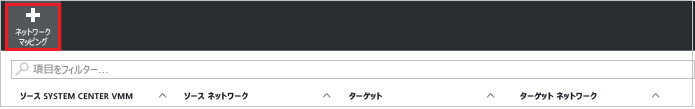

# Azure Portal を使用して VMM クラウド内の Hyper-V 仮想マシンをセカンダリ VMM サイトにレプリケートする
> [!div class="op_single_selector"]
> * [Azure Portal](site-recovery-vmm-to-vmm.md)
> * [クラシック ポータル](site-recovery-vmm-to-vmm-classic.md)
> * [PowerShell - Resource Manager](site-recovery-vmm-to-vmm-powershell-resource-manager.md)
>
>

この記事では、System Center Virtual Machine Manager (VMM) クラウドで管理されているオンプレミスの Hyper-V 仮想マシンを、Azure Portal の [Azure Site Recovery](site-recovery-overview.md) を使用してレプリケートする方法について説明します。 このシナリオで使用されるアーキテクチャについては[こちら](site-recovery-components.md#hyper-v-to-a-secondary-site)をご覧ください。

この記事に関するコメントは、この記事の末尾、または [Azure Recovery Services フォーラム](https://social.msdn.microsoft.com/forums/azure/home?forum=hypervrecovmgr)で投稿してください。

## 前提条件

**前提条件** | **詳細**
--- | ---
**Azure** | [Microsoft Azure](http://azure.microsoft.com/) アカウントが必要です。 アカウントがなくても、 [無料試用版](https://azure.microsoft.com/pricing/free-trial/)を使用できます。 [こちら](https://azure.microsoft.com/pricing/details/site-recovery/) をご覧ください。
**オンプレミス VMM** | 2 つの VMM サーバーを用意して、プライマリ サイトに&1; つをデプロイし、セカンダリ サイトにもう&1; つをデプロイすることをお勧めします。   単一の VMM サーバー上のクラウド間でレプリケートできます。   VMM サーバーは、最新の更新プログラムがインストールされている System Center 2012 SP1 以降を実行している必要があります。   VMM サーバーは、インターネットにアクセスできる必要があります。
**VMM クラウド** | 各 VMM サーバーには&1; つ以上のクラウドがあり、すべてのクラウドには Hyper-V キャパシティ プロファイルが設定されている必要があります。   クラウドには、1 つ以上の VMM ホスト グループが含まれている必要があります。   VMM サーバーが&1; つしかない場合は、プライマリとセカンダリとして作動するために少なくとも&2; つのクラウドが必要です。
**Hyper-V** | Hyper-V サーバーでは、Hyper-V ロールを設定済みの Windows Server 2012 以降が実行され、最新の更新プログラムがインストールされている必要があります。   Hyper-V サーバーに&1; つ以上の VM が含まれている必要があります。    Hyper-V ホスト サーバーが、プライマリおよびセカンダリの VMM クラウドに配置されている必要があります。   Windows Server 2012 R2 のクラスターで Hyper-V を実行する場合は、[更新プログラム 2961977](https://support.microsoft.com/kb/2961977) をインストールします。   Windows Server 2012 上のクラスターで Hyper-V を実行する場合、静的 IP アドレス ベースのクラスターが存在すると、クラスター ブローカーは自動では作成されません。 クラスター ブローカーは手動で構成してください。 詳細については、[こちら](http://social.technet.microsoft.com/wiki/contents/articles/18792.configure-replica-broker-role-cluster-to-cluster-replication.aspx)を参照してください。   Hyper-V サーバーは、インターネットにアクセスできる必要があります。
**URL** | VMM サーバーと Hyper-V ホストは以下の URL にアクセスできる必要があります。   [!INCLUDE [site-recovery-URLS](../../includes/site-recovery-URLS.md)]

## デプロイメントの手順

ここでは、次の手順を実行します。

1. 前提条件を確認します。
2. VMM サーバーと Hyper-V ホストを準備します。
3. Recovery Services コンテナーを作成します。 このコンテナーには構成設定が含まれ、レプリケーションを調整します。
4. ソース、ターゲット、レプリケーションの設定を指定します。
5. レプリケートする VM 上でモビリティ サービスをデプロイします。
6. レプリケーションを準備し、Hyper-V VM のレプリケーションを有効にします。
7. テスト フェールオーバーを実行して、すべて想定どおりに動作していることを確認します。

## VMM サーバーと Hyper-V ホストの準備

デプロイの準備をするには:

1. VMM サーバーと Hyper-V ホストが前述の前提条件に準拠していること、必要な URL にアクセスできることを確認します。
2. [ネットワーク マッピング](#network-mapping-overview)を構成できるように VMM ネットワークをセットアップします。

    - ソース Hyper-V ホスト サーバー上の VM が VMM VM ネットワークに接続されていることを確認します。 そのネットワークは、クラウドに関連付けられた論理ネットワークにリンクされている必要があります。
    回復に使用するセカンダリ クラウドに、対応する VM ネットワークが構成されていることを確認します。 この VM ネットワークは、セカンダリ クラウドに関連付けられた論理ネットワークにリンクされている必要があります。

3. VM を同一 VMM サーバー上のクラウド間でレプリケートする場合は、[単一サーバー デプロイメント](#single-vmm-server-deployment)の準備を行います。

## Recovery Services コンテナーを作成する
1. [Azure ポータル](https://portal.azure.com)にサインインします。
2. **[新規]**  >  **[管理]**  >  **[Recovery Services]** をクリックします。
3. **[名前]**に、コンテナーを識別するフレンドリ名を入力します。 複数のサブスクリプションがある場合は、いずれかを選択します。
4. [リソース グループを作成](../azure-resource-manager/resource-group-template-deploy-portal.md)するか、既存のリソース グループを選択します。 Azure リージョンを指定します。 マシンは、このリージョンにレプリケートされます。 サポートされているリージョンを確認するには、「 [Azure Site Recovery Pricing Details (Azure Site Recovery の価格の詳細)](https://azure.microsoft.com/pricing/details/site-recovery/)
5. ダッシュボードからコンテナーにすばやくアクセスするには、**[ダッシュボードにピン留めする]** > **[コンテナーの作成]** をクリックします。

    

新しいコンテナーは、**[ダッシュボード]** の **[すべてのリソース]** と、メインの **[Recovery Services コンテナー]** ブレードに表示されます。

## 保護の目標を選択する

レプリケートの対象とレプリケート先を選択します。

2. **[Site Recovery]** > **[手順 1: インフラストラクチャを準備する]** > **[保護の目標]** の順にクリックします。
3. **[復旧サイトへ]** を選択し、**[Yes, with Hyper-V (はい、Hyper-V を使用します)]** を選択します。
4. **[はい]** を選択し、VMM を使用して Hyper-V ホストを管理することを指定します。
5. セカンダリ VMM サーバーがある場合は、**[はい]** を選択します。 単一の VMM サーバー上にあるクラウド間でレプリケーションをデプロイする場合は、**[いいえ]** をクリックします。 次に、 **[OK]**をクリックします

    

## ソース環境をセットアップする

Azure Site Recovery プロバイダーを VMM サーバーにインストールし、サーバーを検出してコンテナーに登録します。

1. **[手順 1: インフラストラクチャを準備する]** > **[ソース]** の順にクリックします。

    
2. **[ソースの準備]** で **[+ VMM]** をクリックして、VMM サーバーを追加します。

    
3. **[サーバーの追加]** で、**[サーバーの種類]** に **System Center VMM サーバー**が表示され、その VMM サーバーが[前提条件](#prerequisites)を満たしていることを確認します。
4. Azure Site Recovery プロバイダーのインストール ファイルをダウンロードします。
5. 登録キーをダウンロードします。 セットアップを実行する際に、これが必要になります。 キーは生成後&5; 日間有効です。

    
6. VMM サーバーに Azure Site Recovery プロバイダーをインストールします。 Hyper-V ホスト サーバーには何も明示的にインストールする必要はありません。

### Azure Site Recovery プロバイダーのインストール

1. 各 VMM サーバーでプロバイダーのセットアップ ファイルを実行します。 VMM がクラスターにデプロイされる場合、初めてインストールするときに次を実行します。
    -  プロバイダーをアクティブ ノードにインストールし、インストールを終了して VMM サーバーをコンテナーに登録します。
    - 次に、プロバイダーを他のノードにインストールします。 すべてのクラスター ノードが同じバージョンのプロバイダーを実行する必要があります。
2. セットアップではいくつかの前提条件チェックが実行され、VMM サービスを停止するアクセス許可が要求されます。 セットアップが完了すると、VMM サービスは自動的に再起動されます。 VMM クラスターにインストールしている場合は、クラスター ロールを停止するよう求められます。
3. **[Microsoft Update]** では、Microsoft Update ポリシーに従ってプロバイダーの更新プログラムがインストールされるように指定できます。
4. **[インストール]** で、既定のインストール先をそのまま使用するか、インストール先を変更して、**[インストール]** をクリックします。

    
5. インストールが完了したら、**[登録]** をクリックして、サーバーをコンテナーに登録します。

    
6. **[コンテナー名]**で、サーバーが登録されるコンテナーの名前を確認します。 *[次へ]*をクリックします。

    
7. **[インターネット接続]** で、VMM サーバーで実行中のプロバイダーが Azure に接続する方法を指定します。

    

   - プロバイダーがインターネットに直接接続するかプロキシ経由で接続するかを指定できます。
   - 必要な場合は、プロキシ設定を指定します。
   - プロキシを使用する場合、指定したプロキシの資格情報を使用して VMM RunAs アカウント (DRAProxyAccount) が自動的に作成されます。 このアカウントが正しく認証されるようにプロキシ サーバーを構成します。 RunAs アカウントの設定を変更できます (VMM コンソール> **[設定]** > **[セキュリティ]** > **[RunAs アカウント]**)。 VMM サービスを再起動して変更を更新します。
8. **[登録キー]**で、Azure Site Recovery からダウンロードして VMM サーバーにコピーした登録キーを選択します。
9. 暗号化設定は、VMM クラウド内の Hyper-V VM を Azure にレプリケートする場合のみ使用されます。 セカンダリ サイトにレプリケートする場合は使用されません。
10. **[サーバー名]**に、コンテナーで VMM サーバーを識別する表示名を入力します。 クラスター構成で、VMM クラスターのロール名を指定します。
11. **[クラウドのメタデータの同期]** で、VMM サーバー上のすべてのクラウドのメタデータをコンテナーと同期するかどうかを選択します。 この操作は、各サーバーで&1; 回のみ実行する必要があります。 一部のクラウドを同期しない場合は、この設定をオフのままにして、VMM コンソールのクラウドのプロパティで各クラウドを個別に同期できます。
12. **[次へ]** をクリックしてプロセスを完了します。 登録後に、VMM サーバーからのメタデータが、Azure Site Recovery によって取得されます。 サーバーは、コンテナーの **[サーバー]** ページの **[VMM サーバー]** タブに表示されます。

    
13. Site Recovery コンソールでサーバーが利用できるようになったら、 **[ソース]** > **[ソースの準備]** で、VMM サーバーを選択し、Hyper-V ホストが配置されているクラウドを選択します。 次に、 **[OK]**をクリックします

コマンドラインからプロバイダーをインストールすることもできます。

[!INCLUDE [site-recovery-rw-provider-command-line](../../includes/site-recovery-rw-provider-command-line.md)]

## ターゲット環境をセットアップする

ターゲット VMM サーバーとクラウドを選択します。

1. **[インフラストラクチャの準備]**  > **[ターゲット]** の順にクリックし、使用するターゲット VMM サーバーを選択します。
2. Site Recovery と同期しているサーバー上のクラウドが表示されます。 ターゲット クラウドを選択します。

   ![[ターゲット]](./media/site-recovery-vmm-to-vmm/target-vmm.png)

## レプリケーション設定をセットアップする

- レプリケーション ポリシーを作成するとき、そのポリシーを使用するすべてのホストは同じオペレーティング システムであることが必要です。 VMM クラウドは異なるバージョンの Windows Server を実行する Hyper-V ホストを含むことができますが、その場合は、複数のレプリケーション ポリシーが必要です。
- 初期レプリケーションをオフラインで行うことができます。 [詳細情報](#prepare-for-initial-offline-replication)

1. 新しいレプリケーション ポリシーを作成するには、**[インフラストラクチャの準備]** > **[レプリケーションの設定]** > **[+ 作成と関連付け]** の順にクリックします。

    
2. **[ポリシーの作成と関連付け]**で、ポリシー名を指定します。 ソースとターゲットの種類は **Hyper-V**にする必要があります。
3. **[Hyper-V ホストのバージョン]** で、ホストで実行されているオペレーティング システムを選択します。
4. **[認証の種類]** と **[認証ポート]** で、プライマリおよび復旧用の Hyper-V ホスト サーバー間でトラフィックを認証する方法を指定します。 動作している Kerberos 環境が既にある場合を除き、**[証明書]** を選択してください。 Azure Site Recovery は、HTTPS 認証に使用する証明書を自動的に構成します 手動では何も行う必要はありません。 既定では、Hyper-V ホスト サーバーの Windows ファイアウォールで、ポート 8083 と 8084 (認証用) が開きます。 **Kerberos** を選択した場合は、ホスト サーバーの相互認証に Kerberos チケットが使用されます。 この設定は、Windows Server 2012 R2 で実行されている Hyper-V ホスト サーバーだけに関連することに注意してください。
5. **[コピーの頻度]**で、初期レプリケーションの後、差分データをレプリケートする頻度 (30 秒ごと、5 分ごと、または 15 分ごと) を指定します。
6. **[復旧ポイントの保持期間]**で、各復旧ポイントのリテンション期間の長さを時間単位で指定します。 保護されたマシンはこの期間内のどのポイントにも復旧できます。
7. **[アプリ整合性スナップショットの頻度]** で、アプリケーション整合性スナップショットを含む復旧ポイントの作成頻度 (1 -&12; 時間) を指定します。 Hyper-V では&2; 種類のバックアップを使用します。1 つは標準バックアップで、仮想マシン全体の増分バックアップを実行します。もう&1; つは、アプリケーション整合性スナップショットで、仮想マシン内部のアプリケーション データの特定の時点のスナップショットを作成します。 アプリケーション整合性スナップショットでは、ボリューム シャドウ コピー サービス (VSS) を使用して、スナップショットを作成するときにアプリケーションを一貫性のある状態に保ちます。 アプリケーション整合性スナップショットを有効にすると、ソースの仮想マシンで実行されるアプリケーションのパフォーマンスに影響があります。 設定する値は、追加で構成する復旧ポイントの数より少ない数にしてください。
8. **[データ転送の圧縮]**で、転送されるレプリケート済みデータを圧縮するかどうかを指定します。
9. ソース VM の保護を無効にする場合はレプリカ仮想マシンを削除するように指定するために、**[レプリカ VM の削除]** をオンにします。 この設定を有効にすると、ソース VM の保護を無効にしたときに、Site Recovery コンソールからのソース VM の削除、VMM コンソールからの VMM の Site Recovery 設定の削除、レプリカの削除が行われます。
10. ネットワーク経由でレプリケートする場合は、**[初期レプリケーションの方法]** で、初期レプリケーションを開始するかスケジュールを設定するかを指定します。 ネットワーク帯域幅を節約するために、トラフィックの多い時間帯を避けてスケジュールを設定することをお勧めします。 次に、 **[OK]**をクリックします

     
11. 新しいポリシーを作成すると、自動的に VMM クラウドに関連付けられます。 **[レプリケーション ポリシー]** で **[OK]** をクリックします。 追加の VMM クラウド (およびその内部にある VM) をこのレプリケーション ポリシーに関連付けるには、**[レプリケーション]** > ポリシー名 > **[Associate VMM Cloud (VMM クラウドを関連付ける)]** の順に選択します。

     

### ネットワーク マッピングの構成

- 始める前に[ネットワーク マッピング](#prepare-for-network-mapping)について学びます。
- VMM サーバー上の仮想マシンが VM ネットワークに接続されていることを確認します。

1. **[Site Recovery インフラストラクチャ]** > **[ネットワーク マッピング]** > **[ネットワーク マッピング]** で、**[+ ネットワーク マッピング]** をクリックします。

    
2. **[ネットワーク マッピングの追加]** タブで、ソース VMM サーバーとターゲット VMM サーバーを選択します。 VMM サーバーに関連付けられている VM ネットワークが取得されます。
3. **[ソース ネットワーク]**で、プライマリ VMM サーバーに関連付けられている VM ネットワークの一覧から、使用するネットワークを選択します。
4. **[ターゲット ネットワーク]** で、セカンダリ VMM サーバーで使用するネットワークを選択します。 次に、 **[OK]**をクリックします

    

ネットワーク マッピングが開始されると、次のように動作します。

* ソース VM ネットワークに対応する既存のレプリカの全仮想マシンが、ターゲット VM ネットワークに接続します。
* ソース VM ネットワークに接続する新しい仮想マシンは、レプリケーション後、マップされたターゲット ネットワークに接続します。
* 既存のマッピングを新しいネットワークで変更すると、レプリカの仮想マシンは新しい設定で接続されます。
* ターゲット ネットワークに複数のサブネットがあり、そのサブネットのいずれかが、ソースの仮想マシンが配置されているサブネットと同じ名前である場合、フェールオーバー後、レプリカの仮想マシンはそのターゲット サブネットに接続されます。 ターゲットのサブネットで名前が一致するものがなければ、仮想マシンはネットワークの最初のサブネットに接続されます。

### ストレージ マッピングを構成する

[ストレージ マッピング](#prepare-for-storage-mapping)は、新しい Azure Portal ではサポートされていません。 ただし、Powershell を使用して行うことはできます。 [詳細情報](site-recovery-vmm-to-vmm-powershell-resource-manager.md#step-7-configure-storage-mapping)

## ステップ 5: キャパシティ プランニング

基本的なインフラストラクチャのセットアップが完了したので、キャパシティ プランニングを行い、追加のリソースが必要かどうかを検討できます。

- [Azure Site Recovery Capacity Planner](site-recovery-capacity-planner.md) をダウンロードして実行し、VM、VM あたりのディスク数、ディスクあたりのストレージなど、レプリケーション環境の情報を収集します。
- リアルタイムのレプリケーション情報を収集したら、VM のレプリケーション帯域幅を制御する NetQos ポリシーを変更できます。 [Hyper-V レプリカ トラフィックのスロットル](http://www.thomasmaurer.ch/2013/12/throttling-hyper-v-replica-traffic/)に関する Thomas Maurer のブログを参照してください。 [New-NetQosPolicy コマンドレット](https://technet.microsoft.com/library/hh967468.aspx.)に関する詳細な情報もご覧ください。

## Enable replication

1. **[手順 2: アプリケーションをレプリケートする]** > **[ソース]** の順にクリックします。 レプリケーションを初めて有効にした後は、コンテナーで **[+ レプリケート]** をクリックして、追加のマシンのレプリケーションを有効にします。

    
2. **[ソース]** で、VMM サーバーと、レプリケートする Hyper-V ホストが配置されているクラウドを選択します。 次に、 **[OK]**をクリックします

    
3. **[ターゲット]** で、セカンダリ VMM サーバーとクラウドを確認します。
4. **[仮想マシン]** で、保護する VM を一覧から選択します。

    ![[仮想マシンの保護の有効化]](./media/site-recovery-vmm-to-vmm/enable-replication5.png)

**[ジョブ]** > **[Site Recovery ジョブ]** の順にクリックして、**[保護を有効にする]** アクションの進行状況を追跡できます。 **[保護の最終処理]** ジョブが完了すると、仮想マシンは、フェールオーバーを実行できる状態になります。

以下の点に注意してください。

- VMM コンソールでも仮想マシンの保護を有効にできます。 仮想マシンのプロパティの **[Azure Site Recovery]** タブで、ツール バーにある **[保護を有効にする]** をクリックします。
- レプリケーションを有効にした後、**[レプリケートされたアイテム]** で VM のプロパティを確認できます。 **[要点]** ダッシュボードでは、VM とその状態に関するレプリケーション ポリシーの情報を確認できます。 **[プロパティ]** をクリックすると、詳細が表示されます。

### 既存の仮想マシンの追加
Hyper-V レプリカを使用してレプリケートされる VMM 内に既存の仮想マシンがある場合は、次の手順で Azure Site Recovery のレプリケーションにそれらの仮想マシンを追加できます。

1. 既存の VM をホストしている Hyper-V サーバーがプライマリ クラウドに存在し、レプリカ仮想マシンをホストしている Hyper-V サーバーがセカンダリ クラウドに存在することを確認します。
2. プライマリ VMM クラウドのレプリケーション ポリシーが構成されていることを確認します。
3. プライマリ仮想マシンのレプリケーションを有効にします。 Azure Site Recovery と VMM で同じレプリカ ホストと仮想マシンが検出され、Azure Site Recovery によって、指定の設定を使用してレプリケーションの再使用と再確立が行われます。

## デプロイのテスト

デプロイをテストするために、単一の仮想マシンに対して[テスト フェールオーバー](site-recovery-test-failover-vmm-to-vmm.md)を実行するか、1 つ以上の仮想マシンを含む[復旧計画](site-recovery-create-recovery-plans.md)を作成します。

## オフラインでの初期レプリケーションの準備

初期データ コピーのオフライン レプリケーションを行うことができます。 この準備として、次の手順を実行します。

* ソース サーバーで、データのエクスポートを実施するパスの場所を指定します。 そのエクスポート パスに対する NTFS のフル コントロール アクセス許可と共有アクセス許可を VMM サービスに付与します。 ターゲット サーバーで、データのインポートを実施するパスの場所を指定します。 このインポート パスに対して同じアクセス許可を割り当てます。
* インポート パスまたはエクスポート パスが共有されている場合は、その共有パスの配置先であるリモート コンピューター上の VMM サービス アカウントに対して、Administrator、Power User、Print Operator、または Server Operator グループのメンバーシップを割り当てます。
* いずれかの実行アカウントを使用してホストを追加している場合は、インポート パスおよびエクスポート パスに対する読み取りと書き込みのアクセス許可を VMM の実行アカウントに割り当てます。
* Hyper-V ではループバックの構成がサポートされていないため、インポート用の共有とエクスポート用の共有は、Hyper-V ホスト サーバーとして使用するどのコンピューターにも配置しないでください。
* Active Directory で、保護対象の仮想マシンを含む各 Hyper-V ホスト サーバーに対して、次のように制約付き委任を有効にして構成し、インポート パスとエクスポート パスの配置先であるリモート コンピューターを信頼します。
  1. ドメイン コントローラーで、 **[Active Directory ユーザーとコンピューター]**を開きます。
  2. コンソール ツリーで **[ドメイン名]** > **[コンピューター]** の順にクリックします。
  3. Hyper-V ホスト サーバー名を右クリックして、**[プロパティ]** をクリックします。
  4. **[委任]** タブで、**[指定されたサービスへの委任でのみこのコンピューターを信頼する]** をクリックします。
  5. **[任意の認証プロトコルを使う]**をクリックします。
  6. **[追加]** > **[ユーザーとコンピューター]**に投稿してください。
  7. エクスポート パスがホストされるコンピューターの名前を入力して **[OK]** をクリックします。 利用可能なサービスの一覧で、Ctrl キーを押したまま **[cifs]** > **[OK]** の順にクリックします。 インポート パスをホストするコンピューターの名前に対して、同じ手順を繰り返します。 必要に応じて、追加の Hyper-V ホスト サーバーに対して同じ手順を繰り返します。

## ネットワーク マッピングを準備する
ネットワーク マッピングは、プライマリ VMM サーバーとセカンダリ VMM サーバーの VMM VM ネットワークをマップすることで、次の項目を実現します。

* フェールオーバー後にセカンダリ Hyper-V ホストにレプリカ VM を最適に配置します。
* フェールオーバー後にレプリカ VM を適切な VM ネットワークに接続します。

以下の点に注意してください。
- ネットワーク マッピングは、2 つの VMM サーバー上の VM ネットワーク間、または&2; つのサイトが同じサーバーによって管理されている場合は、単一の VMM サーバー上の VM ネットワーク間に構成できます。
- マッピングを正しく構成し、レプリケーションを有効にすると、1 次拠点にある VM はネットワークに接続され、ターゲットの拠点にあるそのレプリカは、マップされたネットワークに接続されます。
- VMM でネットワークが正しくセットアップされている場合、ネットワーク マッピング中に、ターゲット VM ネットワークを選択すると、ソース VM ネットワークを使用する VMM ソース クラウドが表示されます。また、保護に使用されるターゲット クラウド上の使用可能なターゲット VM ネットワークも表示されます。
- ターゲット ネットワークに複数のサブネットがあり、そのサブネットのいずれかが、ソースの仮想マシンが配置されているサブネットと同じ名前である場合、レプリカの仮想マシンは、フェールオーバー後にそのターゲット サブネットに接続されます。 ターゲットのサブネットで名前が一致するものがなければ、仮想マシンはネットワークの最初のサブネットに接続されます。

このメカニズムを説明するために、次に例を示します。 ニューヨークとシカゴという&2; つの拠点がある組織を例にします。

| **場所** | **VMM サーバー** | **VM ネットワーク** | **マップ先** |
| --- | --- | --- | --- |
| ニューヨーク |VMM-NewYork |VMNetwork1-NewYork |VMNetwork1-Chicago にマップされています |
| VMNetwork2-NewYork |マッピングなし | | |
| シカゴ |VMM-Chicago |VMNetwork1-Chicago |VMNetwork1-NewYork にマップされています |
| VMNetwork2-Chicago |マッピングなし | | |

この例では、次の点に注意してください。

* VMNetwork1-NewYork に接続されている仮想マシンに対してレプリカ仮想マシンが作成されると、そのレプリカ仮想マシンは VMNetwork1-Chicago に接続されます。
* VMNetwork2-NewYork または VMNetwork2-Chicago 対してレプリカ仮想マシンが作成されると、そのレプリカ仮想マシンはどのネットワークにも接続されません。

サンプル組織で VMM クラウドがどのように設定され、論理ネットワークがクラウドにどのように関連付けられるかを次に示します。

### クラウドの保護設定
| **保護されたクラウド** | **保護するクラウド** | **論理ネットワーク (ニューヨーク)** |
| --- | --- | --- |
| GoldCloud1 |GoldCloud2 | |
| SilverCloud1 |SilverCloud2 | |
| GoldCloud2 |
該当なし

 |
LogicalNetwork1-NewYork

LogicalNetwork1-Chicago
 |
| SilverCloud2 |
該当なし

 |
LogicalNetwork1-NewYork

LogicalNetwork1-Chicago
 |

### 論理設定と VM ネットワークの設定
| **場所** | **論理ネットワーク** | **関連付けられた VM ネットワーク** |
| --- | --- | --- |
| ニューヨーク |LogicalNetwork1-NewYork |VMNetwork1-NewYork |
| シカゴ |LogicalNetwork1-Chicago |VMNetwork1-Chicago |
| LogicalNetwork2-Chicago |VMNetwork2-Chicago | |

### ターゲット ネットワーク
これらの設定に基づき、次の表は、ターゲット VM ネットワークを選択する場合に使用可能な選択肢を示します。

| **選択肢** | **保護されたクラウド** | **保護するクラウド** | **使用可能なターゲット ネットワーク** |
| --- | --- | --- | --- |
| VMNetwork1-Chicago |SilverCloud1 |SilverCloud2 |使用可能 |
| GoldCloud1 |GoldCloud2 |使用可能 | |
| VMNetwork2-Chicago |SilverCloud1 |SilverCloud2 |使用できません。 |
| GoldCloud1 |GoldCloud2 |使用可能 | |

### フェールバック
フェールバック (レプリケーションの反転) の場合の動作を確認するために、次の設定で VMNetwork1-NewYork が VMNetwork1-Chicago にマップされていると仮定します。

| **仮想マシン** | **接続先の VM ネットワーク** |
| --- | --- |
| VM1 |VMNetwork1-NewYork |
| VM2 (VM1 のレプリカ) |VMNetwork1-Chicago |

これらの設定で、いくつかの可能なシナリオでの動作を確認しましょう。

| **シナリオ** | **結果** |
| --- | --- |
| フェールオーバー後に VM-2 のネットワークのプロパティの変更がない。 |VM-1 は、ソース ネットワークに接続されたままです。 |
| VM-2 のネットワークのプロパティがフェールオーバー後に変更され、VM-2 が切断される。 |VM-1 が切断されます。 |
| VM-2 のネットワークのプロパティがフェールオーバー後に変更され、VM-2 が VMNetwork2-Chicago に接続される。 |VMNetwork2-Chicago がマップされていない場合、VM-1 は切断されます。 |
| VMNetwork1-Chicago のネットワークのマッピングが変更される。 |VM-1 は VMNetwork1-Chicago にマップされたネットワークに接続されます。 |

## 単一サーバー デプロイを準備する

VMM サーバーが&1; つしかない場合は、VMM クラウド内の Hyper-V ホストにある VM を [Azure](site-recovery-vmm-to-azure.md) またはセカンダリ VMM クラウドにレプリケートできます。 クラウド間でのレプリケートはシームレスでないため、最初の方法をお勧めします。 クラウド間でレプリケートする場合は、1 つのスタンドアロン VMM サーバーを使用するか、ストレッチWindows クラスターにデプロイされた&1; つの VMM サーバーを使用して、レプリケートできます。

### スタンドアロン VMM サーバー

このシナリオでは、単一の VMM サーバーを仮想マシンとしてプライマリ サイトにデプロイし、Site Recovery と Hyper-V レプリカを使用して、この VM をセカンダリ サイトにレプリケートします。

1. **Hyper-V VM で VMM をセットアップします**。 VMM で使用される SQL Server インスタンスは同じ VM 上に配置することをお勧めします。 1 つの VM を作成するだけでよいので時間節約になります。 SQL Server のリモート インスタンスを使用したときに障害が発生した場合、VMM を回復するには、そのインスタンスを回復しておく必要があります。
2. **VMM サーバーに少なくとも&2; つのクラウドが構成されていることを確認します**。 一方のクラウドにはレプリケートを行う VM が含まれ、もう一方のクラウドはセカンダリのロケーションとして機能します。 保護する VM が含まれているクラウドは、 [前提条件](#prerequisites)を満たしている必要があります。
3. この記事で説明されているとおりに、Site Recovery をセットアップします。 VMM サーバーを作成してコンテナーに登録し、レプリケーション ポリシーを設定して、レプリケーションを有効にします。 ソースとターゲットの VMM 名は同じになります。 初期レプリケーションがネットワーク経由で行われるように指定します。
4. ネットワーク マッピングをセットアップするときは、プライマリ クラウドの VM ネットワークをセカンダリ クラウドの VM ネットワークにマップします。
5. Hyper-V マネージャー コンソールで、VMM VM を含む Hyper-V ホスト上での Hyper-V レプリカを有効にし、それから VM 上のレプリケーションを有効にします。 Site Recovery で保護されているクラウドに対して VMM 仮想マシンを追加しないようにしてください。これは、Hyper-V レプリカの設定が Site Recovery によってオーバーライドされないようにするためです。
6. フェールオーバー向けに復旧計画を作成する場合は、ソースとターゲットに同じ VMM サーバーを使用します。
7. 完全な停電の場合、フェールオーバーと回復は次のように実行します。

   1. セカンダリ サイトの Hyper-V Manager コンソールで、計画外のフェールオーバーを実行して、プライマリ VMM VM をセカンダリ サイトにフェールオーバーします。
   2. VMM VM が稼働していることを確認し、計画外のフェールオーバーをコンテナーで実行して、プライマリ クラウドの VM をセカンダリ クラウドにフェールオーバーします。 フェールオーバーをコミットし、必要に応じて、代わりの回復ポイントを選択します。
   3. 計画外のフェールオーバーが完了すると、プライマリ サイトからすべてのリソースに再びアクセスできるようになります。
   4. プライマリ サイトが再び使用可能になったら、セカンダリ サイトの Hyper-V Manager コンソールで、VMM VM のレプリケーションの反転を有効にします。 これにより、セカンダリからプライマリへの VM のレプリケーションが開始します。
   5. セカンダリ サイトの Hyper-V Manager コンソールで、計画されたフェールオーバーを実行して、VMM VM をプライマリ サイトにフェールオーバーします。 フェールオーバーをコミットします。 次に、レプリケーションの反転を有効にして、VMM VM が再びプライマリからセカンダリにレプリケートされるようにします。
   6. Recovery Services コンテナーで、ワークロード VM のレプリケーションの反転を有効にして、セカンダリからプライマリへのレプリケーションを開始します。
   7. Recovery Services コンテナーで、計画されたフェールオーバーを実行して、ワークロード VM をプライマリ サイトにフェールバックします。 フェールオーバーをコミットして完了します。 次に、レプリケーションの反転を有効にして、プライマリからセカンダリへのワークロード VM のレプリケーションを開始します。

### 拡張された VMM クラスター

スタンドアロン VMM サーバーを、セカンダリ サイトにレプリケートする VM としてデプロイするのではなく、Windows フェールオーバー クラスターに VM としてデプロイすることで、VMM の可用性を高めることができます。 これにより、ワークロードの回復力とハードウェア障害に対する保護が提供されます。 Site Recovery でデプロイするには、VMM VM を地理的に離れたサイトにまたがるストレッチ クラスターにデプロイする必要があります。 これを行うには、次の手順を実行します。

1. Windows フェールオーバー クラスターの仮想マシンに VMM をインストールし、セットアップ時に、サーバーを可用性が高い状態で実行するオプションを選択します。
2. VMM によって使用される SQL Server インスタンスは SQL Server AlwaysOn 可用性グループでレプリケートする必要があります。それにより、セカンダリ サイト内にデータベースのレプリカが作成されます。
3. こちらの記事 に記載されている手順に従って、コンテナーを作成し、サーバーを登録して、保護を設定します。 クラスターの各 VMM サーバーを Recovery Services コンテナーに登録する必要があります。 そのためには、アクティブなノードに Provider をインストールし、VMM サーバーを登録します。 次に、プロバイダーを他のノードにインストールします。
4. 障害が発生すると、VMM サーバーと対応する SQL Server データベースがフェールオーバーされ、セカンダリ サイトからアクセスされるようになります。

## ストレージ マッピングを準備する

次の目的で、ソースとターゲットの VMM サーバーで記憶域分類をマップすることで、記憶域マッピングを設定します。

  * **レプリカ仮想マシンのターゲット記憶域の指定** - ソース VM ハード ディスクは、ターゲットの場所に指定した記憶域 (SMB 共有またはクラスター共有ボリューム (CSV)) にレプリケートされます。
  * **レプリカ仮想マシンの配置**- 記憶域マッピングを使用して、Hyper-V ホスト サーバーにレプリカ仮想マシンを最適に配置します。 レプリカ仮想マシンは、マップされた記憶域分類にアクセスできるホストに配置されます。
  * **記憶域マッピングなし**- 記憶域マッピングを構成しない場合、仮想マシンは、レプリカ仮想マシンに関連付けられている Hyper-V ホスト サーバーで指定された既定の記憶域の場所にレプリケートされます。

以下の点に注意してください。
- 単一サーバー上の&2; つの VMM クラウド間でマッピングを設定できます。
- 記憶域分類は、ソースとターゲットのクラウドに配置されたホスト グループで使用できる必要があります。
- 分類のストレージの種類は同じでなくてもかまいません。 たとえば、SMB 共有が含まれているソース分類を、CSV が含まれているターゲット分類にマップすることができます。

### 例
VMM で分類が適切に構成されている場合、記憶域マッピング中にソースとターゲットの VMM サーバーを選択すると、ソース分類とターゲット分類が表示されます。 ニューヨークとシカゴの&2; つの拠点がある組織での記憶域のファイル共有と分類の例を以下に示します。

| **場所** | **VMM サーバー** | **ファイル共有 (ソース)** | **分類 (ソース)** | **マップ先** | **ファイル共有 (ターゲット)** |
| --- | --- | --- | --- | --- | --- |
| ニューヨーク |VMM_Source |SourceShare1 |GOLD |GOLD_TARGET |TargetShare1 |
| SourceShare2 |SILVER |SILVER_TARGET |TargetShare2 | | |
| SourceShare3 |BRONZE |BRONZE_TARGET |TargetShare3 | | |
| シカゴ |VMM_Target | |GOLD_TARGET |マッピングなし | |
|  |SILVER_TARGET |マッピングなし | | | |
|  |BRONZE_TARGET |マッピングなし | | | |

この例では、次の点に注意してください。

* GOLD ストレージ (SourceShare1) 上のいずれかの仮想マシンのレプリカ仮想マシンが作成されると、それが GOLD_TARGET ストレージ (TargetShare1) にレプリケートされます。
* 同様に、SILVER ストレージ (SourceShare2) 上のいずれかの仮想マシンのレプリカ仮想マシンが作成されると、それが SILVER_TARGET (TargetShare2) ストレージにレプリケートされます。

### 複数の記憶域の場所
ターゲット分類が複数の SMB 共有または CSV に割り当てられている場合、仮想マシンを保護するときに、最適な記憶域の場所が自動的に選択されます。 指定された分類で適切なターゲット記憶域が使用できない場合、Hyper-V ホストで指定された既定の記憶域の場所を使用して、レプリカ仮想ハード ディスクが配置されます。

この例の記憶域分類とクラスター共有ボリュームの設定を次の表に示します。

| **場所** | **分類** | **関連付けられた記憶域** |
| --- | --- | --- |
| ニューヨーク |GOLD |
C:\ClusterStorage\SourceVolume1

\\FileServer\SourceShare1
 |
| SILVER |
C:\ClusterStorage\SourceVolume2

\\FileServer\SourceShare2
 | |
| シカゴ |GOLD_TARGET |
C:\ClusterStorage\TargetVolume1

\\FileServer\TargetShare1
 |
| SILVER_TARGET |
C:\ClusterStorage\TargetVolume2

\\FileServer\TargetShare2
 | |

この例の環境で仮想マシン (VM1 ～ VM5) の保護を有効にしたときの動作を次の表にまとめます。

| **仮想マシン** | **ソース記憶域** | **ソース分類** | **マップされたターゲット記憶域** |
| --- | --- | --- | --- |
| VM1 |C:\ClusterStorage\SourceVolume1 |GOLD |
C:\ClusterStorage\SourceVolume1

\\\FileServer\SourceShare1

両方の GOLD_TARGET
 |
| VM2 |\\FileServer\SourceShare1 |GOLD |
C:\ClusterStorage\SourceVolume1

\\FileServer\SourceShare1
 
両方の GOLD_TARGET
 |
| VM3 |C:\ClusterStorage\SourceVolume2 |SILVER |
C:\ClusterStorage\SourceVolume2

\FileServer\SourceShare2
 |
| VM4 |\FileServer\SourceShare2 |SILVER |
C:\ClusterStorage\SourceVolume2

\\FileServer\SourceShare2

両方の SILVER_TARGET
 |
| VM5 |C:\ClusterStorage\SourceVolume3 |該当なし |マッピングを構成していないため、Hyper-V ホストの既定の記憶域の場所が使用されます。 |

### データのプライバシーの概要

次の表は、このシナリオでデータを格納する方法をまとめたものです。

- - -
| アクション | **詳細** | **収集されるデータ** | **最初の起動時にドメインに参加しているマシンになるように VM をプロビジョニングするには、** | **必須** |
| --- | --- | --- | --- | --- |
| **登録** | Recovery Services コンテナーに VMM サーバーを登録します。 後で登録を解除する場合は、Azure Portal からサーバー情報を削除すれば解除できます。 | VMM サーバーが登録された後、VMM サーバーに関するメタデータと、Site Recovery によって検出された VMM クラウドの名前が、収集、処理、転送されます。 | これらのデータを使用して、適切な VMM サーバーの識別と通信、および適切な VMM クラウドの設定の構成が実行されます。 | この機能は必須です。 この情報を Site Recovery に送信することを希望しない場合は、Site Recovery サービスは使用しないでください。 |
| **Enable replication** | Azure Site Recovery プロバイダーが VMM サーバーにインストールされ、Site Recovery サービスと通信するためのパイプの役割を果たします。 プロバイダーは、VMM プロセスでホストされているダイナミック リンク ライブラリ (DLL) です。 プロバイダーをインストールすると、VMM 管理者コンソールで「Datacenter Recovery」機能が有効になります。 新規の VM および既存の VM は、この機能を有効にして、VM の保護を有効にすることができます。 |このプロパティを設定すると、プロバイダーは VM の名前と ID を Site Recovery に送信します。  レプリケーションは、Windows Server 2012 または Windows Server 2012 R2 Hyper-V レプリカによって実現されます。 仮想マシンのデータは、1 つの Hyper-V ホストから (通常は別の "復旧" データ センターにある) 別の Hyper-V ホストにレプリケートされます。 |Site Recovery では、メタデータを使用して、Azure Portal に VM の情報を設定します。 | これは、本サービスに必要不可欠であり、無効にすることはできません。 この情報を送信することを希望しない場合は、VM に対して Site Recovery 保護を有効にしないでください。 プロバイダーによって Site Recovery に送信されるすべてのデータは、HTTPS を介して送信されます。 |
| **復旧計画** | 復旧計画を使用して、復旧データ センターのオーケストレーション計画を作成できます。 VM または仮想マシンのグループを復旧サイトで起動する順序を定義できます。 さらに、各 VM の復旧時に、実行する任意の自動化スクリプトまたは任意の手動による操作を指定することができます。 フェールオーバーは、通常、調整された復旧を行う復旧計画レベルでトリガーされます。 | Site Recovery は、仮想マシンのメタデータ、すべての自動スクリプトおよび手動アクションのメモのメタデータなど、復旧計画のメタデータを収集、処理、および送信します。 |これらのメタデータは、Azure Portal で復旧計画を作成するために使用されます。 |これは、本サービスに必要不可欠であり、無効にすることはできません。 この情報を Site Recovery に送信することを希望しない場合は、復旧計画は作成しないでください。 |
| **ネットワーク マッピング** | プライマリ データ センターから復旧データ センターにネットワークの情報をマップすることができます。 ネットワーク マッピングは、VM を復旧サイトで復旧する際にネットワーク接続を確立するのに役立ちます。 |Site Recovery は、各サイト (プライマリ サイトとデータ センター) の論理ネットワークのメタデータを収集、処理、および送信します。 |これらのメタデータは、ネットワーク情報をマップできるようにネットワーク設定を入力するために使用されます。 | これは、本サービスに必要不可欠であり、無効にすることはできません。 この情報を Site Recovery に送信することを希望しない場合は、ネットワーク マッピングは使用しないでください。 |
| **フェールオーバー (計画済み/計画外/テスト)** | フェールオーバーは VMM 管理対象データ センター間で実行されます。 フェールオーバー アクションは、Azure Portal で手動でトリガーされます。 |VMM サーバー上のプロバイダーは、Site Recovery からフェールオーバー イベントの通知を受け取ると、VMM インターフェイスを介して Hyper-V ホスト上でフェールオーバー アクションを実行します。 VM の実際のフェールオーバーは、Hyper-V ホスト間で実行され、Windows Server 2012 または Windows Server 2012 R2 の Hyper-V レプリカによって処理されます。 Site Recovery は、受け取った情報を使用して、Azure Portal のフェールオーバー アクション情報の状態を設定します。 | これは、本サービスに必要不可欠であり、無効にすることはできません。 この情報を Site Recovery に送信することを希望しない場合は、フェールオーバーは使用しないでください。 |

## 次のステップ

デプロイをテストしたら、他の種類の[フェールオーバー](site-recovery-failover.md)について学びます。

