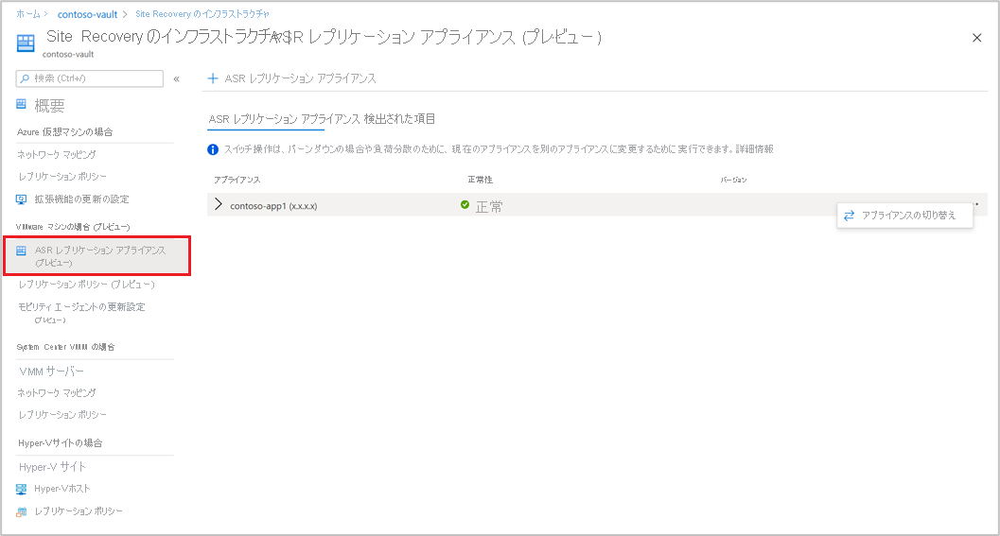
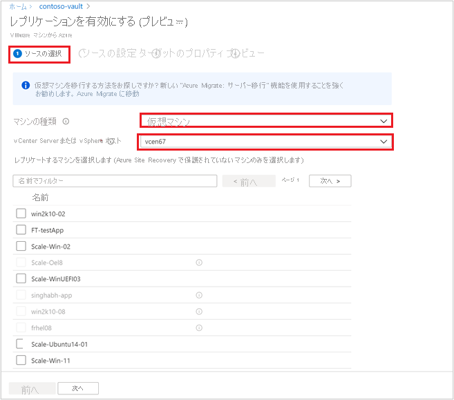
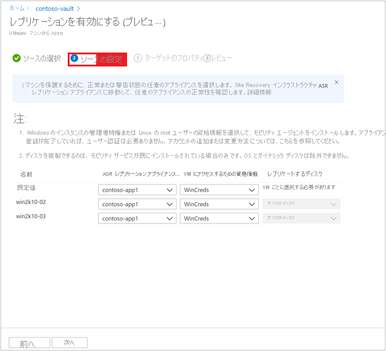
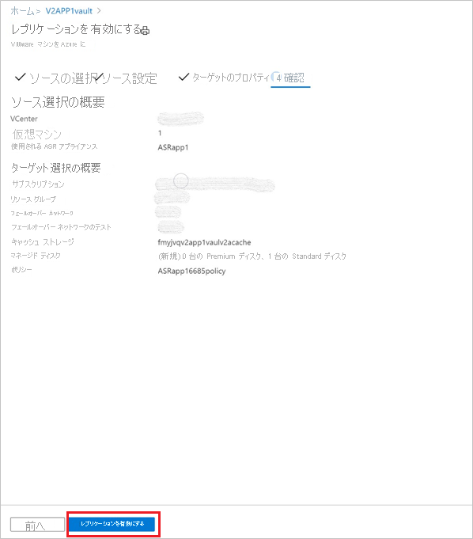

# Azure へのオンプレミス VMware VM のディザスター リカバリーを設定する - プレビュー

この記事では、[Azure Site Recovery](site-recovery-overview.md) サービス (プレビュー) を使用して、Azure へのディザスター リカバリーのためにオンプレミス VMware VM のレプリケーションを有効にする方法について説明します。

Azure Site Recovery クラシック リリースでディザスター リカバリーを設定する方法の詳細については、[チュートリアル](vmware-azure-tutorial.md)を参照してください。

これは、オンプレミスの VMware VM を対象に Azure へのディザスター リカバリーを設定する方法について説明するシリーズの 3 番目のチュートリアルです。 前のチュートリアルでは、Azure へのディザスター リカバリー用に[オンプレミスの VMware 環境を準備](vmware-azure-tutorial-prepare-on-premises.md)しました。

このチュートリアルでは、以下の内容を学習します。

> [!div class="checklist"]
> * ソース レプリケーションの設定を行う。
> * レプリケーション ターゲット設定を設定する。
> * VMware VM のレプリケーションを有効にする。

> [!NOTE]
> チュートリアルでは、シナリオの最も簡単なデプロイ パスを示します。 可能であれば既定のオプションを使い、すべての可能な設定とパスを示してはいません。 詳細な手順については、Site Recovery の目次のハウツー セクションにある記事を参照してください。

## はじめに

VMware から Azure へのレプリケーションには、次の手順が含まれます。

- [Azure portal](https://portal.azure.com/) にサインインします。
- 開始するために、[Azure プレビュー ポータル](https://aka.ms/rcmcanary)に移動します。 次のセクションで説明する手順を実行します。
- Azure アカウントの準備
- インフラストラクチャの準備
- [Recovery Services コンテナーを作成する](./quickstart-create-vault-template.md?tabs=CLI)
- [Azure Site Recovery レプリケーション アプライアンスをデプロイする](deploy-vmware-azure-replication-appliance-preview.md)
- レプリケーションを有効にする

## Azure アカウントの準備

Azure Site Recovery レプリケーション アプライアンスを作成して登録するには、以下を備えた Azure アカウントが必要です。

- Azure サブスクリプションに対する共同作成者または所有者のアクセス許可。
- Azure Active Directory (AAD) アプリを登録するためのアクセス許可。
- エージェントレスの VMware 移行時に使用される Key Vault を作成するための、Azure サブスクリプションに対する所有者または共同作成者と、ユーザー アクセス管理者のアクセス許可。

無料の Azure アカウントを作成したばかりであれば、自分のサブスクリプションの所有者になっています。 サブスクリプションの所有者でない場合は、必要なアクセス許可について所有者と連携します。

次の手順を使用して、必要なアクセス許可を割り当てます。

1. Azure portal で「**サブスクリプション**」を検索し、 **[サービス]** の下の **[サブスクリプション]** 検索ボックスを選択して、必要な Azure サブスクリプションを検索します。

2. **[サブスクリプション] ページ** で、Recovery Services コンテナーを作成したサブスクリプションを選択します。

3. サブスクリプションで、 **[アクセス制御 (IAM)]** > **[アクセスの確認]** の順に選択します。 **[アクセスの確認]** で、適切なユーザー アカウントを検索します。

4. **[ロールの割り当てを追加する]** で、 **[追加]** を選択し、共同作成者または所有者のロールを選択してから、アカウントを選択します。 次に、 **[保存]** を選択します。

5. Azure Site Recovery レプリケーション アプライアンスを登録するには、お使いの Azure アカウントに AAD アプリを登録するためのアクセス許可が必要です。

**必要なアクセス許可を割り当てるには、次の手順に従います**。

1. Azure portal で、 **[Azure Active Directory]**  >  **[ユーザー]**  >  **[ユーザー設定]** に移動します。 **[ユーザー設定]** で、Azure AD ユーザーがアプリケーションを登録できることを確認します (既定で *[はい]* に設定されています)。

2. **[アプリの登録]** 設定が *[いいえ]* に設定されている場合は、テナントまたはグローバル管理者に、必要なアクセス許可を割り当てるよう依頼してください。 テナントまたはグローバル管理者は、AAD アプリの登録を許可するために、アプリケーション開発者ロールをアカウントに割り当てることもできます。

## インフラストラクチャの準備 - Azure Site Recovery レプリケーション アプライアンスの設定

モビリティ エージェントの通信を開くために、[オンプレミス環境で Azure Site Recovery レプリケーション アプライアンスを設定する](deploy-vmware-azure-replication-appliance-preview.md)必要があります。

## VMware VM のレプリケーションを有効にする

Azure Site Recovery レプリケーション アプライアンスをコンテナーに追加した後で、マシンの保護を開始できます。

ストレージとネットワーク全体の[前提条件](vmware-physical-azure-support-matrix.md)を満たしていることを確認してください。

レプリケーションを有効にするには、次の手順を実行します。

1. **[作業の開始]** セクションで、 **[Site Recovery]** を選択します。 [VMware] セクションで、 **[Enable Replication (Preview)]\(レプリケーションの有効化 (プレビュー)\)** をクリックします。

2. Azure Site Recovery で保護するマシンの種類を選択します。

   > [!NOTE]
   > プレビューでは、サポートは仮想マシンに限定されています。

   

3. 仮想マシンを選択した後、このコンテナーに登録されている Azure Site Recovery レプリケーション アプライアンスに追加された vCenter サーバーを選択します。

4. 後で、ソース VM 名を検索して、選択したマシンを保護します。 選択した VM を確認するには、 **[選択したリソース]** を選択します。

5. VM の一覧を選択した後、 **[次へ]** を選択してソースの設定に進みます。 ここでは、レプリケーション アプライアンスと VM の資格情報を選択します。 これらの資格情報は、構成サーバーが VM 上のモビリティ エージェントをプッシュして、Azure Site Recovery の有効化を完了するために使用されます。 正確な資格情報が選択されていることを確認してください。

   >[!NOTE]
   >Linux OS の場合は、ルート資格情報を指定してください。 Windows OS の場合は、管理特権を持つユーザー アカウントを追加する必要があります。 これらの資格情報は、レプリケーションを有効にする操作中に、Mobility Service をソース マシンにプッシュするために使用されます。

   

6. **[次へ]** を選択して、ターゲット リージョンのプロパティを指定します。 既定では、コンテナー サブスクリプションとコンテナー リソース グループが選択されています。 任意のサブスクリプションとリソース グループを選択できます。 ソース マシンは、今後フェールオーバーするときに、このサブスクリプションとリソース グループにデプロイされます。

   

7. 次に、フェールオーバー時に使用するため、既存の Azure ネットワークを選択するか、新しいターゲット ネットワークを作成できます。 **[新規作成]** を選択すると、仮想ネットワークの作成コンテキスト ブレードにリダイレクトされ、アドレス空間とサブネットの詳細を指定するように求められます。 このネットワークは、前の手順で選択したターゲット サブスクリプションとターゲット リソース グループに作成されます。

8. 次に、テスト フェールオーバー ネットワークの詳細を指定します。

   > [!NOTE]
   > テスト フェールオーバー ネットワークがフェールオーバー ネットワークと異なっていることを確認してください。 これは、実際の障害が発生した場合に、フェールオーバー ネットワークをすぐに使用できるようにするためです。

9. ストレージを選択します。

    - キャッシュ ストレージ アカウント: 次に、Azure Site Recovery がステージング目的で使用するキャッシュ ストレージ アカウントを選択します。ここでは、マネージド ディスクに変更を書き込む前に、ログのキャッシュと格納が行われます。

      既定では、コンテナー内の最初のレプリケーションの有効化操作のために、Azure Site Recovery が新しい LRS v1 タイプのストレージ アカウントを作成します。 次の操作では、同じキャッシュ ストレージ アカウントが再利用されます。
    -  マネージド ディスク

       既定では、Standard HDD マネージド ディスクが Azure で作成されます。 **[カスタマイズ]** を選択すると、マネージド ディスクの種類をカスタマイズできます。 ビジネス要件に基づいてディスクの種類を選択します。 ソース マシン ディスクの IOPS に基づいて、[適切なディスクの種類が選択されている](../virtual-machines/disks-types.md#disk-type-comparison)ことを確認します。 価格情報については、[こちら](https://azure.microsoft.com/pricing/details/managed-disks/)のマネージド ディスクの価格に関するドキュメントを参照してください。

       >[!NOTE]
       > レプリケーションを有効にする前に Mobility Service を手動でインストールしている場合は、ディスク レベルでマネージド ディスクの種類を変更できます。 それ以外の場合、既定では、マシン レベルで 1 つのマネージド ディスクの種類を選択できます

10. 必要に応じて、新しいレプリケーション ポリシーを作成します。

     既定のレプリケーション ポリシーは、72 時間の復旧ポイントの保持期間と、4 時間のアプリ整合性の頻度でコンテナーの下に作成されます。  RPO 要件に従って、新しいレプリケーション ポリシーを作成できます。

     - **[新規作成]** を選択します。

     - 名前を入力します。

     - **[回復ポイントの保持時間]** を入力します。

     - ビジネス要件に従って、 **[アプリ整合性スナップショットの頻度 (時間)]** を選択します。

     - **[OK]** を選択してポリシーを保存します。

     ポリシーが作成され、選択したソース マシンの保護に使用できるようになります。

11. レプリケーション ポリシーを選択した後、 **[次へ]** を選択します。 ソースとターゲットのプロパティを確認します。 **[レプリケーションを有効にする]** を選択して、操作を開始します。

    

    選択したマシンのレプリケーションを有効にするジョブが作成されます。 進行状況を追跡するには、Recovery Services コンテナーの Site Recovery ジョブに移動します。

## 次のステップ
レプリケーションを有効にした後は、訓練を実行して、すべてが予想どおりに動作することを確認します。
> [!div class="nextstepaction"]
> [ディザスター リカバリーのテストを実行する](site-recovery-test-failover-to-azure.md)