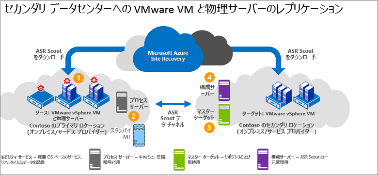

# VMware への VMware VM/物理サーバー レプリケーションのアーキテクチャ

この記事では、[Azure Site Recovery](site-recovery-overview.md) を使用して、オンプレミスの VMware 仮想マシン (VM) または Windows/Linux 物理サーバーをセカンダリ VMware サイトにレプリケート、フェールオーバー、および復旧するときに使われるアーキテクチャとプロセスについて説明します。

## アーキテクチャ コンポーネント

**領域** | **コンポーネント** | **詳細**
--- | --- | ---
**Azure** | InMage Scout を使用してこのシナリオをデプロイします。 | InMage Scout を入手するには、Azure サブスクリプションが必要です。   Recovery Services コンテナーを作成した後、InMage Scout をダウンロードし、最新の更新プログラムをインストールして、デプロイを設定します。
**プロセス サーバー** | プライマリ サイトにあります。 | キャッシュ、圧縮、データ最適化を処理するプロセス サーバーをデプロイします。   プロセス サーバーでは、保護するマシンへの統合エージェントのプッシュ インストールも処理します。
**構成サーバー** | セカンダリ サイトにあります。 | 構成サーバーは、管理 Web サイトまたは vContinuum コンソールを使用して、デプロイを管理、構成、監視します。
**vContinuum サーバー** | 省略可能。 構成サーバーと同じ場所にインストールされます。 | 保護対象の環境を管理および監視するためのコンソールを提供します。
**マスター ターゲット サーバー** | セカンダリ サイトにあります。 | マスター ターゲット サーバーは、レプリケートされたデータを保持します。 プロセス サーバーからデータを受信して、セカンダリ サイトにレプリカ マシンを作成し、データのリテンション期間ポイントを保持します。   必要のあるマスター ターゲット サーバーの数は、保護するマシンの数によって異なります。   プライマリ サイトにフェールバックする場合は、そこにもマスター ターゲット サーバーが必要です。 統合エージェントはこのサーバーにインストールされます。
**VMware ESX/ESXi と vCenter サーバー** |  VM は、ESX/ESXi ホストでホストされます。 ホストは vCenter サーバーで管理されます。 | VMware VM をレプリケートするには、VMware インフラストラクチャが必要です。
**VM/物理サーバー** |  VMware VM にインストールされた統合エージェントと、レプリケートする物理サーバー。 | エージェントはすべてのコンポーネント間の通信プロバイダーとして機能します。

### レプリケーション プロセス

1. 各サイトでコンポーネント サーバー (構成、プロセス、マスター ターゲット) をセットアップし、レプリケートするマシンに統合エージェントをインストールします。
2. 初期レプリケーションの後、各マシン上のエージェントによって、差分レプリケーションの変更がプロセス サーバーに送信されます。
3. プロセス サーバーは、このデータを最適化して、セカンダリ サイト上のマスター ターゲット サーバーに転送します。 構成サーバーでは、レプリケーション プロセスを管理します。

**図 6: VMware から VMware へのレプリケーション**

## 次の手順

セカンダリ サイトへの VMware VM と物理サーバーのディザスター リカバリーを[設定](vmware-physical-secondary-disaster-recovery.md)する。
