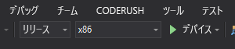

# クイック スタート:Azure Spatial Anchors を使用する Unity HoloLens アプリを作成する

このクイックスタートでは、[Azure Spatial Anchors](../overview.md) を使用する Unity HoloLens アプリを作成します。 Spatial Anchors は、クロスプラットフォーム対応の開発者向けサービスです。このサービスを使用すると、複数のデバイス間でその位置を長期にわたって保持するオブジェクトを使用して複合現実エクスペリエンスを作成できます。 完了すると、Unity でビルドされた、空間アンカーを保存して再呼び出しできる HoloLens アプリが作成されます。

学習内容は次のとおりです。

- Spatial Anchors アカウントを作成する。
- Unity のビルド設定を準備する。
- Spatial Anchors アカウント識別子とアカウント キーを構成する。
- HoloLens Visual Studio プロジェクトをエクスポートする。
- HoloLens デバイスにアプリをデプロイして実行する。

[!INCLUDE [quickstarts-free-trial-note](../../../includes/quickstarts-free-trial-note.md)]

## 前提条件

このクイック スタートを完了するには、以下が必要です。

- <a href="https://unity3d.com/get-unity/download" target="_blank">Unity 2018.3</a> 以降および <a href="https://www.visualstudio.com/downloads/" target="_blank">Visual Studio 2019</a> 以降がインストールされている Windows コンピューターが必要です。 Visual Studio インストールには、**ユニバーサル Windows プラットフォーム開発**ワークロードが含まれている必要があります。 <a href="https://git-scm.com/download/win" target="_blank">Git for Windows</a> をインストールします。
- [開発者モード](https://docs.microsoft.com/windows/mixed-reality/using-visual-studio)が有効になっている HoloLens デバイスが必要です。 [Windows 2018 年 10 月 10 日更新プログラム](https://docs.microsoft.com/windows/mixed-reality/release-notes-october-2018) (RS5 とも呼ばれます) をデバイスにインストールする必要があります。 HoloLens を最新のリリースに更新するには、 **[設定]** アプリを開き、 **[更新とセキュリティ]** を選択し、 **[更新プログラムの確認]** を選択します。
- アプリで **SpatialPerception** 機能を有効にする必要があります。 この設定は、 **[ビルド設定]**  >  **[プレーヤーの設定]**  >  **[発行の設定]**  >  **[機能]** にあります。
- アプリで **[Virtual Reality Supported]\(サポートされている仮想現実\)** を **Windows Mixed Reality SDK** と共に有効にする必要があります。 この設定は、 **[ビルド設定]**  >  **[プレーヤーの設定]**  >  **[XR Settings]\(XR 設定\)** にあります。

[!INCLUDE [Create Spatial Anchors resource](../../../includes/spatial-anchors-get-started-create-resource.md)]

## Unity のサンプル プロジェクトをダウンロードして開く

[!INCLUDE [Clone Sample Repo](../../../includes/spatial-anchors-clone-sample-repository.md)]

[!INCLUDE [Open Unity Project](../../../includes/spatial-anchors-open-unity-project.md)]

**[ファイル]**  >  **[ビルド設定]** を選択して、 **[ビルド設定]** を開きます。

**[プラットフォーム]** セクションで、 **[ユニバーサル Windows プラットフォーム]** を選択します。 **[Target Device]\(ターゲット デバイス\)** を **[HoloLens]** に変更します。

**[Switch Platform]\(プラットフォームの切り替え\)** を選択して、プラットフォームを **[ユニバーサル Windows プラットフォーム]** に変更します。 UWP をサポートするコンポーネントが不足している場合は、Unity によってそれらをインストールすることを要求される場合があります。

![Unity の [Build Settings]\(ビルド設定\) ウィンドウ](./media/get-started-unity-hololens/unity-build-settings.png)

**[ビルド設定]** ウィンドウを閉じます。

## アカウント識別子とキーを構成する

**[Project]\(プロジェクト\)** ウィンドウで `Assets/AzureSpatialAnchorsPlugin/Examples` に移動し、シーン ファイル `AzureSpatialAnchorsBasicDemo.unity` を開きます。

[!INCLUDE [Configure Unity Scene](../../../includes/spatial-anchors-unity-configure-scene.md)]

**[File]\(ファイル\)**  >  **[Save]\(保存\)** の順に選択してシーンを保存します。

## HoloLens Visual Studio プロジェクトをエクスポートする

[!INCLUDE [Export Unity Project](../../../includes/spatial-anchors-unity-export-project-snip.md)]

**[Build]\(ビルド\)** を選択します。 ダイアログ ボックスで、HoloLens Visual Studio プロジェクトのエクスポート先となるフォルダーを選択します。

エクスポートが完了すると、エクスポートされた HoloLens プロジェクトを含むフォルダーが表示されます。

## HoloLens アプリケーションをデプロイする

フォルダー内の **HelloAR U3D.sln** をダブルクリックして、Visual Studio でプロジェクトを開きます。

**[ソリューション構成]** を **[リリース]** に変更し、 **[ソリューション プラットフォーム]** を **[x86]** に変更し、デプロイ ターゲット オプションから **[デバイス]** を選択します。

HoloLens 2 を使用している場合は、 **[x86]** ではなく **[ARM]** を **[ソリューション プラットフォーム]** として使用します。

   

HoloLens デバイスの電源をオンにしてサインインし、USB ケーブルを使用してデバイスを PC に接続します。

**[デバッグ]**  >  **[デバッグの開始]** を選択して、アプリのデプロイとデバッグを開始します。

アプリの指示に従って、アンカーを配置し、呼び戻します。

Visual Studio で、 **[デバッグの停止]** を選択するか、Shift + F5 キーを押して、アプリを停止します。

[!INCLUDE [Clean-up section](../../../includes/clean-up-section-portal.md)]

[!INCLUDE [Next steps](../../../includes/spatial-anchors-quickstarts-nextsteps.md)]

> [!div class="nextstepaction"]
> [チュートリアル:デバイス間で空間アンカーを共有する](../tutorials/tutorial-share-anchors-across-devices.md)
