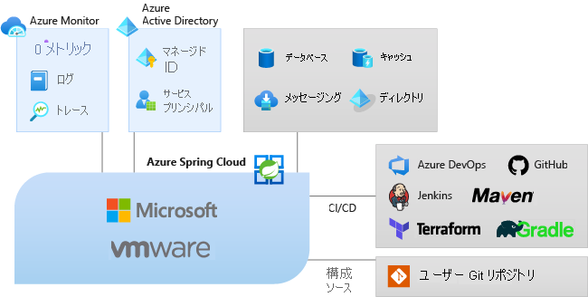

# Azure Spring Cloud とは

Azure Spring Cloud では、コードを変更せずに、Spring Boot マイクロサービス アプリケーションを Azure に簡単にデプロイできます。  Spring Cloud アプリケーションのインフラストラクチャはこのサービスによって管理されるので、開発者はコードに専念できます。  Azure Spring Cloud は、包括的な監視と診断、構成管理、サービス検出、CI/CD 統合、ブルー/グリーン デプロイなどを使用して、ライフサイクル管理を提供します。

次のビデオでは、Azure Spring Cloud を使用して Azure で実行される Spring Boot アプリケーションで構成されるアプリを示します。

 

> [!VIDEO https://www.youtube.com/embed/1jOXMFc1oRg]

## Azure Spring Cloud を使用する理由

Azure Spring Cloud へのアプリケーションのデプロイには多くの利点があります。 次のようにすることができます。

* 既存の Spring アプリを効率的に移行し、クラウドのスケーリングとコストを管理する。
* Spring Cloud のパターンを使用してアプリを最新化することで、俊敏性とデリバリーのスピードを向上させる。
* クラウド規模で Java を実行し、複雑なインフラストラクチャなしで使用率を高める。
* コンテナー化の依存関係なしで迅速に開発およびデプロイする。
* 運用ワークロードを効率的かつ簡単に監視する。

Azure Spring Cloud では、Java [Spring Boot](https://spring.io/projects/spring-boot) と ASP.NET Core [Steeltoe](https://steeltoe.io/) の両方のアプリがサポートされています。 Steeltoe に対するサポートは、現在、パブリック プレビューとして提供されています。 パブリック プレビューの提供では、公式リリースの前に新機能をお試しいただけます。

## サービスの概要

Azure エコシステムの一部として、Azure Spring Cloud は、ストレージ、データベース、監視などの他の Azure サービスに簡単にバインドできます。

* Azure Spring Cloud は、Spring Boot アプリ向けのフル マネージド サービスです。ユーザーはインフラストラクチャの管理に煩わされることなく、アプリの構築と実行に集中できます。

* Spring Boot アプリまたは Zip for your Steeltoe アプリに JAR またはコードをデプロイするだけで、Azure Spring Cloud によって、Spring サービス ランタイムと組み込みのアプリ ライフサイクルにアプリが自動的に接続されます。

* 監視は簡単です。 デプロイ後、アプリのパフォーマンスを監視し、エラーを修正して、アプリケーションを迅速に改善できます。

* Azure のエコシステムとサービスへの完全な統合。

* Azure Spring Cloud はエンタープライズ対応であり、フル マネージド インフラストラクチャ、組み込みのライフサイクル管理、容易な監視を提供します。

## ドキュメントの概要

このドキュメントには、Azure Spring Cloud サービスの使用を開始する方法とサービスを活用する方法を説明するセクションが含まれています。

* はじめに

    * [最初のアプリを起動する](./quickstart.md)
    * [Azure Spring Cloud サービスをプロビジョニングする](./quickstart-provision-service-instance.md)
    * [構成サーバーを設定する]()
    * [アプリをビルドして配置する](./quickstart-deploy-apps.md)
    * [ログ、メトリック、トレースを使用する](./quickstart-logs-metrics-tracing.md)

* 操作方法

    * [開発](how-to-prepare-app-deployment.md): Azure Spring Cloud にデプロイするために、既存の Java Spring アプリケーションを準備します。 適切に構成すると、Azure Spring Cloud によって、Java Spring Cloud アプリケーションの監視、スケーリング、更新を行う堅牢なサービスが提供されます。
    * [デプロイ](./how-to-staging-environment.md): Azure Spring Cloud でブルー/グリーン デプロイ パターンを使用して、ステージング環境のデプロイを設定します。 ブルー/グリーン デプロイとは、新しい (グリーン) バージョンのデプロイ中に、既存 (ブルー) のバージョンを実行状態のまま保持する、Azure DevOps の継続的デリバリーのパターンです。
    * [アプリの構成](./how-to-start-stop-delete.md): Azure Spring Cloud でアプリケーションを開始、停止、削除します。 Azure portal または Azure CLI を使用して、Azure Spring Cloud でアプリケーションの状態を変更します。
    * [スケール](./how-to-scale-manual.md):Azure portal で Azure Spring Cloud ダッシュボードを使用するか、自動スケーリング設定を使用して、マイクロサービス アプリケーションをスケーリングします。 パブリック IP は、データベース、ストレージ、キー コンテナーなど、外部リソースとの通信に使用できます。
    * [アプリの監視](./how-to-distributed-tracing.md): 分散トレース ツールにより、複雑な問題を簡単にデバッグおよび監視できます。 Azure Spring Cloud は、Spring Cloud Sleuth と Azure の Application Insights を統合します。 この統合により、Azure portal から強力な分散トレース機能を利用できます。
    * [アプリのセキュリティ保護](./how-to-enable-system-assigned-managed-identity.md): Azure リソースは、Azure Active Directory で自動的に管理される ID を提供します。 この ID を使用して、コードに資格情報が含まれていなくても、Azure AD の認証をサポートする任意のサービスに認証することができます。
    * [他の Azure サービスとの統合](./how-to-bind-cosmos.md): Spring Boot アプリケーションを手動で構成するのではなく、選択した Azure サービスをアプリケーションに自動的にバインドできます。たとえば、アプリケーションを Azure Cosmos DB データベースにバインドできます。
    * [自動化](./how-to-cicd.md): 継続的インテグレーションと継続的デリバリーのツールを使用すると、最小限の労力とリスクで、既存のアプリケーションにすばやく更新プログラムをデプロイできます。 Azure DevOps は、これらの主要なタスクの整理と制御に役立ちます。
    * [トラブルシューティング](./how-to-self-diagnose-solve.md): Azure Spring Cloud 診断は、アプリのトラブルシューティングに役立つ対話型エクスペリエンスを提供します。 構成は必要ありません。 問題が見つかった場合、Azure Spring Cloud 診断によって問題点が特定され、問題のトラブルシューティングと解決に役立つ情報が示されます。
    * [移行](/azure/developer/java/migration/migrate-spring-boot-to-azure-spring-cloud):既存の Spring Cloud アプリケーションまたは Spring Boot アプリケーションを移行して、Azure Spring Cloud で実行します。

作業を開始するには、次のトピックをご覧ください。

> [!div class="nextstepaction"]
> [Spring Cloud のクイックスタート](./quickstart.md)

サンプルは GitHub で入手できます ([Azure Spring Cloud のサンプル](https://github.com/Azure-Samples/Azure-Spring-Cloud-Samples/tree/master/))。
