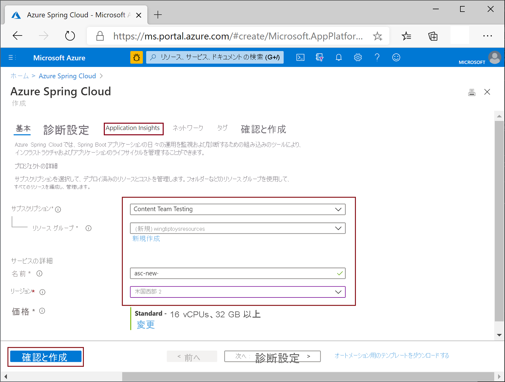

# <a name="quickstart-provision-azure-spring-cloud-service"></a>クイック スタート:Azure Spring Cloud サービスのプロビジョニング

::: zone pivot="programming-language-csharp"
このクイックスタートでは、Azure CLI を使用して、Azure Spring Cloud サービスのインスタンスをプロビジョニングします。

## <a name="prerequisites"></a>前提条件

* アクティブなサブスクリプションが含まれる Azure アカウント。 [無料でアカウントを作成できます](https://azure.microsoft.com/free/?WT.mc_id=A261C142F)。
* [.NET Core 3.1 SDK](https://dotnet.microsoft.com/download/dotnet-core/3.1)。 Azure Spring Cloud サービスでは、.NET Core の 3.1 以降のバージョンがサポートされています。
* [Azure CLI バージョン 2.0.67 以降](/cli/azure/install-azure-cli)。
* [Git](https://git-scm.com/).

## <a name="install-azure-cli-extension"></a>Azure CLI 拡張機能をインストールする

Azure CLI のバージョンが 2.0.67 以降であることを確認します。

```azurecli
az --version
```

次のコマンドを使用して、Azure CLI 用の Azure Spring Cloud 拡張機能をインストールします。

```azurecli
az extension add --name spring-cloud
```

## <a name="log-in-to-azure"></a>Azure にログインする

1. Azure CLI にログインします。

    ```azurecli
    az login
    ```

1. サブスクリプションが複数ある場合は、このクイックスタートで使用するものを選択します。

   ```azurecli
   az account list -o table
   ```

   ```azurecli
   az account set --subscription <Name or ID of a subscription from the last step>
   ```

## <a name="provision-an-instance-of-azure-spring-cloud"></a>Azure Spring Cloud のインスタンスをプロビジョニングする

1. Azure Spring Cloud サービスを格納する[リソース グループ](../azure-resource-manager/management/overview.md)を作成します。 リソース グループ名には、英数字、アンダースコア、かっこ、ハイフン、ピリオド (末尾を除く)、および Unicode 文字を使用できます。

   ```azurecli
   az group create --location eastus --name <resource group name>
   ```

1. Azure Spring Cloud サービスのインスタンスをプロビジョニングします。 サービス インスタンス名は一意である必要があり、長さは 4 文字から 32 文字で、小文字、数字、およびハイフンのみを使用できます。 サービス名の最初の文字は英字でなければならず、最後の文字は英字または数字でなければなりません。

    ```azurecli
    az spring-cloud create -n <service instance name> -g <resource group name>
    ```

    このコマンドは、完了までに数分かかる場合があります。

1. 既定のリソース グループ名とサービス インスタンス名を設定して、後続のコマンドでこれらの値を繰り返し指定しなくてよいようにします。

   ```azurecli
   az configure --defaults group=<resource group name>
   ```

   ```azurecli
   az configure --defaults spring-cloud=<service instance name>
   ```
::: zone-end

::: zone pivot="programming-language-java"
Azure Spring Cloud のインスタンス化は、Azure portal または Azure CLI を使用して行うことができます。  以下の手順では、両方の方法を説明します。
## <a name="prerequisites"></a>前提条件

* [JDK 8 をインストールする](/java/azure/jdk/)
* [Azure サブスクリプションにサインアップする](https://azure.microsoft.com/free/)
* (オプション) [Azure CLI バージョン 2.0.67 以降をインストール](/cli/azure/install-azure-cli)し、`az extension add --name spring-cloud` コマンドを使用して Azure Spring Cloud 拡張機能をインストールする
* (オプション) [Azure Toolkit for IntelliJ をインストール](https://plugins.jetbrains.com/plugin/8053-azure-toolkit-for-intellij/)し、[サインイン](/azure/developer/java/toolkit-for-intellij/create-hello-world-web-app#installation-and-sign-in)する

## <a name="provision-an-instance-of-azure-spring-cloud"></a>Azure Spring Cloud のインスタンスをプロビジョニングする

#### <a name="portal"></a>[ポータル](#tab/Azure-portal)

次の手順では、Azure portal を使用して、Azure Spring Cloud のインスタンスを作成します。

1. 新しいタブで、[Azure portal](https://ms.portal.azure.com/) を開きます。 

2. 上部の検索ボックスから **Azure Spring Cloud** を探します。

3. その結果から **[Azure Spring Cloud]** を選択します。

    

4. Azure Spring Cloud ページで **[+ 追加]** をクリックします。

    

5. Azure Spring Cloud の **[作成]** ページで、フォームに入力します。  次のガイドラインを考慮してください。
    - **サブスクリプション**:このリソースに対する課金用のサブスクリプションを選択します。
    - **[リソース グループ]** :新しいリソース用に新しいリソース グループを作成することをお勧めします。 これが後の手順で **\<resource group name\>** として使用されることに注意してください。
    - **[サービスの詳細/名前]** : **\<service instance name\>** を指定します。  名前の長さは 4 文字から 32 文字で、小文字、数字、およびハイフンのみを使用できます。  サービス名の最初の文字は英字でなければならず、最後の文字は英字または数字でなければなりません。
    - **[場所]** :自分のサービス インスタンスの場所を選択します。

    

6. **[確認と作成]** をクリックします。

> [!div class="nextstepaction"]
> [問題が発生しました](https://www.research.net/r/javae2e?tutorial=asc-cli-quickstart&step=public-endpoint)

#### <a name="cli"></a>[CLI](#tab/Azure-CLI)

次の手順では、Azure CLI 拡張機能を使用して、Azure Spring Cloud のインスタンスをプロビジョニングします。

1. Azure CLI にログインし、アクティブなサブスクリプションを選択します。

    ```azurecli
    az login
    az account list -o table
    az account set --subscription <Name or ID of subscription, skip if you only have 1 subscription>
    ```

1. Azure Spring Cloud サービスの名前を準備します。  名前の長さは 4 文字から 32 文字で、小文字、数字、およびハイフンのみを使用できます。  サービス名の最初の文字は英字でなければならず、最後の文字は英字または数字でなければなりません。

1. Azure Spring Cloud サービスが含まれるリソース グループを作成します。

    ```azurecli
    az group create --location eastus --name <resource group name>
    ```

    Azure リソース グループの詳細については[こちら](../azure-resource-manager/management/overview.md)をご覧ください。

1. Azure CLI ウィンドウを開き、次のコマンドを実行して、Azure Spring Cloud のインスタンスをプロビジョニングします。

    ```azurecli
    az spring-cloud create -n <service instance name> -g <resource group name>
    ```

    サービス インスタンスのデプロイには約 5 分かかります。
---
::: zone-end

## <a name="next-steps"></a>次のステップ

このクイックスタートでは、サブスクリプションに残っていると課金が継続される Azure リソースを作成しました。 次のクイックスタートに進まない場合は、[リソースのクリーンアップ](spring-cloud-quickstart-logs-metrics-tracing.md#clean-up-resources)に関する記事を参照してください。 それ以外の場合は、次のクイックスタートに進んでください。

> [!div class="nextstepaction"]
> [構成サーバーを設定する](spring-cloud-quickstart-setup-config-server.md)
