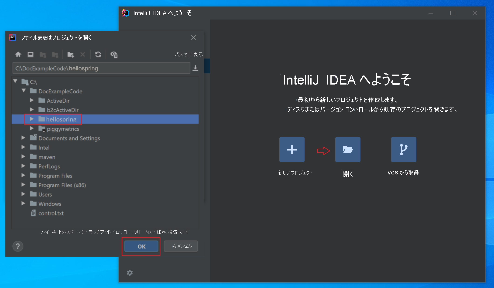
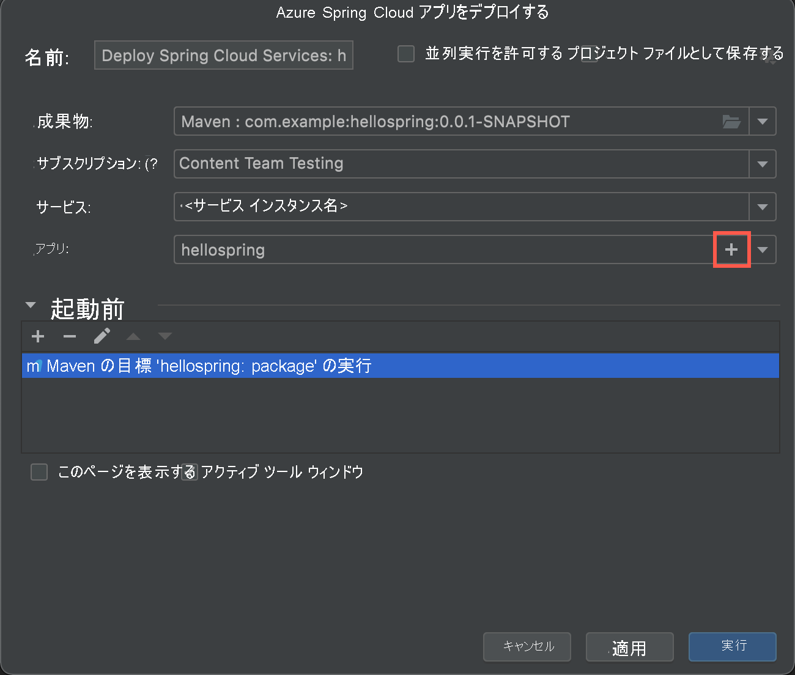
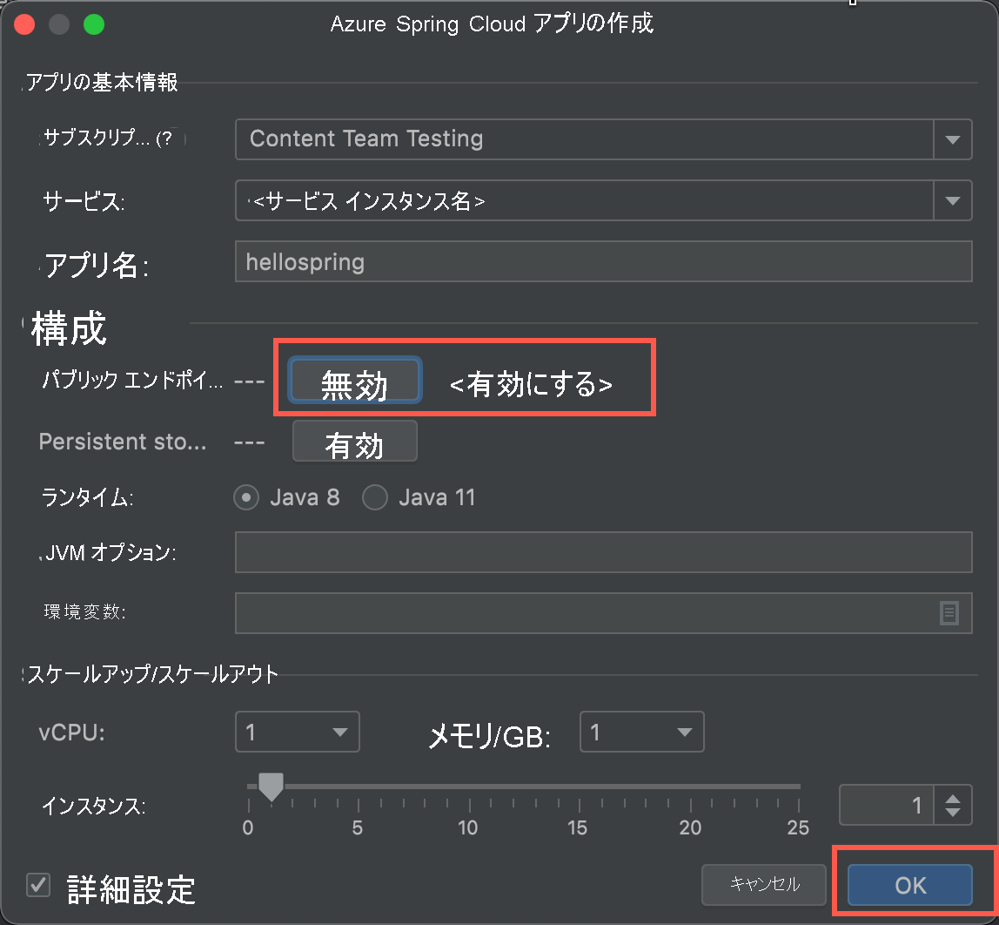
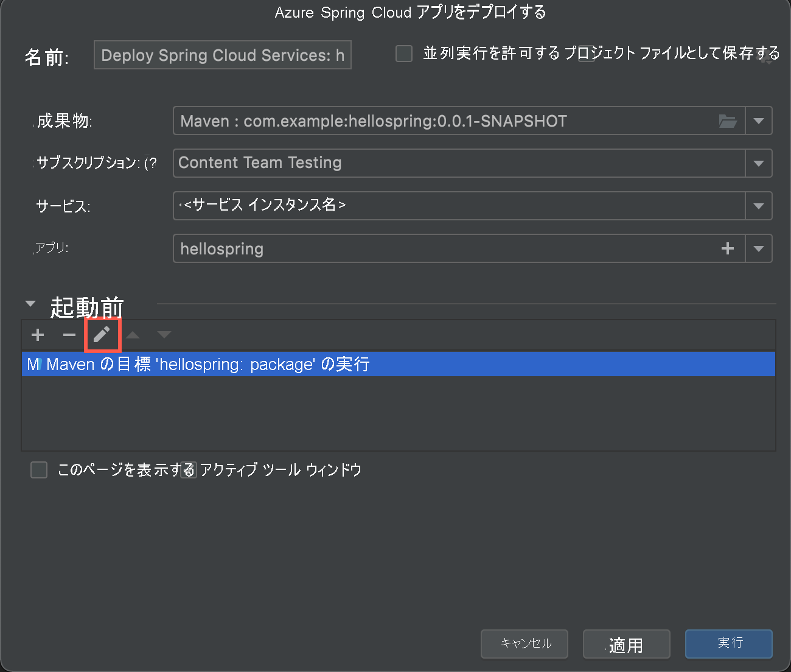

# <a name="quickstart-deploy-your-first-application-to-azure-spring-cloud"></a>クイックスタート: 初めてのアプリケーションを Azure Spring Cloud にデプロイする

::: zone pivot="programming-language-csharp"
このクイックスタートでは、Azure Spring Cloud で実行する小規模なアプリケーションをデプロイする方法について説明します。

>[!NOTE]
> Azure Spring Cloud の Steeltoe のサポートは、現時点ではパブリック プレビューとして提供されています。 パブリック プレビュー オファリングにより、お客様は公式リリースの前に新機能を試すことができます。  パブリック プレビューの機能とサービスは、運用環境での使用を目的としたものではありません。  プレビュー段階のサポートの詳細については、[FAQ](https://azure.microsoft.com/support/faq/) を参照するか、[サポート リクエスト](../azure-portal/supportability/how-to-create-azure-support-request.md)を提出してください。

このクイックスタートでは、次の方法について説明します。
> [!div class="checklist"]
> * 基本的な Steeltoe .NET Core プロジェクトを生成する
> * Azure Spring Cloud サービス インスタンスをプロビジョニングする
> * パブリック エンドポイントがあるアプリをビルドしてデプロイする
> * リアルタイムでログをストリームする

このクイックスタートで使用するアプリケーション コードは、.NET Core Web API プロジェクト テンプレートを使用して構築された単純なアプリです。 この例を完了すると、このアプリケーションにオンラインでアクセスし、Azure portal と Azure CLI で管理できるようになります。

## <a name="prerequisites"></a>前提条件

* アクティブなサブスクリプションが含まれる Azure アカウント。 [無料でアカウントを作成できます](https://azure.microsoft.com/free/?WT.mc_id=A261C142F)。
* [.NET Core 3.1 SDK](https://dotnet.microsoft.com/download/dotnet-core/3.1)。 Azure Spring Cloud サービスでは、.NET Core の 3.1 以降のバージョンがサポートされています。
* [Azure CLI バージョン 2.0.67 以降](/cli/azure/install-azure-cli)。
* [Git](https://git-scm.com/).

## <a name="install-azure-cli-extension"></a>Azure CLI 拡張機能をインストールする

Azure CLI のバージョンが 2.0.67 以降であることを確認します。

```azurecli
az --version
```

次のコマンドを使用して、Azure CLI 用の Azure Spring Cloud 拡張機能をインストールします。

```azurecli
az extension add --name spring-cloud
```

## <a name="sign-in-to-azure"></a>Azure へのサインイン

1. Azure CLI にサインインします。

    ```azurecli
    az login
    ```

1. サブスクリプションが複数ある場合は、このクイックスタートで使用するものを選択します。

   ```azurecli
   az account list -o table
   ```

   ```azurecli
   az account set --subscription <Name or ID of a subscription from the last step>
   ```

## <a name="generate-a-steeltoe-net-core-project"></a>Steeltoe .NET Core プロジェクトを生成する

Visual Studio で API プロジェクト テンプレートを使用して、"hello world" という名前の ASP.NET Core Web アプリケーションを作成します。 自動生成される WeatherForecastController を後でテスト エンドポイントとして使用することに注意してください。

1. プロジェクトのソース コード用のフォルダーを作成し、プロジェクトを生成します。

   ```console
   mkdir source-code
   ```

   ```console
   cd source-code
   ```

   ```dotnetcli
   dotnet new webapi -n hello-world --framework netcoreapp3.1
   ```

1. プロジェクト ディレクトリに移動します。

   ```console
   cd hello-world
   ```

1. *appSettings.json* ファイルを編集して、次の設定を追加します。

   ```json
   "spring": {
     "application": {
       "name": "hello-world"
     }
   },
   "eureka": {
     "client": {
       "shouldFetchRegistry": true,
       "shouldRegisterWithEureka": true
     }
   }
   ```

1. また、*appsettings.json* で、`Microsoft` カテゴリのログ レベルを `Warning` から `Information`に変更します。 この変更により、後の手順でストリーミング ログを表示するときにログが生成されるようになります。

   *appsettings.json* ファイルは、次の例のようになります。

   ```json
   {
     "Logging": {
       "LogLevel": {
         "Default": "Information",
         "Microsoft": "Information",
         "Microsoft.Hosting.Lifetime": "Information"
       }
     },
     "AllowedHosts": "*",
     "spring": {
       "application": {
         "name": "hello-world"
       }
     },
     "eureka": {
       "client": {
         "shouldFetchRegistry": true,
         "shouldRegisterWithEureka": true
       }
     }
   }
   ```

1. *.csproj* ファイルに依存関係と `Zip` タスクを追加します。

   ```xml
   <ItemGroup>
     <PackageReference Include="Steeltoe.Discovery.ClientCore" Version="3.1.0" />
     <PackageReference Include="Microsoft.Azure.SpringCloud.Client" Version="2.0.0-preview.1" />
   </ItemGroup>
   <Target Name="Publish-Zip" AfterTargets="Publish">
     <ZipDirectory SourceDirectory="$(PublishDir)" DestinationFile="$(MSBuildProjectDirectory)/deploy.zip" Overwrite="true" />
   </Target>
   ```

   パッケージは、Steeltoe サービスの検出と Azure Spring Cloud クライアント ライブラリ用です。 `Zip` タスクは、Azure へのデプロイ用です。 `dotnet publish` コマンドを実行すると、*publish* フォルダーにバイナリが生成されます。このタスクにより、*publish* フォルダーが *.zip* ファイルに圧縮されます。これを Azure にアップロードします。

1. *Program.cs* ファイルに、`using` ディレクティブと Azure Spring Cloud クライアント ライブラリを使用するコードを追加します。

   ```csharp
   using Microsoft.Azure.SpringCloud.Client;
   ```

   ```csharp
   public static IHostBuilder CreateHostBuilder(string[] args) =>
               Host.CreateDefaultBuilder(args)
                   .UseAzureSpringCloudService()
                   .ConfigureWebHostDefaults(webBuilder =>
                   {
                       webBuilder.UseStartup<Startup>();
                   });
   ```

1. *Startup.cs* ファイルの `ConfigureServices` メソッドの最後に、`using` ディレクティブと Steeltoe サービス検出を使用するコードを追加します。

   ```csharp
   using Steeltoe.Discovery.Client;
   ```

   ```csharp
   public void ConfigureServices(IServiceCollection services)
   {
       // Template code not shown.

       services.AddDiscoveryClient(Configuration);
   }
   ```

1. プロジェクトをビルドし、コンパイル エラーがないことを確認します。

   ```dotnetcli
   dotnet build
   ```

## <a name="provision-a-service-instance"></a>サービス インスタンスをプロビジョニングする

次の手順では、Azure portal を使用して、Azure Spring Cloud のインスタンスを作成します。

1. [Azure Portal](https://ms.portal.azure.com/)を開きます。

1. 上部の検索ボックスから *Azure Spring Cloud* を探します。

1. その結果から *[Azure Spring Cloud]* を選択します。

   

1. [Azure Spring Cloud] ページで **[作成]** を選択します。

   

1. Azure Spring Cloud の **[作成]** ページで、フォームに入力します。  次のガイドラインを考慮してください。

   * **サブスクリプション**:このリソースに対する課金用のサブスクリプションを選択します。
   * **[リソース グループ]** :新しいリソース グループを作成します。 ここで入力する名前は、後の手順で **\<resource group name\>** として使用されます。
   * **[サービスの詳細/名前]** : **\<service instance name\>** を指定します。  名前の長さは 4 文字から 32 文字で、小文字、数字、およびハイフンのみを使用できます。  サービス名の最初の文字は英字でなければならず、最後の文字は英字または数字でなければなりません。
   * **[リージョン]** :自分のサービス インスタンスのリージョンを選択します。

   

1. **[確認と作成]** を選択します。

1. **［作成］** を選択します

## <a name="build-and-deploy-the-app"></a>アプリを構築してデプロイする

次の手順では、前に作成したプロジェクトをビルドして配置します。

1. コマンド プロンプトがプロジェクト フォルダー内にあることを確認してください。

1. 次のコマンドを実行してプロジェクトをビルドし、バイナリを発行して、バイナリをプロジェクトフォルダー内の *.zip* ファイルに格納します。

   ```dotnetcorecli
   dotnet publish -c release -o ./publish
   ```

1. パブリック エンドポイントが割り当てられた Azure Spring Cloud インスタンスでアプリを作成します。 *appsettings.json* で指定したものと同じアプリケーション名 "hello world" を使用します。

   ```console
   az spring-cloud app create -n hello-world -s <service instance name> -g <resource group name> --assign-endpoint --runtime-version NetCore_31
   ```

1. *.zip* ファイルをアプリにデプロイします。

   ```azurecli
   az spring-cloud app deploy -n hello-world -s <service instance name> -g <resource group name> --runtime-version NetCore_31 --main-entry hello-world.dll --artifact-path ./deploy.zip
   ```

   `--main-entry` オプションにより、アプリケーションのエントリ ポイントを含む *.dll* ファイルを識別します。 サービスは、 *.zip* ファイルをアップロードした後、すべてのファイルとフォルダーを抽出し、`--main-entry` で指定された *.dll* ファイル内のエントリ ポイントを実行しようとします。

   アプリケーションのデプロイが完了するまでに数分かかります。 デプロイが完了したことを確認するには、Azure portal で **[アプリ]** セクションに移動します。

## <a name="test-the-app"></a>アプリのテスト

デプロイが完了したら、次の URL でアプリにアクセスできるようになります。

```url
https://<service instance name>-hello-world.azuremicroservices.io/weatherforecast
```

次の例のような JSON データが返されます。

```json
[{"date":"2020-09-08T21:01:50.0198835+00:00","temperatureC":14,"temperatureF":57,"summary":"Bracing"},{"date":"2020-09-09T21:01:50.0200697+00:00","temperatureC":-14,"temperatureF":7,"summary":"Bracing"},{"date":"2020-09-10T21:01:50.0200715+00:00","temperatureC":27,"temperatureF":80,"summary":"Freezing"},{"date":"2020-09-11T21:01:50.0200717+00:00","temperatureC":18,"temperatureF":64,"summary":"Chilly"},{"date":"2020-09-12T21:01:50.0200719+00:00","temperatureC":16,"temperatureF":60,"summary":"Chilly"}]
```

## <a name="stream-logs-in-real-time"></a>リアルタイムでログをストリームする

次のコマンドを使用して、アプリからリアルタイム ログを取得します。

```azurecli
az spring-cloud app logs -n hello-world -s <service instance name> -g <resource group name> --lines 100 -f
```

出力にログが表示されます。

```output
[Azure Spring Cloud] The following environment variables are loaded:
2020-09-08 20:58:42,432 INFO supervisord started with pid 1
2020-09-08 20:58:43,435 INFO spawned: 'event-gather_00' with pid 9
2020-09-08 20:58:43,436 INFO spawned: 'dotnet-app_00' with pid 10
2020-09-08 20:58:43 [Warning] No managed processes are running. Wait for 30 seconds...
2020-09-08 20:58:44,843 INFO success: event-gather_00 entered RUNNING state, process has stayed up for > than 1 seconds (startsecs)
2020-09-08 20:58:44,843 INFO success: dotnet-app_00 entered RUNNING state, process has stayed up for > than 1 seconds (startsecs)
←[40m←[32minfo←[39m←[22m←[49m: Steeltoe.Discovery.Eureka.DiscoveryClient[0]
      Starting HeartBeat
info: Microsoft.Hosting.Lifetime[0]
      Now listening on: http://[::]:1025
info: Microsoft.Hosting.Lifetime[0]
      Application started. Press Ctrl+C to shut down.
info: Microsoft.Hosting.Lifetime[0]
      Hosting environment: Production
info: Microsoft.Hosting.Lifetime[0]
      Content root path: /netcorepublish/6e4db42a-b160-4b83-a771-c91adec18c60
2020-09-08 21:00:13 [Information] [10] Start listening...
info: Microsoft.AspNetCore.Hosting.Diagnostics[1]
      Request starting HTTP/1.1 GET http://asc-svc-hello-world.azuremicroservices.io/weatherforecast
info: Microsoft.AspNetCore.Routing.EndpointMiddleware[0]
      Executing endpoint 'hello_world.Controllers.WeatherForecastController.Get (hello-world)'
info: Microsoft.AspNetCore.Mvc.Infrastructure.ControllerActionInvoker[3]
      Route matched with {action = "Get", controller = "WeatherForecast"}. Executing controller action with signature System.Collections.Generic.IEnumerable`1[hello_world.WeatherForecast] Get() on controller hello_world.Controllers.WeatherForecastController (hello-world).
info: Microsoft.AspNetCore.Mvc.Infrastructure.ObjectResultExecutor[1]
      Executing ObjectResult, writing value of type 'hello_world.WeatherForecast[]'.
info: Microsoft.AspNetCore.Mvc.Infrastructure.ControllerActionInvoker[2]
      Executed action hello_world.Controllers.WeatherForecastController.Get (hello-world) in 1.8902ms
info: Microsoft.AspNetCore.Routing.EndpointMiddleware[1]
      Executed endpoint 'hello_world.Controllers.WeatherForecastController.Get (hello-world)'
info: Microsoft.AspNetCore.Hosting.Diagnostics[2]
      Request finished in 4.2591ms 200 application/json; charset=utf-8
```

> [!TIP]
> さらに多くのパラメーターとログ ストリーム機能を調べるには、`az spring-cloud app logs -h` を使用します。

高度なログ分析機能については、[Azure portal](https://portal.azure.com/) のメニューで **[ログ]** タブにアクセスしてください。 ここで、ログの待ち時間は数分です。
[  ](media/spring-cloud-quickstart-java/logs-analytics.png#lightbox)
::: zone-end

::: zone pivot="programming-language-java"

このクイックスタートでは、Azure Spring Cloud に小規模なアプリケーションをデプロイする方法について説明します。

このチュートリアルで使用されるアプリケーション コードは、Spring Initializr を使用してビルドされる単純なアプリです。 この例を完了すると、アプリケーションにオンラインでアクセスし、Azure portal で管理できるようになります。

このクイックスタートでは、以下の方法について説明します。

> [!div class="checklist"]
> * 基本的な Spring Cloud プロジェクトを生成する
> * サービス インスタンスをプロビジョニングする
> * パブリック エンドポイントがあるアプリをビルドしてデプロイする
> * リアルタイムでログをストリームする

## <a name="prerequisites"></a>前提条件

このクイック スタートを完了するには、以下が必要です。

* [JDK 8 または JDK 11 をインストールする](/java/azure/jdk/)
* [Azure サブスクリプションにサインアップする](https://azure.microsoft.com/free/)
* (省略可能) [Azure CLI バージョン 2.0.67 以降をインストール](/cli/azure/install-azure-cli)し、`az extension add --name spring-cloud` コマンドを使用して Azure Spring Cloud 拡張機能をインストールする
* (省略可能) [IntelliJ IDEA をインストールする](https://www.jetbrains.com/idea/)
* (オプション) [Azure Toolkit for IntelliJ をインストール](https://plugins.jetbrains.com/plugin/8053-azure-toolkit-for-intellij/)し、[サインイン](/azure/developer/java/toolkit-for-intellij/create-hello-world-web-app#installation-and-sign-in)する
* (省略可能) [Maven をインストールする](https://maven.apache.org/guides/getting-started/maven-in-five-minutes.html) Azure Cloud Shell を使用する場合、このインストールは不要です。

## <a name="generate-a-spring-cloud-project"></a>Spring Cloud プロジェクトを生成する

[Spring Initializr](https://start.spring.io/#!type=maven-project&language=java&platformVersion=2.5.5&packaging=jar&jvmVersion=1.8&groupId=com.example&artifactId=hellospring&name=hellospring&description=Demo%20project%20for%20Spring%20Boot&packageName=com.example.hellospring&dependencies=web,cloud-eureka,actuator,cloud-config-client) を開始して、Azure Spring Cloud に対して推奨される依存関係があるサンプル プロジェクトを生成します。 このリンクでは、次の URL を使用して既定の設定が提供されます。 

```url
https://start.spring.io/#!type=maven-project&language=java&platformVersion=2.5.5&packaging=jar&jvmVersion=1.8&groupId=com.example&artifactId=hellospring&name=hellospring&description=Demo%20project%20for%20Spring%20Boot&packageName=com.example.hellospring&dependencies=web,cloud-eureka,actuator,cloud-config-client
```
次の図は、このサンプル プロジェクトに対して推奨される Initializr 設定を示しています。 

この例では、Java バージョン 8 を使用しています。  Java バージョン 11 を使用したい場合は、 **[Project Metadata]\(プロジェクトのメタデータ\)** にあるオプションを変更してください。


1. すべての依存関係が設定されたら、 **[生成]** を選択します。 
1. パッケージをダウンロードしてアンパックし、次の内容を含むファイル *src/main/java/com/example/hellospring/HelloController.java* を追加して、単純な Web アプリケーション用の Web コントローラーを作成します。

    ```java
    package com.example.hellospring;

    import org.springframework.web.bind.annotation.RestController;
    import org.springframework.web.bind.annotation.RequestMapping;

    @RestController
    public class HelloController {

        @RequestMapping("/")
        public String index() {
            return "Greetings from Azure Spring Cloud!";
        }

    }
    ```

## <a name="provision-an-instance-of-azure-spring-cloud"></a>Azure Spring Cloud のインスタンスをプロビジョニングする

次の手順では、Azure portal を使用して、Azure Spring Cloud のインスタンスを作成します。

1. 新しいタブで、[Azure portal](https://ms.portal.azure.com/) を開きます。

2. 上部の検索ボックスから **Azure Spring Cloud** を探します。

3. その結果から **[Azure Spring Cloud]** を選択します。

    

4. [Azure Spring Cloud] ページで **[作成]** を選択します。

    

5. Azure Spring Cloud の **[作成]** ページで、フォームに入力します。  次のガイドラインを考慮してください。

    - **サブスクリプション**:このリソースに対する課金用のサブスクリプションを選択します。
    - **[リソース グループ]** :新しいリソース用に新しいリソース グループを作成することをお勧めします。 このリソース グループは、後の手順で **\<resource group name\>** として使用します。
    - **[サービスの詳細/名前]** : **\<service instance name\>** を指定します。  名前の長さは 4 文字から 32 文字で、小文字、数字、およびハイフンのみを使用できます。  サービス名の最初の文字は英字でなければならず、最後の文字は英字または数字でなければなりません。
    - **[場所]** :自分のサービス インスタンスのリージョンを選択します。

    

6. **[確認と作成]** を選択します。

## <a name="build-and-deploy-the-app"></a>アプリを構築してデプロイする

#### <a name="cli"></a>[CLI](#tab/Azure-CLI)
以下の手順では、Azure CLI を使用してアプリケーションをビルドし、デプロイします。 プロジェクトのルートで、次のコマンドを実行します。

1. Azure にサインインしてサブスクリプションを選択します。

    ```azurecli
    az login
    ```

   複数のサブスクリプションがある場合は、次のコマンドを使用して、アクセスできるサブスクリプションを一覧表示し、このクイックスタートに使用するサブスクリプションを選択します。

   ```azurecli
   az account list -o table
   ```

   次のコマンドを使用して、このクイックスタートの Azure CLI で使用する既定のサブスクリプションを設定します。

   ```azurecli
   az account set --subscription <Name or ID of a subscription from the last step>
   ```

1. Maven を使用してプロジェクトをビルドします。

    ```console
    mvn clean package -DskipTests
    ```

1. パブリック エンドポイントが割り当てられるアプリを作成します。 Spring Cloud プロジェクトの生成時に Java バージョン 11 を選択した場合、`--runtime-version=Java_11` スイッチを含めます。

    ```azurecli
    az spring-cloud app create -n hellospring -s <service instance name> -g <resource group name> --assign-endpoint true
    ```

1. アプリの Jar ファイルをデプロイします (Windows では `target\hellospring-0.0.1-SNAPSHOT.jar`)。

    ```azurecli
    az spring-cloud app deploy -n hellospring -s <service instance name> -g <resource group name> --artifact-path <jar file path>/hellospring-0.0.1-SNAPSHOT.jar
    ```

1. アプリケーションのデプロイが完了するまでに数分かかります。 デプロイが完了したことを確認するには、Azure portal で **[アプリ]** セクションに移動します。 アプリケーションの状態が表示されるはずです。

#### <a name="intellij"></a>[IntelliJ](#tab/IntelliJ)

次の手順では、Azure Spring Cloud 用の IntelliJ プラグインを使用して、IntelliJ IDEA にサンプル アプリをデプロイします。

### <a name="import-project"></a>プロジェクトのインポート

1. IntelliJ の **[Welcome]\(ようこそ\)** ダイアログを開き、 **[Open]\(開く\)** を選択してインポート ウィザードを開きます。
1. **hellospring** フォルダーを選択します。

    

### <a name="deploy-the-app"></a>アプリケーションのデプロイ

Azure にデプロイするには、Azure アカウントでサインインし、自分のサブスクリプションを選択する必要があります。  サインインの詳細については、「[インストールとサインイン](/azure/developer/java/toolkit-for-intellij/create-hello-world-web-app#installation-and-sign-in)」を参照してください。

1. IntelliJ のプロジェクト エクスプローラーで対象のプロジェクトを右クリックし、 **[Azure]**  ->  **[Deploy to Azure Spring Cloud]\(Azure Spring Cloud にデプロイ\)** を選択します。

    [  ](media/spring-cloud-quickstart-java/intellij-deploy-azure-1.png#lightbox)

1. **[Name]\(名前\)** フィールドのアプリの名前はそのまま使用します。 **[Name]\(名前\)** は、アプリ名ではなく構成を参照します。 通常、ユーザーはこれを変更する必要はありません。
1. **[Artifact]\(成果物\)** テキスト ボックスで、 **[Maven:com.example:hellospring-0.0.1-SNAPSHOT]** を選択します。
1. **[Subscription]\(サブスクリプション\)** ボックスで、自分のサブスクリプションが正しいことを確認します。
1. **[Service]\(サービス\)** テキスト ボックスで、「[Azure Spring Cloud のインスタンスをプロビジョニングする](./quickstart-provision-service-instance.md)」で作成した Azure Spring Cloud のインスタンスを選択します。
1. **[App]\(アプリ\)** ボックスで、 **+** を選択して、新しいアプリを作成します。

    

1. **[App name:]\(アプリ名:\)** テキスト ボックスで、「*hellospring*」と入力して、 **[More settings]\(詳細設定\)** チェック ボックスをオンにします。
1. **[Public endpoint]\(パブリック エンドポイント\)** の横にある **[Enable]\(有効\)** ボタンを選択します。 ボタンが *[Disable]\(無効\) \<to be enabled\>* に変わります。
1. Java 11 を使用した場合は、 **[Runtime]\(ランタイム\)** で **[Java 11]** を選択します。
1. **[OK]** を選択します。

    

1. **[Before launch]\(起動前\)** で、 **[Run Maven Goal 'hellospring:package']\(Maven の目標 'hellospring:package' を実行\)** 行を選択し、鉛筆を選択してコマンド ラインを編集します。

    

1. **[Command line]\(コマンド ライン\)** テキスト ボックスの「*package*」の後に「 *-DskipTests*」と入力し、 **[OK]** を選択します。

    ![Azure へのデプロイ [OK]](media/spring-cloud-quickstart-java/intellij-maven-goal-command-line.png)

1. **[Deploy Azure Spring Cloud app]\(Azure Spring Cloud アプリのデプロイ\)** ダイアログの下部にある **[Run]\(実行\)** ボタンを選択して、デプロイを開始します。 このプラグインは、`hellospring` アプリに対して `mvn package -DskipTests` コマンドを実行し、`package` コマンドによって生成された jar をデプロイします。

---

デプロイが完了したら、`https://<service instance name>-hellospring.azuremicroservices.io/` でアプリにアクセスできるようになります。

[](media/spring-cloud-quickstart-java/access-app-browser.png#lightbox)

## <a name="streaming-logs-in-real-time"></a>リアルタイムでログをストリーミングする

#### <a name="cli"></a>[CLI](#tab/Azure-CLI)

次のコマンドを使用して、アプリからリアルタイム ログを取得します。

```azurecli
az spring-cloud app logs -n hellospring -s <service instance name> -g <resource group name> --lines 100 -f
```

結果のログが表示されます。

[  ](media/spring-cloud-quickstart-java/streaming-logs.png#lightbox)

>[!TIP]
> さらに多くのパラメーターとログ ストリーム機能を調べるには、`az spring-cloud app logs -h` を使用します。

#### <a name="intellij"></a>[IntelliJ](#tab/IntelliJ)

1. **Azure Explorer** を選択し、 **[Spring Cloud]** を選択します。
1. 実行中のアプリを右クリックします。
1. ドロップダウン リストから **[Streaming Logs]\(ストリーミング ログ\)** を選択します。
1. インスタンスを選択します。

    [](media/spring-cloud-quickstart-java/intellij-get-streaming-logs.png)

1. ストリーミング ログが出力ウィンドウに表示されます。

    [](media/spring-cloud-quickstart-java/intellij-streaming-logs-output.png)

---

高度なログ分析機能については、[Azure portal](https://portal.azure.com/) のメニューで **[ログ]** タブにアクセスしてください。 ここで、ログの待ち時間は数分です。

[](media/spring-cloud-quickstart-java/logs-analytics.png#lightbox)

::: zone-end

## <a name="clean-up-resources"></a>リソースをクリーンアップする

上記の手順で作成した Azure リソースは、サブスクリプションに残っている間は課金され続けます。 これらのリソースが今後は必要ないと予想される場合は、ポータルから、または Azure CLI で次のコマンドを実行して、このリソース グループを削除してください。

```azurecli
az group delete --name <your resource group name> --yes
```

## <a name="next-steps"></a>次の手順

このクイックスタートでは、次の方法について学習しました。

> [!div class="checklist"]
> * 基本的な Spring Cloud プロジェクトを生成する
> * サービス インスタンスをプロビジョニングする
> * パブリック エンドポイントがあるアプリをビルドしてデプロイする
> * リアルタイムでログをストリームする

Azure Spring のその他の機能を使用する方法について学習するには、Azure Spring Cloud にサンプル アプリケーションをデプロイするクイックスタート シリーズに進んでください。

> [!div class="nextstepaction"]
> [アプリをビルドして実行する](./quickstart-sample-app-introduction.md)

その他のサンプルを GitHub で入手できます ([Azure Spring Cloud のサンプル](https://github.com/Azure-Samples/Azure-Spring-Cloud-Samples))。
