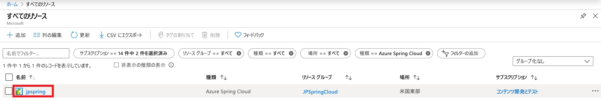
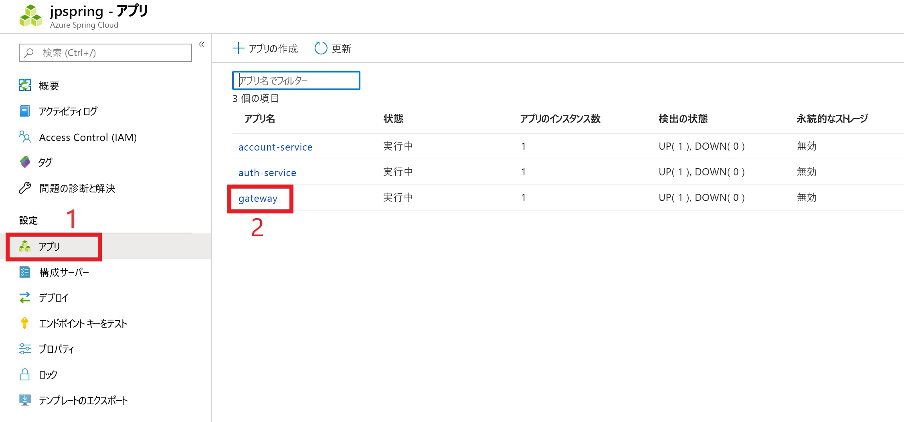
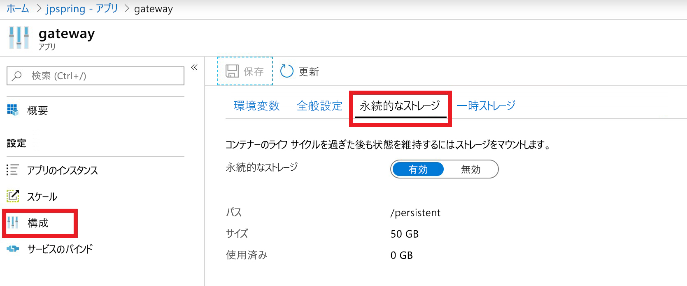

# <a name="use-persistent-storage-in-azure-spring-cloud"></a>Azure Spring Cloud で永続ストレージを使用する

Azure Spring Cloud には、アプリケーション用に永続的ストレージと一時ストレージの 2 種類のストレージが用意されています。

Azure Spring Cloud の既定では、各アプリケーション インスタンスに一時ストレージが提供されます。 一時ストレージはインスタンスごとに 5 GB に制限されており、既定のマウント パスは /tmp になります。

> [!WARNING]
> アプリケーション インスタンスを再起動すると、それに関連付けられている一時ストレージが完全に削除されます。

永続的ストレージは、Azure によって管理され、アプリケーションごとに割り当てられるファイル共有コンテナーです。 永続的ストレージに格納されているデータは、アプリケーションの全インスタンスによって共有されます。 Azure Spring Cloud インスタンスには、永続的ストレージを有効にしたアプリケーションを最大 10 個指定できます。 各アプリケーションには、50 GB の永続的ストレージが割り当てられます。 永続的ストレージの既定のマウント パスは /persistent です。

> [!WARNING]
> アプリケーションの永続的ストレージを無効にすると、すべてのストレージの割り当てが解除され、格納されているデータがすべて失われます。

## <a name="use-the-azure-portal-to-enable-persistent-storage"></a>Azure portal を使用して永続的ストレージを有効にする

1. Azure portal の**ホーム ページ**から、 **[すべてのリソース]** を選択します。

    >![[すべてのリソース] アイコンを見つける](media/portal-all-resources.jpg)

1. 永続的ストレージを必要とする Azure Spring Cloud リソースを選択します。 この例では、**upspring** という名前のアプリケーションが選択されています。

    > 

1. **[設定]** という見出しの下にある **[アプリ]** を選択します。

1. Azure Spring Cloud サービスが表に表示されます。  永続的ストレージを追加するサービスを選択します。 この例では、**ゲートウェイ** サービスが選択されています。

    > 

1. サービスの構成ページから、 **[構成]** を選択します

1. **[Persistent Storage] (永続的ストレージ)** タブを選択し、 **[有効にする]** を選択します。

    > 

永続的ストレージが有効になると、そのサイズとパスが構成ページに表示されます。

## <a name="use-the-azure-cli-to-modify-persistent-storage"></a>Azure CLI を使用して永続的ストレージを変更する

必要な場合は、Azure CLI 用の Spring Cloud 拡張機能をインストールします。

```azurecli
az extension add --name spring-cloud
```
その他の操作:

* 永続的ストレージが有効になった状態のアプリを作成するには:

    ```azurecli
    az spring-cloud app create -n <app> -g <resource-group> -s <service-name> --enable-persistent-storage true
    ```

* 既存のアプリで永続的ストレージを有効にするには:

    ```azurecli
    az spring-cloud app update -n <app> -g <resource-group> -s <service-name> --enable-persistent-storage true
    ```

* 既存のアプリで永続的ストレージを無効にするには:

    ```azurecli
    az spring-cloud app update -n <app> -g <resource-group> -s <service-name> --enable-persistent-storage false
    ```

    > [!WARNING]
    > アプリケーションの永続的ストレージを無効にすると、すべてのストレージの割り当てが解除され、格納されているデータがすべて完全に失われます。

## <a name="next-steps"></a>次のステップ

* アプリケーションとサービスのクォータについては、[こちら](spring-cloud-quotas.md)をご覧ください。
* [アプリケーションを手動でスケーリングする](spring-cloud-tutorial-scale-manual.md)方法について学習してください。
