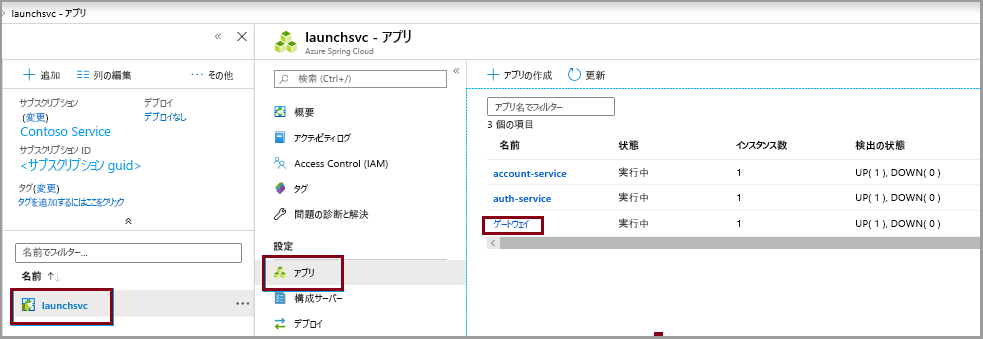
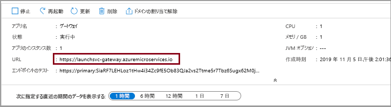

# <a name="quickstart-launch-a-java-spring-application-using-the-azure-cli"></a>クイック スタート:Azure CLI を使用して Java Spring アプリケーションを起動する

Azure Spring Cloud では、Spring Boot ベースのマイクロサービス アプリケーションを Azure で簡単に実行できます。

このクイックスタートでは、既存の Java Spring Cloud アプリケーションを Azure にデプロイする方法について説明します。 完了後は、引き続き Azure CLI を使用してアプリケーションを管理するか、Azure portal の使用に切り替えることができます。

このクイックスタートでは、次の方法について説明します。

> [!div class="checklist"]
> * サービス インスタンスをプロビジョニングする
> * インスタンスに構成サーバーを設定する
> * マイクロサービス アプリケーションをローカルにビルドする
> * 各マイクロサービスをデプロイする
> * アプリケーションのパブリック エンドポイントを割り当てる

## <a name="prerequisites"></a>前提条件

>[!Note]
> Azure Spring Cloud は現時点ではパブリック プレビューとして提供されています。 パブリック プレビュー オファリングにより、お客様は公式リリースの前に新機能を試すことができます。  パブリック プレビューの機能とサービスは、運用環境での使用を目的としたものではありません。  プレビュー期間中のサポートの詳細については、[FAQ](https://azure.microsoft.com/support/faq/) のページを参照するか、詳細について[サポート リクエスト](https://docs.microsoft.com/azure/azure-portal/supportability/how-to-create-azure-support-request)を提出してください。

>[!TIP]
> Azure Cloud Shell は無料のインタラクティブ シェルです。この記事の手順は、Azure Cloud Shell を使って実行することができます。  最新バージョンの Git、JDK、Maven、Azure CLI など、一般的な Azure ツールがプレインストールされています。 Azure サブスクリプションにログインしている場合は、shell.azure.com から [Azure Cloud Shell](https://shell.azure.com) を起動します。  Azure Cloud Shell の詳細については、[ドキュメントを参照](../cloud-shell/overview.md)してください

このクイック スタートを完了するには、以下が必要です。

1. [Git をインストールする](https://git-scm.com/)
2. [JDK 8 をインストールする](https://docs.microsoft.com/java/azure/jdk/?view=azure-java-stable)
3. [Maven 3.0 以上をインストールする](https://maven.apache.org/download.cgi)
4. [Azure CLI バージョン 2.0.67 以上をインストールする](https://docs.microsoft.com/cli/azure/install-azure-cli?view=azure-cli-latest)
5. [Azure サブスクリプションにサインアップする](https://azure.microsoft.com/free/)

## <a name="install-the-azure-cli-extension"></a>Azure CLI 拡張機能をインストールする

次のコマンドを使用して、Azure CLI 用の Azure Spring Cloud 拡張機能をインストールします

```azurecli
az extension add --name spring-cloud
```

## <a name="provision-a-service-instance-on-the-azure-cli"></a>Azure CLI でサービス インスタンスをプロビジョニングする

1. Azure CLI にログインし、アクティブなサブスクリプションを選択します。 Azure Spring Cloud のホワイトリストに登録されているアクティブなサブスクリプションを選択してください

    ```azurecli
        az login
        az account list -o table
        az account set --subscription <Name or ID of subscription from the last step>
    ```

2. Azure Spring Cloud サービスの名前を準備します。  名前の長さは 4 文字から 32 文字で、小文字、数字、およびハイフンのみを使用できます。  サービス名の最初の文字は英字でなければならず、最後の文字は英字または数字でなければなりません。

3. Azure Spring Cloud サービスが含まれるリソース グループを作成します。

    ```azurecli
        az group create --location eastus --name <resource group name>
    ```
    Azure リソース グループの詳細については[こちら](../azure-resource-manager/management/overview.md)をご覧ください。

4. Azure CLI ウィンドウを開き、次のコマンドを実行して、Azure Spring Cloud のインスタンスをプロビジョニングします。

    ```azurecli
        az spring-cloud create -n <service name> -g <resource group name>
    ```

    サービス インスタンスのデプロイには約 5 分かかります。

5. 次のコマンドを使用して、既定のリソース グループ名とクラスター名を設定します。

    ```azurecli
        az configure --defaults group=<service group name>
        az configure --defaults spring-cloud=<service instance name>
    ```

> [!div class="nextstepaction"]
> [問題が発生しました](https://www.research.net/r/javae2e?tutorial=asc-cli-quickstart&step=provision)

## <a name="setup-your-configuration-server"></a>構成サーバーを設定する

次のように、プロジェクトの git リポジトリの場所で、構成サーバーを更新します。

```git
az spring-cloud config-server git set -n <your-service-name> --uri https://github.com/Azure-Samples/piggymetrics-config
```

> [!div class="nextstepaction"]
> [問題が発生しました](https://www.research.net/r/javae2e?tutorial=asc-cli-quickstart&step=config-server)

## <a name="build-the-microservices-applications-locally"></a>マイクロサービス アプリケーションをローカルにビルドする

1. 新しいフォルダーを作成し、Azure Cloud アカウントにサンプル アプリ リポジトリを複製します。  

    ```azurecli
        mkdir source-code
        git clone https://github.com/Azure-Samples/piggymetrics
    ```

2. ディレクトリを変更し、プロジェクトをビルドします。

    ```azurecli
        cd piggymetrics
        mvn clean package -D skipTests
    ```

プロジェクトのコンパイルには、約 5 分かかります。  完了すると、各サービスのそれぞれのフォルダーに、個別の JAR ファイルができているはずです。

## <a name="create-the-microservices"></a>マイクロサービスを作成する

前の手順でビルドした JAR ファイルを使用して、Spring Cloud マイクロサービスを作成します。 3 つのマイクロサービス (**gateway**、**auth-service**、および **account-service**) を作成します。

```azurecli
az spring-cloud app create --name gateway
az spring-cloud app create --name auth-service
az spring-cloud app create --name account-service
```

## <a name="deploy-applications-and-set-environment-variables"></a>アプリケーションをデプロイし、環境変数を設定する

アプリケーションを Azure に実際にデプロイする必要があります。 以下のコマンドを実行して、3 つのすべてのアプリケーションをデプロイします。

```azurecli
az spring-cloud app deploy -n gateway --jar-path ./gateway/target/gateway.jar
az spring-cloud app deploy -n account-service --jar-path ./account-service/target/account-service.jar
az spring-cloud app deploy -n auth-service --jar-path ./auth-service/target/auth-service.jar
```

> [!div class="nextstepaction"]
> [問題が発生しました](https://www.research.net/r/javae2e?tutorial=asc-cli-quickstart&step=deploy)

## <a name="assign-public-endpoint-to-gateway"></a>ゲートウェイにパブリック エンドポイントを割り当てる

Web ブラウザーを介してアプリケーションにアクセスする手段が必要です。 ゲートウェイ アプリケーションには、パブリックに公開されているエンドポイントが必要です。それは、次のコマンドを使用して割り当てることができます。

```azurecli
az spring-cloud app update -n gateway --is-public true
```

最後に、アプリケーションが実行されていることを確認できるように、**gateway** アプリケーションに対してパブリック IP を求めるクエリを実行します。

```azurecli
az spring-cloud app show --name gateway | grep url
```

前のコマンドによって提供された URL に移動し、PiggyMetrics アプリケーションを実行します。
    

また、Azure portal に移動して URL を検索することもできます。 
1. サービスに移動します
1. **[アプリ]** を選択します
1. **[gateway]** を選択します

    
1. **gateway の概要** ページで、URL を見つけます

> [!div class="nextstepaction"]
> [問題が発生しました](https://www.research.net/r/javae2e?tutorial=asc-cli-quickstart&step=public-endpoint)

## <a name="next-steps"></a>次の手順

このクイックスタートでは、Azure CLI から Spring Cloud アプリケーションをデプロイしました。  Azure Spring Cloud の詳細を学習するには、デプロイ用のアプリの準備に関するチュートリアルに進みます。

> [!div class="nextstepaction"]
> [Azure Spring Cloud アプリケーションをデプロイ用に準備する](spring-cloud-tutorial-prepare-app-deployment.md)

その他のサンプルを GitHub で入手できます ([Azure Spring Cloud のサンプル](https://github.com/Azure-Samples/Azure-Spring-Cloud-Samples/tree/master/service-binding-cosmosdb-sql))。
