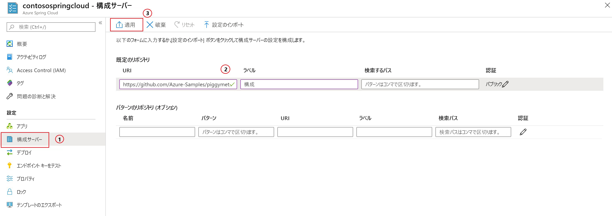

# <a name="quickstart-launch-an-azure-spring-cloud-app-using-the-maven-plug-in"></a>クイック スタート:Maven プラグインを使用して Azure Spring Cloud アプリを起動する

Azure Spring Cloud の Maven プラグインを使用すると、自分の Azure Spring Cloud アプリケーションを簡単に作成および更新できます。 構成を事前定義することにより、既存の Azure Spring Cloud サービスにアプリケーションをデプロイできます。 この記事では、PiggyMetrics というサンプル アプリケーションを使用して、この機能を紹介します。

このクイックスタートでは、次の方法について説明します。

> [!div class="checklist"]
> * サービス インスタンスをプロビジョニングする
> * インスタンスに構成サーバーを設定する
> * マイクロサービス アプリケーションをローカルにクローンおよびビルドする
> * 各マイクロサービスをデプロイする
> * アプリケーションのパブリック エンドポイントを割り当てる

>[!Note]
> Azure Spring Cloud は現時点ではパブリック プレビューとして提供されています。 パブリック プレビュー オファリングにより、お客様は公式リリースの前に新機能を試すことができます。  パブリック プレビューの機能とサービスは、運用環境での使用を目的としたものではありません。  プレビュー期間中のサポートの詳細については、[FAQ](https://azure.microsoft.com/support/faq/) のページを参照するか、詳細について[サポート リクエスト](https://docs.microsoft.com/azure/azure-portal/supportability/how-to-create-azure-support-request)を提出してください。


>[!TIP]
> Azure Cloud Shell は無料のインタラクティブ シェルです。この記事のコマンドは、Azure Cloud Shell を使って実行することができます。 最新バージョンの Git、Java Development Kit (JDK)、Maven、Azure CLI など、一般的な Azure ツールがプレインストールされています。 Azure サブスクリプションにサインインしている場合は、[Azure Cloud Shell](https://shell.azure.com) を起動します。 詳細については、[Azure Cloud Shell の概要](../cloud-shell/overview.md)に関するページを参照してください。

このクイック スタートを完了するには、以下が必要です。

1. [Git をインストールします](https://git-scm.com/)。
2. [JDK 8 をインストールします](https://docs.microsoft.com/java/azure/jdk/?view=azure-java-stable)。
3. [Maven 3.0 以上をインストールします](https://maven.apache.org/download.cgi)。
4. [無料の Azure サブスクリプションにサインアップします](https://azure.microsoft.com/free/)。

## <a name="provision-a-service-instance-on-the-azure-portal"></a>Azure portal でサービス インスタンスをプロビジョニングする

1. Web ブラウザーで、[Azure portal の Azure Spring Cloud へのこのリンク](https://ms.portal.azure.com/#create/Microsoft.AppPlatform)を開き、アカウントにサインインします。

1. サンプル アプリケーションの **[プロジェクトの詳細]** を次のように指定します。

    1. アプリケーションが関連付けられる **[サブスクリプション]** を選択します。
    1. アプリケーションのリソース グループを選択または作成します。 新しいリソース グループを作成することをお勧めします。  次の例は、`myspringservice` という名前の新しいリソース グループを示しています。
    1. 新しい Azure Spring Cloud サービスの名前を指定します。  名前の長さは 4 文字から 32 文字で、小文字、数字、およびハイフンのみを使用できます。 サービス名の最初の文字は英字でなければならず、最後の文字は英字または数字でなければなりません。  次の例のサービスには `contosospringcloud` という名前が付いています。
    1. 提供されているオプションから、アプリケーションの場所を選択します。  この例では、`East US` を選択します。
    1. **[確認と作成]** を選択して、新しいサービスの概要を確認します。  すべてが正しい場合は、 **[選択]** を選択します。

    > [!div class="mx-imgBorder"]
    > ![[確認と作成] を選択する](media/maven-qs-review-create.jpg)

サービスのデプロイには約 5 分かかります。 サービスがデプロイされると、サービス インスタンスの **[リソースに移動]** および **[概要]** ページが表示されます。

> [!div class="nextstepaction"]
> [問題が発生しました](https://www.research.net/r/javae2e?tutorial=asc-maven-quickstart&step=provision)

## <a name="set-up-your-configuration-server"></a>構成サーバーを設定する

1. サービスの **[概要]** ページで、 **[Config Server]\(構成サーバー\)** を選択します。
1. **[既定のリポジトリ]** セクションで **[URI]** を **https://github.com/Azure-Samples/piggymetrics** に設定し、 **[ラベル]** を **config** に設定して、 **[適用]** を選択し、変更を保存します。

    > [!div class="mx-imgBorder"]
    > 

> [!div class="nextstepaction"]
> [問題が発生しました](https://www.research.net/r/javae2e?tutorial=asc-maven-quickstart&step=config-server)

## <a name="clone-and-build-the-sample-application-repository"></a>サンプル アプリケーション リポジトリを複製してビルドする

1. [Azure Cloud Shell](https://shell.azure.com) を起動します。

1. 次のコマンドを実行して、Git リポジトリを複製します。

    ```azurecli
    git clone https://github.com/Azure-Samples/PiggyMetrics
    ```
  
1. 次のコマンドを実行して、ディレクトリを変更し、プロジェクトをビルドします。

    ```azurecli
    cd piggymetrics
    mvn clean package -DskipTests
    ```

## <a name="generate-configurations-and-deploy-to-the-azure-spring-cloud"></a>構成を生成し、Azure Spring Cloud にデプロイする

1. 親 POM を含む PiggyMetrics のルート フォルダー内で次のコマンドを実行して、構成を生成します。

    ```azurecli
    mvn com.microsoft.azure:azure-spring-cloud-maven-plugin:1.0.0:config
    ```

    a. `gateway`、`auth-service`、および `account-service` モジュールを選択します。

    b. 自分のサブスクリプションと Azure Spring Cloud サービス クラスターを選択します。

    c. 提示されるプロジェクトの一覧で、`gateway` に対応する番号を入力し、パブリック アクセス権を付与します。
    
    d. 構成を確認します。

1. POM にプラグインの依存関係と構成が含まれるようになりました。 次のコマンドを使用して、アプリをデプロイします。

   ```azurecli
   mvn azure-spring-cloud:deploy
   ```

1. デプロイが完了したら、前のコマンドからの出力内で提供された URL を使用して、PiggyMetrics にアクセスできます。

> [!div class="nextstepaction"]
> [問題が発生しました](https://www.research.net/r/javae2e?tutorial=asc-maven-quickstart&step=deploy)

## <a name="next-steps"></a>次のステップ

このクイックスタートでは、Maven リポジトリから Spring Cloud アプリケーションをデプロイしました。 Azure Spring Cloud の詳細を学習するには、デプロイ用のアプリの準備に関するチュートリアルに進みます。

> [!div class="nextstepaction"]
> [Azure Spring Cloud アプリケーションをデプロイ用に準備する](spring-cloud-tutorial-prepare-app-deployment.md)
> [Azure の Maven プラグインの詳細を確認する](https://github.com/microsoft/azure-maven-plugin)

その他のサンプルを GitHub で入手できます ([Azure Spring Cloud のサンプル](https://github.com/Azure-Samples/Azure-Spring-Cloud-Samples/tree/master/service-binding-cosmosdb-sql))。
