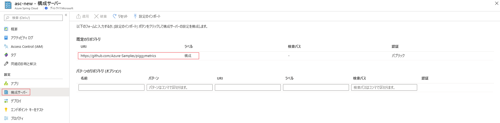

# <a name="tutorial-set-up-a-spring-cloud-config-server-for-your-service"></a>チュートリアル:自分のサービス向けに Spring Cloud Config Server を設定する

このチュートリアルでは、Spring Cloud Config Server を自分の Azure Spring Cloud サービスに接続する方法を示します。

Spring Cloud Config は、分散システムで外部化された構成用に、サーバー側とクライアント側のサポートを提供します。 Config Server を使用すると、すべての環境にわたってアプリケーションの外部プロパティを一元的に管理できます。 詳細については、[Spring Cloud Config Server のリファレンス](https://spring.io/projects/spring-cloud-config)を参照してください。

## <a name="prerequisites"></a>前提条件
* Azure サブスクリプション。 Azure サブスクリプションをお持ちでない場合は、開始する前に [無料アカウント](https://azure.microsoft.com/free/?WT.mc_id=A261C142F) を作成してください。 
* 既にプロビジョニングされ、実行されている Azure Spring Cloud サービス。  Azure Spring Cloud サービスをプロビジョニングし、起動するには、[このクイックスタート](spring-cloud-quickstart-launch-app-cli.md)を完了します。

## <a name="restriction"></a>Restriction

git バックエンドで __Config Server__ を使用する場合、いくつかの制限があります。 __Config Server__ と __Service Discovery__ にアクセスするため、一部のプロパティはお使いのアプリケーション環境に自動的に挿入されます。 これらのプロパティを **Config Server** ファイルからも構成すると、競合と予期しない動作が生じる場合があります。 プロパティには、次のようなものがあります。 

```yaml
eureka.client.service-url.defaultZone
eureka.client.tls.keystore
server.port
spring.cloud.config.tls.keystore
spring.application.name
```
> [!CAUTION]
> 上のプロパティをご自分の __Config Server __アプリケーション ファイルには設定__しない__ことを強くお勧めします。

## <a name="create-your-config-server-files"></a>Config Server ファイルを作成する

Azure Spring Cloud では、Config Server ファイルを格納するために、Azure DevOps、GitHub、GitLab、および Bitbucket がサポートされています。 自分のリポジトリの準備ができたら、以下の手順で構成ファイルを作成し、そこに格納します。

また、構成可能なプロパティの一部は、一部の型でのみ使用できます。 以降のサブセクションでは、リポジトリの種類ごとにプロパティの一覧を示します。

### <a name="public-repository"></a>パブリック リポジトリ

パブリック リポジトリを使用する場合、構成可能なプロパティは、より制限されます。

パブリック `Git` リポジトリを設定するために使用されるすべての構成可能なプロパティを、以下の一覧に示します。

> [!NOTE]
> 現在サポートされている名前付け規則は、ハイフン ("-") を使用して単語を区切ることだけです。 たとえば、`default-label` を使用できますが、`defaultLabel` は使用できません。

| プロパティ        | 必須 | 機能                                                      |
| :-------------- | -------- | ------------------------------------------------------------ |
| `uri`           | `yes`    | 構成サーバー バックエンドとして使用される `Git` リポジトリの `uri` は、`http://`、`https://`、`git@`、または `ssh://` で開始する必要があります。 |
| `default-label` | `no`     | `Git` リポジトリの既定のラベルは、リポジトリの `branch name`、`tag name`、または `commit-id` にする必要があります。 |
| `search-paths`  | `no`     | `Git` リポジトリのサブディレクトリを検索するために使用される文字列の配列。 |

------

### <a name="private-repository-with-ssh-authentication"></a>SSH 認証を使用したプライベート リポジトリ

`Ssh` を使用するプライベート `Git` リポジトリを設定するために使用されるすべての構成可能なプロパティを、以下の一覧に示します。

> [!NOTE]
> 現在サポートされている名前付け規則は、ハイフン ("-") を使用して単語を区切ることだけです。 たとえば、`default-label` を使用できますが、`defaultLabel` は使用できません。

| プロパティ                   | 必須 | 機能                                                      |
| :------------------------- | -------- | ------------------------------------------------------------ |
| `uri`                      | `yes`    | 構成サーバー バックエンドとして使用される `Git` リポジトリの `uri` は、`http://`、`https://`、`git@`、または `ssh://` で開始する必要があります。 |
| `default-label`            | `no`     | `Git` リポジトリの既定のラベルは、リポジトリの `branch name`、`tag name`、または `commit-id` にする必要があります。 |
| `search-paths`             | `no`     | `Git` リポジトリのサブディレクトリを検索するために使用される文字列の配列。 |
| `private-key`              | `no`     | `Git` リポジトリにアクセスするための `Ssh` 秘密キー。`uri` が `git@` または `ssh://` で始まる場合は__必須__。 |
| `host-key`                 | `no`     | Git リポジトリ サーバーのホスト キーには、`host-key-algorithm` で対応されているアルゴリズム プレフィックスを含めないでください。 |
| `host-key-algorithm`       | `no`     | ホスト キー アルゴリズム。`ssh-dss`、`ssh-rsa`、`ecdsa-sha2-nistp256`、`ecdsa-sha2-nistp384`、または `ecdsa-sha2-nistp521` を指定する必要があります。 `host-key` が存在する場合にのみ必須。 |
| `strict-host-key-checking` | `no`     | プライベートな `host-key` が指定されたら、構成サーバーの起動を失敗するかどうかを示します。 `true` (既定値) または `false` にする必要があります。 |

-----

### <a name="private-repository-with-basic-authentication"></a>基本認証を使用したプライベート リポジトリ

基本認証を使用するプライベート Git リポジトリを設定するために使用されるすべての構成可能なプロパティを、以下の一覧に示します。

> [!NOTE]
> 現在サポートされている名前付け規則は、ハイフン ("-") を使用して単語を区切ることだけです。 たとえば、`defaultLabel` ではなく `default-label` を使用します。

| プロパティ        | 必須 | 機能                                                      |
| :-------------- | -------- | ------------------------------------------------------------ |
| `uri`           | `yes`    | 構成サーバー バックエンドとして使用される `Git` リポジトリの `uri` は、`http://`、`https://`、`git@`、または `ssh://` で開始する必要があります。 |
| `default-label` | `no`     | `Git` リポジトリの既定のラベルは、リポジトリの `branch name`、`tag name`、または `commit-id` にする必要があります。 |
| `search-paths`  | `no`     | `Git` リポジトリのサブディレクトリを検索するために使用される文字列の配列。 |
| `username`      | `no`     | `Git` リポジトリ サーバーへのアクセスに使用される `username`。`Git` リポジトリ サーバーで `Http Basic Authentication` がサポートされている場合は__必須__。 |
| `password`      | `no`     | `Git` リポジトリ サーバーへのアクセスに使用されるパスワード。`Git` リポジトリ サーバーで `Http Basic Authentication` がサポートされている場合は__必須__。 |

> [!NOTE]
> GitHub など、一部の `Git` リポジトリ サーバーでは、`HTTP Basic Authentication` のパスワードとして "personal-token" または "access-token" がサポートされています。 ここでもそのようなトークンをパスワードとして使用でき、"personal-token" または "access-token" は期限切れになりません。 ただし、BitBucket や Azure DevOps などの Git リポジトリ サーバーでは、トークンの有効期限は 1 時間または 2 時間です。そのため、そのオプションは Azure Spring Cloud では使用できません。

### <a name="git-repositories-with-pattern"></a>パターンを使用する Git リポジトリ

パターンを使用する Git リポジトリを設定するために使用されるすべての構成可能なプロパティを、以下の一覧に示します。

> [!NOTE]
> 現在サポートされている名前付け規則は、ハイフン ("-") を使用して単語を区切ることだけです。 たとえば、`defaultLabel` ではなく `default-label` を使用します。

| プロパティ                           | 必須         | 機能                                                      |
| :--------------------------------- | ---------------- | ------------------------------------------------------------ |
| `repos`                            | `no`             | 指定された名前の `Git` リポジトリの設定で構成されるマップ。 |
| `repos."uri"`                      | `repos` の場合は `yes` | 構成サーバー バックエンドとして使用される `Git` リポジトリの `uri` は、`http://`、`https://`、`git@`、または `ssh://` で開始する必要があります。 |
| `repos."name"`                     | `repos` の場合は `yes` | 1 つの `Git` リポジトリを識別する名前。`repos` が存在する場合にのみ__必須__。 上の例では、`team-A`、`team-B`。 |
| `repos."pattern"`                  | `no`             | アプリケーション名の照合に使用される文字列の配列。 各パターンでは、ワイルドカードで `{application}/{profile}` の形式を使用します。 |
| `repos."default-label"`            | `no`             | `Git` リポジトリの既定のラベルは、リポジトリの `branch name`、`tag name`、または `commit-id` にする必要があります。 |
| `repos."search-paths`"             | `no`             | `Git` リポジトリのサブディレクトリを検索するために使用される文字列の配列。 |
| `repos."username"`                 | `no`             | `Git` リポジトリ サーバーへのアクセスに使用される `username`。`Git` リポジトリ サーバーで `Http Basic Authentication` がサポートされている場合は__必須__。 |
| `repos."password"`                 | `no`             | `Git` リポジトリ サーバーへのアクセスに使用されるパスワード。`Git` リポジトリ サーバーで `Http Basic Authentication` がサポートされている場合は__必須__。 |
| `repos."private-key"`              | `no`             | `Git` リポジトリにアクセスするための `Ssh` 秘密キー。`uri` が `git@` または `ssh://` で始まる場合に__必須__。 |
| `repos."host-key"`                 | `no`             | Git リポジトリ サーバーのホスト キーには、`host-key-algorithm` で対応されているアルゴリズム プレフィックスを含めないでください。 |
| `repos."host-key-algorithm"`       | `no`             | ホスト キー アルゴリズム。`ssh-dss`、`ssh-rsa`、`ecdsa-sha2-nistp256`、`ecdsa-sha2-nistp384`、または `ecdsa-sha2-nistp521` を指定する必要があります。 `host-key` が存在する場合にのみ__必須__。 |
| `repos."strict-host-key-checking"` | `no`             | プライベートな `host-key` が指定されたら、構成サーバーの起動を失敗するかどうかを示します。 `true` (既定値) または `false` にする必要があります。 |

## <a name="attaching-your-config-server-repository-to-azure-spring-cloud"></a>自分の Config Server リポジトリを Azure Spring Cloud に接続する

自分の構成ファイルをリポジトリに保存したので、Azure Spring Cloud をそれに接続する必要があります。

1. [Azure Portal](https://portal.azure.com) にログインします。

1. Azure Spring Cloud の **[概要]** ページに移動します。

1. 左側のメニューにある **[設定]** 見出しの下の **[Config Server]** タブに移動します。



### <a name="input-repository-information-directly-to-the-azure-portal"></a>リポジトリの情報を Azure portal に直接入力する

#### <a name="default-repository"></a>既定のリポジトリ

* パブリック リポジトリ: **[既定のリポジトリ]** セクションで、 **[Uri]** セクションにリポジトリの URI を貼り付けます。  **[ラベル]** を「`config`」に設定します。 **[認証]** の設定が **[パブリック]** であることを確認し、 **[適用]** を選択して完了します。 

* プライベート リポジトリ: Azure Spring Cloud では、基本的なパスワード/トークン ベースの認証と SSH がサポートされています。

    * 基本認証: **[既定のリポジトリ]** セクションで、 **[Uri]** セクションにリポジトリの URI を貼り付けてから、 **[認証]** をクリックします。 **[認証の種類]** として **[基本]** を選択し、ユーザー名とパスワード/トークンを入力して、Azure Spring Cloud へのアクセスを許可します。 **[OK]** をクリックし、 **[適用]** をクリックして、Config Server の設定を完了します。

    
    
    > [!CAUTION]
    > GitHub などの一部の Git リポジトリ サーバーでは、**基本認証**のパスワードのような `personal-token` または `access-token` が使用されます。 その種のトークンは、有効期限が切れることがないため、Azure Spring Cloud のパスワードとして使用できます。 ただし、BitBucket や Azure DevOps などの他の Git リポジトリ サーバーでは、`access-token` は 1 時間または 2 時間以内に期限切れになります。 つまり、それらのリポジトリ サーバーを Azure Spring Cloud で使用するときは、このオプションは利用できません。

    * SSH: **[既定のリポジトリ]** セクションで、 **[Uri]** セクションにリポジトリの URI を貼り付けてから、 **[認証]** をクリックします。 **[認証の種類]** として **[SSH]** を選択し、 **[秘密キー]** を入力します。 必要に応じて、**ホスト キー**と**ホスト キー アルゴリズム**を指定できます。 構成サーバー リポジトリには公開キーを含めるようにしてください。 **[OK]** をクリックし、 **[適用]** をクリックして、Config Server の設定を完了します。

    

#### <a name="pattern-repository"></a>パターン リポジトリ

オプションの**パターン リポジトリ**を使用してサービスを構成する場合は、**既定のリポジトリ**と同じように、**URI** と **認証**を指定します。 パターンの **[名前]** を必ず指定し、 **[適用]** をクリックしてインスタンスにアタッチします。 

### <a name="enter-repository-information-into-a-yaml-file"></a>リポジトリの情報を YAML ファイルに入力する

リポジトリの設定を含む YAML ファイルを記述した場合は、ローカル コンピューターから Azure Spring Cloud に YAML ファイルを直接インポートできます。 基本認証を使用するプライベート リポジトリ用の簡単な YAML ファイルは次のようになります。

```yml
spring:
    cloud:
        config:
            server:
                git:
                    uri: https://github.com/azure-spring-cloud-samples/config-server-repository.git
                    username: <username>
                    password: <password/token>

```

**[設定のインポート]** ボタンをクリックし、プロジェクト ディレクトリから `.yml` ファイルを選択します。 **[インポート]** をクリックすると、 **[通知]** から `async` 操作がポップアップ表示されます。 1 - 2 分後に、成功したことが示されるはずです。


YAML ファイルの情報が Azure portal に表示されます。 **[適用]** をクリックして完了します。 


## <a name="delete-your-app-configuration"></a>アプリ構成を削除する

構成ファイルを保存すると、 **[構成]** タブに **[Delete app configuration]\(アプリ構成の削除\)** ボタンが表示されます。これにより、既存の設定が完全に消去されます。 GitHub から Azure DevOps への移動など、構成サーバーを別のソースに接続する場合は、この手順を実行する必要があります。


## <a name="next-steps"></a>次の手順

このチュートリアルでは、Config Server を有効にし、構成する方法を学習しました。 アプリケーションの管理の詳細を学習するには、手動でのアプリのスケーリングに関するチュートリアルに進んでください。

> [!div class="nextstepaction"]
> [Azure Spring Cloud アプリケーションを手動でスケーリングする方法を学習](spring-cloud-tutorial-scale-manual.md)します。

