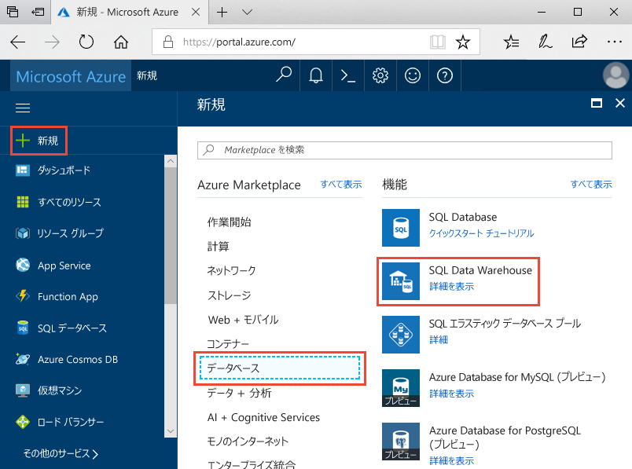
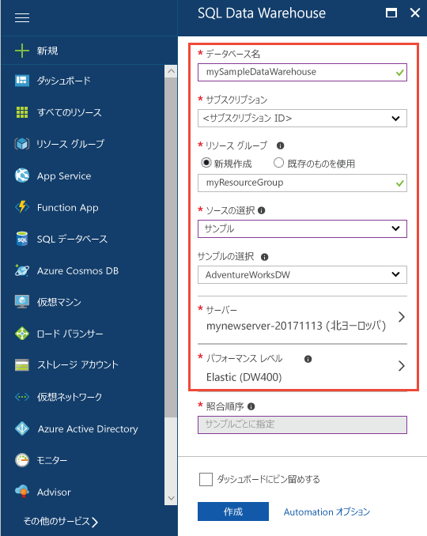
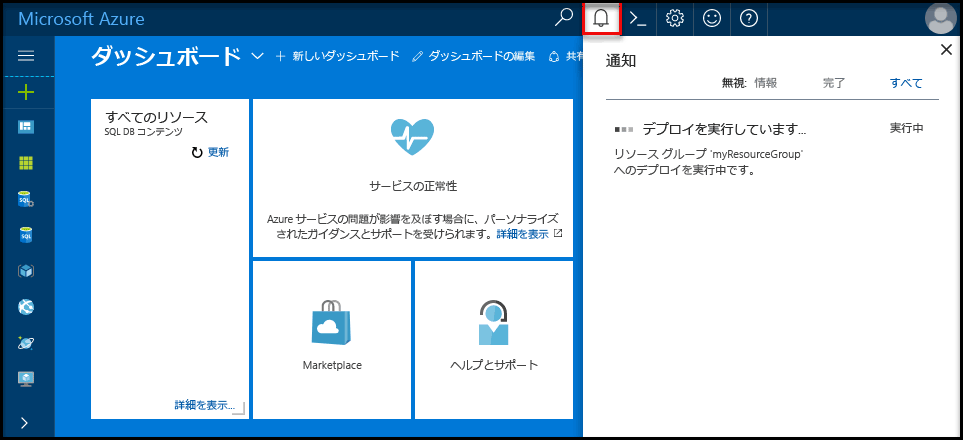
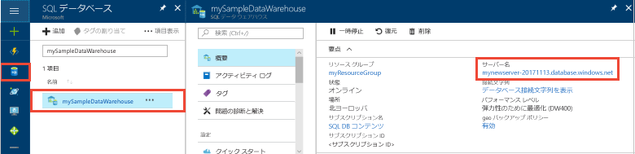
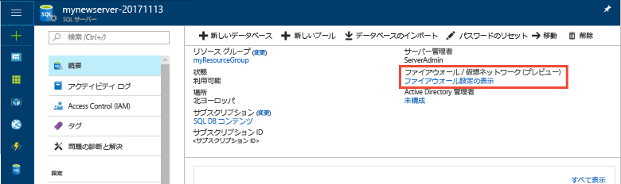
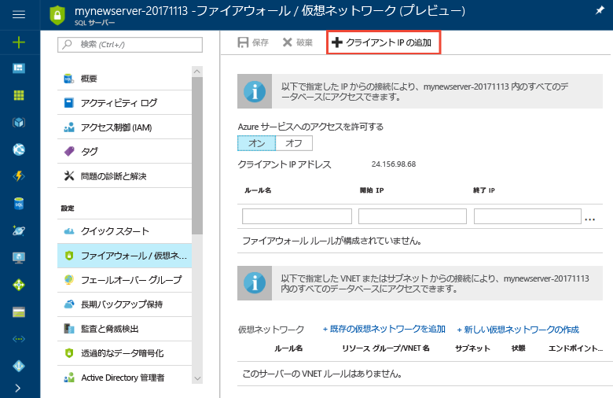
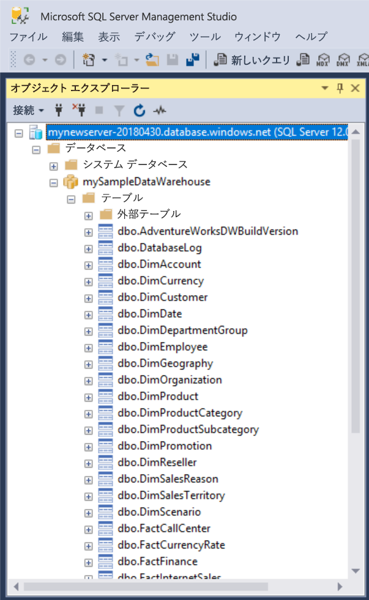
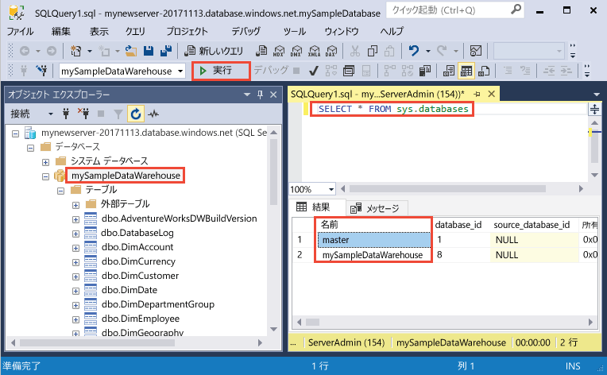
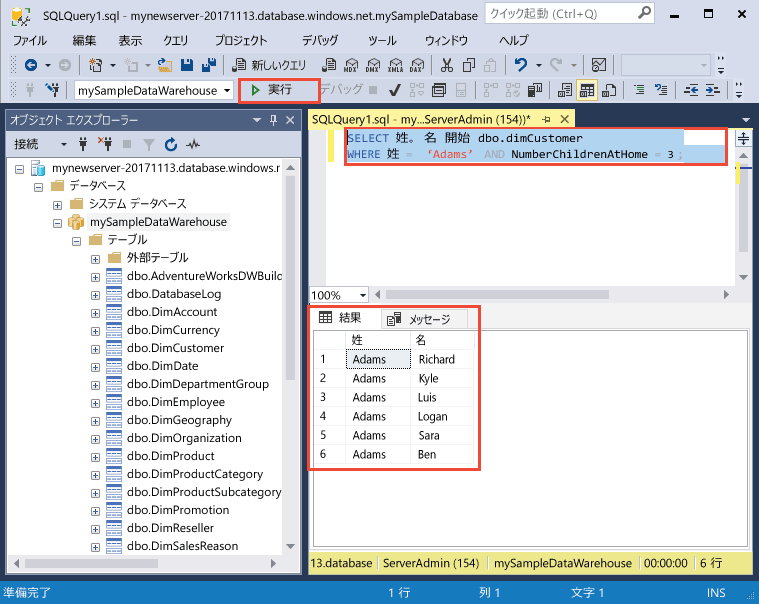
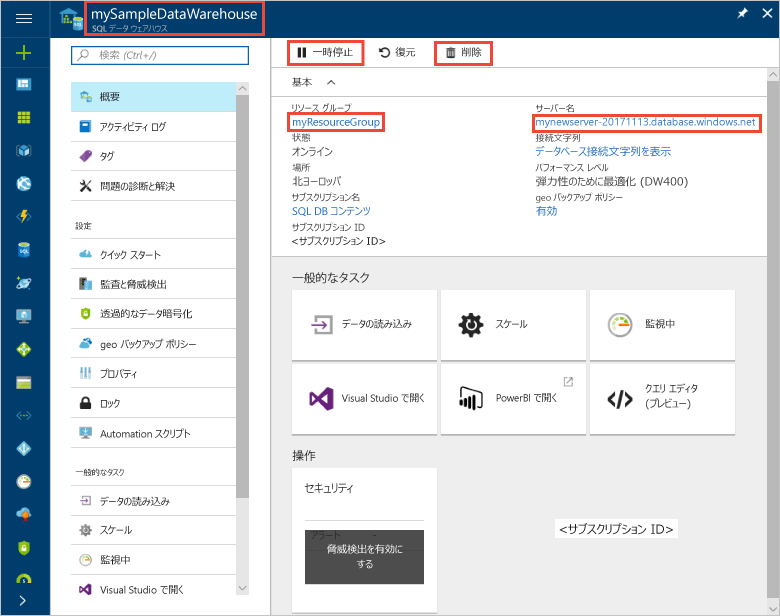

# <a name="quickstart-create-and-query-an-azure-sql-data-warehouse-in-the-azure-portal"></a>クイック スタート: Azure Portal で Azure SQL データ ウェアハウスを作成し、クエリを実行する

Azure Portal を使用すると、Azure SQL Data Warehouse を簡単に作成し、クエリを実行することができます。

Azure サブスクリプションをお持ちでない場合は、開始する前に[無料](https://azure.microsoft.com/free/)アカウントを作成してください。

> [!NOTE]
> SQL Data Warehouse を作成すると、新しい課金対象サービスを使用することになる場合があります。  詳細については、「[SQL Data Warehouse の価格](https://azure.microsoft.com/pricing/details/sql-data-warehouse/)」を参照してください。
>
>

## <a name="before-you-begin"></a>開始する前に

最新バージョンの [SQL Server Management Studio](/sql/ssms/download-sql-server-management-studio-ssms) (SSMS) をダウンロードしてインストールします。

## <a name="sign-in-to-the-azure-portal"></a>Azure ポータルにサインインします。

[Azure Portal](https://portal.azure.com/) にサインインします。

## <a name="create-a-data-warehouse"></a>データ ウェアハウスの作成

Azure SQL Data Warehouse は、定義済みの一連の[コンピューティング リソースリソース](memory-and-concurrency-limits.md)を使って作成されます。 データベースは、[Azure リソース グループ](../azure-resource-manager/resource-group-overview.md)内と [Azure SQL 論理サーバー](../sql-database/sql-database-logical-servers.md)内に作成されます。 

以下の手順で AdventureWorksDW サンプル データを含む SQL Data Warehouse を作成します。 

1. Azure Portal の左上隅にある **[リソースの作成]** をクリックします。

2. **[新規]** ページの **[データベース]** を選択し、**[新規]** ページの **[おすすめ]** で **[SQL Data Warehouse]** を選択します。

    

3. SQL Data Warehouse のフォームで、次の情報を入力します。   

    | Setting | 推奨値 | 説明 | 
    | ------- | --------------- | ----------- | 
    | **データベース名** | mySampleDataWarehouse | 有効なデータベース名については、「[Database Identifiers (データベース識別子)](/sql/relational-databases/databases/database-identifiers)」を参照してください。 データ ウェアハウスはデータベースの一種です。| 
    | **サブスクリプション** | 該当するサブスクリプション  | サブスクリプションの詳細については、[サブスクリプション](https://account.windowsazure.com/Subscriptions)に関するページを参照してください。 |
    | **[リソース グループ]** | myResourceGroup | 有効なリソース グループ名については、[名前付け規則と制限](https://docs.microsoft.com/azure/architecture/best-practices/naming-conventions)に関するページを参照してください。 |
    | **ソースの選択** | サンプル | サンプル データベースの読み込みを指定します。 データ ウェアハウスはデータベースの一種です。 |
    | **[サンプルの選択]** | AdventureWorksDW | AdventureWorksDW サンプル データベースの読み込みを指定します。  |

    

4. **[サーバー]** をクリックして、新しいデータベース用の新しいサーバーを作成して構成します。 **[新しいサーバー]** フォームには次の情報を入力してください。 

    | Setting | 推奨値 | 説明 | 
    | ------------ | ------------------ | ------------------------------------------------- | 
    | **サーバー名** | グローバルに一意の名前 | 有効なサーバー名については、[名前付け規則と制限](https://docs.microsoft.com/azure/architecture/best-practices/naming-conventions)に関するページを参照してください。 | 
    | **サーバー管理者ログイン** | 有効な名前 | 有効なログイン名については、「[Database Identifiers (データベース識別子)](https://docs.microsoft.com/sql/relational-databases/databases/database-identifiers)」を参照してください。|
    | **パスワード** | 有効なパスワード | パスワードには 8 文字以上が使用され、大文字、小文字、数字、英数字以外の文字のうち、3 つのカテゴリの文字が含まれている必要があります。 |
    | **場所** | 有効な場所 | リージョンについては、「[Azure リージョン](https://azure.microsoft.com/regions/)」を参照してください。 |

    

5. **[選択]** をクリックします。

6. **[パフォーマンス レベル]** をクリックして、データ ウェアハウスのパフォーマンス構成を指定します。

7. このチュートリアルでは、**[Gen2]** を選択します。 スライダーは、既定で **[DW1000c]** に設定されています。  上下に動かしてどうなるか試してみてください。 

    

8. **[Apply]** をクリックします。

9. これで SQL Data Warehouse フォームの入力が完了したので、**[作成]** をクリックして、データベースをプロビジョニングします。 プロビジョニングには数分かかります。 

    ![[作成] をクリックする](media/load-data-from-azure-blob-storage-using-polybase/click-create.png)

10. ツール バーの **[通知]** をクリックして、デプロイ プロセスを監視します。
    
     

## <a name="create-a-server-level-firewall-rule"></a>サーバーレベルのファイアウォール規則を作成する

SQL Data Warehouse サービスでは、外部のアプリケーションやツールに、サーバーまたはサーバー上のすべてのデータベースへの接続を禁止するファイアウォールが、サーバーレベルで作成されます。 接続できるようにするには、特定の IP アドレスに接続を許可するファイアウォール規則を追加します。  次の手順に従って、クライアントの IP アドレスに対する[サーバーレベルのファイアウォール規則](../sql-database/sql-database-firewall-configure.md)を作成します。 

> [!NOTE]
> SQL Data Warehouse の通信は、ポート 1433 で行われます。 企業ネットワーク内から接続しようとしても、ポート 1433 での送信トラフィックがネットワークのファイアウォールで禁止されている場合があります。 その場合、会社の IT 部門によってポート 1433 が開放されない限り、Azure SQL Database サーバーに接続することはできません。
>

1. デプロイが完了したら、左側のメニューから **[SQL データ ウェアハウス]** をクリックし、**[SQL データ ウェアハウス]** ページで、**mySampleDatabase** をクリックします。 このデータベースの概要ページが開くと、完全修飾サーバー名 (**mynewserver-20180430.database.windows.net** など) や追加の構成オプションが表示されます。 

2. この完全修飾サーバー名をコピーします。以降のクイック スタートでサーバーとそのデータベースに接続する際に必要となります。 サーバー設定を開くには、サーバー名をクリックします。

    

3. サーバー設定を開くには、 
4. サーバー名をクリックします。

    

5. **[ファイアウォール設定の表示]** をクリックします。 SQL Database サーバーの **[ファイアウォール設定]** ページが開きます。 

    

4. 現在の IP アドレスをファイアウォール規則に追加するには、ツール バーの **[クライアント IP の追加]** をクリックします。 ファイアウォール規則は、単一の IP アドレスまたは IP アドレスの範囲に対して、ポート 1433 を開くことができます。

5. **[Save]** をクリックします。 論理サーバーでポート 1433 を開いている現在の IP アドレスに対して、サーバーレベルのファイアウォール規則が作成されます。

6. **[OK]** をクリックし、**[ファイアウォール設定]** ページを閉じます。

この IP アドレスを使って、SQL Server とそのデータ ウェアハウスに接続できるようになります。 接続するには、SQL Server Management Studio または他の適当なツールを使います。 接続するときは、前に作成した ServerAdmin アカウントを使います。  

> [!IMPORTANT]
> 既定では、すべての Azure サービスで、SQL Database ファイアウォール経由のアクセスが有効になります。 このページの **[オフ]** をクリックし、**[保存]** をクリックして、すべての Azure サービスに対してファイアウォールを無効にします。

## <a name="get-the-fully-qualified-server-name"></a>完全修飾サーバー名を取得する

Azure Portal で、SQL サーバーの完全修飾サーバー名を取得します。 後でサーバーに接続するときに、完全修飾名を使います。

1. [Azure Portal](https://portal.azure.com/) にサインインします。
2. 左側のメニューの **[SQL データ ウェアハウス]** を選択し、**[SQL データ ウェアハウス]** ページで目的のデータベースをクリックします。 
3. そのデータベースの Azure Portal ページの **[基本]** ウィンドウで、**サーバー名**を見つけてコピーします。  この例の完全修飾名は mynewserver-20180430.database.windows.net です。 

      

## <a name="connect-to-the-server-as-server-admin"></a>サーバー管理者としてサーバーに接続する

このセクションでは、[SQL Server Management Studio](/sql/ssms/download-sql-server-management-studio-ssms) (SSMS) を使って、Azure SQL Server に対する接続を確立します。

1. SQL Server Management Studio を開きます。

2. **[サーバーへの接続]** ダイアログ ボックスで、次の情報を入力します。

   | Setting       | 推奨値 | 説明 | 
   | ------------ | ------------------ | ------------------------------------------------- | 
   | サーバーの種類 | データベース エンジン | この値は必須です |
   | サーバー名 | 完全修飾サーバー名 | 例: **mynewserver-20180430.database.windows.net** |
   | Authentication | パブリック | このチュートリアルで構成した認証の種類は "SQL 認証" のみです。 |
   | ログイン | サーバー管理者アカウント | これは、サーバーの作成時に指定したアカウントです。 |
   | パスワード | サーバー管理者アカウントのパスワード | これは、サーバーの作成時に指定したパスワードです。 |

    ![[サーバーへの接続]](media/load-data-from-azure-blob-storage-using-polybase/connect-to-server.png)

4. **[接続]** をクリックします。 SSMS でオブジェクト エクスプローラー ウィンドウが開きます。 

5. オブジェクト エクスプローラーで、**[データベース]** を展開します。 **mySampleDatabase** を展開して、新しいデータベースのオブジェクトを表示します。

     

## <a name="run-some-queries"></a>クエリを実行する

SQL Data Warehouse はクエリ言語として T-SQL を使用しています。 クエリ ウィンドウを開いて T-SQL クエリを実行するには、次の手順を実行します。

1. **mySampleDataWarehouse** を右クリックして、**[新しいクエリ]** を選びます。  新しいクエリ ウィンドウが開きます。
2. クエリ ウィンドウで、次のコマンドを入力してデータベースの一覧を表示します。

    ```sql
    SELECT * FROM sys.databases
    ```

3. **[実行]** をクリックします。  クエリ結果には、**master** と **mySampleDataWarehouse** という 2 つのデータベースが表示されます。

    

4. 何かのデータを確認する場合、次のコマンドを使用すると、家庭に 3 人の子供がいる Adams という名前のユーザー数が表示されます。 結果として 6 人のユーザーが一覧表示されます。 

    ```sql
    SELECT LastName, FirstName FROM dbo.dimCustomer
    WHERE LastName = 'Adams' AND NumberChildrenAtHome = 3;
    ```

    

## <a name="clean-up-resources"></a>リソースのクリーンアップ

データ ウェアハウス ユニットとデータ ウェアハウスに格納されているデータに対して課金されます。 これらのコンピューティングとストレージのリソースは別々に請求されます。 

- データをストレージに保持しておく場合は、データ ウェアハウスを使わない間、コンピューティング リソースを一時停止できます。 コンピューティングを一時停止すると、データ ストレージに対してのみ課金されます。 データを使用する準備ができたら、コンピューティングを再開できます。
- それ以上課金されないようにする場合は、データ ウェアハウスを削除できます。 

必要に応じて、以下の手順でリソースをクリーンアップします。

1. [Azure Portal](https://portal.azure.com) にログインし、データ ウェアハウスをクリックします。

    

1. コンピューティング リソースを一時停止するには、**[一時停止]** ボタンをクリックします。 データ ウェアハウスが一時停止すると、ボタンの表示が **[開始]** になります。  コンピューティング リソースを再開するには、**[開始]** をクリックします。

2. コンピューティング リソースやストレージに課金されないようにデータ ウェアハウスを削除するには、**[削除]** をクリックします。

3. 作成した SQL Server を削除するには、前の画像の **mynewserver-20180430.database.windows.net** をクリックして、**[削除]** をクリックします。  サーバーを削除すると、サーバーに割り当てられているすべてのデータベースが削除されるので、削除には注意してください。

4. リソース グループを削除するには、**myResourceGroup** をクリックして、**[リソース グループの削除]** をクリックします。


## <a name="next-steps"></a>次の手順
ここではデータ ウェアハウスを作成し、ファイアウォール規則を作成し、データ ウェアハウスに接続していくつかのクエリを実行しました。 Azure SQL Data Warehouse の詳細については、データの読み込みに関するチュートリアルを参照してください。
> [!div class="nextstepaction"]
>[SQL Data Warehouse にデータを読み込む](load-data-from-azure-blob-storage-using-polybase.md)
