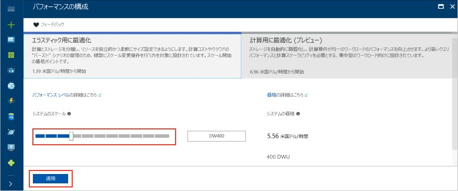

# <a name="tutorial-load-data-to-azure-sql-data-warehouse"></a>チュートリアル: Azure SQL Data Warehouse へのデータの読み込み

このチュートリアルでは、PolyBase を使用して、Azure Blob Storage から Azure SQL Data Warehouse に WideWorldImportersDW データ ウェアハウスを読み込みます。 このチュートリアルでは、[Azure Portal](https://portal.azure.com) と [SQL Server Management Studio](/sql/ssms/download-sql-server-management-studio-ssms) (SSMS) を使って、次のことを行います。 

> [!div class="checklist"]
> * Azure Portal でデータ ウェアハウスを作成する
> * Azure Portal でサーバーレベルのファイアウォール規則を設定する
> * SSMS でデータ ウェアハウスに接続する
> * データを読み込むように指定されたユーザーを作成する
> * Azure BLOB をデータ ソースとして使用する外部テーブルを作成する
> * CTAS T-SQL ステートメントを使ってデータをデータ ウェアハウスに読み込む
> * データ読み込みの進行状況を表示する
> * 日付ディメンションと売上ファクト テーブルに 1 年分のデータを生成する
> * 新しく読み込まれたデータの統計を作成する

Azure サブスクリプションをお持ちでない場合は、開始する前に[無料アカウントを作成](https://azure.microsoft.com/free/)してください。

## <a name="before-you-begin"></a>開始する前に

このチュートリアルを始める前に、最新バージョンの [SQL Server Management Studio](/sql/ssms/download-sql-server-management-studio-ssms) (SSMS) をダウンロードしてインストールします。


## <a name="log-in-to-the-azure-portal"></a>Azure Portal にログインする

[Azure Portal](https://portal.azure.com/) にログインします。

## <a name="create-a-blank-sql-data-warehouse"></a>空の SQL Data Warehouse を作成する

Azure SQL Data Warehouse は、定義済みの一連の[コンピューティング リソースリソース](memory-and-concurrency-limits.md)を使って作成されます。 データベースは、[Azure リソース グループ](../azure-resource-manager/resource-group-overview.md)内と [Azure SQL 論理サーバー](../sql-database/sql-database-features.md)内に作成されます。 

空の SQL Data Warehouse を作成するには、次のようにします。 

1. Azure Portal の左上隅にある **[リソースの作成]** をクリックします。

2. **[新規]** ページの **[データベース]** を選択し、**[新規]** ページの **[おすすめ]** で **[SQL Data Warehouse]** を選択します。

    

3. SQL Data Warehouse のフォームで、次の情報を入力します。   

   | Setting | 推奨値 | [説明] | 
   | ------- | --------------- | ----------- | 
   | **[データベース名]** | SampleDW | 有効なデータベース名については、「[Database Identifiers (データベース識別子)](/sql/relational-databases/databases/database-identifiers)」を参照してください。 | 
   | **サブスクリプション** | 該当するサブスクリプション  | サブスクリプションの詳細については、[サブスクリプション](https://account.windowsazure.com/Subscriptions)に関するページを参照してください。 |
   | **[リソース グループ]** | SampleRG | 有効なリソース グループ名については、[名前付け規則と制限](https://docs.microsoft.com/azure/architecture/best-practices/naming-conventions)に関するページを参照してください。 |
   | **[ソースの選択]** | 空のデータベース | 空のデータベースの作成を指定します。 データ ウェアハウスはデータベースの 1 つの種類であることに注意してください。|

    

4. **[サーバー]** をクリックして、新しいデータベース用の新しいサーバーを作成して構成します。 **[新しいサーバー]** フォームには次の情報を入力してください。 

    | Setting | 推奨値 | [説明] | 
    | ------- | --------------- | ----------- |
    | **[サーバー名]** | グローバルに一意の名前 | 有効なサーバー名については、[名前付け規則と制限](https://docs.microsoft.com/azure/architecture/best-practices/naming-conventions)に関するページを参照してください。 | 
    | **[サーバー管理者ログイン]** | 有効な名前 | 有効なログイン名については、「[Database Identifiers (データベース識別子)](https://docs.microsoft.com/sql/relational-databases/databases/database-identifiers)」を参照してください。|
    | **パスワード** | 有効なパスワード | パスワードには 8 文字以上が使用され、大文字、小文字、数字、英数字以外の文字のうち、3 つのカテゴリの文字が含まれている必要があります。 |
    | **場所** | 有効な場所 | リージョンについては、「[Azure リージョン](https://azure.microsoft.com/regions/)」を参照してください。 |

    

5. **[選択]** をクリックします。

6. **[パフォーマンス レベル]** をクリックし、データ ウェアハウスを弾力性または計算能力に最適化するかどうか、および Data Warehouse ユニットの数を指定します。 

7. このチュートリアルでは、**[エラスティック用に最適化]** サービス レベルを選びます。 スライダーは、既定で **[DW400]** に設定されています。  上下に動かしてどうなるか試してみてください。 

    

8. **[Apply]** をクリックします。
9. [SQL Data Warehouse] ページで、空のデータベースの **[照合順序]** を選びます。 このチュートリアルでは、既定の値を使います。 照合順序の詳細については、「[Collations (照合順序)](/sql/t-sql/statements/collations)」を参照してください。

11. これで SQL Database フォームの入力が完了したので、**[作成]** をクリックして、データベースをプロビジョニングします。 プロビジョニングには数分かかります。 

    ![[作成] をクリックする](media/load-data-wideworldimportersdw/click-create.png)

12. ツール バーの **[通知]** をクリックして、デプロイ プロセスを監視します。
    
     

## <a name="create-a-server-level-firewall-rule"></a>サーバーレベルのファイアウォール規則を作成する

SQL Data Warehouse サービスでは、外部のアプリケーションやツールに、サーバーまたはサーバー上のすべてのデータベースへの接続を禁止するファイアウォールが、サーバーレベルで作成されます。 接続できるようにするには、特定の IP アドレスに接続を許可するファイアウォール規則を追加します。  次の手順に従って、クライアントの IP アドレスに対する[サーバーレベルのファイアウォール規則](../sql-database/sql-database-firewall-configure.md)を作成します。 

> [!NOTE]
> SQL Data Warehouse の通信は、ポート 1433 で行われます。 企業ネットワーク内から接続しようとしても、ポート 1433 での送信トラフィックがネットワークのファイアウォールで禁止されている場合があります。 その場合、会社の IT 部門によってポート 1433 が開放されない限り、Azure SQL Database サーバーに接続することはできません。
>

1. デプロイが完了したら、左側のメニューから **[SQL データベース]** をクリックし、**SQL データベース** ページで、**SampleDW** をクリックします。 このデータベースの概要ページが開くと、完全修飾サーバー名 (**sample-svr.database.windows.net** など) や追加の構成オプションが表示されます。 

2. この完全修飾サーバー名をコピーします。以降のクイック スタートでサーバーとそのデータベースに接続する際に必要となります。 サーバー設定を開くには、サーバー名をクリックします。

     

3. サーバー設定を開くには、サーバー名をクリックします。

     

5. **[ファイアウォール設定の表示]** をクリックします。 SQL Database サーバーの **[ファイアウォール設定]** ページが開きます。 

     

4.  現在の IP アドレスをファイアウォール規則に追加するには、ツール バーの **[クライアント IP の追加]** をクリックします。 ファイアウォール規則は、単一の IP アドレスまたは IP アドレスの範囲に対して、ポート 1433 を開くことができます。

5. **[Save]** をクリックします。 論理サーバーでポート 1433 を開いている現在の IP アドレスに対して、サーバーレベルのファイアウォール規則が作成されます。

6. **[OK]** をクリックし、**[ファイアウォール設定]** ページを閉じます。

この IP アドレスを使って、SQL Server とそのデータ ウェアハウスに接続できるようになります。 接続するには、SQL Server Management Studio または他の適当なツールを使います。 接続するときは、前に作成した serveradmin アカウントを使います。  

> [!IMPORTANT]
> 既定では、すべての Azure サービスで、SQL Database ファイアウォール経由のアクセスが有効になります。 このページの **[オフ]** をクリックし、**[保存]** をクリックして、すべての Azure サービスに対してファイアウォールを無効にします。

## <a name="get-the-fully-qualified-server-name"></a>完全修飾サーバー名を取得する

Azure Portal で、SQL サーバーの完全修飾サーバー名を取得します。 後でサーバーに接続するときに、完全修飾名を使います。

1. [Azure Portal](https://portal.azure.com/) にログインします。
2. 左側のメニューから **[SQL データベース]** を選択し、**[SQL データベース]** ページで目的のデータベースをクリックします。 
3. そのデータベースの Azure Portal ページの **[基本]** ウィンドウで、**サーバー名**を見つけてコピーします。  この例の完全修飾名は mynewserver-20171113.database.windows.net です。 

      

## <a name="connect-to-the-server-as-server-admin"></a>サーバー管理者としてサーバーに接続する

このセクションでは、[SQL Server Management Studio](/sql/ssms/download-sql-server-management-studio-ssms) (SSMS) を使って、Azure SQL Server に対する接続を確立します。

1. SQL Server Management Studio を開きます。

2. **[サーバーへの接続]** ダイアログ ボックスで、次の情報を入力します。

    | Setting      | 推奨値 | [説明] | 
    | ------------ | --------------- | ----------- | 
    | サーバーの種類 | データベース エンジン | この値は必須です |
    | サーバー名 | 完全修飾サーバー名 | たとえば、**sample-svr.database.windows.net** は完全修飾サーバー名です。 |
    | 認証 | パブリック | このチュートリアルで構成した認証の種類は "SQL 認証" のみです。 |
    | ログイン | サーバー管理者アカウント | これは、サーバーの作成時に指定したアカウントです。 |
    | パスワード | サーバー管理者アカウントのパスワード | これは、サーバーの作成時に指定したパスワードです。 |

    ![[サーバーへの接続]](media/load-data-wideworldimportersdw/connect-to-server.png)

4. **[接続]** をクリックします。 SSMS でオブジェクト エクスプローラー ウィンドウが開きます。 

5. オブジェクト エクスプローラーで、**[データベース]** を展開します。 **[システム データベース]**、**[master]** の順に展開し、マスター データベースのオブジェクトを表示します。  **mySampleDatabase** を展開して、新しいデータベースのオブジェクトを表示します。

     

## <a name="create-a-user-for-loading-data"></a>データを読み込むためのユーザーを作成する

サーバー管理者アカウントは管理操作を実行するためのものであり、ユーザー データに対するクエリの実行には適していません。 データの読み込みは、メモリを大量に消費する操作です。 メモリの最大値は、使用している SQL Data Warehouse の世代、[データ ウェアハウス ユニット](what-is-a-data-warehouse-unit-dwu-cdwu.md)、[リソース クラス](resource-classes-for-workload-management.md)に従って定義されます。 

データの読み込みに専用のログインとユーザーを作成することをお勧めします。 その後、適切な最大メモリ割り当てを有効にする[リソース クラス](resource-classes-for-workload-management.md)に読み込みユーザーを追加します。

現在はサーバー管理者として接続しているので、ログインとユーザーを作成することができます。 以下の手順を使って、**LoaderRC60** という名前のログインとユーザーを作成します。 その後、そのユーザーを **staticrc60** リソース クラスに割り当てます。 

1.  SSMS で **[master]** を右クリックしてドロップダウン メニューを表示し、**[新しいクエリ]** を選びます。 新しいクエリ ウィンドウが開きます。

    

2. クエリ ウィンドウで、次の T-SQL コマンドを入力して、LoaderRC60 という名前のログインとユーザーを作成します。"a123STRONGpassword!" は独自のパスワードに置き換えます。 

    ```sql
    CREATE LOGIN LoaderRC60 WITH PASSWORD = 'a123STRONGpassword!';
    CREATE USER LoaderRC60 FOR LOGIN LoaderRC60;
    ```

3. **[実行]** をクリックします。

4. **SampleDW** を右クリックして、**[新しいクエリ]** を選びます。 新しいクエリ ウィンドウが開きます。  

    
 
5. 次の T-SQL コマンドを入力して、LoaderRC60 ログインに対する LoaderRC60 という名前のデータベース ユーザーを作成します。 2 行目では、新しいユーザーに新しいデータ ウェアハウスの CONTROL アクセス許可を付与しています。  これらのアクセス許可は、ユーザーをデータベースの所有者にする場合と似ています。 3 行目では、新しいユーザーを staticrc60 [リソース クラス](resource-classes-for-workload-management.md)のメンバーとして追加します。

    ```sql
    CREATE USER LoaderRC60 FOR LOGIN LoaderRC60;
    GRANT CONTROL ON DATABASE::[SampleDW] to LoaderRC60;
    EXEC sp_addrolemember 'staticrc60', 'LoaderRC60';
    ```

6. **[実行]** をクリックします。

## <a name="connect-to-the-server-as-the-loading-user"></a>読み込みユーザーとしてサーバーに接続する

データを読み込むための最初のステップは、LoaderRC60 としてログインすることです。  

1. オブジェクト エクスプローラーで **[接続]** ドロップダウン メニューをクリックして、**[データベース エンジン]** を選びます。 **[サーバーへの接続]** ダイアログ ボックスが表示されます。

    

2. 完全修飾サーバー名を入力し、ログインとして「**LoaderRC60**」と入力します。  LoaderRC60 のパスワードを入力します。

3. **[接続]** をクリックします。

4. 接続する準備ができると、オブジェクト エクスプローラーに 2 つのサーバー接続が表示されます。 1 つは ServerAdmin としての接続、もう 1 つは LoaderRC60 としての接続です。

    

## <a name="create-external-tables-and-objects"></a>外部テーブルとオブジェクトを作成する

新しいデータ ウェアハウスにデータを読み込むプロセスを始める準備ができました。 今後の参考として、データを Azure Blob Storage に取得する方法やソースから直接 SQL Data Warehouse に読み込む方法については、[読み込みの概要](sql-data-warehouse-overview-load.md)に関するページを参照してください。

次の SQL スクリプトを実行して、読み込むデータに関する情報を指定します。 この情報には、データが置かれている場所、データの内容の形式、およびデータのテーブル定義が含まれます。 データは、パブリック Azure BLOB に存在します。

1. 前のセクションで、LoaderRC60 としてデータ ウェアハウスにログインしました。 SSMS で LoaderRC60 接続の **[SampleDW]** を右クリックして、**[新しいクエリ]** を選びます。  新しいクエリ ウィンドウが表示されます。 

    

2. 実際のクエリ ウィンドウと上の画像を比べてください。  新しいクエリ ウィンドウが LoaderRC60 として実行されていること、および SampleDW データベースに対するクエリを実行していることを確認します。 このクエリ ウィンドウを使って、すべての読み込み手順を実行します。

3. SampleDW データベースのマスター キーを作成します。 マスター キーは、データベースごとに 1 回作成するだけで済みます。 

    ```sql
    CREATE MASTER KEY;
    ```

4. 次の [CREATE EXTERNAL DATA SOURCE](/sql/t-sql/statements/create-external-data-source-transact-sql) ステートメントを実行して、Azure BLOB の場所を定義します。 これは、外部のタクシー データの場所です。  クエリ ウィンドウに追加したコマンドを実行するには、実行するコマンドを強調表示にして、**[実行]** をクリックします。

    ```sql
    CREATE EXTERNAL DATA SOURCE WWIStorage
    WITH
    (
        TYPE = Hadoop,
        LOCATION = 'wasbs://wideworldimporters@sqldwholdata.blob.core.windows.net'
    );
    ```

5. 次の [CREATE EXTERNAL FILE FORMAT](/sql/t-sql/statements/create-external-file-format-transact-sql) T-SQL ステートメントを実行して、外部データ ファイルの書式設定の特性とオプションを指定します。 このステートメントでは、外部データがテキストとして格納されており、値がパイプ ("|") 文字で区切られていることを指定します。  

    ```sql
    CREATE EXTERNAL FILE FORMAT TextFileFormat 
    WITH 
    (   
        FORMAT_TYPE = DELIMITEDTEXT,
        FORMAT_OPTIONS
        (   
            FIELD_TERMINATOR = '|',
            USE_TYPE_DEFAULT = FALSE 
        )
    );
    ```

6.  次の [CREATE SCHEMA](/sql/t-sql/statements/create-schema-transact-sql) ステートメントを実行して、外部ファイルの形式のスキーマを作成します。 ext スキーマを使って、作成しようとしている外部テーブルを構造化できます。 データが格納される標準テーブルは、wwi スキーマで構造化します。 

    ```sql
    CREATE SCHEMA ext;
    GO
    CREATE SCHEMA wwi;
    ```

7. 外部テーブルを作成する テーブルの定義は SQL Data Warehouse に格納されますが、テーブルは Azure Blob Storage に格納されているデータを参照します。 次の T-SQL コマンドを実行して、複数の外部テーブルを作成します。これらのテーブルは、そのすべてが以前に外部データ ソースで定義した Azure BLOB を指します。

    ```sql
    CREATE EXTERNAL TABLE [ext].[dimension_City](
        [City Key] [int] NOT NULL,
        [WWI City ID] [int] NOT NULL,
        [City] [nvarchar](50) NOT NULL,
        [State Province] [nvarchar](50) NOT NULL,
        [Country] [nvarchar](60) NOT NULL,
        [Continent] [nvarchar](30) NOT NULL,
        [Sales Territory] [nvarchar](50) NOT NULL,
        [Region] [nvarchar](30) NOT NULL,
        [Subregion] [nvarchar](30) NOT NULL,
        [Location] [nvarchar](76) NULL,
        [Latest Recorded Population] [bigint] NOT NULL,
        [Valid From] [datetime2](7) NOT NULL,
        [Valid To] [datetime2](7) NOT NULL,
        [Lineage Key] [int] NOT NULL
    )
    WITH (LOCATION='/v1/dimension_City/',   
        DATA_SOURCE = WWIStorage,  
        FILE_FORMAT = TextFileFormat,
        REJECT_TYPE = VALUE,
        REJECT_VALUE = 0
    );  
    CREATE EXTERNAL TABLE [ext].[dimension_Customer] (
        [Customer Key] [int] NOT NULL,
        [WWI Customer ID] [int] NOT NULL,
        [Customer] [nvarchar](100) NOT NULL,
        [Bill To Customer] [nvarchar](100) NOT NULL,
        [Category] [nvarchar](50) NOT NULL,
        [Buying Group] [nvarchar](50) NOT NULL,
        [Primary Contact] [nvarchar](50) NOT NULL,
        [Postal Code] [nvarchar](10) NOT NULL,
        [Valid From] [datetime2](7) NOT NULL,
        [Valid To] [datetime2](7) NOT NULL,
        [Lineage Key] [int] NOT NULL
    )
    WITH (LOCATION='/v1/dimension_Customer/',   
        DATA_SOURCE = WWIStorage,  
        FILE_FORMAT = TextFileFormat,
        REJECT_TYPE = VALUE,
        REJECT_VALUE = 0
    );  
    CREATE EXTERNAL TABLE [ext].[dimension_Employee] (
        [Employee Key] [int] NOT NULL,
        [WWI Employee ID] [int] NOT NULL,
        [Employee] [nvarchar](50) NOT NULL,
        [Preferred Name] [nvarchar](50) NOT NULL,
        [Is Salesperson] [bit] NOT NULL,
        [Photo] [varbinary](300) NULL,
        [Valid From] [datetime2](7) NOT NULL,
        [Valid To] [datetime2](7) NOT NULL,
        [Lineage Key] [int] NOT NULL
    )
    WITH ( LOCATION='/v1/dimension_Employee/',   
        DATA_SOURCE = WWIStorage,  
        FILE_FORMAT = TextFileFormat,
        REJECT_TYPE = VALUE,
        REJECT_VALUE = 0
    );
    CREATE EXTERNAL TABLE [ext].[dimension_PaymentMethod] (
        [Payment Method Key] [int] NOT NULL,
        [WWI Payment Method ID] [int] NOT NULL,
        [Payment Method] [nvarchar](50) NOT NULL,
        [Valid From] [datetime2](7) NOT NULL,
        [Valid To] [datetime2](7) NOT NULL,
        [Lineage Key] [int] NOT NULL
    )
    WITH ( LOCATION ='/v1/dimension_PaymentMethod/',   
        DATA_SOURCE = WWIStorage,  
        FILE_FORMAT = TextFileFormat,
        REJECT_TYPE = VALUE,
        REJECT_VALUE = 0
    );
    CREATE EXTERNAL TABLE [ext].[dimension_StockItem](
        [Stock Item Key] [int] NOT NULL,
        [WWI Stock Item ID] [int] NOT NULL,
        [Stock Item] [nvarchar](100) NOT NULL,
        [Color] [nvarchar](20) NOT NULL,
        [Selling Package] [nvarchar](50) NOT NULL,
        [Buying Package] [nvarchar](50) NOT NULL,
        [Brand] [nvarchar](50) NOT NULL,
        [Size] [nvarchar](20) NOT NULL,
        [Lead Time Days] [int] NOT NULL,
        [Quantity Per Outer] [int] NOT NULL,
        [Is Chiller Stock] [bit] NOT NULL,
        [Barcode] [nvarchar](50) NULL,
        [Tax Rate] [decimal](18, 3) NOT NULL,
        [Unit Price] [decimal](18, 2) NOT NULL,
        [Recommended Retail Price] [decimal](18, 2) NULL,
        [Typical Weight Per Unit] [decimal](18, 3) NOT NULL,
        [Photo] [varbinary](300) NULL,
        [Valid From] [datetime2](7) NOT NULL,
        [Valid To] [datetime2](7) NOT NULL,
        [Lineage Key] [int] NOT NULL
    )
    WITH ( LOCATION ='/v1/dimension_StockItem/',   
        DATA_SOURCE = WWIStorage,  
        FILE_FORMAT = TextFileFormat,
        REJECT_TYPE = VALUE,
        REJECT_VALUE = 0
    );
    CREATE EXTERNAL TABLE [ext].[dimension_Supplier](
        [Supplier Key] [int] NOT NULL,
        [WWI Supplier ID] [int] NOT NULL,
        [Supplier] [nvarchar](100) NOT NULL,
        [Category] [nvarchar](50) NOT NULL,
        [Primary Contact] [nvarchar](50) NOT NULL,
        [Supplier Reference] [nvarchar](20) NULL,
        [Payment Days] [int] NOT NULL,
        [Postal Code] [nvarchar](10) NOT NULL,
        [Valid From] [datetime2](7) NOT NULL,
        [Valid To] [datetime2](7) NOT NULL,
        [Lineage Key] [int] NOT NULL
    )
    WITH ( LOCATION ='/v1/dimension_Supplier/',   
        DATA_SOURCE = WWIStorage,  
        FILE_FORMAT = TextFileFormat,
        REJECT_TYPE = VALUE,
        REJECT_VALUE = 0
    );
    CREATE EXTERNAL TABLE [ext].[dimension_TransactionType](
        [Transaction Type Key] [int] NOT NULL,
        [WWI Transaction Type ID] [int] NOT NULL,
        [Transaction Type] [nvarchar](50) NOT NULL,
        [Valid From] [datetime2](7) NOT NULL,
        [Valid To] [datetime2](7) NOT NULL,
        [Lineage Key] [int] NOT NULL
    )    
    WITH ( LOCATION ='/v1/dimension_TransactionType/',   
        DATA_SOURCE = WWIStorage,  
        FILE_FORMAT = TextFileFormat,
        REJECT_TYPE = VALUE,
        REJECT_VALUE = 0
    );
    CREATE EXTERNAL TABLE [ext].[fact_Movement] (
        [Movement Key] [bigint] NOT NULL,
        [Date Key] [date] NOT NULL,
        [Stock Item Key] [int] NOT NULL,
        [Customer Key] [int] NULL,
        [Supplier Key] [int] NULL,
        [Transaction Type Key] [int] NOT NULL,
        [WWI Stock Item Transaction ID] [int] NOT NULL,
        [WWI Invoice ID] [int] NULL,
        [WWI Purchase Order ID] [int] NULL,
        [Quantity] [int] NOT NULL,
        [Lineage Key] [int] NOT NULL
    )
    WITH ( LOCATION ='/v1/fact_Movement/',   
        DATA_SOURCE = WWIStorage,  
        FILE_FORMAT = TextFileFormat,
        REJECT_TYPE = VALUE,
        REJECT_VALUE = 0
    );
    CREATE EXTERNAL TABLE [ext].[fact_Order] (
        [Order Key] [bigint] NOT NULL,
        [City Key] [int] NOT NULL,
        [Customer Key] [int] NOT NULL,
        [Stock Item Key] [int] NOT NULL,
        [Order Date Key] [date] NOT NULL,
        [Picked Date Key] [date] NULL,
        [Salesperson Key] [int] NOT NULL,
        [Picker Key] [int] NULL,
        [WWI Order ID] [int] NOT NULL,
        [WWI Backorder ID] [int] NULL,
        [Description] [nvarchar](100) NOT NULL,
        [Package] [nvarchar](50) NOT NULL,
        [Quantity] [int] NOT NULL,
        [Unit Price] [decimal](18, 2) NOT NULL,
        [Tax Rate] [decimal](18, 3) NOT NULL,
        [Total Excluding Tax] [decimal](18, 2) NOT NULL,
        [Tax Amount] [decimal](18, 2) NOT NULL,
        [Total Including Tax] [decimal](18, 2) NOT NULL,
        [Lineage Key] [int] NOT NULL
    )
    WITH ( LOCATION ='/v1/fact_Order/',   
        DATA_SOURCE = WWIStorage,  
        FILE_FORMAT = TextFileFormat,
        REJECT_TYPE = VALUE,
        REJECT_VALUE = 0
    );
    CREATE EXTERNAL TABLE [ext].[fact_Purchase] (
        [Purchase Key] [bigint] NOT NULL,
        [Date Key] [date] NOT NULL,
        [Supplier Key] [int] NOT NULL,
        [Stock Item Key] [int] NOT NULL,
        [WWI Purchase Order ID] [int] NULL,
        [Ordered Outers] [int] NOT NULL,
        [Ordered Quantity] [int] NOT NULL,
        [Received Outers] [int] NOT NULL,
        [Package] [nvarchar](50) NOT NULL,
        [Is Order Finalized] [bit] NOT NULL,
        [Lineage Key] [int] NOT NULL
    )
    WITH ( LOCATION ='/v1/fact_Purchase/',   
        DATA_SOURCE = WWIStorage,  
        FILE_FORMAT = TextFileFormat,
        REJECT_TYPE = VALUE,
        REJECT_VALUE = 0
    );
    CREATE EXTERNAL TABLE [ext].[fact_Sale] (
        [Sale Key] [bigint] NOT NULL,
        [City Key] [int] NOT NULL,
        [Customer Key] [int] NOT NULL,
        [Bill To Customer Key] [int] NOT NULL,
        [Stock Item Key] [int] NOT NULL,
        [Invoice Date Key] [date] NOT NULL,
        [Delivery Date Key] [date] NULL,
        [Salesperson Key] [int] NOT NULL,
        [WWI Invoice ID] [int] NOT NULL,
        [Description] [nvarchar](100) NOT NULL,
        [Package] [nvarchar](50) NOT NULL,
        [Quantity] [int] NOT NULL,
        [Unit Price] [decimal](18, 2) NOT NULL,
        [Tax Rate] [decimal](18, 3) NOT NULL,
        [Total Excluding Tax] [decimal](18, 2) NOT NULL,
        [Tax Amount] [decimal](18, 2) NOT NULL,
        [Profit] [decimal](18, 2) NOT NULL,
        [Total Including Tax] [decimal](18, 2) NOT NULL,
        [Total Dry Items] [int] NOT NULL,
        [Total Chiller Items] [int] NOT NULL,
        [Lineage Key] [int] NOT NULL
    )
    WITH ( LOCATION ='/v1/fact_Sale/',   
        DATA_SOURCE = WWIStorage,  
        FILE_FORMAT = TextFileFormat,
        REJECT_TYPE = VALUE,
        REJECT_VALUE = 0
    );
    CREATE EXTERNAL TABLE [ext].[fact_StockHolding] (
        [Stock Holding Key] [bigint] NOT NULL,
        [Stock Item Key] [int] NOT NULL,
        [Quantity On Hand] [int] NOT NULL,
        [Bin Location] [nvarchar](20) NOT NULL,
        [Last Stocktake Quantity] [int] NOT NULL,
        [Last Cost Price] [decimal](18, 2) NOT NULL,
        [Reorder Level] [int] NOT NULL,
        [Target Stock Level] [int] NOT NULL,
        [Lineage Key] [int] NOT NULL
    )
    WITH ( LOCATION ='/v1/fact_StockHolding/',   
        DATA_SOURCE = WWIStorage,  
        FILE_FORMAT = TextFileFormat,
        REJECT_TYPE = VALUE,
        REJECT_VALUE = 0
    );
    CREATE EXTERNAL TABLE [ext].[fact_Transaction] (
        [Transaction Key] [bigint] NOT NULL,
        [Date Key] [date] NOT NULL,
        [Customer Key] [int] NULL,
        [Bill To Customer Key] [int] NULL,
        [Supplier Key] [int] NULL,
        [Transaction Type Key] [int] NOT NULL,
        [Payment Method Key] [int] NULL,
        [WWI Customer Transaction ID] [int] NULL,
        [WWI Supplier Transaction ID] [int] NULL,
        [WWI Invoice ID] [int] NULL,
        [WWI Purchase Order ID] [int] NULL,
        [Supplier Invoice Number] [nvarchar](20) NULL,
        [Total Excluding Tax] [decimal](18, 2) NOT NULL,
        [Tax Amount] [decimal](18, 2) NOT NULL,
        [Total Including Tax] [decimal](18, 2) NOT NULL,
        [Outstanding Balance] [decimal](18, 2) NOT NULL,
        [Is Finalized] [bit] NOT NULL,
        [Lineage Key] [int] NOT NULL
    )
    WITH ( LOCATION ='/v1/fact_Transaction/',   
        DATA_SOURCE = WWIStorage,  
        FILE_FORMAT = TextFileFormat,
        REJECT_TYPE = VALUE,
        REJECT_VALUE = 0
    );
    ```

8. オブジェクト エクスプローラーで、SampleDW を展開して、先ほど作成した外部テーブルの一覧を表示します。

    

## <a name="load-the-data-into-your-data-warehouse"></a>データ ウェアハウスにデータを読み込む

このセクションでは、先ほど定義した外部テーブルを使って、サンプル データを Azure BLOB から SQL Data Warehouse に読み込みます。  

> [!NOTE]
> このチュートリアルでは、最終テーブルにデータを直接読み込みます。 運用環境では、通常、CREATE TABLE AS SELECT を使用して、ステージング テーブルに読み込みます。 データがステージング テーブルにある間に、必要な変換を実行できます。 ステージング テーブルのデータを運用テーブルに追加するには、INSERT...SELECT ステートメントを使用します。 詳細については、「[運用テーブルにデータを挿入する](guidance-for-loading-data.md#inserting-data-into-a-production-table)」を参照してください。
> 

このスクリプトは [CREATE TABLE AS SELECT (CTAS)](/sql/t-sql/statements/create-table-as-select-azure-sql-data-warehouse) T-SQL ステートメントを使って、Azure Storage Blob からデータ ウェアハウスの新しいテーブルにデータを読み込みます。 CTAS は、select ステートメントの結果に基づいて新しいテーブルを作成します。 新しいテーブルでは、select ステートメントの結果と同じ列およびデータ型が保持されます。 select ステートメントが外部テーブルから選択すると、SQL Data Warehouse はデータ ウェアハウスのリレーショナル テーブルにデータをインポートします。 

このスクリプトでは、wwi.dimension_Date テーブルと wwi.fact_Sales テーブルへのデータの読み込みは行いません。 これらのテーブルは、大量の行を格納できるようにするため、後続の手順で生成されます。

1. データ ウェアハウス内の新しいテーブルにデータを読み込むには、次のスクリプトを実行します。

    ```sql
    CREATE TABLE [wwi].[dimension_City]
    WITH
    ( 
        DISTRIBUTION = REPLICATE,
        CLUSTERED COLUMNSTORE INDEX
    )
    AS
    SELECT * FROM [ext].[dimension_City]
    OPTION (LABEL = 'CTAS : Load [wwi].[dimension_City]')
    ;

    CREATE TABLE [wwi].[dimension_Customer]
    WITH
    ( 
        DISTRIBUTION = REPLICATE,
        CLUSTERED COLUMNSTORE INDEX
    )
    AS
    SELECT * FROM [ext].[dimension_Customer]
    OPTION (LABEL = 'CTAS : Load [wwi].[dimension_Customer]')
    ;

    CREATE TABLE [wwi].[dimension_Employee]
    WITH
    ( 
        DISTRIBUTION = REPLICATE,
        CLUSTERED COLUMNSTORE INDEX
    )
    AS
    SELECT * FROM [ext].[dimension_Employee]
    OPTION (LABEL = 'CTAS : Load [wwi].[dimension_Employee]')
    ;

    CREATE TABLE [wwi].[dimension_PaymentMethod]
    WITH
    ( 
        DISTRIBUTION = REPLICATE,
        CLUSTERED COLUMNSTORE INDEX
    )
    AS
    SELECT * FROM [ext].[dimension_PaymentMethod]
    OPTION (LABEL = 'CTAS : Load [wwi].[dimension_PaymentMethod]')
    ;

    CREATE TABLE [wwi].[dimension_StockItem]
    WITH
    ( 
        DISTRIBUTION = REPLICATE,
        CLUSTERED COLUMNSTORE INDEX
    )
    AS
    SELECT * FROM [ext].[dimension_StockItem]
    OPTION (LABEL = 'CTAS : Load [wwi].[dimension_StockItem]')
    ;

    CREATE TABLE [wwi].[dimension_Supplier]
    WITH
    ( 
        DISTRIBUTION = REPLICATE,
        CLUSTERED COLUMNSTORE INDEX
    )
    AS
    SELECT * FROM [ext].[dimension_Supplier]
    OPTION (LABEL = 'CTAS : Load [wwi].[dimension_Supplier]')
    ;

    CREATE TABLE [wwi].[dimension_TransactionType]
    WITH
    ( 
        DISTRIBUTION = REPLICATE,
        CLUSTERED COLUMNSTORE INDEX
    )
    AS
    SELECT * FROM [ext].[dimension_TransactionType]
    OPTION (LABEL = 'CTAS : Load [wwi].[dimension_TransactionType]')
    ;

    CREATE TABLE [wwi].[fact_Movement]
    WITH
    ( 
        DISTRIBUTION = HASH([Movement Key]),
        CLUSTERED COLUMNSTORE INDEX
    )
    AS
    SELECT * FROM [ext].[fact_Movement]
    OPTION (LABEL = 'CTAS : Load [wwi].[fact_Movement]')
    ;

    CREATE TABLE [wwi].[fact_Order]
    WITH
    ( 
        DISTRIBUTION = HASH([Order Key]),
        CLUSTERED COLUMNSTORE INDEX
    )
    AS
    SELECT * FROM [ext].[fact_Order]
    OPTION (LABEL = 'CTAS : Load [wwi].[fact_Order]')
    ;

    CREATE TABLE [wwi].[fact_Purchase]
    WITH
    ( 
        DISTRIBUTION = HASH([Purchase Key]),
        CLUSTERED COLUMNSTORE INDEX
    )
    AS
    SELECT * FROM [ext].[fact_Purchase]
    OPTION (LABEL = 'CTAS : Load [wwi].[fact_Purchase]')
    ;

    CREATE TABLE [wwi].[seed_Sale]
    WITH
    ( 
        DISTRIBUTION = HASH([WWI Invoice ID]),
        CLUSTERED COLUMNSTORE INDEX
    )
    AS
    SELECT * FROM [ext].[fact_Sale]
    OPTION (LABEL = 'CTAS : Load [wwi].[seed_Sale]')
    ;

    CREATE TABLE [wwi].[fact_StockHolding]
    WITH
    ( 
        DISTRIBUTION = HASH([Stock Holding Key]),
        CLUSTERED COLUMNSTORE INDEX
    )
    AS
    SELECT * FROM [ext].[fact_StockHolding]
    OPTION (LABEL = 'CTAS : Load [wwi].[fact_StockHolding]')
    ;

    CREATE TABLE [wwi].[fact_Transaction]
    WITH
    ( 
        DISTRIBUTION = HASH([Transaction Key]),
        CLUSTERED COLUMNSTORE INDEX
    )
    AS
    SELECT * FROM [ext].[fact_Transaction]
    OPTION (LABEL = 'CTAS : Load [wwi].[fact_Transaction]')
    ;
    ```

2. 読み込んだデータを表示します。 数 GB のデータを読み込み、高パフォーマンスのクラスター化列ストア インデックスに圧縮しています。 SampleDW で新しいクエリ ウィンドウを開き、次のクエリを実行して読み込みの状態を表示します。 SQL Data Warehouse での処理にはある程度の時間がかかります。クエリを開始したら、完了するまでお待ちください。

    ```sql
    SELECT
        r.command,
        s.request_id,
        r.status,
        count(distinct input_name) as nbr_files,
        sum(s.bytes_processed)/1024/1024/1024 as gb_processed
    FROM 
        sys.dm_pdw_exec_requests r
        INNER JOIN sys.dm_pdw_dms_external_work s
        ON r.request_id = s.request_id
    WHERE
        r.[label] = 'CTAS : Load [wwi].[dimension_City]' OR
        r.[label] = 'CTAS : Load [wwi].[dimension_Customer]' OR
        r.[label] = 'CTAS : Load [wwi].[dimension_Employee]' OR
        r.[label] = 'CTAS : Load [wwi].[dimension_PaymentMethod]' OR
        r.[label] = 'CTAS : Load [wwi].[dimension_StockItem]' OR
        r.[label] = 'CTAS : Load [wwi].[dimension_Supplier]' OR
        r.[label] = 'CTAS : Load [wwi].[dimension_TransactionType]' OR
        r.[label] = 'CTAS : Load [wwi].[fact_Movement]' OR
        r.[label] = 'CTAS : Load [wwi].[fact_Order]' OR
        r.[label] = 'CTAS : Load [wwi].[fact_Purchase]' OR
        r.[label] = 'CTAS : Load [wwi].[fact_StockHolding]' OR
        r.[label] = 'CTAS : Load [wwi].[fact_Transaction]'
    GROUP BY
        r.command,
        s.request_id,
        r.status
    ORDER BY
        nbr_files desc, 
        gb_processed desc;
    ```

3. すべてのシステム クエリを表示します。

    ```sql
    SELECT * FROM sys.dm_pdw_exec_requests;
    ```

4. データ ウェアハウスにデータが適切に読み込まれました。

    

## <a name="create-tables-and-procedures-to-generate-the-date-and-sales-tables"></a>Date テーブルと Sales テーブルを生成するためのテーブルとプロシージャを作成する

このセクションでは、wwi.dimension_Date テーブルと wwi.fact_Sales テーブルを作成します。 また、wwi.dimension_Date テーブルと wwi.fact_Sales テーブルに大量の行を生成するストアド プロシージャも作成します。

1. dimension_Date テーブルと fact_Sale テーブルを作成します。  

    ```sql
    CREATE TABLE [wwi].[dimension_Date]
    (
        [Date] [datetime] NOT NULL,
        [Day Number] [int] NOT NULL,
        [Day] [nvarchar](10) NOT NULL,
        [Month] [nvarchar](10) NOT NULL,
        [Short Month] [nvarchar](3) NOT NULL,
        [Calendar Month Number] [int] NOT NULL,
        [Calendar Month Label] [nvarchar](20) NOT NULL,
        [Calendar Year] [int] NOT NULL,
        [Calendar Year Label] [nvarchar](10) NOT NULL,
        [Fiscal Month Number] [int] NOT NULL,
        [Fiscal Month Label] [nvarchar](20) NOT NULL,
        [Fiscal Year] [int] NOT NULL,
        [Fiscal Year Label] [nvarchar](10) NOT NULL,
        [ISO Week Number] [int] NOT NULL
    )
    WITH 
    (
        DISTRIBUTION = REPLICATE,
        CLUSTERED INDEX ([Date])
    );
    CREATE TABLE [wwi].[fact_Sale]
    (
        [Sale Key] [bigint] IDENTITY(1,1) NOT NULL,
        [City Key] [int] NOT NULL,
        [Customer Key] [int] NOT NULL,
        [Bill To Customer Key] [int] NOT NULL,
        [Stock Item Key] [int] NOT NULL,
        [Invoice Date Key] [date] NOT NULL,
        [Delivery Date Key] [date] NULL,
        [Salesperson Key] [int] NOT NULL,
        [WWI Invoice ID] [int] NOT NULL,
        [Description] [nvarchar](100) NOT NULL,
        [Package] [nvarchar](50) NOT NULL,
        [Quantity] [int] NOT NULL,
        [Unit Price] [decimal](18, 2) NOT NULL,
        [Tax Rate] [decimal](18, 3) NOT NULL,
        [Total Excluding Tax] [decimal](18, 2) NOT NULL,
        [Tax Amount] [decimal](18, 2) NOT NULL,
        [Profit] [decimal](18, 2) NOT NULL,
        [Total Including Tax] [decimal](18, 2) NOT NULL,
        [Total Dry Items] [int] NOT NULL,
        [Total Chiller Items] [int] NOT NULL,
        [Lineage Key] [int] NOT NULL
    )
    WITH
    (
        DISTRIBUTION = HASH ( [WWI Invoice ID] ),
        CLUSTERED COLUMNSTORE INDEX
    )
    ```

2. [wwi].[seed_Sale] の行数を 8 倍に増やす [wwi].[InitialSalesDataPopulation] を作成します。 

    ```sql
    CREATE PROCEDURE [wwi].[InitialSalesDataPopulation] AS
    BEGIN
        INSERT INTO [wwi].[seed_Sale] (
            [Sale Key], [City Key], [Customer Key], [Bill To Customer Key], [Stock Item Key], [Invoice Date Key], [Delivery Date Key], [Salesperson Key], [WWI Invoice ID], [Description], [Package], [Quantity], [Unit Price], [Tax Rate], [Total Excluding Tax], [Tax Amount], [Profit], [Total Including Tax], [Total Dry Items], [Total Chiller Items], [Lineage Key]
        )
        SELECT
            [Sale Key], [City Key], [Customer Key], [Bill To Customer Key], [Stock Item Key], [Invoice Date Key], [Delivery Date Key], [Salesperson Key], [WWI Invoice ID], [Description], [Package], [Quantity], [Unit Price], [Tax Rate], [Total Excluding Tax], [Tax Amount], [Profit], [Total Including Tax], [Total Dry Items], [Total Chiller Items], [Lineage Key]
        FROM [wwi].[seed_Sale]

        INSERT INTO [wwi].[seed_Sale] (
            [Sale Key], [City Key], [Customer Key], [Bill To Customer Key], [Stock Item Key], [Invoice Date Key], [Delivery Date Key], [Salesperson Key], [WWI Invoice ID], [Description], [Package], [Quantity], [Unit Price], [Tax Rate], [Total Excluding Tax], [Tax Amount], [Profit], [Total Including Tax], [Total Dry Items], [Total Chiller Items], [Lineage Key]
        )
        SELECT
            [Sale Key], [City Key], [Customer Key], [Bill To Customer Key], [Stock Item Key], [Invoice Date Key], [Delivery Date Key], [Salesperson Key], [WWI Invoice ID], [Description], [Package], [Quantity], [Unit Price], [Tax Rate], [Total Excluding Tax], [Tax Amount], [Profit], [Total Including Tax], [Total Dry Items], [Total Chiller Items], [Lineage Key]
        FROM [wwi].[seed_Sale]

        INSERT INTO [wwi].[seed_Sale] (
            [Sale Key], [City Key], [Customer Key], [Bill To Customer Key], [Stock Item Key], [Invoice Date Key], [Delivery Date Key], [Salesperson Key], [WWI Invoice ID], [Description], [Package], [Quantity], [Unit Price], [Tax Rate], [Total Excluding Tax], [Tax Amount], [Profit], [Total Including Tax], [Total Dry Items], [Total Chiller Items], [Lineage Key]
        )
        SELECT
            [Sale Key], [City Key], [Customer Key], [Bill To Customer Key], [Stock Item Key], [Invoice Date Key], [Delivery Date Key], [Salesperson Key], [WWI Invoice ID], [Description], [Package], [Quantity], [Unit Price], [Tax Rate], [Total Excluding Tax], [Tax Amount], [Profit], [Total Including Tax], [Total Dry Items], [Total Chiller Items], [Lineage Key]
        FROM [wwi].[seed_Sale]
    END
    ```

3. wwi.dimension_Date に行を事前設定する次のストアド プロシージャを作成します。

    ```sql
    CREATE PROCEDURE [wwi].[PopulateDateDimensionForYear] @Year [int] AS
    BEGIN
        IF OBJECT_ID('tempdb..#month', 'U') IS NOT NULL 
            DROP TABLE #month
        CREATE TABLE #month (
            monthnum int,
            numofdays int
        )
        WITH ( DISTRIBUTION = ROUND_ROBIN, heap )
        INSERT INTO #month
            SELECT 1, 31 UNION SELECT 2, CASE WHEN (@YEAR % 4 = 0 AND @YEAR % 100 <> 0) OR @YEAR % 400 = 0 THEN 29 ELSE 28 END UNION SELECT 3,31 UNION SELECT 4,30 UNION SELECT 5,31 UNION SELECT 6,30 UNION SELECT 7,31 UNION SELECT 8,31 UNION SELECT 9,30 UNION SELECT 10,31 UNION SELECT 11,30 UNION SELECT 12,31

        IF OBJECT_ID('tempdb..#days', 'U') IS NOT NULL 
            DROP TABLE #days
        CREATE TABLE #days (days int)
        WITH (DISTRIBUTION = ROUND_ROBIN, HEAP)

        INSERT INTO #days
            SELECT 1 UNION SELECT 2 UNION SELECT 3 UNION SELECT 4 UNION SELECT 5 UNION SELECT 6 UNION SELECT 7 UNION SELECT 8 UNION SELECT 9 UNION SELECT 10 UNION SELECT 11 UNION SELECT 12 UNION SELECT 13 UNION SELECT 14 UNION SELECT 15 UNION SELECT 16 UNION SELECT 17 UNION SELECT 18 UNION SELECT 19 UNION SELECT 20    UNION SELECT 21 UNION SELECT 22 UNION SELECT 23 UNION SELECT 24 UNION SELECT 25 UNION SELECT 26 UNION SELECT 27 UNION SELECT 28 UNION SELECT 29 UNION SELECT 30 UNION SELECT 31

        INSERT [wwi].[dimension_Date] (
            [Date], [Day Number], [Day], [Month], [Short Month], [Calendar Month Number], [Calendar Month Label], [Calendar Year], [Calendar Year Label], [Fiscal Month Number], [Fiscal Month Label], [Fiscal Year], [Fiscal Year Label], [ISO Week Number] 
        )
        SELECT
            CAST(CAST(monthnum AS VARCHAR(2)) + '/' + CAST([days] AS VARCHAR(3)) + '/' + CAST(@year AS CHAR(4)) AS DATE) AS [Date]
            ,DAY(CAST(CAST(monthnum AS VARCHAR(2)) + '/' + CAST([days] AS VARCHAR(3)) + '/' + CAST(@year AS CHAR(4)) AS DATE)) AS [Day Number]
            ,CAST(DATENAME(day, CAST(CAST(monthnum AS VARCHAR(2)) + '/' + CAST([days] AS VARCHAR(3)) + '/' + CAST(@year AS CHAR(4)) AS DATE)) AS NVARCHAR(10)) AS [Day]
            ,CAST(DATENAME(month, CAST(CAST(monthnum AS VARCHAR(2)) + '/' + CAST([days] AS VARCHAR(3)) + '/' + CAST(@year as char(4)) AS DATE)) AS nvarchar(10)) AS [Month]
            ,CAST(SUBSTRING(DATENAME(month, CAST(CAST(monthnum as varchar(2)) + '/' + CAST([days] as varchar(3)) + '/' + CAST(@year as char(4)) AS DATE)), 1, 3) AS nvarchar(3)) AS [Short Month]
            ,MONTH(CAST(CAST(monthnum as varchar(2)) + '/' + CAST([days] as varchar(3)) + '/' + CAST(@year as char(4)) AS DATE)) AS [Calendar Month Number]
            ,CAST(N'CY' + CAST(YEAR(CAST(CAST(monthnum as varchar(2)) + '/' + CAST([days] as varchar(3)) + '/' + CAST(@year as char(4)) AS DATE)) AS nvarchar(4)) + N'-' + SUBSTRING(DATENAME(month, CAST(CAST(monthnum as varchar(2)) + '/' + CAST([days] as varchar(3)) + '/' + CAST(@year as char(4)) AS DATE)), 1, 3) AS nvarchar(10)) AS [Calendar Month Label]
            ,YEAR(CAST(CAST(monthnum as varchar(2)) + '/' + CAST([days] as varchar(3)) + '/' + CAST(@year as char(4)) AS DATE)) AS [Calendar Year]
            ,CAST(N'CY' + CAST(YEAR(CAST(CAST(monthnum as varchar(2)) + '/' + CAST([days] as varchar(3)) + '/' + CAST(@year as char(4)) AS DATE)) AS nvarchar(4)) AS nvarchar(10)) AS [Calendar Year Label]
            ,CASE WHEN MONTH(CAST(CAST(monthnum as varchar(2)) + '/' + CAST([days] as varchar(3)) + '/' + CAST(@year as char(4)) AS DATE)) IN (11, 12)
            THEN MONTH(CAST(CAST(monthnum as varchar(2)) + '/' + CAST([days] as varchar(3)) + '/' + CAST(@year as char(4)) AS DATE)) - 10
            ELSE MONTH(CAST(CAST(monthnum as varchar(2)) + '/' + CAST([days] as varchar(3)) + '/' + CAST(@year as char(4)) AS DATE)) + 2 END AS [Fiscal Month Number]
            ,CAST(N'FY' + CAST(CASE WHEN MONTH(CAST(CAST(monthnum as varchar(2)) + '/' + CAST([days] as varchar(3)) + '/' + CAST(@year as char(4)) AS DATE)) IN (11, 12)
            THEN YEAR(CAST(CAST(monthnum as varchar(2)) + '/' + CAST([days] as varchar(3)) + '/' + CAST(@year as char(4)) AS DATE)) + 1
            ELSE YEAR(CAST(CAST(monthnum as varchar(2)) + '/' + CAST([days] as varchar(3)) + '/' + CAST(@year as char(4)) AS DATE)) END AS nvarchar(4)) + N'-' + SUBSTRING(DATENAME(month, CAST(CAST(monthnum as varchar(2)) + '/' + CAST([days] as varchar(3)) + '/' + CAST(@year as char(4)) AS DATE)), 1, 3) AS nvarchar(20)) AS [Fiscal Month Label]
            ,CASE WHEN MONTH(CAST(CAST(monthnum as varchar(2)) + '/' + CAST([days] as varchar(3)) + '/' + CAST(@year as char(4)) AS DATE)) IN (11, 12)
            THEN YEAR(CAST(CAST(monthnum as varchar(2)) + '/' + CAST([days] as varchar(3)) + '/' + CAST(@year as char(4)) AS DATE)) + 1
            ELSE YEAR(CAST(CAST(monthnum as varchar(2)) + '/' + CAST([days] as varchar(3)) + '/' + CAST(@year as char(4)) AS DATE)) END AS [Fiscal Year]
            ,CAST(N'FY' + CAST(CASE WHEN MONTH(CAST(CAST(monthnum as varchar(2)) + '/' + CAST([days] as varchar(3)) + '/' + CAST(@year as char(4)) AS DATE)) IN (11, 12)
            THEN YEAR(CAST(CAST(monthnum as varchar(2)) + '/' + CAST([days] as varchar(3)) + '/' + CAST(@year as char(4)) AS DATE)) + 1
            ELSE YEAR(CAST(CAST(monthnum as varchar(2)) + '/' + CAST([days] as varchar(3)) + '/' + CAST(@year as char(4)) AS DATE))END AS nvarchar(4)) AS nvarchar(10)) AS [Fiscal Year Label]
            , DATEPART(ISO_WEEK, CAST(CAST(monthnum as varchar(2)) + '/' + CAST([days] as varchar(3)) + '/' + CAST(@year as char(4)) AS DATE)) AS [ISO Week Number]
    FROM #month m
        CROSS JOIN #days d
    WHERE d.days <= m.numofdays

    DROP table #month;
    DROP table #days;
    END;
    ```
4. wwi.dimension_Date テーブルと wwi.fact_Sales テーブルを事前設定するプロシージャを作成します。 ここから [wwi].[PopulateDateDimensionForYear] が呼び出されて、wwi.dimension_Date が事前設定されます。

    ```sql
    CREATE PROCEDURE [wwi].[Configuration_PopulateLargeSaleTable] @EstimatedRowsPerDay [bigint],@Year [int] AS
    BEGIN
        SET NOCOUNT ON;
        SET XACT_ABORT ON;

        EXEC [wwi].[PopulateDateDimensionForYear] @Year;

        DECLARE @OrderCounter bigint = 0;
        DECLARE @NumberOfSalesPerDay bigint = @EstimatedRowsPerDay;
        DECLARE @DateCounter date; 
        DECLARE @StartingSaleKey bigint;
        DECLARE @MaximumSaleKey bigint = (SELECT MAX([Sale Key]) FROM wwi.seed_Sale);
        DECLARE @MaxDate date;
        SET @MaxDate = (SELECT MAX([Invoice Date Key]) FROM wwi.fact_Sale)
        IF ( @MaxDate < CAST(@YEAR AS CHAR(4)) + '1231') AND (@MaxDate > CAST(@YEAR AS CHAR(4)) + '0101')
            SET @DateCounter = @MaxDate
        ELSE
            SET @DateCounter= CAST(@Year as char(4)) + '0101';

        PRINT 'Targeting ' + CAST(@NumberOfSalesPerDay AS varchar(20)) + ' sales per day.';

        DECLARE @OutputCounter varchar(20);
        DECLARE @variance DECIMAL(18,10);
        DECLARE @VariantNumberOfSalesPerDay BIGINT;

        WHILE @DateCounter < CAST(@YEAR AS CHAR(4)) + '1231'
        BEGIN
            SET @OutputCounter = CONVERT(varchar(20), @DateCounter, 112);
            RAISERROR(@OutputCounter, 0, 1);
            SET @variance = (SELECT RAND() * 10)*.01 + .95
            SET @VariantNumberOfSalesPerDay = FLOOR(@NumberOfSalesPerDay * @variance)

            SET @StartingSaleKey = @MaximumSaleKey - @VariantNumberOfSalesPerDay - FLOOR(RAND() * 20000);
            SET @OrderCounter = 0;

            INSERT [wwi].[fact_Sale] (
                [City Key], [Customer Key], [Bill To Customer Key], [Stock Item Key], [Invoice Date Key], [Delivery Date Key], [Salesperson Key], [WWI Invoice ID], [Description], Package, Quantity, [Unit Price], [Tax Rate], [Total Excluding Tax], [Tax Amount], Profit, [Total Including Tax], [Total Dry Items], [Total Chiller Items], [Lineage Key]
            )
            SELECT TOP(@VariantNumberOfSalesPerDay)
                [City Key], [Customer Key], [Bill To Customer Key], [Stock Item Key], @DateCounter, DATEADD(day, 1, @DateCounter), [Salesperson Key], [WWI Invoice ID], [Description], Package, Quantity, [Unit Price], [Tax Rate], [Total Excluding Tax], [Tax Amount], Profit, [Total Including Tax], [Total Dry Items], [Total Chiller Items], [Lineage Key]
            FROM [wwi].[seed_Sale]
            WHERE 
                 --[Sale Key] > @StartingSaleKey and /* IDENTITY DOES NOT WORK THE SAME IN SQLDW AND CAN'T USE THIS METHOD FOR VARIANT */
                [Invoice Date Key] >=cast(@YEAR AS CHAR(4)) + '-01-01'
            ORDER BY [Sale Key];

            SET @DateCounter = DATEADD(day, 1, @DateCounter);
        END;

    END;
    ```

## <a name="generate-millions-of-rows"></a>大量の行を生成する
作成したストアド プロシージャを使用して、wwi.fact_Sales テーブル内に大量の行と、wwi.dimension_Date テーブル内に対応するデータを生成します。 


1. この手順を実行して、さらに多くの行を持つ [wwi].[seed_Sale] をシード処理します。

    ```sql    
    EXEC [wwi].[InitialSalesDataPopulation]
    ```

2. このプロシージャを実行して、西暦 2000 年のすべての日について、1 日あたり 100,000 行を wwi.fact_Sales に事前設定します。

    ```sql
    EXEC [wwi].[Configuration_PopulateLargeSaleTable] 100000, 2000
    ```
3. 前の手順のデータ生成は、通年のデータが処理されるため、しばらく時間がかかります。  現在処理中の日を確認するには、新しいクエリを開いて、次の SQL コマンドを実行します。

    ```sql
    SELECT MAX([Invoice Date Key]) FROM wwi.fact_Sale;
    ```

4. 使用領域を確認するには、次のコマンドを実行します。

    ```sql
    EXEC sp_spaceused N'wwi.fact_Sale';
    ```

## <a name="populate-the-replicated-table-cache"></a>レプリケートされたテーブルのキャッシュを事前設定する
SQL Data Warehouse は、個々の計算ノードにデータをキャッシュすることでテーブルをレプリケートします。 このキャッシュは、テーブルに対してクエリが実行されたときに事前設定されます。 したがって、レプリケートされたテーブルに対する初回クエリでは、キャッシュの事前設定のために余分に時間がかかります。 キャッシュの事前設定後は、レプリケートされたテーブルに対するクエリが高速に実行されます。

レプリケートされたテーブルのキャッシュを計算ノードで事前設定するには、次の SQL クエリを実行します。 

    ```sql
    SELECT TOP 1 * FROM [wwi].[dimension_City];
    SELECT TOP 1 * FROM [wwi].[dimension_Customer];
    SELECT TOP 1 * FROM [wwi].[dimension_Date];
    SELECT TOP 1 * FROM [wwi].[dimension_Employee];
    SELECT TOP 1 * FROM [wwi].[dimension_PaymentMethod];
    SELECT TOP 1 * FROM [wwi].[dimension_StockItem];
    SELECT TOP 1 * FROM [wwi].[dimension_Supplier];
    SELECT TOP 1 * FROM [wwi].[dimension_TransactionType];
    ```

## <a name="create-statistics-on-newly-loaded-data"></a>新しく読み込まれたデータの統計を作成する

高いクエリ パフォーマンスを実現するには、最初の読み込み後に各テーブルの各列についての統計を作成することが重要です。 また、データが大幅に変更された後で統計を更新することも重要です。 

1. すべてのテーブルのすべての列について統計を更新する次のストアド プロシージャを作成します。

    ```sql
    CREATE PROCEDURE    [dbo].[prc_sqldw_create_stats]
    (   @create_type    tinyint -- 1 default 2 Fullscan 3 Sample
    ,   @sample_pct     tinyint
    )
    AS

    IF @create_type IS NULL
    BEGIN
        SET @create_type = 1;
    END;

    IF @create_type NOT IN (1,2,3)
    BEGIN
        THROW 151000,'Invalid value for @stats_type parameter. Valid range 1 (default), 2 (fullscan) or 3 (sample).',1;
    END;

    IF @sample_pct IS NULL
    BEGIN;
        SET @sample_pct = 20;
    END;

    IF OBJECT_ID('tempdb..#stats_ddl') IS NOT NULL
    BEGIN;
        DROP TABLE #stats_ddl;
    END;
    
    CREATE TABLE #stats_ddl
    WITH    (   DISTRIBUTION    = HASH([seq_nmbr])
            ,   LOCATION        = USER_DB
            )
    AS
    WITH T
    AS
    (
    SELECT      t.[name]                        AS [table_name]
    ,           s.[name]                        AS [table_schema_name]
    ,           c.[name]                        AS [column_name]
    ,           c.[column_id]                   AS [column_id]
    ,           t.[object_id]                   AS [object_id]
    ,           ROW_NUMBER()
                OVER(ORDER BY (SELECT NULL))    AS [seq_nmbr]
    FROM        sys.[tables] t
    JOIN        sys.[schemas] s         ON  t.[schema_id]       = s.[schema_id]
    JOIN        sys.[columns] c         ON  t.[object_id]       = c.[object_id]
    LEFT JOIN   sys.[stats_columns] l   ON  l.[object_id]       = c.[object_id]
                                        AND l.[column_id]       = c.[column_id]
                                        AND l.[stats_column_id] = 1
    LEFT JOIN    sys.[external_tables] e    ON    e.[object_id]        = t.[object_id]
    WHERE       l.[object_id] IS NULL
    AND            e.[object_id] IS NULL -- not an external table
    )
    SELECT  [table_schema_name]
    ,       [table_name]
    ,       [column_name]
    ,       [column_id]
    ,       [object_id]
    ,       [seq_nmbr]
    ,       CASE @create_type
            WHEN 1
            THEN    CAST('CREATE STATISTICS '+QUOTENAME('stat_'+table_schema_name+ '_' + table_name + '_'+column_name)+' ON '+QUOTENAME(table_schema_name)+'.'+QUOTENAME(table_name)+'('+QUOTENAME(column_name)+')' AS VARCHAR(8000))
            WHEN 2
            THEN    CAST('CREATE STATISTICS '+QUOTENAME('stat_'+table_schema_name+ '_' + table_name + '_'+column_name)+' ON '+QUOTENAME(table_schema_name)+'.'+QUOTENAME(table_name)+'('+QUOTENAME(column_name)+') WITH FULLSCAN' AS VARCHAR(8000))
            WHEN 3
            THEN    CAST('CREATE STATISTICS '+QUOTENAME('stat_'+table_schema_name+ '_' + table_name + '_'+column_name)+' ON '+QUOTENAME(table_schema_name)+'.'+QUOTENAME(table_name)+'('+QUOTENAME(column_name)+') WITH SAMPLE '+CONVERT(varchar(4),@sample_pct)+' PERCENT' AS VARCHAR(8000))
            END AS create_stat_ddl
    FROM T
    ;

    DECLARE @i INT              = 1
    ,       @t INT              = (SELECT COUNT(*) FROM #stats_ddl)
    ,       @s NVARCHAR(4000)   = N''
    ;

    WHILE @i <= @t
    BEGIN
        SET @s=(SELECT create_stat_ddl FROM #stats_ddl WHERE seq_nmbr = @i);
        PRINT @s
        EXEC sp_executesql @s
        SET @i+=1;
    END

    DROP TABLE #stats_ddl;
    ```

2. データ ウェアハウス内のすべてのテーブルのすべての列について統計を作成するには、次のコマンドを実行します。

    ```sql
    EXEC [dbo].[prc_sqldw_create_stats] 1, NULL;
    ```

## <a name="clean-up-resources"></a>リソースのクリーンアップ

コンピューティング リソースとデータ ウェアハウスに読み込んだデータには課金されています。 これらは別々に請求されます。  

必要に応じて、以下の手順でリソースをクリーンアップします。

1. [Azure Portal](https://portal.azure.com) にログインし、お使いのデータ ウェアハウスをクリックします。

    

2. データをストレージに保持しておく場合は、データ ウェアハウスを使わない間、コンピューティング リソースを一時停止できます。 コンピューティング リソースを一時停止すると課金はデータ ストレージだけになり、データを使う準備ができたらいつでもコンピューティング リソースを再開できます。 コンピューティング リソースを一時停止するには、**[一時停止]** ボタンをクリックします。 データ ウェアハウスが一時停止すると、ボタンの表示が **[開始]** になります。  コンピューティング リソースを再開するには、**[開始]** をクリックします。

3. それ以上課金されないようにする場合は、データ ウェアハウスを削除できます。 コンピューティング リソースやストレージに課金されないようにデータ ウェアハウスを削除するには、**[削除]** をクリックします。

4. 作成した SQL Server を削除するには、前の画像の **sample-svr.database.windows.net** をクリックして、**[削除]** をクリックします。  サーバーを削除すると、サーバーに割り当てられているすべてのデータベースが削除されるので、注意してください。

5. リソース グループを削除するには、**SampleRG** をクリックして、**[リソース グループの削除]** をクリックします。

## <a name="next-steps"></a>次の手順 
このチュートリアルでは、データ ウェアハウスを作成し、データを読み込むためのユーザーを作成する方法について学習しました。 外部テーブルを作成して Azure Storage Blob に格納されているデータの構造を定義した後、PolyBase の CREATE TABLE AS SELECT ステートメントを使って、データ ウェアハウスにデータを読み込みました。 

以下のことを行いました。
> [!div class="checklist"]
> * Azure Portal でデータ ウェアハウスを作成しました
> * Azure Portal でサーバーレベルのファイアウォール規則を設定する
> * SSMS でデータ ウェアハウスに接続しました
> * データを読み込むように指定されたユーザーを作成しました
> * Azure Storage Blob のデータ用の外部テーブルを作成しました
> * CTAS T-SQL ステートメントを使ってデータをデータ ウェアハウスに読み込みました
> * データ読み込みの進行状況を表示しました
> * 新しく読み込まれたデータの統計を作成しました

移行の概要に進んで、既存のデータベースを SQL Data Warehouse に移行する方法を学習してください。

> [!div class="nextstepaction"]
>[既存のデータベースを SQL Data Warehouse に移行する方法を学習する](sql-data-warehouse-overview-migrate.md)
