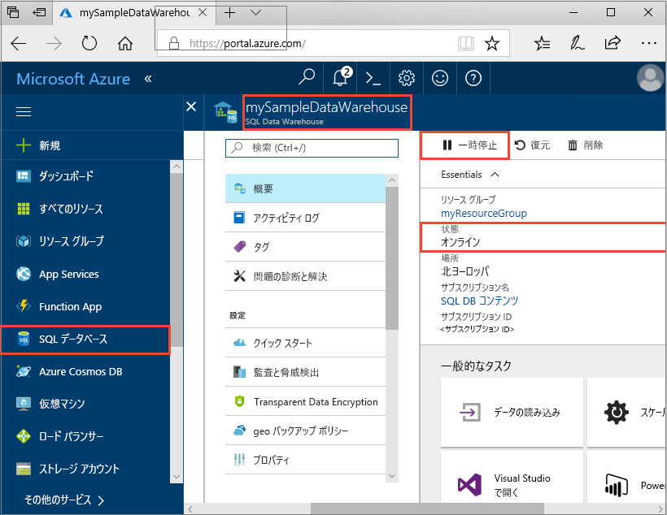
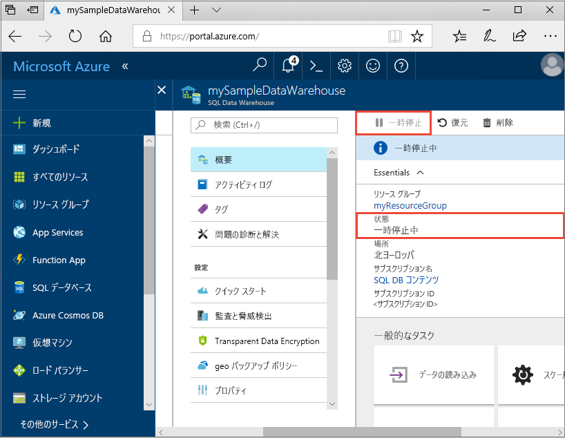
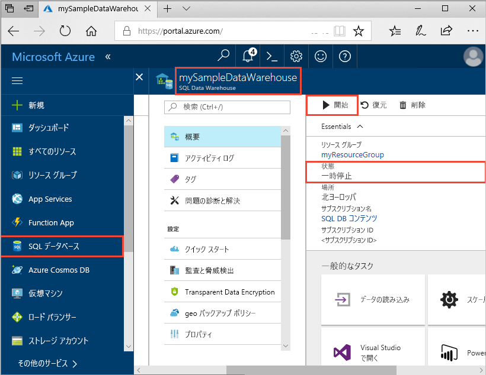
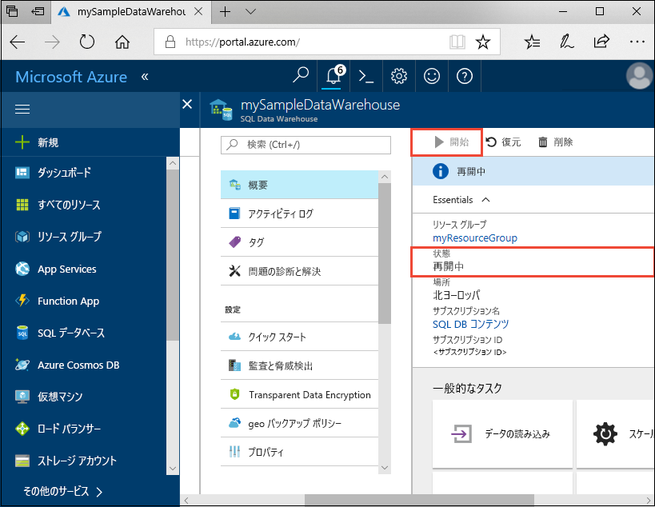

# クイック スタート:Azure portal での Azure SQL Data Warehouse のコンピューティングの一時停止と再開

Azure Portal を使用して、Azure SQL Data Warehouse のコンピューティングを一時停止し、コストを節約します。 データ ウェアハウスを使用する準備ができたら、[コンピューティングを再開](sql-data-warehouse-manage-compute-overview.md)します。

Azure サブスクリプションをお持ちでない場合は、開始する前に[無料](https://azure.microsoft.com/free/)アカウントを作成してください。

## Azure ポータルにサインインします。

[Azure Portal](https://portal.azure.com/) にサインインします。

## 開始する前に

[Azure Portal での作成と接続](create-data-warehouse-portal.md)に関する記事に従って、**mySampleDataWarehouse** という名前のデータ ウェアハウスを作成してください。 

## コンピューティングの一時停止

コストを節約するために、オンデマンドでコンピューティング リソースを一時停止および再開できます。 たとえば、夜間と週末にデータベースを使用しない場合、その期間にデータベースを一時停止して、日中に再開することができます。 データベースが一時停止されている間、コンピューティング リソースへの課金は行われません。 ただし、ストレージに対する課金は引き続き行われます。 

SQL Data Warehouse を一時停止するには、次の手順を実行します。

1. Azure Portal の左側のページで **[SQL データベース]** を選択します。
2. **[SQL データベース]** ページから **[mySampleDataWarehouse]** を選択します。 これにより、データ ウェアハウスが開きます。 
3. **[mySampleDataWarehouse]** ページで **[状態]** が **[オンライン]** になっていることがわかります。

    

4. データ ウェアハウスを一時停止するには、**[一時停止]** ボタンをクリックします。 
5. 続行してよいかどうかを確認するメッセージが表示されます。 **[はい]** をクリックします。
6. 少し待つと、**[状態]** が **[一時停止中]** になります。

    

7. 一時停止操作が完了すると、状態が **[一時停止]** になり、オプション ボタンが **[開始]** になります。
8. これでデータ ウェアハウスのコンピューティング リソースがオフラインになりました。 サービスを再開するまで、コンピューティングの料金は発生しません。

    

## コンピューティングの再開

SQL Data Warehouse を再開するには、次の手順を実行します。

1. Azure Portal の左側のページで **[SQL データベース]** を選択します。
2. **[SQL データベース]** ページから **[mySampleDataWarehouse]** を選択します。 これにより、データ ウェアハウスが開きます。 
3. **[mySampleDataWarehouse]** ページで **[状態]** が **[一時停止]** になっていることがわかります。

    

4. データ ウェアハウスを再開するには、**[開始]** をクリックします。 
5. 開始してよいかどうかを確認するメッセージが表示されます。 **[はい]** をクリックします。
6. **[状態]** が **[再開中]** になっていることがわかります。

    

7. データ ウェアハウスがオンライン状態に戻ると、状態が **[オンライン]** になり、オプション ボタンが **[一時停止]** になります。
8. これでデータ ウェアハウスのコンピューティング リソースがオンラインになりました。サービスを使用することができます。 コンピューティングの課金が再開されます。

    

## リソースのクリーンアップ

データ ウェアハウス ユニットとデータ ウェアハウスに格納されているデータに対して課金されます。 これらのコンピューティングとストレージのリソースは別々に請求されます。 

- データをストレージ内に保持する場合は、コンピューティングを一時停止します。
- それ以上課金されないようにする場合は、データ ウェアハウスを削除できます。 

必要に応じて、以下の手順でリソースをクリーンアップします。

1. [Azure Portal](https://portal.azure.com) にサインインし、データ ウェアハウスをクリックします。

    

1. コンピューティング リソースを一時停止するには、**[一時停止]** ボタンをクリックします。 データ ウェアハウスが一時停止すると、ボタンの表示が **[開始]** になります。  コンピューティング リソースを再開するには、**[開始]** をクリックします。

2. コンピューティング リソースやストレージに課金されないようにデータ ウェアハウスを削除するには、**[削除]** をクリックします。

3. 作成した SQL Server を削除するには、**mynewserver-20171113.database.windows.net** をクリックした後、**[削除]** をクリックします。  サーバーを削除すると、サーバーに割り当てられているすべてのデータベースが削除されるので、削除には注意してください。

4. リソース グループを削除するには、**myResourceGroup** をクリックして、**[リソース グループの削除]** をクリックします。

## 次の手順

データ ウェアハウスに対するコンピューティングの一時停止と再開を行いました。 Azure SQL Data Warehouse の詳細については、データの読み込みに関するチュートリアルを参照してください。

> [!div class="nextstepaction"]
> [SQL Data Warehouse にデータを読み込む](load-data-from-azure-blob-storage-using-polybase.md)
