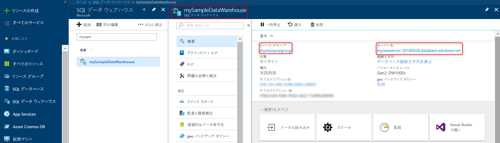

# <a name="quickstart-pause-and-resume-compute-in-azure-synapse-analytics-sql-pool-with-azure-powershell"></a>クイック スタート:Azure PowerShell を使用して Azure Synapse Analytics の SQL プールのコンピューティングを一時停止、再開する

Azure PowerShell を使用して、SQL プールのコンピューティングを一時停止してコストを節約します。 データ ウェアハウスを使用する準備ができたら、[コンピューティングを再開](sql-data-warehouse-manage-compute-overview.md)します。

Azure サブスクリプションをお持ちでない場合は、開始する前に[無料](https://azure.microsoft.com/free/)アカウントを作成してください。

## <a name="before-you-begin"></a>開始する前に

[!INCLUDE [updated-for-az](../../includes/updated-for-az.md)]

このクイックスタートでは、一時停止して再開できる SQL プールが既に用意されていることを前提とします。 作成する必要がある場合は、[ポータルでの作成と接続](create-data-warehouse-portal.md)に関する記事に従って、**mySampleDataWarehouse** という名前の SQL プールを作成してください。

## <a name="log-in-to-azure"></a>Azure にログインする

[Connect-AzAccount](/powershell/module/az.accounts/connect-azaccount) コマンドで Azure サブスクリプションにログインし、画面上の指示に従います。

```powershell
Connect-AzAccount
```

使用しているサブスクリプションを確認するには、[Get-AzSubscription](/powershell/module/az.accounts/get-azsubscription) を実行します。

```powershell
Get-AzSubscription
```

既定ではない別のサブスクリプションを使用する必要がある場合は、[Set-AzContext](/powershell/module/az.accounts/set-azcontext) を実行します。

```powershell
Set-AzContext -SubscriptionName "MySubscription"
```

## <a name="look-up-data-warehouse-information"></a>データ ウェアハウスの情報を調べる

一時停止して再開する予定の SQL プールのデータベース名、サーバー名、リソース グループを見つけます。

次の手順に従って、SQL プールの場所の情報を検索します。

1. [Azure portal](https://portal.azure.com/) にサインインします。
1. Azure portal の左側のページで **[Azure Synapse Analytics (以前の SQL DW)]** をクリックします。
1. **[Azure Synapse Analytics (以前の SQL DW)]** ページから **[mySampleDataWarehouse]** を選択します。 データ ウェアハウスが開きます。

    

1. データ ウェアハウスの名前 (データベース名) を書き留めます。 サーバー名とリソース グループも書き留めます。
1. PowerShell コマンドレットで使用するのは、サーバー名の最初の部分のみです。 前の図では、サーバーの完全名は sqlpoolservername.database.windows.net です。 PowerShell コマンドレットでは、サーバー名として **sqlpoolservername** を使用します。

## <a name="pause-compute"></a>コンピューティングの一時停止

コストを節約するために、オンデマンドでコンピューティング リソースを一時停止および再開できます。 たとえば、夜間と週末にデータベースを使用しない場合、その期間にデータベースを一時停止して、日中に再開することができます。 データベースが一時停止されている間、コンピューティング リソースへの課金は行われません。 ただし、ストレージに対する課金は引き続き行われます。

データベースを一時停止するには、[Suspend-AzSqlDatabase](/powershell/module/az.sql/suspend-azsqldatabase) コマンドレットを使用します。 次の例は、**sqlpoolservername** という名前のサーバーでホストされている **mySampleDataWarehouse** という名前のデータ ウェアハウスを一時停止します。 このサーバーは、**myResourceGroup** という名前の Azure リソース グループ内にあります。


```Powershell
Suspend-AzSqlDatabase –ResourceGroupName "myResourceGroup" `
–ServerName "nsqlpoolservername" –DatabaseName "mySampleDataWarehouse"
```

バリエーションの 1 つとして、次の例では $database オブジェクトにデータベースを取り込みます。 オブジェクトは [Suspend-AzSqlDatabase](/powershell/module/az.sql/suspend-azsqldatabase) にパイプ処理されます。 結果は、オブジェクト resultDatabase に格納されます。 最後のコマンドは結果を表示します。

```Powershell
$database = Get-AzSqlDatabase –ResourceGroupName "myResourceGroup" `
–ServerName "sqlpoolservername" –DatabaseName "mySampleDataWarehouse"
$resultDatabase = $database | Suspend-AzSqlDatabase
$resultDatabase
```

## <a name="resume-compute"></a>コンピューティングの再開

データベースを開始するには、[Resume-AzSqlDatabase](/powershell/module/az.sql/resume-azsqldatabase) コマンドレットを使用します。 次の例は、**sqlpoolservername** という名前のサーバーでホストされている **mySampleDataWarehouse** という名前のデータベースを開始します。 このサーバーは、**myResourceGroup** という名前の Azure リソース グループ内にあります。

```Powershell
Resume-AzSqlDatabase –ResourceGroupName "myResourceGroup" `
–ServerName "sqlpoolservername" -DatabaseName "mySampleDataWarehouse"
```

バリエーションの 1 つとして、次の例では $database オブジェクトにデータベースを取り込みます。 オブジェクトは [Resume-AzSqlDatabase](/powershell/module/az.sql/resume-azsqldatabase) にパイプ処理され、結果が $resultDatabase に格納されます。 最後のコマンドは結果を表示します。

```Powershell
$database = Get-AzSqlDatabase –ResourceGroupName "myResourceGroup" `
–ServerName "sqlpoolservername" –DatabaseName "mySampleDataWarehouse"
$resultDatabase = $database | Resume-AzSqlDatabase
$resultDatabase
```

## <a name="check-status-of-your-data-warehouse-operation"></a>データ ウェアハウスの操作の状態の確認

データ ウェアハウスの状態を確認するには、[Get-AzSqlDatabaseActivity](https://docs.microsoft.com/powershell/module/az.sql/Get-AzSqlDatabaseActivity#description) コマンドレットを使用します。

```Powershell
Get-AzSqlDatabaseActivity -ResourceGroupName "myResourceGroup" -ServerName "sqlpoolservername" -DatabaseName "mySampleDataWarehouse"
```

## <a name="clean-up-resources"></a>リソースをクリーンアップする

データ ウェアハウス ユニットとデータ ウェアハウスに格納されているデータに対して課金されます。 これらのコンピューティングとストレージのリソースは別々に請求されます。

- データをストレージ内に保持する場合は、コンピューティングを一時停止します。
- それ以上課金されないようにする場合は、SQL プールを削除できます。

必要に応じて、以下の手順でリソースをクリーンアップします。

1. [Azure portal](https://portal.azure.com) にサインインし、SQL プールをクリックします。

    

2. コンピューティング リソースを一時停止するには、 **[一時停止]** ボタンをクリックします。 SQL プールが一時停止すると、ボタンの表示が **[開始]** になります。  コンピューティング リソースを再開するには、 **[開始]** をクリックします。

3. コンピューティング リソースやストレージに課金されないように SQL プールを削除するには、 **[削除]** をクリックします。

4. 作成した SQL Server を削除するには、**sqlpoolservername.database.windows.net** をクリックした後、 **[削除]** をクリックします。  サーバーを削除すると、サーバーに割り当てられているすべてのデータベースが削除されるので、削除には注意してください。

5. リソース グループを削除するには、**myResourceGroup** をクリックして、 **[リソース グループの削除]** をクリックします。


## <a name="next-steps"></a>次のステップ

SQL プールに対するコンピューティングの一時停止と再開を行いました。 SQL プールに関する理解をさらに深めるために、データの読み込みに関するチュートリアルに進んでください。

> [!div class="nextstepaction"]
> [SQL プールにデータを読み込む](load-data-from-azure-blob-storage-using-polybase.md)
