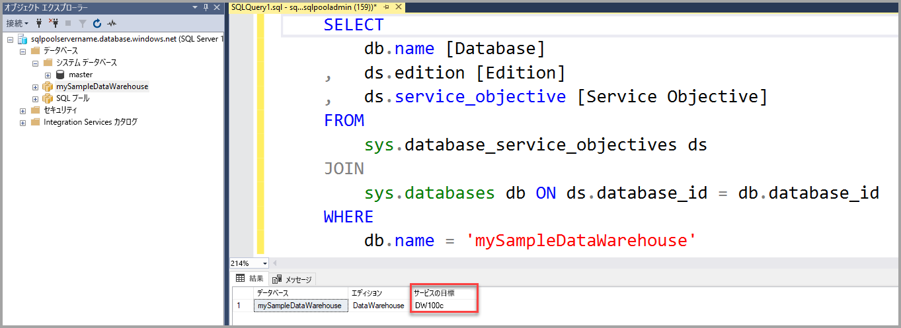

# <a name="quickstart-scale-compute-in-azure-sql-data-warehouse-using-t-sql"></a>クイックスタート: T-SQL を使用して Azure SQL Data Warehouse のコンピューティングをスケーリングする

T-SQL と SQL Server Management Studio (SSMS) を使用して、Azure SQL Data Warehouse のコンピューティングをスケーリングします。 コンピューティングをスケールアウトしてパフォーマンスを向上させます。または、コンピューティングをスケールバックしてコストを削減します。 

Azure サブスクリプションをお持ちでない場合は、開始する前に[無料](https://azure.microsoft.com/free/)アカウントを作成してください。

## <a name="before-you-begin"></a>開始する前に

最新バージョンの [SQL Server Management Studio](/sql/ssms/download-sql-server-management-studio-ssms.md) (SSMS) をダウンロードしてインストールします。

ここでは、[ポータルでの作成と接続に関するクイックスタート](create-data-warehouse-portal.md)を完了していることを前提としています。 作成と接続に関するクイックスタートを完了すると、接続方法がわかります。**mySampleDataWarehouse** という名前のデータ ウェアハウスの作成、クライアントによるサーバーへのアクセスを可能にするファイアウォール規則の作成、インストールが完了します。
 
## <a name="create-a-data-warehouse"></a>データ ウェアハウスの作成

[ポータルでの作成と接続に関するクイックスタート](create-data-warehouse-portal.md)を使用して、**mySampleDataWarehouse** という名前のデータ ウェアハウスを作成します。 クイックスタートを完了して、ファイアウォール規則があり、SQL Server Management Studio 内からデータ ウェアハウスに接続できることを確認します。

## <a name="connect-to-the-server-as-server-admin"></a>サーバー管理者としてサーバーに接続する

このセクションでは、[SQL Server Management Studio](/sql/ssms/download-sql-server-management-studio-ssms.md) (SSMS) を使って、Azure SQL Server に対する接続を確立します。

1. SQL Server Management Studio を開きます。

2. **[サーバーへの接続]** ダイアログ ボックスで、次の情報を入力します。

   | 設定       | 推奨値 | [説明] | 
   | ------------ | ------------------ | ------------------------------------------------- | 
   | サーバーの種類 | データベース エンジン | この値は必須です |
   | サーバー名 | 完全修飾サーバー名 | たとえば、**mynewserver-20171113.database.windows.net** です。 |
   | 認証 | パブリック | このチュートリアルで構成した認証の種類は "SQL 認証" のみです。 |
   | ログイン | サーバー管理者アカウント | これは、サーバーの作成時に指定したアカウントです。 |
   | パスワード | サーバー管理者アカウントのパスワード | これは、サーバーの作成時に指定したパスワードです。 |

    ![[サーバーへの接続]](media/load-data-from-azure-blob-storage-using-polybase/connect-to-server.png)

4. **[接続]**をクリックします。 SSMS でオブジェクト エクスプローラー ウィンドウが開きます。 

5. オブジェクト エクスプローラーで、**[データベース]** を展開します。 **mySampleDatabase** を展開して、新しいデータベースのオブジェクトを表示します。

     

## <a name="view-service-objective"></a>サービス目標の表示
サービス目標設定には、データ ウェアハウスの Data Warehouse ユニットの数が含まれています。 

データ ウェアハウスの現在の Data Warehouse ユニットを表示するには:

1. **mynewserver-20171113.database.windows.net** への接続で、**System Databases** を展開します。
2. **master** を右クリックし、**[新しいクエリ]** を選択します。 新しいクエリ ウィンドウが開きます。
3. 次のクエリを実行して、sys.database_service_objectives 動的管理ビューから選択します。 

    ```sql
    SELECT
        db.name [Database]
    ,   ds.edition [Edition]
    ,   ds.service_objective [Service Objective]
    FROM
        sys.database_service_objectives ds
    JOIN
        sys.databases db ON ds.database_id = db.database_id
    WHERE 
        db.name = 'mySampleDataWarehouse'
    ```

4. 次の結果は、**mySampleDataWarehouse** のサービス目標が DW400 であることを示しています。 

    


## <a name="scale-compute"></a>コンピューティングのスケーリング
SQL Data Warehouse では、Data Warehouse ユニットを調整してコンピューティング リソースを増減させることができます。 [ポータルでの作成と接続](create-data-warehouse-portal.md)では、**mySampleDataWarehouse** を作成し、それを 400 DWU で初期化しました。 次の手順では、**mySampleDataWarehouse** の DWU を調整します。

Data Warehouse ユニットを変更するには:

1. **master** を右クリックし、**[新しいクエリ]** を選択します。
2. [ALTER DATABASE](/sql/t-sql/statements/alter-database-azure-sql-database) T-SQL ステートメントを使用して、サービス目標を変更します。 次のクエリを実行して、サービス目標を DW300 に変更します。 

```Sql
ALTER DATABASE mySampleDataWarehouse
MODIFY (SERVICE_OBJECTIVE = 'DW300')
;
```

## <a name="check-database-state"></a>データベース状態の確認

データベース状態を確認するには、**master** データベースに対して次のクエリを実行します。

```sql
SELECT name AS "Database Name", state_desc AS "Status" 
FROM sys.databases db
WHERE db.name = 'mySampleDataWarehouse'
;
```

このコマンドを実行すると、状態を表す値としてオンライン、一時停止中、再開中、スケーリング、一時停止のいずれかが表示されます。

## <a name="check-operation-status"></a>操作の状態の確認

SQL Data Warehouse に対するさまざまな管理操作に関する情報を返すには、[sys.dm_operation_status](/sql/relational-databases/system-dynamic-management-views/sys-dm-operation-status-azure-sql-database) DMV で次のクエリを実行します。 たとえば、操作と操作の状態 (IN_PROGRESS または COMPLETED) が返されます。

```sql
SELECT *
FROM
    sys.dm_operation_status
WHERE
    resource_type_desc = 'Database'
AND 
    major_resource_id = 'MySQLDW'
```


## <a name="next-steps"></a>次の手順
ここでは、データ ウェアハウスのコンピューティングをスケーリングする方法について学習しました。 Azure SQL Data Warehouse の詳細については、データの読み込みに関するチュートリアルを参照してください。

> [!div class="nextstepaction"]
>[SQL Data Warehouse にデータを読み込む](load-data-from-azure-blob-storage-using-polybase.md)
