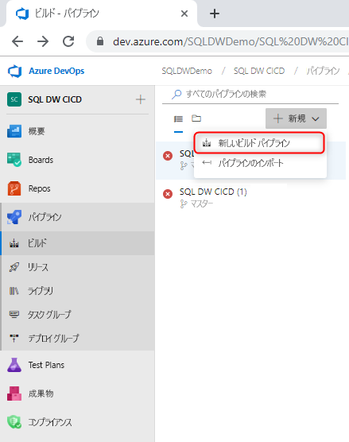
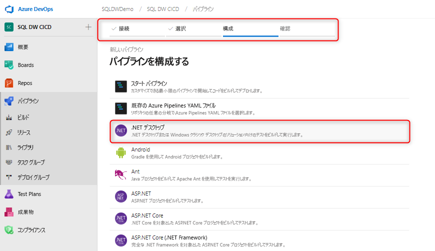
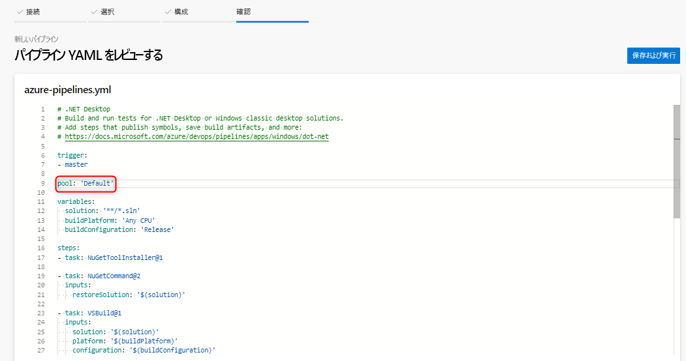
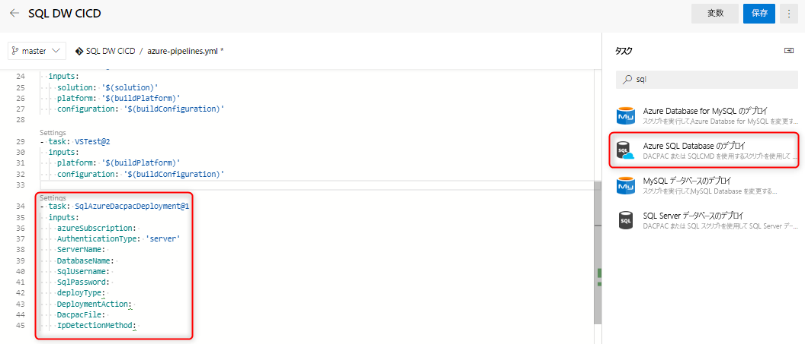
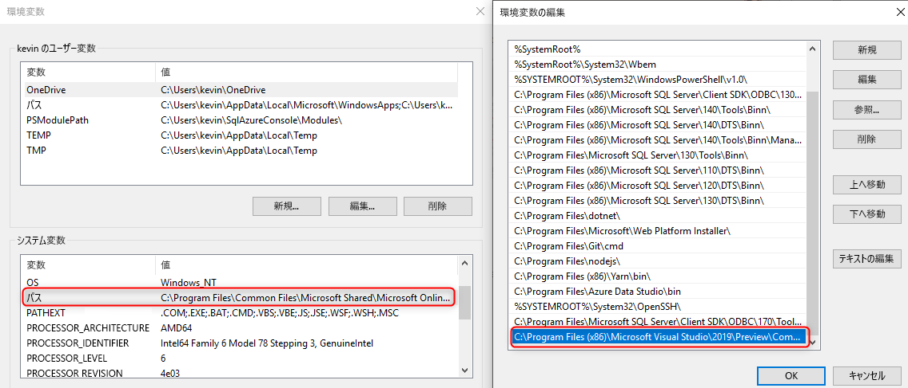

# Azure SQL Data Warehouse のための継続的インテグレーションとデプロイ

この簡単なチュートリアルでは、SQL Server Data tools (SSDT) データベース プロジェクトを Azure DevOps と統合し、Azure Pipelines を利用して継続的インテグレーションとデプロイを設定する方法の概要を説明します。 このチュートリアルは、SQL Data Warehouse を使用して継続的インテグレーションおよびデプロイ パイプラインを構築するための 2 番目の手順です。 

## 開始する前に

- [ソース管理の統合のチュートリアル](https://docs.microsoft.com/azure/sql-data-warehouse/sql-data-warehouse-source-control-integration)を実行します

- SQL Data Warehouse (プレビュー) 用に SSDT Preview Bits (16.3 プレビュー 2 以降) がインストールされた[セルフ ホステッド エージェント](https://docs.microsoft.com/azure/devops/pipelines/agents/agents?view=azure-devops#install)を作成します

- Azure DevOps を設定して接続する

  > [!NOTE]
  > SSDT は現在プレビュー段階であり、セルフ ホステッド エージェントを利用する必要があります。 Microsoft によってホストされるエージェントは、数か月以内に更新されます。

## Visual Studio ビルドを使用した継続的インテグレーション

1. Azure Pipelines に移動し、新しいビルド パイプラインを作成します

      

2. ソース コード リポジトリ (Azure Repos Git) を選択し、.NET デスクトップ アプリ テンプレートを選択します

       

3. エージェントの適切なプールを使用するように YAML ファイルを編集します。 YAML ファイルは、次のようになります。

      

この時点で、ソース管理リポジトリの master ブランチにチェックインすると、データベース プロジェクトの Visual Studio ビルドが成功したことが自動的にトリガーされる単純な環境ができています。 ローカル データベース プロジェクトに変更を加え、その変更を master ブランチにチェックインして、オートメーション全体が正常に機能していることを検証します。

## Azure SQL Database デプロイ タスクを使用した継続的なデプロイ

1. [Azure SQL Database デプロイ タスク](https://docs.microsoft.com/azure/devops/pipelines/tasks/deploy/sql-azure-dacpac-deployment?view=azure-devops)を使用して新しいタスクを追加し、ターゲット データ ウェアハウスへの接続に必要なフィールドに入力します。 このタスクを実行すると、前のビルド プロセスから生成された DACPAC がターゲット データ ウェアハウスにデプロイされます。

      

2. セルフ ホステッド エージェントを使用する場合は、SQL Data Warehouse 用の正しい SqlPackage.exe を使用するように環境変数を設定してください。 パスは次のようになります。

      

   C:\Program Files (x86)\Microsoft Visual Studio\2019\Preview\Common7\IDE\Extensions\Microsoft\SQLDB\DAC\150  

   パイプラインを実行して検証します。 ローカルで変更を行い、自動的なビルドとデプロイを生成する必要があるソース管理に変更をチェックインすることができます。

## 次の手順

- [Azure SQL Data Warehouse アーキテクチャ](/azure/sql-data-warehouse/massively-parallel-processing-mpp-architecture)を確認する
- 迅速に [SQL Data Warehouse を作成する][create a SQL Data Warehouse]
- [サンプル データを読み込む][load sample data]
- [ビデオ](/azure/sql-data-warehouse/sql-data-warehouse-videos)を確認する

<!--Image references-->

[1]: ./media/sql-data-warehouse-overview-what-is/dwarchitecture.png

<!--Article references-->
[Create a support ticket]: ./sql-data-warehouse-get-started-create-support-ticket.md
[load sample data]: ./sql-data-warehouse-load-sample-databases.md
[create a SQL Data Warehouse]: ./sql-data-warehouse-get-started-provision.md
[Migration documentation]: ./sql-data-warehouse-overview-migrate.md
[SQL Data Warehouse solution partners]: ./sql-data-warehouse-partner-business-intelligence.md
[Integrated tools overview]: ./sql-data-warehouse-overview-integrate.md
[Backup and restore overview]: ./sql-data-warehouse-restore-database-overview.md
[Azure glossary]: ../azure-glossary-cloud-terminology.md

<!--MSDN references-->

<!--Other Web references-->
[Blogs]: https://azure.microsoft.com/blog/tag/azure-sql-data-warehouse/
[Customer Advisory Team blogs]: https://blogs.msdn.microsoft.com/sqlcat/tag/sql-dw/
[Feature requests]: https://feedback.azure.com/forums/307516-sql-data-warehouse
[MSDN forum]: https://social.msdn.microsoft.com/Forums/azure/home?forum=AzureSQLDataWarehouse
[Stack Overflow forum]: https://stackoverflow.com/questions/tagged/azure-sqldw
[Twitter]: https://twitter.com/hashtag/SQLDW
[Videos]: https://azure.microsoft.com/documentation/videos/index/?services=sql-data-warehouse
[SLA for SQL Data Warehouse]: https://azure.microsoft.com/support/legal/sla/sql-data-warehouse/v1_0/
[Volume Licensing]: https://www.microsoftvolumelicensing.com/DocumentSearch.aspx?Mode=3&DocumentTypeId=37
[Service Level Agreements]: https://azure.microsoft.com/support/legal/sla/
