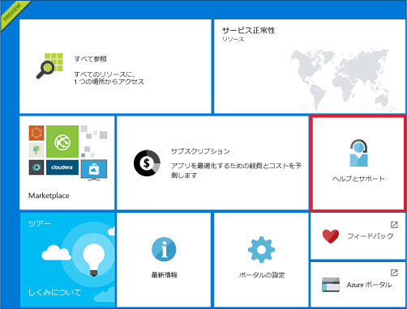
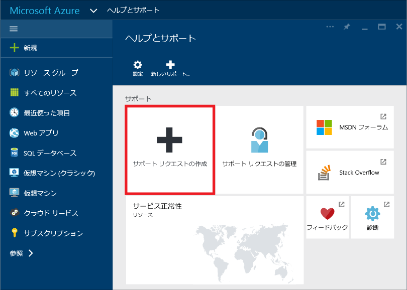
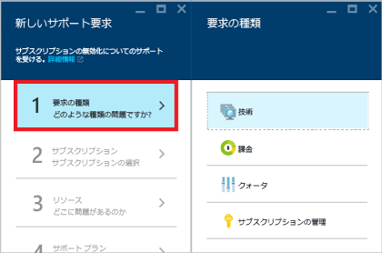
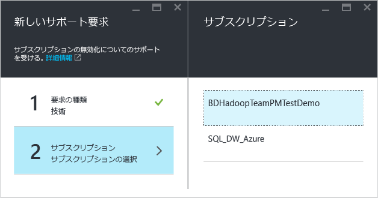
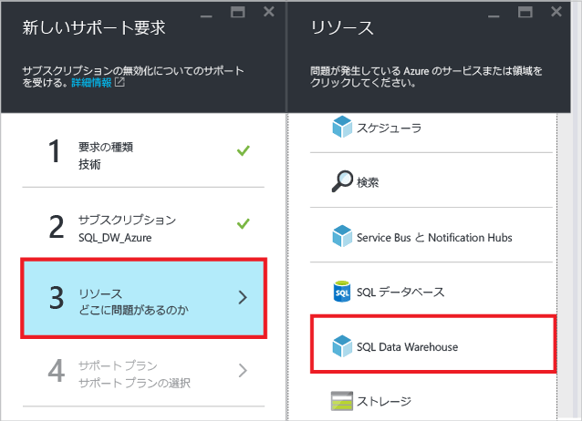
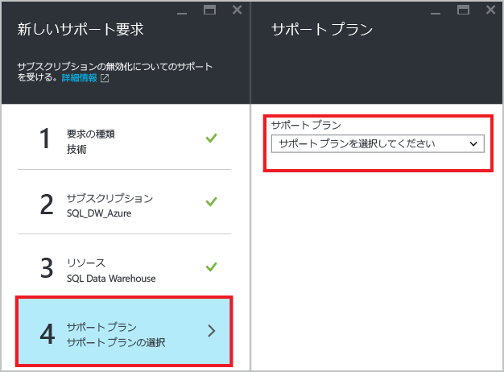
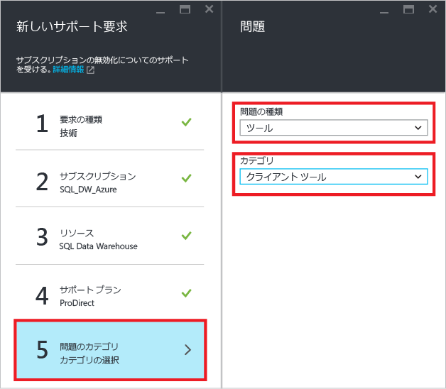
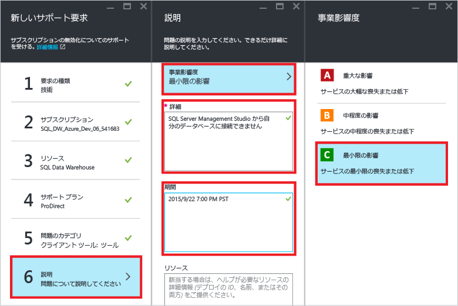
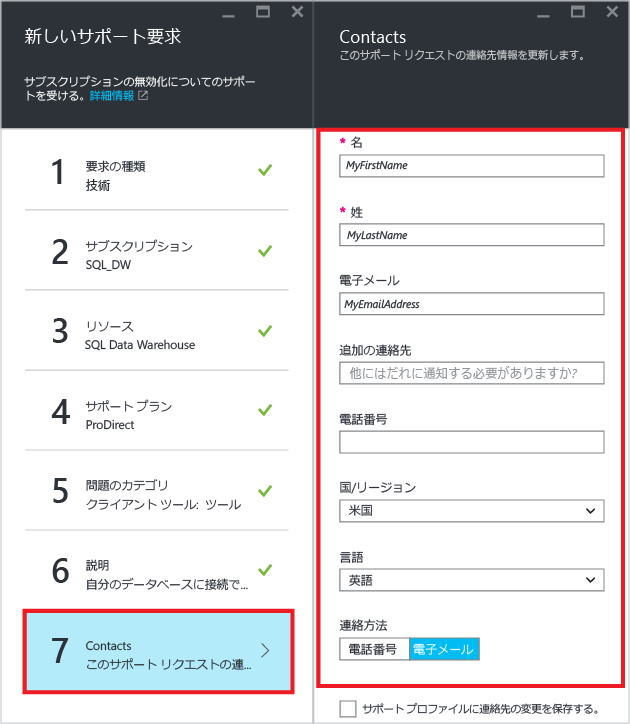
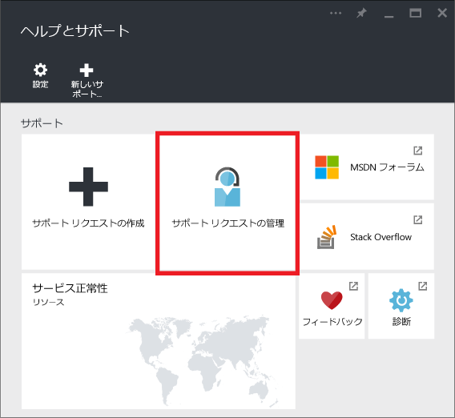

<properties
   pageTitle="SQL Data Warehouse のサポート チケットを作成する方法 | Microsoft Azure"
   description="Azure SQL Data Warehouse でサポート チケットを作成する方法。"
   services="sql-data-warehouse"
   documentationCenter="NA"
   authors="sonyam"
   manager="barbkess"
   editor=""/>

<tags
   ms.service="sql-data-warehouse"
   ms.devlang="NA"
   ms.topic="get-started-article"
   ms.tgt_pltfrm="NA"
   ms.workload="data-services"
   ms.date="09/01/2016"
   ms.author="sonyama;barbkess"/>

# SQL Data Warehouse のサポート チケットを作成する方法
 
SQL Data Warehouse で問題が発生した場合は、サポート チケットを作成してください。エンジニアリング チームがサポートいたします。

## サポート チケットの作成

1. [Azure ポータル][] を開きます。

2. ホーム画面で **[ヘルプとサポート]** タイルをクリックします。

    

3. [ヘルプとサポート] ブレードで **[サポート要求の作成]** をクリックします。

    
    
    

4. **[要求の種類]** を選択します。

    
    
    >[AZURE.NOTE]  既定では、各 SQL Server (myserver.database.windows.net など) の **DTU クォータ**は 45,000 に設定されています。このクォータは単に安全上の制限です。サポート チケットを作成し、要求の種類として *[クォータ]* を選択すれば、クォータを引き上げることができます。実際に必要な DTU を計算するには、必要とされる [DWU][] の合計に 7.5 を掛けます。たとえば、2 つの DW6000 を 1 つの SQL Server でホストする場合、90,000 の DTU クォータを要求する必要があります。現在の DTU 消費量は、ポータルの [SQL Server] ブレードから確認できます。DTU クォータには、一時停止しているデータベースと一時停止していないデータベースの両方が考慮されます。

5. 報告する問題が発生しているデータベースをホストしている **[サブスクリプション]** を選択します。

    

6. [リソース] として **[SQL Data Warehouse]** を選択します。

    

7. [Azure サポート プラン][] を選択します。

    - **課金、クォータ、サブスクリプション管理**のサポートは、すべてのサポート レベルでご利用いただけます。
    - **障害対応**のサポートは、[Developer][] サポート、[Standard][] サポート、[Professional Direct][] サポート、[Premier][] サポートにより提供されます。障害対応のサポートとは、Azure のご利用に際して発生した、マイクロソフトが原因と想定される問題への対応です。
    - **開発者支援**および**アドバイザリ サービス**は、[Professional Direct][] サポートと [Premier][] サポートでご利用いただけます。
    
    Premier サポート プランを持っている場合は、[Microsoft Premier オンライン ポータル][]でも SQL Data Warehouse 関連の問題を連絡できます。サポートの範囲、応答時間、価格など各プランの詳細については、[Azure サポート プラン][Azure support plan]をご覧ください。Azure のサポートに関してよく寄せられる質問については、「[Azure サポートに関する FAQ][]」をご覧ください。

    

8. **[問題の種類]** と **[カテゴリ]** を選択します。

    

9. 問題を記述し、業務への影響のレベルを選択します。

    

10. このサポート チケットの**連絡先情報**は自動的に設定されます。必要な場合は更新します。

    

11. **[作成]** をクリックしてサポート要求を送信します。

## サポート チケットの状態の確認

サポート要求を送信すると、Azure サポート チームから連絡があります。要求の状態と詳細を確認するには、ダッシュボードで **[サポート要求の管理]** をクリックします。

## その他のリソース

さらに、[Stack Overflow][] または [Azure SQL Data Warehouse MSDN フォーラム][]で SQL Data Warehouse のコミュニティと交流することができます。

<!--Image references--> 

<!--Article references--> 
[DWU]: ./sql-data-warehouse-overview-what-is.md#data-warehouse-units

<!--MSDN references--> 

<!--Other web references--> 
[Azure ポータル]: https://portal.azure.com/
[Azure support plan]: https://azure.microsoft.com/support/plans/?WT.mc_id=Support_Plan_510979/
[Azure サポート プラン]: https://azure.microsoft.com/support/plans/?WT.mc_id=Support_Plan_510979/
[Developer]: https://azure.microsoft.com/support/plans/developer/
[Standard]: https://azure.microsoft.com/support/plans/standard/
[Professional Direct]: https://azure.microsoft.com/support/plans/prodirect/
[Premier]: https://azure.microsoft.com/support/plans/premier/
[Azure サポートに関する FAQ]: https://azure.microsoft.com/support/faq/
[Microsoft Premier オンライン ポータル]: https://premier.microsoft.com/
[Stack Overflow]: https://stackoverflow.com/questions/tagged/azure-sqldw/
[Azure SQL Data Warehouse MSDN フォーラム]: https://social.msdn.microsoft.com/Forums/home?forum=AzureSQLDataWarehouse/

<!-------HONumber=AcomDC_0907_2016-->