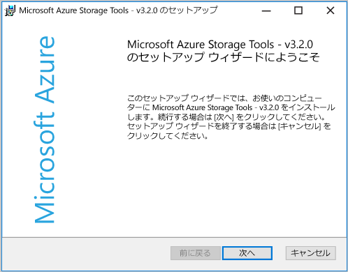
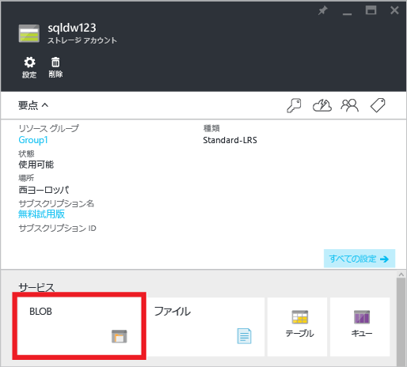
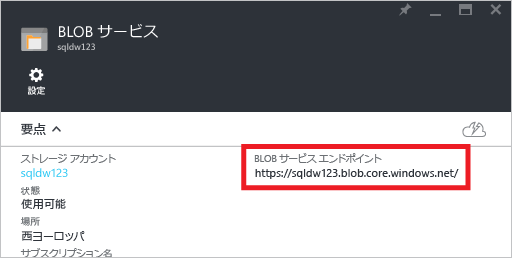
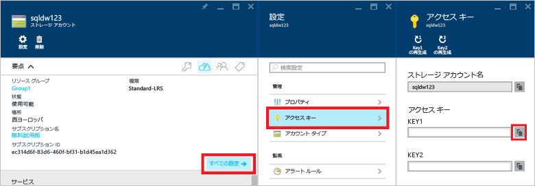
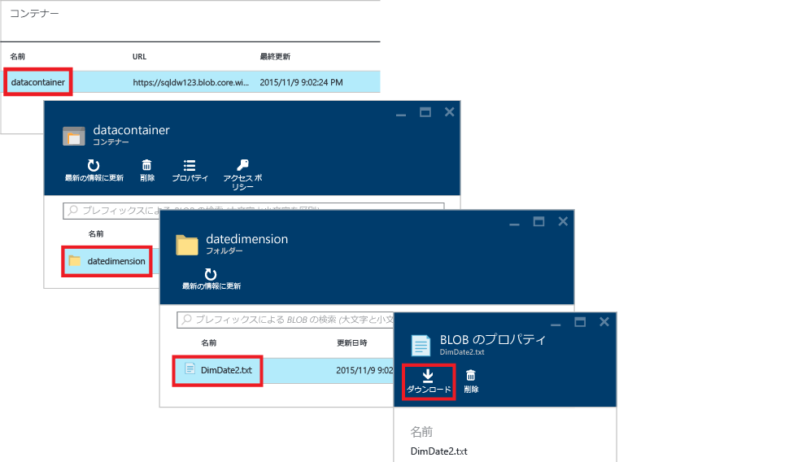
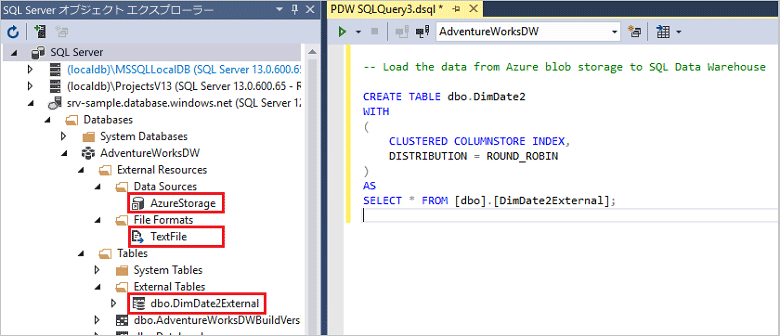

<properties
   pageTitle="SQL Data Warehouse の PolyBase チュートリアル | Microsoft Azure"
   description="データ ウェアハウジングのシナリオに沿って、PolyBase の概要と、その使用方法を学習します。"
   services="sql-data-warehouse"
   documentationCenter="NA"
   authors="ckarst"
   manager="barbkess"
   editor=""/>

<tags
   ms.service="sql-data-warehouse"
   ms.devlang="NA"
   ms.topic="get-started-article"
   ms.tgt_pltfrm="NA"
   ms.workload="data-services"
   ms.date="06/30/2016"
   ms.author="cakarst;barbkess;sonyama"/>


# SQL Data Warehouse で PolyBase によってデータを読み込む

> [AZURE.SELECTOR]
- [Data Factory](sql-data-warehouse-get-started-load-with-azure-data-factory.md)
- [PolyBase](sql-data-warehouse-get-started-load-with-polybase.md)
- [BCP](sql-data-warehouse-load-with-bcp.md)

このチュートリアルでは、AzCopy と PolyBase を使用して SQL Data Warehouse にデータを読み込む方法を説明します。このチュートリアルを行うと、以下の作業方法がわかります。

- AzCopy を使用して Azure Blob Storage にデータをコピーする
- データを定義するデータベース オブジェクトを作成する
- データを読み込む T-SQL クエリを実行する

>[AZURE.VIDEO loading-data-with-polybase-in-azure-sql-data-warehouse]

## 前提条件

このチュートリアルを進めるには、次のものが必要です。

- SQL Data Warehouse データベース
- 種類が Standard ローカル冗長ストレージ (Standard-LRS)、Standard geo 冗長ストレージ (Standard-GRS)、または Standard 読み取りアクセス geo 冗長ストレージ (Standard-RAGRS) である Azure ストレージ アカウント
- AzCopy コマンド ライン ユーティリティMicrosoft Azure Storage Tools と共にインストールされる [最新バージョンの AzCopy][] をダウンロードしてインストールします。

    


## 手順 1: Azure Blob Storage にサンプル データを追加する

データを読み込むには、Azure Blob Storage にサンプル データを配置する必要があります。この手順では、Azure Storage BLOB にサンプル データを設定します。その後、PolyBase を使用して、このサンプル データを SQL Data Warehouse データベースに読み込みます。

### A.サンプル テキスト ファイルを準備する

サンプル テキスト ファイルを準備するには:

1. メモ帳を開き、データの次の行を新しいファイルにコピーします。これをローカル一時ディレクトリに %temp%\\DimDate2.txt として保存します。

```
20150301,1,3
20150501,2,4
20151001,4,2
20150201,1,3
20151201,4,2
20150801,3,1
20150601,2,4
20151101,4,2
20150401,2,4
20150701,3,1
20150901,3,1
20150101,1,3
```

### B.BLOB サービス エンドポイントを検索する

BLOB サービス エンドポイントを検索するには:

1. Azure ポータルで、**[参照]**、**[ストレージ アカウント]** の順に選択します。
2. 使用するストレージ アカウントをクリックします。
3. ストレージ アカウントのブレードで、BLOB をクリックします。

    

1. 後の操作のために、BLOB サービス エンドポイントの URL を保存しておきます。

    

### C.Azure ストレージ キーを検索する

Azure ストレージ キーを検索するには:

1. Azure ポータルで、**[参照]**、**[ストレージ アカウント]** の順に選択します。
2. 使用するストレージ アカウントをクリックします。
3. **[すべての設定]**、**[アクセス キー]** の順に選択します。
4. いずれかのアクセス キーをクリップボードにコピーするために、コピー ボックスをクリックします。

    

### D.サンプル ファイルを Azure Blob Storage にコピーする

Azure Blob Storage にデータをコピーするには:

1. コマンド プロンプトを開き、ディレクトリを AzCopy インストール ディレクトリに変更します。このコマンドによって、64 ビットの Windows クライアント上の既定のインストール ディレクトリに移動します。

    ```
    cd /d "%ProgramFiles(x86)%\Microsoft SDKs\Azure\AzCopy"
    ```

1. 次のコマンドを実行してファイルをアップロードします。<blob service endpoint URL> に BLOB サービス エンドポイント URL を指定し、<azure\_storage\_account\_key> に Azure ストレージ アカウント キーを指定します。

    ```
    .\AzCopy.exe /Source:C:\Temp\ /Dest:<blob service endpoint URL> /datacontainer/datedimension/ /DestKey:<azure_storage_account_key> /Pattern:DimDate2.txt
    ```

「[AzCopy コマンド ライン ユーティリティの概要][]」も参照してください。

### E.Blob Storage コンテナーを調べる

Blob Storage にアップロードしたファイルを表示するには:

1. BLOB サービス ブレードに戻ります。
2. [コンテナー] の下の **[データコンテナー]** をダブルクリックします。
3. データへのパスをたどるために **datedimension** フォルダーをクリックすると、アップロードした **DimDate2.txt** ファイルが表示されます。
4. プロパティを表示するには、**DimDate2.txt** をクリックします。
5. BLOB プロパティ ブレードでは、ファイルをダウンロードまたは削除することができます。

    


## 手順 2: サンプル データ用の外部テーブルを作成する

このセクションでは、サンプル データを定義する外部テーブルを作成します。

PolyBase では、外部テーブルを使用して、Azure Blob Storage 内のデータにアクセスします。データは SQL Data Warehouse 内に保存されないため、PolyBase は、データベース スコープの資格情報を使用して、外部データへの認証を処理します。

この手順の例では、以下の Transact-SQL ステートメントを使用して、外部テーブルを作成します。

- [Create Master Key (Transact-SQL)][]\: データベース スコープの資格情報のシークレットを暗号化します。
- [Create Database Scoped Credential (Transact-SQL)][]\: Azure ストレージ アカウントの認証情報を指定します。
- [Create External Data Source (Transact-SQL)][]\: Azure Blob Storage の場所を指定します。
- [Create External File Format (Transact-SQL)][]\: データの形式を指定します。
- [Create External Table (Transact-SQL)][]\: テーブル定義とデータの場所を指定します。

SQL Data Warehouse データベースに対して、このクエリを実行します。Azure Blob Storage 内の DimDate2.txt サンプル データを指す dbo スキーマに、DimDate2External という名前の外部テーブルが作成されます。


```sql
-- A: Create a master key.
-- Only necessary if one does not already exist.
-- Required to encrypt the credential secret in the next step.

CREATE MASTER KEY;


-- B: Create a database scoped credential
-- IDENTITY: Provide any string, it is not used for authentication to Azure storage.
-- SECRET: Provide your Azure storage account key.


CREATE DATABASE SCOPED CREDENTIAL AzureStorageCredential
WITH
    IDENTITY = 'user',
    SECRET = '<azure_storage_account_key>'
;


-- C: Create an external data source
-- TYPE: HADOOP - PolyBase uses Hadoop APIs to access data in Azure blob storage.
-- LOCATION: Provide Azure storage account name and blob container name.
-- CREDENTIAL: Provide the credential created in the previous step.

CREATE EXTERNAL DATA SOURCE AzureStorage
WITH (
    TYPE = HADOOP,
    LOCATION = 'wasbs://<blob_container_name>@<azure_storage_account_name>.blob.core.windows.net',
    CREDENTIAL = AzureStorageCredential
);


-- D: Create an external file format
-- FORMAT_TYPE: Type of file format in Azure storage (supported: DELIMITEDTEXT, RCFILE, ORC, PARQUET).
-- FORMAT_OPTIONS: Specify field terminator, string delimiter, date format etc. for delimited text files.
-- Specify DATA_COMPRESSION method if data is compressed.

CREATE EXTERNAL FILE FORMAT TextFile
WITH (
    FORMAT_TYPE = DelimitedText,
    FORMAT_OPTIONS (FIELD_TERMINATOR = ',')
);


-- E: Create the external table
-- Specify column names and data types. This needs to match the data in the sample file.
-- LOCATION: Specify path to file or directory that contains the data (relative to the blob container).
-- To point to all files under the blob container, use LOCATION='.'

CREATE EXTERNAL TABLE dbo.DimDate2External (
    DateId INT NOT NULL,
    CalendarQuarter TINYINT NOT NULL,
    FiscalQuarter TINYINT NOT NULL
)
WITH (
    LOCATION='/datedimension/',
    DATA_SOURCE=AzureStorage,
    FILE_FORMAT=TextFile
);


-- Run a query on the external table

SELECT count(*) FROM dbo.DimDate2External;

```


Visual Studio の SQL Server オブジェクト エクスプローラーで、外部ファイル形式、外部データ ソース、および DimDate2External テーブルを表示できます。



## 手順 3: SQL Data Warehouse にデータを読み込む

外部テーブルが作成されたので、新しいテーブルにデータを読み込むか、既存のテーブルに挿入することができます。

- 新しいテーブルにデータを読み込むには、[CREATE TABLE AS SELECT (Transact-SQL)][] ステートメントを実行します。新しいテーブルには、クエリで指定された列があります。列のデータ型は、外部テーブル定義内のデータ型と一致します。
- 既存のテーブルにデータを読み込むには、[INSERT...SELECT (Transact-SQL)][] ステートメントを使用します。

```sql
-- Load the data from Azure blob storage to SQL Data Warehouse

CREATE TABLE dbo.DimDate2
WITH
(   
    CLUSTERED COLUMNSTORE INDEX,
    DISTRIBUTION = ROUND_ROBIN
)
AS
SELECT * FROM [dbo].[DimDate2External];
```

## 手順 4: 新しく読み込んだデータの統計を作成する

SQL Data Warehouse は、統計の自動作成または自動更新を行いません。そのため、高いクエリ パフォーマンスを実現するには、最初の読み込み後に各テーブルの各列についての統計を作成することが重要です。また、データが大幅に変更された後で統計を更新することも重要です。

この例では、新しい DimDate2 テーブルに単一列統計を作成します。

```sql
CREATE STATISTICS [DateId] on [DimDate2] \([DateId]);
CREATE STATISTICS [CalendarQuarter] on [DimDate2] \([CalendarQuarter]);
CREATE STATISTICS [FiscalQuarter] on [DimDate2] \([FiscalQuarter]);
```

詳細については、[統計][]に関するページを参照してください。


## 次のステップ
PolyBase を使用するソリューションを開発する際に知っておく必要がある情報については、[PolyBase ガイド][]を参照してください。

<!--Image references-->


<!--Article references-->
[PolyBase in SQL Data Warehouse Tutorial]: ./sql-data-warehouse-get-started-load-with-polybase.md
[Load data with bcp]: ./sql-data-warehouse-load-with-bcp.md
[統計]: ./sql-data-warehouse-tables-statistics.md
[PolyBase ガイド]: ./sql-data-warehouse-load-polybase-guide.md
[AzCopy コマンド ライン ユーティリティの概要]: ../storage/storage-use-azcopy.md
[最新バージョンの AzCopy]: ../storage/storage-use-azcopy.md

<!--External references-->
[supported source/sink]: https://msdn.microsoft.com/library/dn894007.aspx
[copy activity]: https://msdn.microsoft.com/library/dn835035.aspx
[SQL Server destination adapter]: https://msdn.microsoft.com/library/ms141095.aspx
[SSIS]: https://msdn.microsoft.com/library/ms141026.aspx


[Create External Data Source (Transact-SQL)]: https://msdn.microsoft.com/library/dn935022.aspx
[Create External File Format (Transact-SQL)]: https://msdn.microsoft.com/library/dn935026.aspx
[Create External Table (Transact-SQL)]: https://msdn.microsoft.com/library/dn935021.aspx

[DROP EXTERNAL DATA SOURCE (Transact-SQL)]: https://msdn.microsoft.com/library/mt146367.aspx
[DROP EXTERNAL FILE FORMAT (Transact-SQL)]: https://msdn.microsoft.com/library/mt146379.aspx
[DROP EXTERNAL TABLE (Transact-SQL)]: https://msdn.microsoft.com/library/mt130698.aspx

[CREATE TABLE AS SELECT (Transact-SQL)]: https://msdn.microsoft.com/library/mt204041.aspx
[INSERT...SELECT (Transact-SQL)]: https://msdn.microsoft.com/library/ms174335.aspx
[Create Master Key (Transact-SQL)]: https://msdn.microsoft.com/library/ms174382.aspx
[CREATE CREDENTIAL (Transact-SQL)]: https://msdn.microsoft.com/library/ms189522.aspx
[Create Database Scoped Credential (Transact-SQL)]: https://msdn.microsoft.com/library/mt270260.aspx
[DROP CREDENTIAL (Transact-SQL)]: https://msdn.microsoft.com/library/ms189450.aspx

<!-------HONumber=AcomDC_0907_2016-->