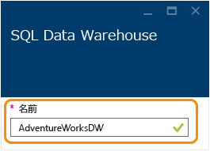
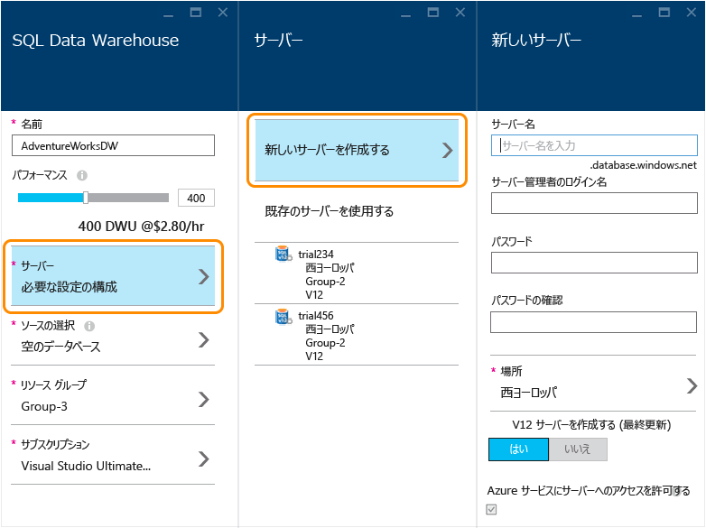
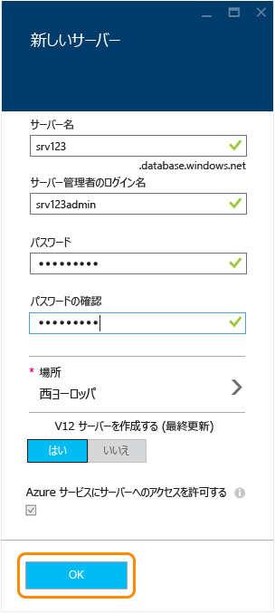
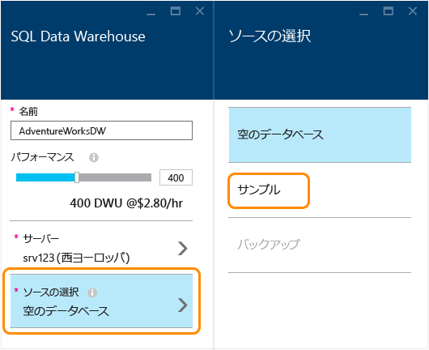
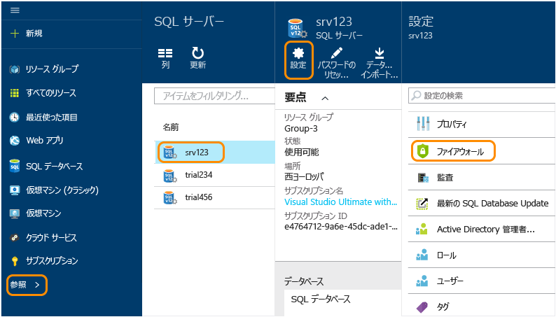
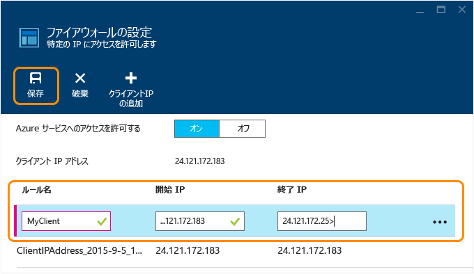

<properties
   pageTitle="Azure ポータルでの SQL Data Warehouse データベースの作成 | Microsoft Azure"
   description="Azure ポータルで Azure SQL Data Warehouse を作成する方法を説明します。"
   services="sql-data-warehouse"
   documentationCenter="NA"
   authors="barbkess"
   manager="jhubbard"
   editor=""
   tags="azure-sql-data-warehouse"/>

<tags
   ms.service="sql-data-warehouse"
   ms.devlang="NA"
   ms.topic="get-started-article"
   ms.tgt_pltfrm="NA"
   ms.workload="data-services"
   ms.date="01/04/2016"
   ms.author="lodipalm;barbkess"/>

# SQL Data Warehouse の作成

> [AZURE.SELECTOR]
- [Azure Portal](sql-data-warehouse-get-started-provision.md)
- [TSQL](sql-data-warehouse-get-started-create-database-tsql.md)
- [PowerShell](sql-data-warehouse-get-started-provision-powershell.md)

このチュートリアルでは、Azure ポータルを使用して、Azure SQL Data Warehouse データベースを数分で作成する方法について説明します。

このチュートリアルでは、次のことについて説明します。

- データベースをホストするサーバーを作成する。
- AdventureWorksDW サンプル データベースを含んだデータベースを作成する。

既存のデータベースを SQL Data Warehouse に移行する場合、[移行の概要](./sql-data-warehouse-get-started-overview-migrate.md)に関するページを参照するか、[移行ユーティリティ](./sql-data-warehouse-migrate-migration-utility.md)を使用してください。

SQL Data Warehouse へのデータの読み込みについては、[読み込みの概要](./sql-data-warehouse-overview-load.md)に関するページを参照してください。

[AZURE.INCLUDE [free-trial-note](../../includes/free-trial-note.md)]

## 手順 1: サインインして作業を開始する

1. [Azure ポータル](https://portal.azure.com)にサインインします。

2. **[新規]**、**[データ + ストレージ]**、**[SQL Data Warehouse]** の順にクリックします。

    

1. [SQL Data Warehouse ] ブレードにデータベースの名前を入力します。この例では、データベースに AdventureWorksDW という名前を付けます。

    

## 手順 2: サーバーを構成して作成する

SQL Database および SQL Data Warehouse では、各データベースがサーバーに割り当てられ、それぞれのサーバーが地理的な場所に割り当てられます。このサーバーを論理 SQL サーバーといいます。

> [AZURE.NOTE]論理 SQL サーバーの特徴: > > + 地理的に同じ場所にある複数のデータベースの構成に一貫性を与える効果があります。 > + オンプレミス サーバーに使用されるような物理的なハードウェアではありません。サービスのソフトウェアの構成要素です。*論理サーバー*と呼ばれるのはそのためです。 > + パフォーマンスを損ねずに複数のデータベースをホストすることができます。 > + 名前は SQL Server ではなく *SQL サーバー*です。SQL **サーバー**が Azure の論理サーバーであるのに対し、SQL **Server** は Microsoft のオンプレミス データベース製品です。

1. **[サーバー]**、**[新しいサーバーの作成]** をクリックします。サーバーの料金は発生しません。使用する V12 論理 SQL サーバーが既にある場合は、既存のサーバーを選択し、次の手順に進みます。 

    

3. **新しいサーバー**の情報を入力します。
    
	- **[サーバー名]**: 論理サーバーの名前を入力します。これは、地理的な場所ごとに一意です。
	- **[サーバー管理者名]**: サーバーの管理者アカウントのユーザー名を入力します。
	- **[パスワード]**: サーバーの管理者パスワードを入力します。 
	- **[場所]**: サーバーの地理的な場所を選択します。データの転送時間を短縮するために、このデータベースがアクセスする他のデータ リソースと地理的に近い場所にサーバーを配置することをお勧めします。
	- **[V12 サーバーの作成]**: SQL Data Warehouse の場合は常に [はい] を選択してください。 
	- **[Azure サービスにサーバーへのアクセスを許可する]**: SQL Data Warehouse の場合は常にオンになります。

    >[AZURE.NOTE]サーバー名、サーバー管理者名、パスワードは、必ずどこかに記録してください。この情報は、サーバーにログオンするときに必要になります。

1. **[OK]** をクリックして論理 SQL サーバーの構成設定を保存し、[SQL Data Warehouse] ブレードに戻ります。

    

## 手順 3: データベースを構成して作成する

論理 SQL サーバーを選択したら、データベースの作成に着手します。
 
2. **[SQL Data Warehouse]** ブレードで、残りのフィールドに必要事項を入力します。 

    
    
    - **[パフォーマンス]**: 最初は 400 DWU にすることをお勧めします。データベースのパフォーマンス レベルは、スライダーを左右に動かして調整します。データベースの作成後に調整することもできます。 

        > [AZURE.NOTE]SQL Data Warehouse では、パフォーマンスを Data Warehouse ユニット (DWU) で測定します。DWU を増やすと、データベース操作に使用できるコンピューティング リソースが SQL Data Warehouse によって増やされます。ワークロードのパフォーマンスと DWU との関係は、ワークロードを実行するうちにわかるようになります。
        > 
        > パフォーマンス レベルは、データベースの作成後に迅速かつ簡単に変更できます。たとえば、データベースを使用していない場合は、左にスライダーを移動し、コストを削減します。または、さらにリソースが必要な場合はパフォーマンスを上げます。コストを 0 にするには、データベースを一時停止します。これが、SQL Data Warehouse の拡張性です。

    - **[ソースの選択]**: **[ソースの選択]**、**[サンプル]** の順にクリックします。この時点で使用できるサンプル データベースは 1 つだけなので、[サンプル] を選択すると、**[サンプルの選択]** に AdventureWorksDW が自動的に設定されます。
  
        

    - **[リソース グループ]**: 既定値を保持できます。リソース グループは、Azure リソースのコレクション管理のサポートを目的としたコンテナーです。[リソース グループ](../azure-portal/resource-group-portal.md)に関する詳細情報を参照してください。
    
    - **[サブスクリプション]**: このデータベースで請求する、サブスクリプションを選択します。

1. **[作成]** をクリックして SQL Data Warehouse データベースを作成します。

1. 数分するとデータベースの準備が整います。完了すると、[Azure ポータル](https://portal.azure.com)に戻ります。SQL Data Warehouse データベースがダッシュボードに追加されていることに注意してください。

    

## 手順 4: クライアントの IP からアクセスできるようにサーバーのファイアウォールを構成する

現在ご使用の IP アドレスからサーバーに接続するには、そのクライアントの IP アドレスをファイアウォールの規則に追加します。この手順では、その方法を紹介します。

1. **[参照]**、**[SQL Server]** の順にクリックし、目的のサーバーを選択して、**[設定]**、**[ファイアウォール]** の順に選択します。

    

4. **[クライアント IP の追加]** をクリックすると、Azure でそのクライアント IP アドレスの規則が作成されます。**[保存]** をクリックします。

	

1. 一連の IP アドレスでファイアウォールの規則を作成します。この作業は後から行うこともできます。

	>[AZURE.IMPORTANT]IP アドレスは不定期で変更される可能性があるため、新しいファイアウォール規則を作成するまでサーバーにアクセスできなくなる場合があります。一貫したアクセスを確保するために、IP アドレスの範囲を追加することをお勧めします。詳細については、[ファイアウォール設定の構成方法](../sql-database/sql-database-configure-firewall-settings.md)に関するページを参照してください。

    規則を作成するには、名前と IP アドレス範囲を入力し、**[保存]** をクリックします。

    

ファイアウォールの構成が完了したので、デスクトップから、作成した SQL Data Warehouse データベースへの接続を作成できます。

## 次のステップ

SQL Data Warehouse のサンプル データベースの作成は以上で完了です。いつでもデータベースに[接続](./sql-data-warehouse-get-started-connect.md)することができます。

<!---HONumber=AcomDC_0107_2016-->