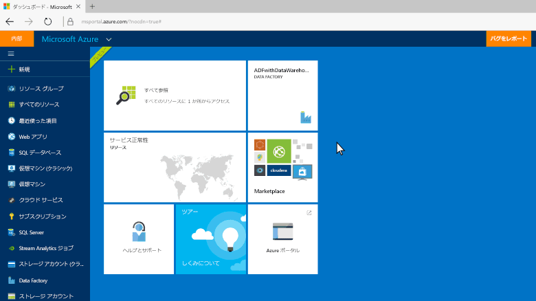
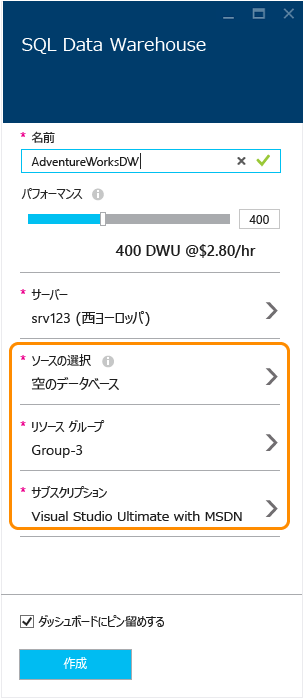

# Azure SQL データ ウェアハウスを作成します。
> [!div class="op_single_selector"]
> * [Azure Portal](sql-data-warehouse-get-started-provision.md)
> * [TSQL](sql-data-warehouse-get-started-create-database-tsql.md)
> * [PowerShell](sql-data-warehouse-get-started-provision-powershell.md)
>
>

このチュートリアルでは、AdventureWorksDW サンプル データベースを含む SQL データ ウェアハウスを作成し、Azure ポータルを使用します。

## 前提条件
開始するには、次の必要があります。

* **Azure アカウント**: を参照してください[Azure 無料評価版][ Azure Free Trial]または[MSDN の Azure クレジット][ MSDN Azure Credits]にアカウントを作成します。
* **Azure の SQL server**: を参照してください[Azure ポータルで Azure SQL データベースを作成][ Create an Azure SQL database in the Azure portal]詳細についてはします。

> [!NOTE]
> SQL データ ウェアハウスを作成すると、課金対象の新しいサービス可能性があります。  参照してください[SQL Data Warehouse 料金][ SQL Data Warehouse pricing]詳細についてはします。
>
>

## SQL データ ウェアハウスを作成します。
1. [Azure ポータル](https://portal.azure.com)にサインインします。
2. をクリックして**+ 新規** > **データベース** > **SQL Data Warehouse**です。

    
3. **SQL Data Warehouse**ブレードで、情報の塗りつぶし、必要なキーを押します 'Create' を作成します。

    

   * **サーバー**: まず、サーバーを選択することをお勧めします。  
   * **データベース名**: SQL データ ウェアハウスを参照するために使用される名前です。  サーバーに一意である必要があります。
   * **パフォーマンス**: 400 で始まることをお勧め[DWUs][DWU]です。 左または右、データ ウェアハウスのパフォーマンスを調整するか、作成後に拡張または縮小するには、スライダーを移動できます。  DWUs の詳細については、このドキュメントを参照して[スケーリング](sql-data-warehouse-manage-compute-overview.md)または[料金ページ][SQL Data Warehouse pricing]です。
   * **サブスクリプション**: 選択、[サブスクリプション]をこの SQL データ ウェアハウスに料金を請求します。
   * **リソース グループ**:[リソース グループ][ Resource group]コンテナーの Azure リソースのコレクションを管理するために設計されています。 詳細については[リソース グループ](../azure-resource-manager/resource-group-overview.md)です。
   * **ソース**: をクリックして**Select ソース** > **サンプル**です。 Azure が自動的に入力、**選択サンプル**AdventureWorksDW でオプションです。

   > [!NOTE]
   > SQL データ ウェアハウスの既定の照合順序は、SQL_Latin1_General_CP1_CI_AS です。 別の照合順序が必要な場合は[T-SQL] [ T-SQL]別の照合順序とデータベースの作成に使用できます。
   >
   >

1. をクリックして**作成**SQL データ ウェアハウスを作成します。
2. 数分を待ちます。 返されるデータ ウェアハウスの準備ができたら、 [Azure ポータル](https://portal.azure.com)です。 SQL データ ウェアハウスは、ダッシュ ボード、または作成時に使用するリソース グループで、SQL データベースでは、下に検索できます。

    

[!INCLUDE [SQL Database create server](../../includes/sql-database-create-new-server-firewall-portal.md)]

## 次のステップ
準備ができたら、SQL データ ウェアハウスを作成したら、これで[接続](sql-data-warehouse-connect-overview.md)し、クエリを開始します。

SQL データ ウェアハウスにデータを読み込む、次を参照してください。、[の概要を読み込み](sql-data-warehouse-overview-load.md)です。

既存のデータベースを SQL Data Warehouse に移行する場合を参照してください、[の移行の概要](sql-data-warehouse-overview-migrate.md)使用または[移行ユーティリティ](sql-data-warehouse-migrate-migration-utility.md)です。

TRANSACT-SQL を使用してファイアウォール規則を構成することもできます。 詳細については、次を参照してください。 [sp_set_firewall_rule] [ sp_set_firewall_rule]と[sp_set_database_firewall_rule][sp_set_database_firewall_rule]です。

すばらしいアイデアを見ても、[ベスト プラクティス][Best practices]です。

<!--Article references-->
[Create an Azure SQL database in the Azure portal]: ../sql-database/sql-database-get-started.md
[Create an Azure SQL database with PowerShell]: ../sql-database/sql-database-create-and-configure-database-powershell
[resource groups]: ../azure-resource-manager/resource-group-template-deploy-portal.md
[Best practices]: sql-data-warehouse-best-practices.md
[DWU]: sql-data-warehouse-overview-what-is.md
[サブスクリプション]: ../azure-glossary-cloud-terminology.md#subscription
[resource group]: ../azure-glossary-cloud-terminology.md#resource-group
[T-SQL]: ./sql-data-warehouse-get-started-create-database-tsql.md

<!--MSDN references-->
[sp_set_firewall_rule]: https://msdn.microsoft.com/library/dn270017.aspx
[sp_set_database_firewall_rule]: https://msdn.microsoft.com/library/dn270010.aspx

<!--Other Web references-->
[SQL Data Warehouse pricing]: https://azure.microsoft.com/pricing/details/sql-data-warehouse/
[Azure Free Trial]: https://azure.microsoft.com/pricing/free-trial/?WT.mc_id=A261C142F
[MSDN Azure Credits]: https://azure.microsoft.com/pricing/member-offers/msdn-benefits-details/?WT.mc_id=A261C142F
