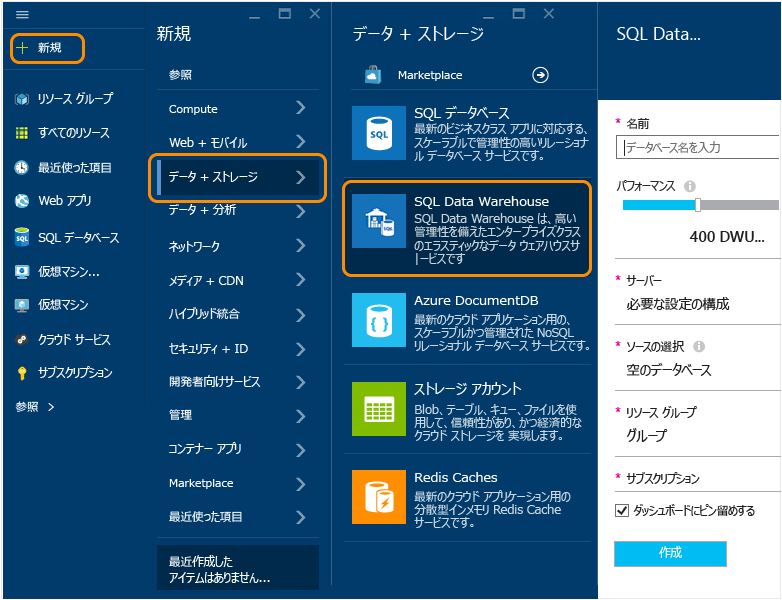

<properties
	pageTitle="Azure プレビュー ポータルでの SQL Data Warehouse の作成 | Microsoft Azure"
	description="Azure プレビュー ポータルで Azure SQL Data Warehouse を作成する方法を説明します。"
	services="sql-data-warehouse"
	documentationCenter="NA"
	authors="barbkess"
	manager="jhubbard"
	editor=""
	tags="azure-sql-data-warehouse"/>
<tags
   ms.service="sql-data-warehouse"
   ms.devlang="NA"
   ms.topic="get-started-article"
   ms.tgt_pltfrm="NA"
   ms.workload="data-services"
   ms.date="10/01/2015"
   ms.author="lodipalm;barbkess"/>

# Azure プレビュー ポータルでの SQL Data Warehouse の作成#

> [AZURE.SELECTOR]
- [Azure Preview Portal](sql-data-warehouse-get-started-provision.md)
- [TSQL](sql-data-warehouse-get-started-create-TSQL.md)
- [PowerShell](sql-data-warehouse-get-started-create-powershell.md)

このチュートリアルでは、Azure プレビュー ポータルを使用して、Azure SQL Data Warehouse データベースを数分で作成する方法について説明します。

このチュートリアルでは次を行います。

- データベースをホストするサーバーを作成する。
- AdventureWorksDW サンプル データベースを含んだデータベースを作成する。

[AZURE.INCLUDE [free-trial-note](../../includes/free-trial-note.md)]

## 手順 1: サインインして作業を開始する

1. [プレビュー ポータル](https://portal.azure.com)にサインインします。

2. **[新規]**、**[データ + ストレージ]**、**[SQL Data Warehouse]** の順にクリックします。

	

1. [SQL Data Warehouse ] ブレードにデータベースの名前を入力します。この例では、データベースに AdventureWorksDW という名前を付けます。

    

## 手順 2: サーバーを構成して作成する
SQL Database および SQL Data Warehouse では、各データベースがサーバーに割り当てられ、それぞれのサーバーが地理的な場所に割り当てられます。このサーバーを論理 SQL サーバーといいます。

> [AZURE.NOTE]論理 SQL サーバーの特徴: > > + 地理的に同じ場所にある複数のデータベースの構成に一貫性を与える効果があります。 > + データベースをホストするオンプレミス サーバーに使用されるような物理的なハードウェアではありません。サービスのソフトウェアの構成要素です。*論理サーバー*と呼ばれるのはそのためです。 > + パフォーマンスを損ねずに複数のデータベースをホストすることができます。 > + 名前は SQL Server ではなく *SQL サーバー*です。SQL **サーバー**が Azure の論理サーバーであるのに対し、SQL **Server** は製品名です。

1. **[サーバー]**、**[新しいサーバーの作成]** をクリックします。サーバーの料金は発生しません。使用する V12 サーバーが既にある場合は、既存のサーバーを選択し、次の手順に進みます。 

    

3. 新しいサーバーの情報を入力します。
    
	- **[サーバー名]**: 論理サーバーの名前を入力します。
	- **[サーバー管理者名]**: サーバーの管理者アカウントのユーザー名を入力します。
	- **[パスワード]**: サーバーの管理者パスワードを入力します。 
	- **[場所]**: サーバーの地理的な場所を選択します。データの転送時間を短縮するために、このデータベースがアクセスする他のデータ リソースと地理的に近い場所にサーバーを配置することをお勧めします。
	- **[V12 サーバーの作成]**: SQL Data Warehouse の場合は常に [はい] を選択してください。 
	- **[Azure サービスにサーバーへのアクセスを許可する]**: SQL Data Warehouse の場合は常にオンになります。

    >[AZURE.NOTE]サーバー名、サーバー管理者名、パスワードは、必ずどこかに記録してください。この情報は、サーバーにログオンするときに必要になります。

1. **[OK]** をクリックしてサーバーの構成設定を保存し、[SQL Data Warehouse] ブレードに戻ります。

    

## 手順 3: データベースを構成して作成する
サーバーを選択したら、データベースの作成に着手します。
 
2. **[SQL Data Warehouse]** ブレードで、残りのフィールドに必要事項を入力します。 

    
    
    - **[パフォーマンス]**: 最初は 400 DWU にすることをお勧めします。データベースのパフォーマンス レベルは、スライダーを左右に動かして調整します。データベースの作成後に調整することもできます。 

        > [AZURE.NOTE]パフォーマンスの測定単位は Data Warehouse ユニット (DWU) です。DWU を増やすと、データベース操作に使用できるコンピューティング リソースが SQL Data Warehouse によって増やされます。ワークロードのパフォーマンスと DWU との関係は、ワークロードを実行するうちにわかるようになります。
        > 
        > パフォーマンス レベルは、データベースの作成後に迅速かつ簡単に変更できます。たとえば、データベースを使用していない場合は、左にスライダーを移動し、コストを削減します。または、さらにリソースが必要な場合はパフォーマンスを上げます。これが、SQL Data Warehouse の拡張性です。

    - **[ソースの選択]**:**[ソースの選択]**、**[サンプル]** の順にクリックします。この時点で使用できるサンプル データベースは 1 つだけなので、[サンプル] を選択すると、**[サンプルの選択]** に AdventureWorksDW が自動的に設定されます。
  
        

    - **[リソース グループ]**: 既定値のままにします。リソース グループは、Azure リソースのコレクション管理のサポートを目的としたコンテナーです。[リソース グループ](../azure-portal/resource-group-portal.md)に関する詳細情報を参照してください。
    
    - **[サブスクリプション]**: このデータベースで請求する、サブスクリプションを選択します。

1. **[作成]** をクリックして SQL Data Warehouse データベースを作成します。

1. 数分するとデータベースの準備が整います。完了すると、ダッシュボードでデータベースを確認できます。ここで、[Azure プレビュー ポータル](https://portal.azure.com)に戻ります。SQL Data Warehouse データベースがページに追加されていることに注意してください。

    

## 手順 4: クライアントの IP からアクセスできるようにサーバーのファイアウォールを構成する
現在ご使用の IP アドレスからサーバーに接続するためには、そのクライアントの IP アドレスをファイアウォールの規則に追加する必要があります。この手順では、その方法を紹介します。

1. **[参照]**、**[SQL Server]** の順にクリックし、目的のサーバーを選択して、**[設定]**、**[ファイアウォール]** の順に選択します。

    

4. **[クライアント IP の追加]** をクリックすると、Azure でその IP アドレスの規則が作成されます。次に **[保存]** をクリックします。

	

1. 一連の IP アドレスでファイアウォールの規則を作成します。この作業は後から行うこともできます。

	>[AZURE.IMPORTANT]IP アドレスは不定期で変更される可能性があるため、新しいファイアウォール規則を作成するまでサーバーにアクセスできなくなる場合があります。[Bing](http://www.bing.com/search?q=my%20ip%20address) を使用して IP アドレスをチェックした後、単一の IP アドレスまたは IP アドレスの範囲を追加します。詳細については、[ファイアウォール設定の構成方法](../sql-database/sql-database-configure-firewall-settings.md)に関するページを参照してください。

    ルールを作成するには、名前と IP アドレス範囲を入力し、**[保存]** をクリックします。

    

ファイアウォールの構成が完了したので、デスクトップから、作成した SQL Data Warehouse データベースへの接続を作成できます。

## 次のステップ

これで SQL Data Warehouse のサンプル データベースの作成が完了しました。[接続とクエリ](./sql-data-warehouse-get-started-connect-query.md)に関するページで、SQL Data Warehouse の使用方法について説明します。

>[AZURE.NOTE]記事の改善にご協力ください。「この記事は役に立ちましたか?」という質問に「いいえ」を選択した場合は、不足しているものやどうすれば記事を改善できるかについてのご提案をお願いいたします。ご協力ありがとうございます。

<!---HONumber=Oct15_HO2-->