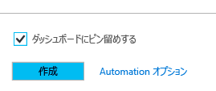
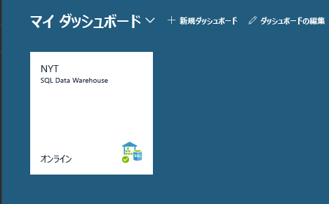
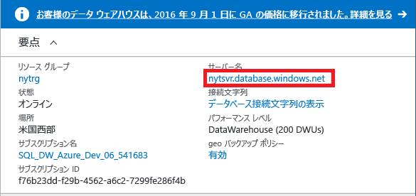
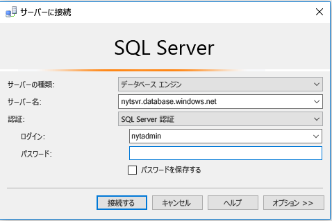
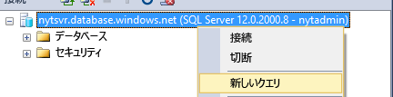
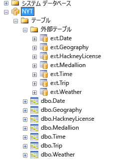
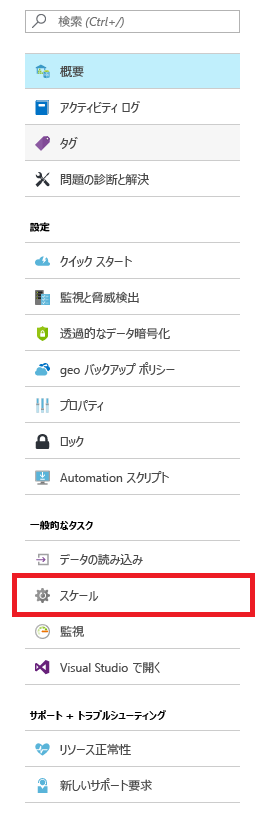
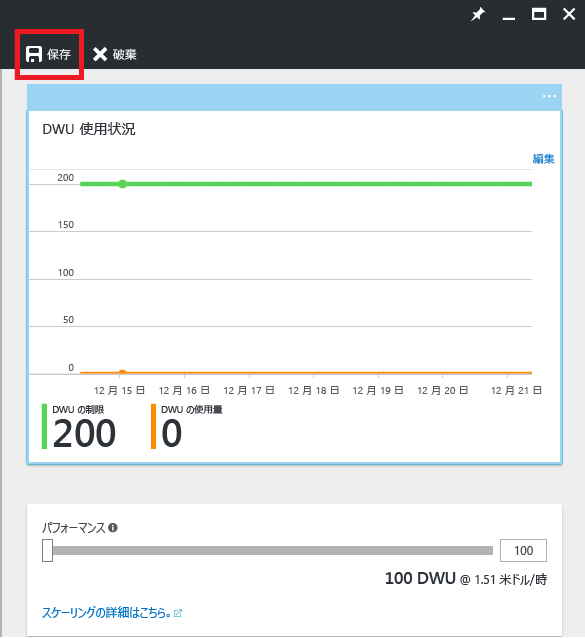

# <a name="get-started-with-sql-data-warehouse"></a>SQL Data Warehouse を使ってみる

このチュートリアルでは、Azure SQL Data Warehouse をプロビジョニングしてデータを読み込む方法について説明します。 また、スケーリング、一時停止、チューニングの基本についても学習します。 このチュートリアルを完了すると、データ ウェアハウスの照会と探索ができるようになります。

**推定所要時間:** これは、サンプル コードを含むエンド ツー エンドのチュートリアルです。前提条件を満たしたうえで、完了するのに約 30 分かかります。 

## <a name="prerequisites"></a>前提条件

このチュートリアルでは、SQL Data Warehouse の基本的な概念を理解していることを前提としています。 概論から始めたい場合は、[SQL Data Warehouse の概要](sql-data-warehouse-overview-what-is.md)に関するトピックを参照してください。 

### <a name="sign-up-for-microsoft-azure"></a>Microsoft Azure にサインアップ
まだ Microsoft Azure アカウントを持っていない場合、このサービスを使用するには、サインアップする必要があります。 既にアカウントを持っている場合は、この手順をスキップできます。 

1. アカウントのページ ([https://azure.microsoft.com/account/](https://azure.microsoft.com/account/)) に移動します。
2. 無料の Azure アカウントを作成するか、アカウントを購入します。
3. 手順に従います。

### <a name="install-appropriate-sql-client-drivers-and-tools"></a>適切な SQL クライアント ドライバーとツールのインストール

ほとんどの SQL クライアント ツールは、JDBC、ODBC、または ADO.NET を使用して SQL Data Warehouse に接続できます。 SQL Data Warehouse でサポートされている T-SQL 機能が多いため、SQL Data Warehouse との完全な互換性がないクライアント アプリケーションもあります。

Windows オペレーティング システムを実行している場合は、[Visual Studio] または [SQL Server Management Studio] を使用することをお勧めします。

[!INCLUDE [Create a new logical server](../../includes/sql-data-warehouse-create-logical-server.md)] 

[!INCLUDE [SQL Database create server](../../includes/sql-database-create-new-server-firewall-portal.md)]

## <a name="create-a-sql-data-warehouse"></a>SQL Data Warehouse の作成

SQL Data Warehouse は、大規模な並列処理用に設計された特殊なデータベースです。 データベースは複数のノードに分散され、並列にクエリを処理します。 SQL Data Warehouse には、すべてのノードのアクティビティを調整する制御ノードがあります。 ノードは、それ自体が SQL Database を使用してデータを管理します。  

> [!NOTE]
> SQL Data Warehouse を作成すると、新しい課金対象サービスを使用することになる場合があります。  詳細については、「[SQL Data Warehouse の価格](https://azure.microsoft.com/pricing/details/sql-data-warehouse/)」を参照してください。
>

### <a name="create-a-data-warehouse"></a>データ ウェアハウスの作成

1. [Azure ポータル](https://portal.azure.com)にサインインします。
2. **[新規]** > **[Databases]** > **[SQL Data Warehouse]** の順にクリックします。

    
    

3. デプロイの詳細を入力します。

    **[データベース名]**: 任意の名前を付けます。 複数のデータ ウェアハウスがある場合は、リージョン、環境などの詳細を含む名前をお勧めします (例: *mydw-westus-1-test*)。

    **[サブスクリプション]**: Azure のサブスクリプション

    **[リソース グループ]**: リソース グループを作成するか、既存のリソース グループを使用します。
    > [!NOTE]
    > リソース グループは、アクセス制御のスコープ設定やテンプレート化されたデプロイなどのリソース管理に役立ちます。 Azure リソース グループの詳細とベスト プラクティスについては、[こちら](https://docs.microsoft.com/azure/azure-resource-manager/resource-group-overview#resource-groups)を参照してください。

    **[ソース]**: 空のデータベース。

    **[サーバー]**: 「[前提条件]」で作成したサーバーを選択します。

    **[照合順序]**: 既定の照合順序である SQL_Latin1_General_CP1_CI_AS のままにしておきます。

    **[Select performance (パフォーマンスの選択)]**: 標準の 400DWU で始めることをお勧めします。

4. **[ダッシュボードにピン留めする]** チェック ボックスをオンにします。
    

5. データ ウェアハウスがデプロイされるまでしばらく待ちます。 通常、この処理には数分かかります。 データ ウェアハウスの使用準備が整うとポータルによって通知されます。 

## <a name="connect-to-sql-data-warehouse"></a>SQL Data Warehouse への接続

このチュートリアルでは、SQL Server Management Studio (SSMS) を使用してデータ ウェアハウスに接続します。 SQL Data Warehouse には、サポートされているコネクタ (ADO.NET、JDBC、ODBC、および PHP) を経由して接続できます。 Microsoft がサポートしていないツールでは、機能が限定される場合があることに注意してください。


### <a name="get-connection-information"></a>接続情報の取得

データ ウェアハウスに接続するには、「[前提条件]」で作成した論理 SQL サーバーを通じて接続する必要があります。

1. ダッシュボードでデータ ウェアハウスを選択するか、リソース内で検索します。

    

2. 論理 SQL サーバーの完全な名前を検索します。

    

3. SSMS を開き、オブジェクト エクスプローラーで、「[前提条件]」で作成したサーバー管理者の資格情報を使用して、このサーバーに接続します。

    

すべてが正しく設定されていれば、この時点で論理 SQL サーバーに接続されるはずです。 ここではサーバー管理者としてログインしているため、master データベースを含め、サーバーによってホストされている任意のデータベースに接続できます。 

サーバー管理者アカウントは&1; つしかなく、それにはユーザーのほとんどの権限が付与されています。 組織内で管理者パスワードを知っている人が多くなりすぎないように注意してください。 

Azure Active Directory 管理者アカウントを利用することもできます。 ここでは、詳しい説明を省略します。 Azure Active Directory 認証の使用に関する詳細については、[Azure AD 認証](https://docs.microsoft.com/azure/sql-database/sql-database-aad-authentication)に関するページを参照してください。

次に、追加のログインとユーザーの作成について説明します。


## <a name="create-a-database-user"></a>データベース ユーザーの作成

この手順では、データ ウェアハウスにアクセスするためのユーザー アカウントを作成します。 また、そのユーザーが大量のメモリと CPU リソースを使用してクエリを実行できるようにする方法についても説明します。

### <a name="notes-about-resource-classes-for-allocating-resources-to-queries"></a>リソースをクエリに割り当てるためのリソース クラスに関する注意

- データを安全に保つため、サーバー管理者アカウントを使用して運用データベースに対してクエリを実行しないでください。 サーバー管理者アカウントにはユーザーのほとんどの権限が付与されているため、これを使用してユーザー データを操作するとデータが危険にさらされます。 また、サーバー管理者が実行するのは管理操作であるため、実行する操作に対するメモリと CPU リソースの割り当てが小さくなります。 

- SQL Data Warehouse では、リソース クラスと呼ばれる事前定義されたデータベース ロールを使用して、さまざまな量のメモリ、CPU リソース、および同時実行スロットをユーザーに割り当てます。 各ユーザーは、小規模、中規模、大規模、または超大規模なリソース クラスに属することができます。 ユーザーのリソース クラスにより、ユーザーがクエリを実行して操作を読み込むために使用できるリソースが決定されます。

- データ圧縮を最適化するためには、ユーザーは場合によっては、大規模または超大規模なリソースを割り当てて読み込む必要があります。 リソース クラスの詳細については、[こちら](./sql-data-warehouse-develop-concurrency.md#resource-classes)を参照してください。

### <a name="create-an-account-that-can-control-a-database"></a>データベースを制御できるアカウントの作成

現在サーバー管理者としてログインしているため、ログインとユーザーを作成する権限があります。

1. SSMS または別のクエリ クライアントを使用して、**master** に対する新しいクエリを開きます。

    

    

2. クエリ ウィンドウで、次の T-SQL コマンドを実行して、MedRCLogin というログインと LoadingUser というユーザーを作成します。 このログインは、論理 SQL サーバーに接続できます。

    ```sql
    CREATE LOGIN MedRCLogin WITH PASSWORD = 'a123reallySTRONGpassword!';
    CREATE USER LoadingUser FOR LOGIN MedRCLogin;
    ```

3. "*SQL Data Warehouse データベース*" に対してクエリを実行して、データベースにアクセスして操作を実行するためのデータベース ユーザーを、作成したログインに基づいて作成します。

    ```sql
    CREATE USER LoadingUser FOR LOGIN MedRCLogin;
    ```

4. データベース ユーザーに、NYT という名前のデータベースに対する管理アクセス許可を与えます。 

    ```sql
    GRANT CONTROL ON DATABASE::[NYT] to LoadingUser;
    ```
    > [!NOTE]
    > データベース名にハイフンが含まれる場合は、その名前を角かっこで囲んでください。 
    >

### <a name="give-the-user-medium-resource-allocations"></a>ユーザーへの中規模リソースの割り当て

1. ユーザーを mediumrc と呼ばれる中規模リソース クラスのメンバーにするには、次の T-SQL コマンドを実行します。 

    ```sql
    EXEC sp_addrolemember 'mediumrc', 'LoadingUser';
    ```
    > [!NOTE]
    > 同時実行とリソース クラスの詳細については、[ここ](sql-data-warehouse-develop-concurrency.md#resource-classes)をクリックしてください。 
    >

2. 新しい資格情報を使用して論理サーバーに接続します。

    


## <a name="load-data-from-azure-blob-storage"></a>Azure BLOB ストレージからのデータのロード

これで、データ ウェアハウスにデータを読み込む準備が整いました。 ここでは、パブリック Azure Storage BLOB からニューヨーク市のタクシーのデータを読み込む手順を示します。 

- SQL Data Warehouse にデータを読み込む場合、一般的に、最初にデータを Azure Blob Storage に移動してから、データ ウェアハウスに読み込みます。 読み込み方法を理解しやすくするために、ニューヨーク市のタクシーのデータは、パブリック Azure Storage BLOB で既にホストされています。 

- 今後の参考として、データを Azure Blob Storage に取得する方法やソースから直接 SQL Data Warehouse に読み込む方法については、[読み込みの概要](sql-data-warehouse-overview-load.md)に関するページを参照してください。


### <a name="define-external-data"></a>外部データの定義

1. マスター キーを作成します。 マスター キーは、データベースごとに&1; 回作成するだけで済みます。 

    ```sql
    CREATE MASTER KEY;
    ```

2. タクシーのデータを格納する Azure BLOB の場所を定義します。  

    ```sql
    CREATE EXTERNAL DATA SOURCE NYTPublic
    WITH
    (
        TYPE = Hadoop,
        LOCATION = 'wasbs://2013@nytpublic.blob.core.windows.net/'
    );
    ```

3. 外部ファイル形式を定義します。

    ```CREATE EXTERNAL FILE FORMAT``` コマンドは、外部データを含むファイルの形式を指定するために使用します。 データには、区切り文字と呼ばれる&1; つ以上の文字で区切られたテキストが含まれます。 デモンストレーション用に、タクシーのデータは、非圧縮データと gzip 圧縮データの両方の形式で格納されています。

    非圧縮形式と圧縮形式の&2; つの異なる形式を定義するには、次の T-SQL コマンドを実行します。

    ```sql
    CREATE EXTERNAL FILE FORMAT uncompressedcsv
    WITH (
        FORMAT_TYPE = DELIMITEDTEXT,
        FORMAT_OPTIONS ( 
            FIELD_TERMINATOR = ',',
            STRING_DELIMITER = '',
            DATE_FORMAT = '',
            USE_TYPE_DEFAULT = False
        )
    );

    CREATE EXTERNAL FILE FORMAT compressedcsv
    WITH ( 
        FORMAT_TYPE = DELIMITEDTEXT,
        FORMAT_OPTIONS ( FIELD_TERMINATOR = '|',
            STRING_DELIMITER = '',
        DATE_FORMAT = '',
            USE_TYPE_DEFAULT = False
        ),
        DATA_COMPRESSION = 'org.apache.hadoop.io.compress.GzipCodec'
    );
    ```

4.  外部ファイル形式のスキーマを作成します。 

    ```sql
    CREATE SCHEMA ext;
    ```
5. 外部テーブルを作成する これらのテーブルは、Azure Blob Storage に格納されたデータを参照します。 次の T-SQL コマンドを実行して、複数の外部テーブルを作成します。これらのテーブルは、そのすべてが以前に外部データ ソースで定義した Azure BLOB を指します。

```sql
    CREATE EXTERNAL TABLE [ext].[Date] 
    (
        [DateID] int NOT NULL,
        [Date] datetime NULL,
        [DateBKey] char(10) COLLATE SQL_Latin1_General_CP1_CI_AS NULL,
        [DayOfMonth] varchar(2) COLLATE SQL_Latin1_General_CP1_CI_AS NULL,
        [DaySuffix] varchar(4) COLLATE SQL_Latin1_General_CP1_CI_AS NULL,
        [DayName] varchar(9) COLLATE SQL_Latin1_General_CP1_CI_AS NULL,
        [DayOfWeek] char(1) COLLATE SQL_Latin1_General_CP1_CI_AS NULL,
        [DayOfWeekInMonth] varchar(2) COLLATE SQL_Latin1_General_CP1_CI_AS NULL,
        [DayOfWeekInYear] varchar(2) COLLATE SQL_Latin1_General_CP1_CI_AS NULL,
        [DayOfQuarter] varchar(3) COLLATE SQL_Latin1_General_CP1_CI_AS NULL,
        [DayOfYear] varchar(3) COLLATE SQL_Latin1_General_CP1_CI_AS NULL,
        [WeekOfMonth] varchar(1) COLLATE SQL_Latin1_General_CP1_CI_AS NULL,
        [WeekOfQuarter] varchar(2) COLLATE SQL_Latin1_General_CP1_CI_AS NULL,
        [WeekOfYear] varchar(2) COLLATE SQL_Latin1_General_CP1_CI_AS NULL,
        [Month] varchar(2) COLLATE SQL_Latin1_General_CP1_CI_AS NULL,
        [MonthName] varchar(9) COLLATE SQL_Latin1_General_CP1_CI_AS NULL,
        [MonthOfQuarter] varchar(2) COLLATE SQL_Latin1_General_CP1_CI_AS NULL,
        [Quarter] char(1) COLLATE SQL_Latin1_General_CP1_CI_AS NULL,
        [QuarterName] varchar(9) COLLATE SQL_Latin1_General_CP1_CI_AS NULL,
        [Year] char(4) COLLATE SQL_Latin1_General_CP1_CI_AS NULL,
        [YearName] char(7) COLLATE SQL_Latin1_General_CP1_CI_AS NULL,
        [MonthYear] char(10) COLLATE SQL_Latin1_General_CP1_CI_AS NULL,
        [MMYYYY] char(6) COLLATE SQL_Latin1_General_CP1_CI_AS NULL,
        [FirstDayOfMonth] date NULL,
        [LastDayOfMonth] date NULL,
        [FirstDayOfQuarter] date NULL,
        [LastDayOfQuarter] date NULL,
        [FirstDayOfYear] date NULL,
        [LastDayOfYear] date NULL,
        [IsHolidayUSA] bit NULL,
        [IsWeekday] bit NULL,
        [HolidayUSA] varchar(50) COLLATE SQL_Latin1_General_CP1_CI_AS NULL
    )
    WITH
    (
        LOCATION = 'Date',
        DATA_SOURCE = NYTPublic,
        FILE_FORMAT = uncompressedcsv,
        REJECT_TYPE = value,
        REJECT_VALUE = 0
    );
    
    CREATE EXTERNAL TABLE [ext].[Geography]
    (
        [GeographyID] int NOT NULL,
        [ZipCodeBKey] varchar(10) COLLATE SQL_Latin1_General_CP1_CI_AS NOT NULL,
        [County] varchar(50) COLLATE SQL_Latin1_General_CP1_CI_AS NULL,
        [City] varchar(50) COLLATE SQL_Latin1_General_CP1_CI_AS NULL,
        [State] varchar(50) COLLATE SQL_Latin1_General_CP1_CI_AS NULL,
        [Country] varchar(50) COLLATE SQL_Latin1_General_CP1_CI_AS NULL,
        [ZipCode] varchar(50) COLLATE SQL_Latin1_General_CP1_CI_AS NULL
    )
    WITH
    (
        LOCATION = 'Geography',
        DATA_SOURCE = NYTPublic,
        FILE_FORMAT = uncompressedcsv,
        REJECT_TYPE = value,
        REJECT_VALUE = 0 
    );
        
    
    CREATE EXTERNAL TABLE [ext].[HackneyLicense]
    (
        [HackneyLicenseID] int NOT NULL,
        [HackneyLicenseBKey] varchar(50) COLLATE SQL_Latin1_General_CP1_CI_AS NOT NULL,
        [HackneyLicenseCode] varchar(50) COLLATE SQL_Latin1_General_CP1_CI_AS NULL
    )
    WITH
    (
        LOCATION = 'HackneyLicense',
        DATA_SOURCE = NYTPublic,
        FILE_FORMAT = uncompressedcsv,
        REJECT_TYPE = value,
        REJECT_VALUE = 0
    )
    ;
        
    
    CREATE EXTERNAL TABLE [ext].[Medallion]
    (
        [MedallionID] int NOT NULL,
        [MedallionBKey] varchar(50) COLLATE SQL_Latin1_General_CP1_CI_AS NOT NULL,
        [MedallionCode] varchar(50) COLLATE SQL_Latin1_General_CP1_CI_AS NULL
    )
    WITH
    (
        LOCATION = 'Medallion',
        DATA_SOURCE = NYTPublic,
        FILE_FORMAT = uncompressedcsv,
        REJECT_TYPE = value,
        REJECT_VALUE = 0
    )
    ;
        
    CREATE EXTERNAL TABLE [ext].[Time]
    (
        [TimeID] int NOT NULL,
        [TimeBKey] varchar(8) COLLATE SQL_Latin1_General_CP1_CI_AS NOT NULL,
        [HourNumber] tinyint NOT NULL,
        [MinuteNumber] tinyint NOT NULL,
        [SecondNumber] tinyint NOT NULL,
        [TimeInSecond] int NOT NULL,
        [HourlyBucket] varchar(15) COLLATE SQL_Latin1_General_CP1_CI_AS NOT NULL,
        [DayTimeBucketGroupKey] int NOT NULL,
        [DayTimeBucket] varchar(100) COLLATE SQL_Latin1_General_CP1_CI_AS NOT NULL
    )
    WITH
    (
        LOCATION = 'Time',
        DATA_SOURCE = NYTPublic,
        FILE_FORMAT = uncompressedcsv,
        REJECT_TYPE = value,
        REJECT_VALUE = 0
    )
    ;
    
    
    CREATE EXTERNAL TABLE [ext].[Trip]
    (
        [DateID] int NOT NULL,
        [MedallionID] int NOT NULL,
        [HackneyLicenseID] int NOT NULL,
        [PickupTimeID] int NOT NULL,
        [DropoffTimeID] int NOT NULL,
        [PickupGeographyID] int NULL,
        [DropoffGeographyID] int NULL,
        [PickupLatitude] float NULL,
        [PickupLongitude] float NULL,
        [PickupLatLong] varchar(50) COLLATE SQL_Latin1_General_CP1_CI_AS NULL,
        [DropoffLatitude] float NULL,
        [DropoffLongitude] float NULL,
        [DropoffLatLong] varchar(50) COLLATE SQL_Latin1_General_CP1_CI_AS NULL,
        [PassengerCount] int NULL,
        [TripDurationSeconds] int NULL,
        [TripDistanceMiles] float NULL,
        [PaymentType] varchar(50) COLLATE SQL_Latin1_General_CP1_CI_AS NULL,
        [FareAmount] money NULL,
        [SurchargeAmount] money NULL,
        [TaxAmount] money NULL,
        [TipAmount] money NULL,
        [TollsAmount] money NULL,
        [TotalAmount] money NULL
    )
    WITH
    (
        LOCATION = 'Trip2013',
        DATA_SOURCE = NYTPublic,
        FILE_FORMAT = compressedcsv,
        REJECT_TYPE = value,
        REJECT_VALUE = 0
    )
    ;
    
    CREATE EXTERNAL TABLE [ext].[Weather]
    (
        [DateID] int NOT NULL,
        [GeographyID] int NOT NULL,
        [PrecipitationInches] float NOT NULL,
        [AvgTemperatureFahrenheit] float NOT NULL
    )
    WITH
    (
        LOCATION = 'Weather2013',
        DATA_SOURCE = NYTPublic,
        FILE_FORMAT = uncompressedcsv,
        REJECT_TYPE = value,
        REJECT_VALUE = 0
    )
    ;
```

### <a name="import-the-data-from-azure-blob-storage"></a>Azure Blob Storage からデータをインポートします。

SQL Data Warehouse は、CREATE TABLE AS SELECT (CTAS) と呼ばれる重要なステートメントをサポートしています。 このステートメントにより、select ステートメントの結果に基づいた新しいテーブルが作成されます。 新しいテーブルでは、select ステートメントの結果と同じ列およびデータ型が保持されます。  この方法なら、Azure Blob Storage から SQL Data Warehouse へのデータのインポートが効率よく行えます。

1. 次のスクリプトを実行して、データをインポートします。

    ```sql
    CREATE TABLE [dbo].[Date]
    WITH
    ( 
        DISTRIBUTION = ROUND_ROBIN,
        CLUSTERED COLUMNSTORE INDEX
    )
    AS SELECT * FROM [ext].[Date]
    OPTION (LABEL = 'CTAS : Load [dbo].[Date]')
    ;
    
    CREATE TABLE [dbo].[Geography]
    WITH
    ( 
        DISTRIBUTION = ROUND_ROBIN,
        CLUSTERED COLUMNSTORE INDEX
    )
    AS
    SELECT * FROM [ext].[Geography]
    OPTION (LABEL = 'CTAS : Load [dbo].[Geography]')
    ;
    
    CREATE TABLE [dbo].[HackneyLicense]
    WITH
    ( 
        DISTRIBUTION = ROUND_ROBIN,
        CLUSTERED COLUMNSTORE INDEX
    )
    AS SELECT * FROM [ext].[HackneyLicense]
    OPTION (LABEL = 'CTAS : Load [dbo].[HackneyLicense]')
    ;
    
    CREATE TABLE [dbo].[Medallion]
    WITH
    (
        DISTRIBUTION = ROUND_ROBIN,
        CLUSTERED COLUMNSTORE INDEX
    )
    AS SELECT * FROM [ext].[Medallion]
    OPTION (LABEL = 'CTAS : Load [dbo].[Medallion]')
    ;
    
    CREATE TABLE [dbo].[Time]
    WITH
    (
        DISTRIBUTION = ROUND_ROBIN,
        CLUSTERED COLUMNSTORE INDEX
    )
    AS SELECT * FROM [ext].[Time]
    OPTION (LABEL = 'CTAS : Load [dbo].[Time]')
    ;
    
    CREATE TABLE [dbo].[Weather]
    WITH
    ( 
        DISTRIBUTION = ROUND_ROBIN,
        CLUSTERED COLUMNSTORE INDEX
    )
    AS SELECT * FROM [ext].[Weather]
    OPTION (LABEL = 'CTAS : Load [dbo].[Weather]')
    ;
    
    CREATE TABLE [dbo].[Trip]
    WITH
    (
        DISTRIBUTION = ROUND_ROBIN,
        CLUSTERED COLUMNSTORE INDEX
    )
    AS SELECT * FROM [ext].[Trip]
    OPTION (LABEL = 'CTAS : Load [dbo].[Trip]')
    ;
    ```

2. 読み込んだデータを表示します。

   数 GB のデータを読み込み、高パフォーマンスのクラスター化列ストア インデックスに圧縮しています。 動的管理ビュー (DMV) を使用する次のクエリを実行して、読み込みの状態を表示します。 SQL Data Warehouse での処理にはある程度の時間がかかります。クエリを開始したら、完了するまでお待ちください。
    
    ```sql
    SELECT
        r.command,
        s.request_id,
        r.status,
        count(distinct input_name) as nbr_files,
        sum(s.bytes_processed)/1024/1024 as gb_processed
    FROM 
        sys.dm_pdw_exec_requests r
        INNER JOIN sys.dm_pdw_dms_external_work s
        ON r.request_id = s.request_id
    WHERE
        r.[label] = 'CTAS : Load [dbo].[Date]' OR
        r.[label] = 'CTAS : Load [dbo].[Geography]' OR
        r.[label] = 'CTAS : Load [dbo].[HackneyLicense]' OR
        r.[label] = 'CTAS : Load [dbo].[Medallion]' OR
        r.[label] = 'CTAS : Load [dbo].[Time]' OR
        r.[label] = 'CTAS : Load [dbo].[Weather]' OR
        r.[label] = 'CTAS : Load [dbo].[Trip]'
    GROUP BY
        r.command,
        s.request_id,
        r.status
    ORDER BY
        nbr_files desc, 
        gb_processed desc;
    ```

3. すべてのシステム クエリを表示します。

    ```sql
    SELECT * FROM sys.dm_pdw_exec_requests;
    ```

4. Azure SQL Data Warehouse にデータが適切に読み込まれました。

    


## <a name="improve-query-performance"></a>クエリ パフォーマンスの向上

クエリ パフォーマンスを向上させ、高速なパフォーマンスを実現するために、SQL Data Warehouse ではいくつかの方法が用意されています。  

### <a name="see-the-effect-of-scaling-on-query-performance"></a>スケーリングによるクエリ パフォーマンスへの効果の確認 

クエリ パフォーマンスを向上させる方法の&1; つは、データ ウェアハウスの DWU サービス レベルを変更することで、リソースをスケーリングすることです。 各サービス レベルでのコストは高くなりますが、スケールバックまたはリソースの一時停止はいつでも実施できます。 

この手順では、2 つの異なる DWU 設定におけるパフォーマンスを比較します。

最初に、1 つのコンピューティング ノード単独でのパフォーマンスがわかるように、サイズを 100 DWU にスケールダウンします。

1. ポータルに移動し、お使いの SQL Data Warehouse を選択します。

2. SQL Data Warehouse ブレードで、スケールを選択します。 

    

3. パフォーマンス バーを 100 DWU にスケールダウンし、保存します。

    

4. スケーリング操作が完了するまで待ちます。

    > [!NOTE]
    > スケールの変更中は、クエリを実行できません。 スケーリングにより、現在実行中のクエリは**中止**されます。 操作が完了したら、再開できます。
    >
    
5. すべての列の上位&100; 万エントリを選択して、乗車データに対するスキャン操作を実行します。 早く先へ進みたい場合は、選択する行を少なくしてもかまいません。 この操作の実行にかかった時間を書き留めておきます。

    ```sql
    SELECT TOP(1000000) * FROM dbo.[Trip]
    ```
6. データ ウェアハウスを 400 DWU にスケールバックします。 100 DWU ごとに、1 つのコンピューティング ノードが Azure SQL Data Warehouse に追加されることに注意してください。

7. もう一度クエリを実行します。 大きな違いに気付くはずです。 

> [!NOTE]
> Azure SQL Data Warehouse では、超並列処理を使用しています。 Azure SQL Data Warehouse の真価は、特に数百万行のデータに対してスキャンまたは分析機能を実行するクエリにおいて発揮されます。
>

### <a name="see-the-effect-of-statistics-on-query-performance"></a>統計によるクエリ パフォーマンスへの効果の確認

1. Date テーブルと Trip テーブルを結合するクエリを実行します。

    ```sql
    SELECT TOP (1000000) 
        dt.[DayOfWeek],
        tr.[MedallionID],
        tr.[HackneyLicenseID],
        tr.[PickupTimeID],
        tr.[DropoffTimeID],
        tr.[PickupGeographyID],
        tr.[DropoffGeographyID],
        tr.[PickupLatitude],
        tr.[PickupLongitude],
        tr.[PickupLatLong],
        tr.[DropoffLatitude],
        tr.[DropoffLongitude],
        tr.[DropoffLatLong],
        tr.[PassengerCount],
        tr.[TripDurationSeconds],
        tr.[TripDistanceMiles],
        tr.[PaymentType],
        tr.[FareAmount],
        tr.[SurchargeAmount],
        tr.[TaxAmount],
        tr.[TipAmount],
        tr.[TollsAmount],
        tr.[TotalAmount]
    FROM [dbo].[Trip] as tr
        JOIN dbo.[Date] as dt
        ON  tr.DateID = dt.DateID
    ```

    このクエリの実行には少々時間がかかります。結合を実行する前に、SQL Data Warehouse でデータをシャッフルする必要があるためです。 分散されたときと同じ方法でデータを結合する場合、結合時にデータをシャッフルする必要はありません。 それは別の問題となります。 

2. 統計のパフォーマンスが向上します。 
3. 次のステートメントを実行して、結合列の統計を作成します。

    ```sql
    CREATE STATISTICS [dbo.Date DateID stats] ON dbo.Date (DateID);
    CREATE STATISTICS [dbo.Trip DateID stats] ON dbo.Trip (DateID);
    ```

    > [!NOTE]
    > SQL DW では、統計は自動的には管理されません。 統計はクエリのパフォーマンスにとって重要なため、統計を作成および更新することを強くお勧めします。
    > 
    > **結合に含まれる列、WHERE 句で使用されている列、および GROUP BY に含まれている列に関する統計を作成すると、最も大きなメリットが得られます。**
    >

3. 前提条件のクエリを再実行し、パフォーマンスの違いを観察します。 クエリのパフォーマンスの違いは、スケールアップした場合ほど劇的ではありませんが、高速化したことがわかります。 

## <a name="next-steps"></a>次のステップ

これで、クエリを実行して探索する準備ができました。 ベスト プラクティスやヒントを確認してください。

一日の作業を終了した場合は、インスタンスを一時停止するようにしてください。 運用環境では、一時停止とビジネス ニーズに合わせたスケーリングによって、さまざまな節約が可能になります。


## <a name="useful-readings"></a>有益な参考情報

[同時実行とワークロード管理][]

[Azure SQL Data Warehouse のベスト プラクティス][]

[クエリ監視][]

[大規模なリレーショナル データ ウェアハウスを構築するためのベストプラクティスのトップ 10][]

[Azure SQL Data Warehouse へのデータの移行][]

[同時実行とワークロード管理]: sql-data-warehouse-develop-concurrency.md#change-a-user-resource-class-example
[Azure SQL Data Warehouse のベスト プラクティス]: sql-data-warehouse-best-practices.md#hash-distribute-large-tables
[クエリ監視]: sql-data-warehouse-manage-monitor.md
[大規模なリレーショナル データ ウェアハウスを構築するためのベストプラクティスのトップ 10]: https://blogs.msdn.microsoft.com/sqlcat/2013/09/16/top-10-best-practices-for-building-a-large-scale-relational-data-warehouse/
[Azure SQL Data Warehouse へのデータの移行]: https://blogs.msdn.microsoft.com/sqlcat/2016/08/18/migrating-data-to-azure-sql-data-warehouse-in-practice/


[!INCLUDE [Additional Resources](../../includes/sql-data-warehouse-article-footer.md)]

<!-- Internal Links -->
[前提条件]: sql-data-warehouse-get-started-tutorial.md#prerequisites

<!--Other Web references-->
[Visual Studio]: https://www.visualstudio.com/
[SQL Server Management Studio]: https://msdn.microsoft.com/en-us/library/mt238290.aspx

