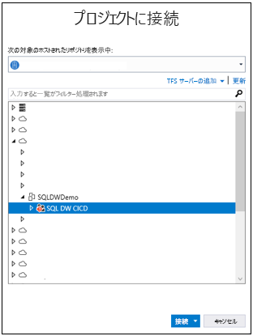
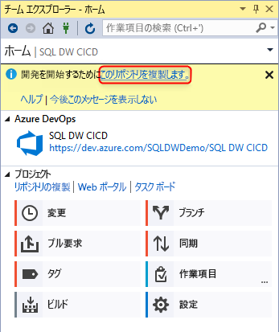
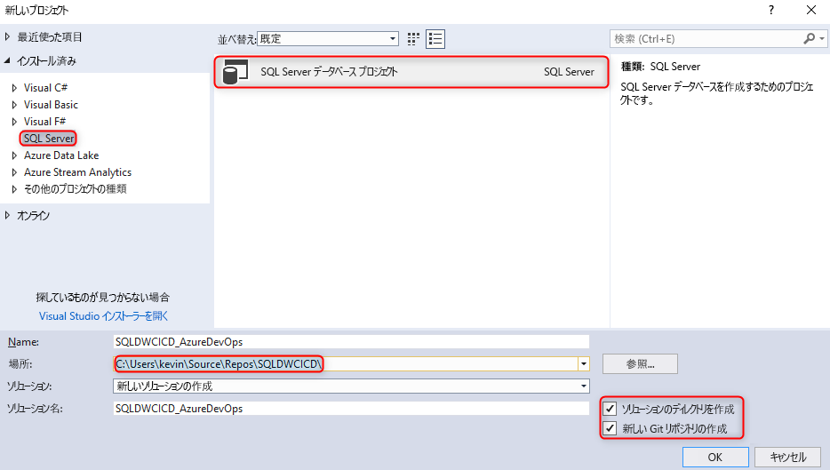
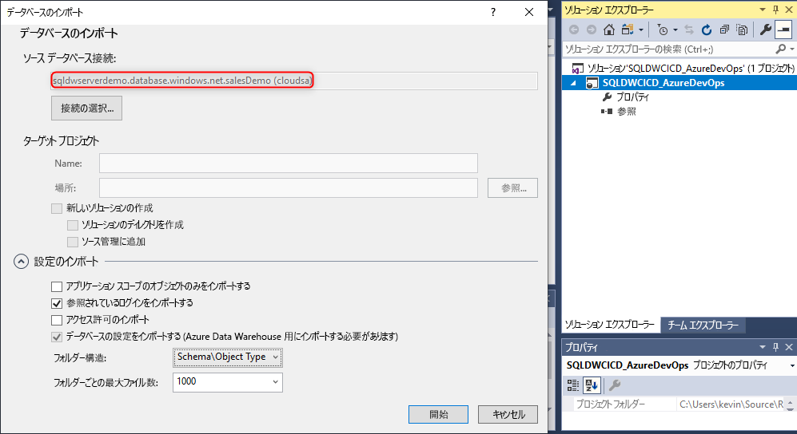
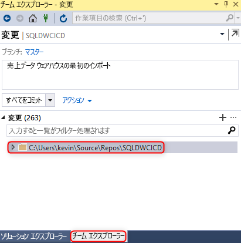
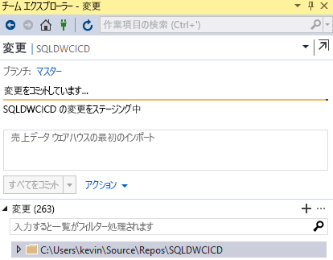
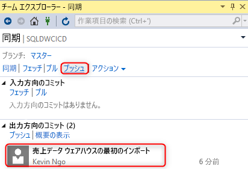
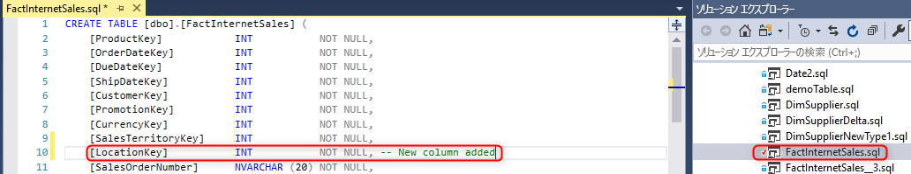
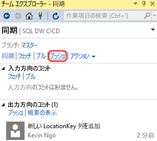
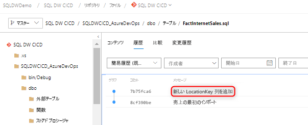

# Azure SQL Data Warehouse のソース管理の統合

このチュートリアルでは、SQL Server Data Tools (SSDT) データベース プロジェクトをソース管理と統合する方法について概説します。  ソース管理の統合は、SQL Data Warehouse を使用して継続的インテグレーションおよびデプロイ パイプラインを構築するための最初の手順です。 

## 開始する前に

- [Azure DevOps 組織](https://azure.microsoft.com/services/devops/)にサインアップします
- [作成と接続](https://docs.microsoft.com/azure/sql-data-warehouse/create-data-warehouse-portal)に関するチュートリアルを実行します
-  [Visual Studio 2019 をインストール](https://visualstudio.microsoft.com/vs/older-downloads/)します 

## Azure DevOps を設定して接続する

1. Azure DevOps 組織内で、Azure Repo リポジトリを介して SSDT データベース プロジェクトをホストするプロジェクトを作成します

   

2. Visual Studio を開き、[接続の管理] を選択して、手順 1 で作成した Azure DevOps 組織とプロジェクトに接続します

   ![[接続の管理]](media/sql-data-warehouse-source-control-integration/2-manage-connections.png "[接続の管理]")

   

3. プロジェクトからお使いのローカル コンピューターに Azure Repo リポジトリを複製します

   

## プロジェクトを作成して接続する

1. Visual Studio で、**ローカルの複製されたリポジトリ**に、ディレクトリとローカル Git リポジトリの両方を含む新しい SQL Server データベース プロジェクトを作成します

     

2. 空の sqlproject を右クリックし、お使いのデータ ウェアハウスをデータベース プロジェクトにインポートします

     

3. Visual Studio のチーム エクスプローラーで、ローカル Git リポジトリに対するすべての変更をコミットします 

     

4. これで、複製されたリポジトリで変更がローカルにコミットされたので、Azure DevOps プロジェクトの Azure Repo リポジトリに変更を同期してプッシュします。

   

     

## 検証

1. Visual Studio SQL Server Data Tools (SSDT) から対象のデータベース プロジェクトのテーブル列を更新して、変更が Azure Repo にプッシュされたことを確認します

   

2. 変更をコミットしてローカル リポジトリから Azure Repo にプッシュします

   

3. Azure Repo リポジトリに変更がプッシュされたことを確認します

   

4. (**オプション**) SSDT を使用して、スキーマ比較を使用し、お使いのターゲット データ ウェアハウスへの変更を更新して、Azure Repo リポジトリおよびローカル リポジトリ内のオブジェクト定義にお使いのデータ ウェアハウスが反映されていることを確認します

## 次の手順

- [Azure SQL Data Warehouse 向けの開発](sql-data-warehouse-overview-develop.md)

<!--Image references-->

<!--Article references-->

<!--MSDN references-->

<!--Other Web references-->

