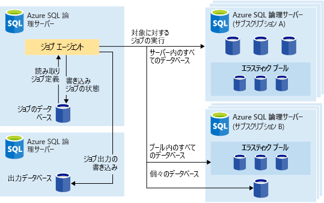
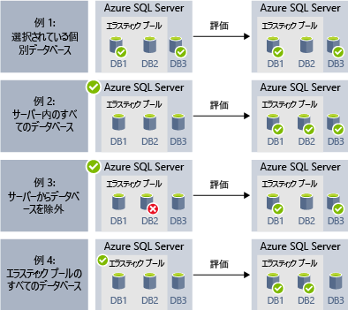
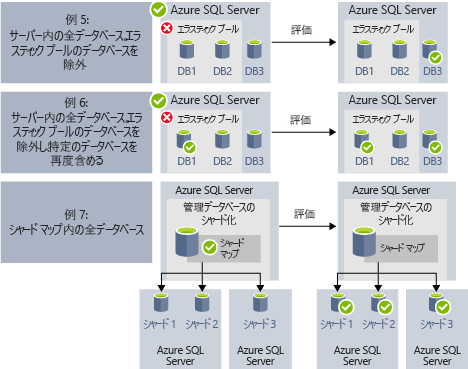
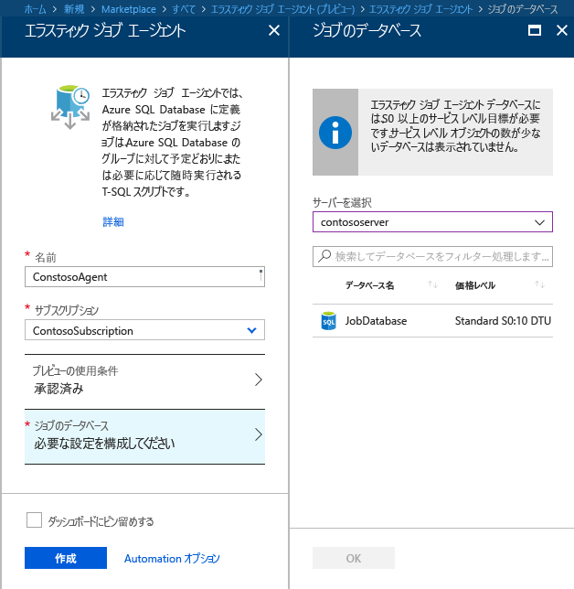
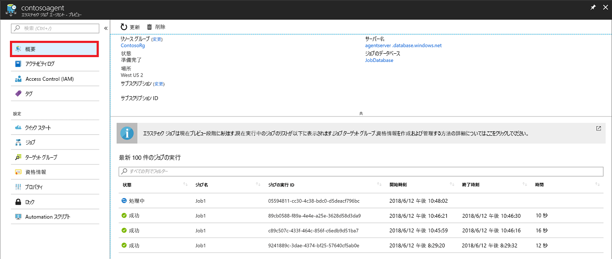
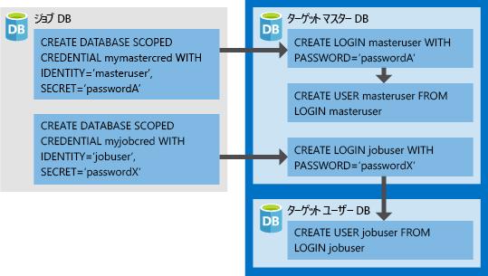

# <a name="manage-groups-of-databases-with-elastic-database-jobs"></a>Elastic Database ジョブを使ってデータベースのグループを管理する

**Elastic Database ジョブ**は、多数のデータベースを対象に T-SQL スクリプトを並列実行できる機能です。一定のスケジュールに従って実行することも、オンデマンドで実行することもできます。

**ジョブの実行対象とするデータベースの組み合わせは問いません**。個々のデータベースだけでなく、サーバー上のデータベースすべて、エラスティック プール内のデータベースすべて、シャードマップを自由に指定してジョブを実行できます。さらに、特定のデータベースをジョブの対象としたり、逆に対象から除外したりできる柔軟性も備わっています。 **多数のサーバーやプールにまたがるジョブだけでなく、異なるサブスクリプションのデータベースを対象としたジョブの実行も可能です。** 実行時にはサーバーとプールが動的に列挙されるので、実行時にターゲット グループに存在するデータベースに漏れなくジョブを実行できます。

次の図は、種類がさまざまに異なるターゲット グループに対してジョブ エージェントがジョブを実行するようすを示したものです。




## <a name="why-use-elastic-jobs"></a>エラスティック ジョブを使用する理由

### <a name="manage-many-databases"></a>データベースの管理

- 管理タスクについて、平日の業務時間後に日々実行するなどのスケジュールを設定します。
- スキーマの変更、資格情報の管理、パフォーマンス データの収集、テナント (顧客) テレメトリの収集をデプロイします。 参照データ (全データベースに共通の情報) を更新します。
- インデックスを再構築して、クエリのパフォーマンスを向上します。 データベース コレクションを対象として (ピーク外の時間などに) 定期的に実行するジョブを構成します。
- データベース セットのクエリ結果をリアルタイムで中央のテーブルに収集します。 パフォーマンス クエリを継続的に実行して、その他のタスクの実行をトリガーするように構成できます。

### <a name="collect-data-for-reporting"></a>レポート用データの収集

- Azure SQL データベースのコレクションから 1 つのテーブルにデータを集約します。
- 顧客の製品利用統計情報収集など、大規模なデータセット全体に対して、時間がかかるデータ処理クエリを実行します。 結果は 1 つの対象テーブルに収集され、分析に使用されます。

### <a name="reduce-overhead"></a>オーバーヘッドの削減

- 通常、Transact-SQL ステートメントを実行するか、その他の管理タスクを実行するには、各データベースに個別に接続する必要があります。 ジョブを利用すれば、ターゲット グループ内の各データベースのログイン タスクが処理されます。 また、Azure SQL データベースのグループに対して実行する Transact-SQL スクリプトを定義、保守、維持することもできます。

### <a name="accounting"></a>会計

- ジョブにより、各データベースの実行状態をログに記録します。 また、エラーが発生すると自動的に再試行を行います。

### <a name="flexibility"></a>柔軟性

- Azure SQL データベースのカスタム グループを定義し、ジョブを実行するスケジュールを定義します。


## <a name="elastic-job-components"></a>エラスティック ジョブのコンポーネント

|コンポーネント  | 説明 (詳しい情報は表の下に記載しています) |
|---------|---------|
|[**エラスティック ジョブ エージェント**](#elastic-job-agent) |  ジョブの実行と管理を目的として作成する Azure リソースです。   |
|[**ジョブ データベース**](#job-database)    |    Azure SQL データベースの一種で、ジョブ エージェントがジョブの関連データや定義などの情報を格納するために使用するものです。      |
|[**ターゲット グループ**](#target-group)      |  ジョブの実行の対象となるサーバー、プール、データベース、シャード マップをまとめたものを指します。       |
|[**ジョブ**](#job)  |  処理の 1 単位で、1 つ以上の[ジョブ ステップ](#job-step)から成ります。 ジョブ ステップでは、実行する T-SQL スクリプトのほか、スクリプトの実行に必要な詳細情報を指定します。  |


### <a name="elastic-job-agent"></a>エラスティック ジョブ エージェント

ジョブを作成、実行、および管理するための Azure リソースを、エラスティック ジョブ エージェントといいます。 エラスティック ジョブ エージェントは、ポータルで作成する Azure リソースです (このほか、[PowerShell](elastic-jobs-powershell.md) と REST による作成もサポートされています)。 

**エラスティック ジョブ エージェント**を作成するには、既存の SQL データベースが必要です。 エージェントはこの既存のデータベースを "[*ジョブ データベース*](#job-database)" として構成することになります。

エラスティック ジョブ エージェントは無料です。 ジョブ データベースについては、SQL データベースと同じ料金が発生します。

### <a name="job-database"></a>ジョブ データベース

"*ジョブ データベース*" は、ジョブの定義のほか、ジョブの実行状態や実行履歴の追跡に使用するものです。 同時に、エージェントのメタデータ、ログ、結果、およびジョブの定義の保管場所としての役割も果たします。さらに、"*ジョブ データベース*" には、便利なストアド プロシージャや、T-SQL を使ったジョブの作成、実行、管理に役立つデータベース オブジェクトが多数格納されます。

現時点のプレビューでは、エラスティック ジョブ エージェントを作成する際に既存の Azure SQL データベース (S0 以降) が必要になります。

"*ジョブ データベース*" となるデータベースは新しいものでなくてもかまいませんが、データが入っておらず、サービス レベルが S0 以上であることが条件となります。 "*ジョブ データベース*" で推奨されるサービス レベルは S1 以上ですが、この点はジョブのパフォーマンスに関するニーズ (ジョブ ステップの数、ジョブの実行回数、実行頻度) により大きく左右されます。 たとえば、ジョブ エージェントがジョブを実行するのが 1 時間に 2、3 回であれば、S0 データベースでも十分でしょう。しかし、ジョブを毎分実行するのであれば、S0 では十分なパフォーマンスが得られないことが予想されますので、もっと上のサービス レベルの方が望ましいと考えられます。


#### <a name="job-database-permissions"></a>ジョブ データベースのアクセス許可

ジョブ エージェントの作成時には、"*ジョブ データベース*" にスキーマとテーブルのほか、*jobs_reader* と呼ばれるロールが作成されます。 このロールには作成時に次のアクセス許可が割り当てられるので、管理者が従来よりも細かくアクセスを制御してジョブを監視できるようになっています。


|ロール名  |"jobs" スキーマのアクセス許可  |"jobs_internal" スキーマのアクセス許可  |
|---------|---------|---------|
|**jobs_reader**     |    SELECT     |    なし     |

> [!IMPORTANT]
> "*ジョブ データベース*" のデータベース管理者としてのアクセス権を付与する際には、セキュリティ面の影響を考慮するようにしてください。 悪意のあるユーザーがジョブを作成または編集できるアクセス権を取得すると、保存されている資格情報を使ってそのユーザーの管理下にあるデータベースに接続するジョブを (新規に、または既存のジョブの編集により) 作成される可能性があります。そのような事態が起これば、悪意のあるユーザーが資格情報のパスワードを自由に設定できる状況が発生しかねません。


### <a name="target-group"></a>ターゲット グループ

"*ターゲット グループ*" は、ジョブ ステップの実行対象となる一連のデータベースを定義したものです。 ターゲット グループに含めることができるものは次のとおりです (数や組み合わせは問いません)。

- **Azure SQL サーバー** - サーバーを指定した場合には、ジョブの実行時点でそのサーバーに存在するデータベースがすべて、グループのメンバーとなります。 ジョブの実行前にグループのメンバーを列挙して更新できるように、マスター データベース資格情報を指定する必要があります。
- **エラスティック プール** - エラスティック プールを指定した場合には、ジョブの実行時点でそのエラスティック プールに存在するデータベースがすべて、グループのメンバーとなります。 サーバーの場合と同じく、ジョブの実行前にグループを更新できるように、マスター データベース資格情報を指定する必要があります。
- **単一のデータベース** - データベースを個別に指定してグループのメンバーとすることができます。
- **シャードマップ** - シャードマップに含まれるデータベースです。

> [!TIP]
> サーバーまたはプールが含まれるターゲット グループの場合には、ジョブの実行時に "*動的列挙*" によりグループ内のデータベースが再評価されます。 動的列挙は、**ジョブの実行時にサーバーまたはプールに存在するデータベース全部に漏れなくジョブを実行**するための処理です。 プールまたはサーバーのメンバーが頻繁に変わるシナリオでは、実行時にデータベースの一覧を再評価することが特に有用です。

プールとデータベースは個別にグループのメンバーとしたり、グループから除外したりできます。 このため、作成するターゲット グループのメンバーとなるデータベースの組み合わせは自由に調節できます。 たとえば、ターゲット グループにサーバーを追加した後で、エラスティック プール内の特定のデータベース (またはプール全体) をグループから除外することができます。

ターゲット グループには、複数のサブスクリプションのデータベースをメンバーに追加できます。また、グループ内のデータベースのリージョンが異なっていても問題ありません。 ただし、ジョブの実行が複数のリージョンにまたがる場合には、実行が同一のリージョン内にとどまる場合よりも待ち時間が長くなる点に注意してください。

次の例は、ジョブ実行時に異なるターゲット グループ定義を動的に列挙して、ジョブを実行するデータベースを決定する方法を示しています。



**例 1** は、個々 のデータベースの一覧で構成されるターゲット グループを示しています。 このターゲット グループを使用してジョブ ステップを実行すると、ジョブ ステップのアクションがこれらのデータベースのそれぞれで実行されます。<br>
**例 2** は、Azure SQL Server をターゲットとして含むターゲット グループを示しています。 このターゲット グループを使用してジョブ ステップを実行すると、サーバーが動的に列挙され、現在サーバーに入っているデータベースの一覧が判定されます。 ジョブ ステップのアクションは、これらのデータベースのそれぞれで実行されます。<br>
**例 3** は "*例 2*" と似たターゲット グループを示していますが、個々のデータベースが明示的に除外されています。 ジョブ ステップのアクションは、除外されたデータベースでは実行 "*されません*"。<br>
**例 4** は、エラスティック プールをターゲットとして含むターゲット グループを示しています。 "*例 2*" と同様に、プールはジョブ実行時に動的に列挙され、プール内のデータベースの一覧が判定されます。
<br><br>




**例 5** と "*例 6*" は、包含ルールと除外ルールを使用して Azure SQL Server、エラスティック プール、およびデータベースを結合できる高度なシナリオを示しています。<br>
**例 7** は、シャード マップ内のシャードをジョブ実行時にも評価できることを示しています。

### <a name="job"></a>ジョブ

"*ジョブ*" は処理の 1 単位です。一定のスケジュールに基づいて実行することもあれば、1 回限りのジョブとして実行することもあります。 ジョブは、いくつかの "*ジョブ ステップ*" で構成されます。

#### <a name="job-step"></a>ジョブ ステップ

各ジョブ ステップでは、実行する T-SQL スクリプト、そのスクリプトの対象となるターゲット グループ (複数可)、ジョブ エージェントがターゲット データベースに接続する際に必要になる資格情報の 3 つを指定します。 ジョブ ステップにはそれぞれカスタマイズが可能なタイムアウト値と再試行ポリシーが設定されているほか、オプションで出力パラメーターを指定できます。

#### <a name="job-output"></a>ジョブの出力

それぞれのターゲット データベースに実行したジョブ ステップの結果は詳細が記録されるので、指定したテーブルにスクリプトの出力を取り込むことができます。 ジョブから返されたデータはいずれも、保存先となるデータベースを指定できます。

#### <a name="job-history"></a>ジョブ履歴

ジョブの実行履歴は "*ジョブ データベース*" に格納されます。 記録から 45 日が経過した実行履歴については、システムのクリーンアップ ジョブにより削除されます。 45 日が経過する前に履歴を削除する場合には、"*ジョブ データベース*" で**sp_purge_history** ストアド プロシージャを呼び出してください。

## <a name="workflow-to-create-configure-and-manage-jobs"></a>ジョブの作成、構成、および管理のワークフロー

### <a name="create-and-configure-the-agent"></a>エージェントの作成と構成

1. S0 以上で、中身が空の SQL データベースを作成または特定します。 このデータベースが、エラスティック ジョブ エージェントの作成時に "*ジョブ データベース*" として使用されます。
2. [ポータル](https://portal.azure.com/#create/Microsoft.SQLElasticJobAgent)または [PowerShell](elastic-jobs-powershell.md#create-the-elastic-job-agent) を使ってエラスティック ジョブ エージェントを作成します。

   

### <a name="create-run-and-manage-jobs"></a>ジョブの作成、実行、および管理

1. [PowerShell](elastic-jobs-powershell.md#create-job-credentials-so-that-jobs-can-execute-scripts-on-its-targets) または [T-SQL](elastic-jobs-tsql.md#create-a-credential-for-job-execution) を使用して、"*ジョブ データベース*" にジョブ実行のための資格情報を作成します。
2. [PowerShell](elastic-jobs-powershell.md#define-the-target-databases-you-want-to-run-the-job-against) または [T-SQL](elastic-jobs-tsql.md#create-a-target-group-servers) を使用して、ターゲット グループ (ジョブの実行の対象とするデータベース) を定義します。
3. ジョブを実行するデータベースのそれぞれに、ジョブ エージェントの資格情報を作成 [(グループ内の各データベースにユーザー (またはロール) を追加)](https://docs.microsoft.com/azure/sql-database/sql-database-control-access) します。 例については、[PowerShell のチュートリアル](elastic-jobs-powershell.md#create-job-credentials-so-that-jobs-can-execute-scripts-on-its-targets)を参照してください。
4. [PowerShell](elastic-jobs-powershell.md#create-a-job) または [T-SQL](elastic-jobs-tsql.md#deploy-new-schema-to-many-databases) を使用してジョブを作成します。
5. [PowerShell](elastic-jobs-powershell.md#create-a-job-step) または [T-SQL](elastic-jobs-tsql.md#deploy-new-schema-to-many-databases) を使用してジョブ ステップを追加します。
6. [PowerShell](elastic-jobs-powershell.md#run-the-job) または [T-SQL](elastic-jobs-tsql.md#begin-ad-hoc-execution-of-a-job) を使用してジョブを実行します。
7. ポータル、[PowerShell](elastic-jobs-powershell.md#monitor-status-of-job-executions)、または[T-SQL](elastic-jobs-tsql.md#monitor-job-execution-status) を使用して、ジョブの実行状態を監視します。

   

## <a name="credentials-for-running-jobs"></a>ジョブの実行のための資格情報

ジョブは[データベース スコープ資格情報](/sql/t-sql/statements/create-database-scoped-credential-transact-sql)を使用して、実行時にターゲット グループによって指定されたデータベースに接続します。 ターゲット グループにサーバーまたはプールが含まれる場合には、利用できるデータベースを列挙するマスター データベースに接続するときに、このデータベース スコープ資格情報が使用されます。

ジョブの実行に必要な資格情報を正しく設定する作業は多少複雑ですので、次のポイントを頭に入れておくようにしてください。

- データベース スコープ資格情報は "*ジョブ データベース*" に作成する必要があります。
- **ターゲット データベースにはいずれも、ジョブが正常に完了するうえで[十分なアクセス許可](https://docs.microsoft.com/sql/relational-databases/security/permissions-database-engine)を備えたログインを設定しておく必要があります** (以下の図の jobuser)。
- 資格情報は複数のジョブで再利用することが想定されています。このため、資格情報のパスワードは暗号化のうえ、ジョブ オブジェクトに対する読み取りアクセス許可が認められたユーザーに知られることがないように保護されます。

次の図は、ジョブの正しい資格情報を把握し、その設定をサポートすることを意図して用意したものです。 **ジョブの実行が必要なデータベースの 1 つひとつ ("*ターゲット ユーザー DB*" すべて) で、忘れずにユーザーを作成してください**。



## <a name="security-best-practices"></a>セキュリティのベスト プラクティス

エラスティック ジョブを使用する際のベスト プラクティスをいくつか紹介します。

- API の使用を信頼できるユーザーに制限します。
- 資格情報には、ジョブ ステップの実行に最小限必要な権限だけを設定します。 さらに詳しい情報については、[SQL Server の認可とアクセス許可](https://docs.microsoft.com/dotnet/framework/data/adonet/sql/authorization-and-permissions-in-sql-server)に関するページを参照してください。
- ターゲット グループのメンバーとしてサーバーまたはプールを使用する場合には、マスター データベースでデータベースを表示/一覧表示するための権限を設定した資格情報を別個に作成することを強くお勧めします。この資格情報は、ジョブの実行前にサーバーまたはプールのデータベースの一覧を展開する際に使用します。


## <a name="agent-performance-capacity-and-limitations"></a>エージェントのパフォーマンス、容量、および制約

エラスティック ジョブでは、実行時間の長いジョブの完了を待っている間に消費する計算リソースを最小限に抑えます。

データベースから成るターゲット グループの大きさと、ジョブについて希望する実行時間 (同時に実行する worker の数) に応じて、エージェントが "*ジョブ データベース*" に要求する計算量とパフォーマンスが変わります (ターゲットとジョブの数が増えるほど、要求される計算量が増大します)。

現時点のプレビュー版では、同時に実行するジョブの上限が 100 件に制限されています。

### <a name="prevent-jobs-from-reducing-target-database-performance"></a>ジョブを原因とするターゲット データベースのパフォーマンス低下を防ぐ

SQL エラスティック プール内のデータベースにジョブを実行しているときにリソースに対する負荷が大きくなりすぎないようにするために、ジョブを構成して同時にジョブの実行対象とするデータベースの数に制限を設けることができます。

##  <a name="differences-between-elastic-jobs-and-sql-server-agent"></a>エラスティック ジョブと SQL Server エージェントの違い

SQL Server エージェント (オンプレミスで SQL Database Managed Instance の一環として利用可能) と Azure SQL Database エラスティック ジョブ エージェント (現時点では SQL Database と SQL Data Warehouse で利用可能) の間には、いくつかの点で違いがあります。


|  |エラスティック ジョブ  |SQL Server エージェント |
|---------|---------|---------|
|Scope (スコープ)     |  ジョブ エージェントと同一の Azure クラウド内に存在する任意の数の Azure SQL データベースまたはデータ ウェアハウス。 ロジック サーバー、サブスクリプション、またはリージョンが異なっていてもターゲットとすることができます。 <br><br>ターゲット グループを構成するメンバーには、個々のデータベースまたはデータ ウェアハウスのほか、サーバー、プール、またはシャードマップに含まれるすべてのデータベースを指定できます (ジョブの実行時に動的に列挙されます)。 | SQL エージェントと同一の SQL Server インスタンス内の単一のデータベース。 |
|サポートされる API とツール     |  ポータル、PowerShell、T-SQL、Azure Resource Manager      |   T-SQL、SQL Server Management Studio (SSMS)     |


## <a name="best-practices-for-creating-jobs"></a>ジョブ作成のベスト プラクティス

### <a name="idempotent-scripts"></a>べき等スクリプト
ジョブの T-SQL スクリプトは [べき等](https://en.wikipedia.org/wiki/Idempotence)にする必要があります。 **べき等**とは、実行に成功したスクリプトを再度実行した場合に、結果が同じになることを意味します。 一時的なネットワークの問題により、スクリプトが失敗することがあります。 その場合、ジョブは事前に設定した回数に達するまで自動的にスクリプトを再試行します。 べき等スクリプトは、2 回 (以上) 実行して成功した場合、結果が同じになります。

単純な方法として、作成前に、オブジェクトの存在をテストします。


```sql
IF NOT EXIST (some_object)
    -- Create the object
    -- If it exists, drop the object before recreating it.
```

同様に、スクリプトは、それが検出する条件を論理的に試験し、対処することで正常に実行できる必要があります。


## <a name="next-steps"></a>次の手順

- [PowerShell を使用したエラスティック ジョブの作成と管理](elastic-jobs-powershell.md)
- [Transact-SQL を使用したエラスティック ジョブの作成と管理](elastic-jobs-tsql.md)