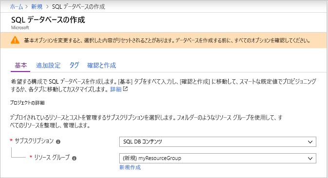
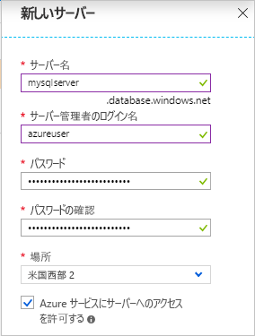
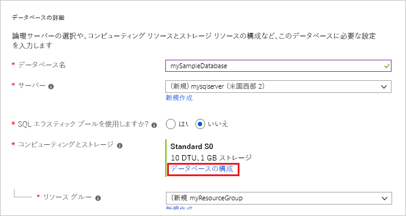
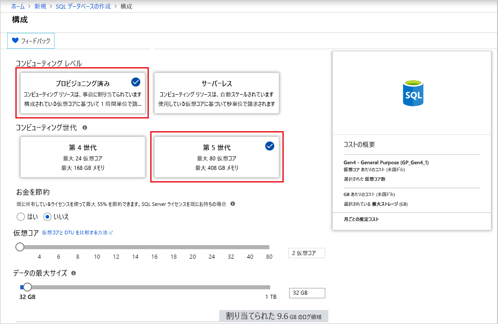
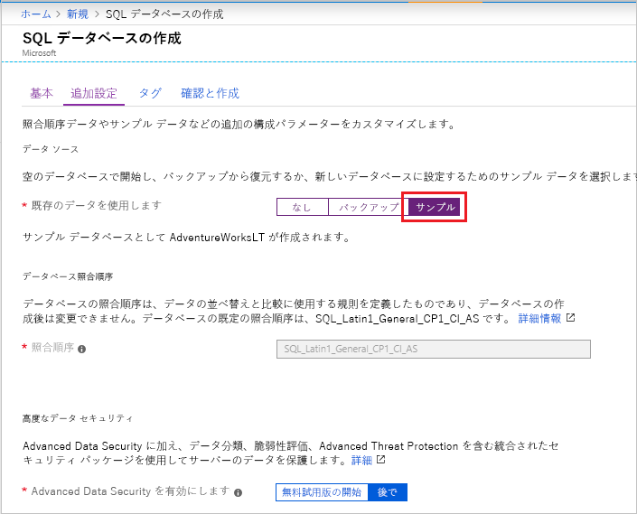

この手順では、リソース グループと Azure SQL Database の単一データベースを作成します。

> [!IMPORTANT]
> この記事の手順を実行しているコンピューターのパブリック IP アドレスを使用するようにファイアウォール規則を確実に設定してください。 
>
> 詳細については、[データベース レベルのファイアウォール規則の作成](/sql/relational-databases/system-stored-procedures/sp-set-database-firewall-rule-azure-sql-database)に関するページを参照してください。ご利用のコンピューターのサーバー レベルのファイアウォール規則に使用する IP アドレスを調べる場合は、[サーバーレベルのファイアウォールの作成](../sql-database-server-level-firewall-rule.md)に関するページを参照してください。  

# <a name="azure-portaltabazure-portal"></a>[Azure Portal](#tab/azure-portal)

Azure portal を使用して、リソース グループと単一データベースを作成します。

1. Azure Portal の左上隅にある **[リソースの作成]** を選択します。
2. **[データベース]** を選択してから、 **[SQL Database]** を選択し、 **[SQL データベースの作成]** ページを開きます。

   

3. **[基本]** タブの **[プロジェクトの詳細]** セクションで、次の値を入力または選択します。

   - **サブスクリプション**:表示されていない場合は、ドロップ ダウンして適切なサブスクリプションを選択します。
   - **[リソース グループ]** : **[新規作成]** を選択し、「`myResourceGroup`」と入力して、 **[OK]** を選択します。

     

4. **[データベースの詳細]** セクションで、次の値を入力または選択します。

   - **データベース名**: 「 `mySampleDatabase` 」を入力します。
   - **サーバー**: **[新規作成]** を選択して次の値を入力し、 **[選択]** を選択します。
       - **サーバー名**: 一意性を確保するためにいくつかの数字とともに「`mysqlserver`」と入力します。
       - **サーバー管理者ログイン**:「 `azureuser`」と入力します。
       - **Password**:パスワードの要件を満たす複雑なパスワードを入力します。
       - **[場所]** :ドロップダウンから場所 (`West US 2` など) を選択します。

         

      > [!IMPORTANT]
      > 忘れずにサーバー管理者のログインとパスワードを記録して、このクイック スタートと他のクイック スタートのためにサーバーとデータベースにログインできるようにします。 ログインまたはパスワードを忘れた場合は、 **[SQL サーバー]** ページでログイン名を取得するかパスワードをリセットします。 **[SQL サーバー]** ページを開くには、データベースの作成後にデータベースの **[概要]** ページでサーバー名を選択します。

   - **[SQL エラスティック プールを使用しますか?]** : **[いいえ]** オプションを選択します。
   - **[コンピューティングとストレージ]** : **[データベースの構成]** を選択します。 

     

   - **[プロビジョニング済み]** と **[第 5 世代]** を選択します。

     

   - **[最大 vCores]** 、 **[最小 vCores]** 、 **[自動一時停止の遅延]** 、および **[データの最大サイズ]** の設定を確認します。 必要に応じて、これらを変更します。
   - プレビューの使用条件に同意し、 **[OK]** をクリックします。
   - **[適用]** を選択します。

5. **[追加設定]** タブを選択します。 
6. **[データ ソース]** セクションの **[既存のデータを使用します]** で、`Sample` を選択します。

   

   > [!IMPORTANT]
   > このクイック スタートとこのデータを使用する他の Azure SQL Database クイック スタートを簡単に実行できるように、必ず **Sample (AdventureWorksLT)** を選択します。

7. 残りの値は既定値のままにして、フォームの下部にある **[確認および作成]** を選択します。
8. 最終設定を確認し、 **[作成]** を選択します。

9. **[SQL Database]** フォームで **[作成]** を選択して、リソース グループ、サーバー、データベースをデプロイし、プロビジョニングします。

# <a name="powershelltabpowershell"></a>[PowerShell](#tab/powershell)

[!INCLUDE [updated-for-az](../../../includes/updated-for-az.md)]

PowerShell を使用して、リソース グループと単一データベースを作成します。

   ```powershell-interactive
   # Set variables for your server and database
   $subscriptionId = '<SubscriptionID>'
   $resourceGroupName = "myResourceGroup-$(Get-Random)"
   $location = "West US 2"
   $adminLogin = "azureuser"
   $password = "PWD27!"+(New-Guid).Guid
   $serverName = "mysqlserver-$(Get-Random)"
   $databaseName = "mySampleDatabase"

   # The ip address range that you want to allow to access your server 
   # (leaving at 0.0.0.0 will prevent outside-of-azure connections to your DB)
   $startIp = "0.0.0.0"
   $endIp = "0.0.0.0"

   # Show randomized variables
   Write-host "Resource group name is" $resourceGroupName 
   Write-host "Password is" $password  
   Write-host "Server name is" $serverName 

   # Connect to Azure
   Connect-AzAccount

   # Set subscription ID
   Set-AzContext -SubscriptionId $subscriptionId 

   # Create a resource group
   Write-host "Creating resource group..."
   $resourceGroup = New-AzResourceGroup -Name $resourceGroupName -Location $location -Tag @{Owner="SQLDB-Samples"}
   $resourceGroup

   # Create a server with a system wide unique server name
   Write-host "Creating primary logical server..."
   $server = New-AzSqlServer -ResourceGroupName $resourceGroupName `
      -ServerName $serverName `
      -Location $location `
      -SqlAdministratorCredentials $(New-Object -TypeName System.Management.Automation.PSCredential `
      -ArgumentList $adminLogin, $(ConvertTo-SecureString -String $password -AsPlainText -Force))
   $server

   # Create a server firewall rule that allows access from the specified IP range
   Write-host "Configuring firewall for primary logical server..."
   $serverFirewallRule = New-AzSqlServerFirewallRule -ResourceGroupName $resourceGroupName `
      -ServerName $serverName `
      -FirewallRuleName "AllowedIPs" -StartIpAddress $startIp -EndIpAddress $endIp
   $serverFirewallRule

   # Create General Purpose Gen4 database with 1 vCore
   Write-host "Creating a gen5 2 vCore database..."
   $database = New-AzSqlDatabase  -ResourceGroupName $resourceGroupName `
      -ServerName $serverName `
      -DatabaseName $databaseName `
      -Edition GeneralPurpose `
      -VCore 2 `
      -ComputeGeneration Gen5 `
      -MinimumCapacity 2 `
      -SampleName "AdventureWorksLT"
   $database
   ```

# <a name="az-clitabbash"></a>[AZ CLI](#tab/bash)

AZ CLI を使用して、リソース グループと単一データベースを作成します。

   ```azurecli-interactive
   #!/bin/bash
   # Set variables
   subscriptionID=<SubscriptionID>
   resourceGroupName=myResourceGroup-$RANDOM
   location=SouthCentralUS
   adminLogin=azureuser
   password="PWD27!"+`openssl rand -base64 18`
   serverName=mysqlserver-$RANDOM
   databaseName=mySampleDatabase
   drLocation=NorthEurope
   drServerName=mysqlsecondary-$RANDOM
   failoverGroupName=failovergrouptutorial-$RANDOM

   # The ip address range that you want to allow to access your DB. 
   # Leaving at 0.0.0.0 will prevent outside-of-azure connections to your DB
   startip=0.0.0.0
   endip=0.0.0.0
  
   # Connect to Azure
   az login

   # Set the subscription context for the Azure account
   az account set -s $subscriptionID

   # Create a resource group
   echo "Creating resource group..."
   az group create \
      --name $resourceGroupName \
      --location $location \
      --tags Owner[=SQLDB-Samples]

   # Create a logical server in the resource group
   echo "Creating primary logical server..."
   az sql server create \
      --name $serverName \
      --resource-group $resourceGroupName \
      --location $location  \
      --admin-user $adminLogin \
      --admin-password $password

   # Configure a firewall rule for the server
   echo "Configuring firewall..."
   az sql server firewall-rule create \
      --resource-group $resourceGroupName \
      --server $serverName \
      -n AllowYourIp \
      --start-ip-address $startip \
      --end-ip-address $endip

   # Create a gen5 1vCore database in the server 
   echo "Creating a gen5 2 vCore database..."
   az sql db create \
      --resource-group $resourceGroupName \
      --server $serverName \
      --name $databaseName \
      --sample-name AdventureWorksLT \
      --edition GeneralPurpose \
      --family Gen5 \
      --capacity 2
   ```

---
