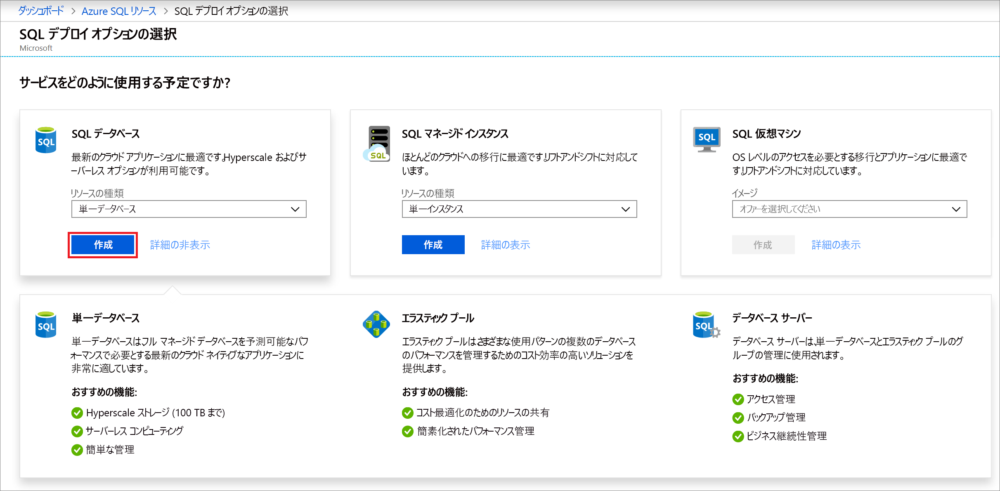

この手順では、Azure SQL Database の単一データベースを作成します。 

> [!IMPORTANT]
> この記事の実行に使用しているコンピューターのパブリック IP アドレスを使用するようにファイアウォール規則を確実に設定してください。
>
> 詳細については、[データベース レベルのファイアウォール規則の作成](/sql/relational-databases/system-stored-procedures/sp-set-database-firewall-rule-azure-sql-database)に関するページを参照してください。ご利用のコンピューターのサーバーレベルのファイアウォール規則に使用する IP アドレスを調べる場合は、[サーバーレベルのファイアウォールの作成](../sql-database-server-level-firewall-rule.md)に関するページを参照してください。  

# <a name="portal"></a>[ポータル](#tab/azure-portal)

Azure portal を使用して、リソース グループと単一データベースを作成します。

1. [Azure portal](https://portal.azure.com) の左側のメニューで **[Azure SQL]** を選択します。 **[Azure SQL]** が一覧にない場合は、 **[すべてのサービス]** を選択し、検索ボックスに「*Azure SQL*」と入力します。 (省略可能) **[Azure SQL]** の横にある星を選択してお気に入りに追加し、左側のナビゲーションに項目として追加します。 
2. **[+ 追加]** を選択して、 **[Select SQL deployment option]\(SQL デプロイ オプションの選択\)** ページを開きます。 **[データベース]** タイルで **[詳細の表示]** を選択すると、さまざまなデータベースに関する追加情報を表示できます。
3. **[作成]** を選択します。

   

4. **[基本]** タブの **[プロジェクトの詳細]** セクションで、次の値を入力または選択します。

   - **サブスクリプション**:表示されていない場合は、ドロップ ダウンして適切なサブスクリプションを選択します。
   - **[リソース グループ]** : **[新規作成]** を選択し、「`myResourceGroup`」と入力して、 **[OK]** を選択します。

     

5. **[データベースの詳細]** セクションで、次の値を入力または選択します。

   - **データベース名**: 「`mySampleDatabase`」と入力します。
   - **[サーバー]** : **[新規作成]** を選択して次の値を入力し、 **[選択]** を選択します。
       - **[サーバー名]** : 一意性を確保するためにいくつかの数字とともに「`mysqlserver`」と入力します。
       - **サーバー管理者ログイン**:「`azureuser`.
       - **パスワード**:パスワードの要件を満たす複雑なパスワードを入力します。
       - **[場所]** :ドロップダウンから場所 (`West US` など) を選択します。

         

      > [!IMPORTANT]
      > 忘れずにサーバー管理者のログインとパスワードを記録して、このクイック スタートと他のクイック スタートのためにサーバーとデータベースにログインできるようにします。 ログインまたはパスワードを忘れた場合は、 **[SQL サーバー]** ページでログイン名を取得するかパスワードをリセットします。 **[SQL サーバー]** ページを開くには、データベースの作成後にデータベースの **[概要]** ページでサーバー名を選択します。

   - **[SQL エラスティック プールを使用しますか?]** : **[いいえ]** オプションを選択します。
   - **[コンピューティングとストレージ]** : **[データベースの構成]** を選択します。 

     

   - **[プロビジョニング済み]** を選択します。

     

   - **仮想コア**、**データの最大サイズ**の設定を確認します。 必要に応じて、これらを変更します。 
     - 必要に応じて、 **[構成の変更]** を選択して、ハードウェアの世代を変更することもできます。
   - **[適用]** を選択します。

6. **[ネットワーク]** タブを選択し、[ **[Azure サービスおよびリソースにこのサーバーへのアクセスを許可する]** ](../sql-database-networkaccess-overview.md)かどうか、または[プライベート エンドポイント](../../private-link/private-endpoint-overview.md)を追加するかどうかを決定します。

   ![[ネットワーク] タブ](../media/sql-database-get-started-portal/create-database-networking.png)

7. **[追加設定]** タブを選択します。 
8. **[データ ソース]** セクションの **[既存のデータを使用します]** で、`Sample` を選択します。

   

   > [!IMPORTANT]
   > このクイック スタートとこのデータを使用する他の Azure SQL Database クイック スタートを簡単に実行できるように、必ず **Sample (AdventureWorksLT)** を選択します。

9. 残りの値は既定値のままにして、フォームの下部にある **[確認および作成]** を選択します。
10. 最終設定を確認し、 **[作成]** を選択します。

11. **[SQL Database]** フォームで **[作成]** を選択して、リソース グループ、サーバー、データベースをデプロイし、プロビジョニングします。

# <a name="powershell"></a>[PowerShell](#tab/azure-powershell)

[!INCLUDE [updated-for-az](../../../includes/updated-for-az.md)]

PowerShell を使用して、リソース グループと単一データベースを作成します。

   ```powershell-interactive
   # Set variables for your server and database
   $subscriptionId = '<SubscriptionID>'
   $resourceGroupName = "myResourceGroup-$(Get-Random)"
   $location = "West US"
   $adminLogin = "azureuser"
   $password = "PWD27!"+(New-Guid).Guid
   $serverName = "mysqlserver-$(Get-Random)"
   $databaseName = "mySampleDatabase"

   # The ip address range that you want to allow to access your server 
   # (leaving at 0.0.0.0 will prevent outside-of-azure connections to your DB)
   $startIp = "0.0.0.0"
   $endIp = "0.0.0.0"

   # Show randomized variables
   Write-host "Resource group name is" $resourceGroupName 
   Write-host "Password is" $password  
   Write-host "Server name is" $serverName 

   # Connect to Azure
   Connect-AzAccount

   # Set subscription ID
   Set-AzContext -SubscriptionId $subscriptionId 

   # Create a resource group
   Write-host "Creating resource group..."
   $resourceGroup = New-AzResourceGroup -Name $resourceGroupName -Location $location -Tag @{Owner="SQLDB-Samples"}
   $resourceGroup

   # Create a server with a system wide unique server name
   Write-host "Creating primary logical server..."
   $server = New-AzSqlServer -ResourceGroupName $resourceGroupName `
      -ServerName $serverName `
      -Location $location `
      -SqlAdministratorCredentials $(New-Object -TypeName System.Management.Automation.PSCredential `
      -ArgumentList $adminLogin, $(ConvertTo-SecureString -String $password -AsPlainText -Force))
   $server

   # Create a server firewall rule that allows access from the specified IP range
   Write-host "Configuring firewall for primary logical server..."
   $serverFirewallRule = New-AzSqlServerFirewallRule -ResourceGroupName $resourceGroupName `
      -ServerName $serverName `
      -FirewallRuleName "AllowedIPs" -StartIpAddress $startIp -EndIpAddress $endIp
   $serverFirewallRule

   # Create General Purpose Gen4 database with 1 vCore
   Write-host "Creating a gen5 2 vCore database..."
   $database = New-AzSqlDatabase  -ResourceGroupName $resourceGroupName `
      -ServerName $serverName `
      -DatabaseName $databaseName `
      -Edition GeneralPurpose `
      -VCore 2 `
      -ComputeGeneration Gen5 `
      -MinimumCapacity 2 `
      -SampleName "AdventureWorksLT"
   $database
   ```

この記事のこの部分では、次の PowerShell コマンドレットを使用します。

| command | Notes |
|---|---|
| [New-AzResourceGroup](/powershell/module/az.resources/new-azresourcegroup) | すべてのリソースを格納するリソース グループを作成します。 |
| [New-AzSqlServer](/powershell/module/az.sql/new-azsqlserver) | 単一データベースとエラスティック プールをホストする SQL Database サーバーを作成します。 |
| [New-AzSqlServerFirewallRule](/powershell/module/az.sql/new-azsqlserverfirewallrule) | 論理サーバー用のファイアウォール規則を作成します。 | 
| [New-AzSqlDatabase](/powershell/module/az.sql/new-azsqldatabase) | Azure SQL Database の新しい単一データベースを作成します。 | 

# <a name="azure-cli"></a>[Azure CLI](#tab/azure-cli)

AZ CLI を使用して、リソース グループと単一データベースを作成します。

   ```azurecli-interactive
   #!/bin/bash
   # Set variables
   subscriptionID=<SubscriptionID>
   resourceGroupName=myResourceGroup-$RANDOM
   location=SouthCentralUS
   adminLogin=azureuser
   password="PWD27!"+`openssl rand -base64 18`
   serverName=mysqlserver-$RANDOM
   databaseName=mySampleDatabase
   drLocation=NorthEurope
   drServerName=mysqlsecondary-$RANDOM
   failoverGroupName=failovergrouptutorial-$RANDOM

   # The ip address range that you want to allow to access your DB. 
   # Leaving at 0.0.0.0 will prevent outside-of-azure connections to your DB
   startip=0.0.0.0
   endip=0.0.0.0
  
   # Connect to Azure
   az login

   # Set the subscription context for the Azure account
   az account set -s $subscriptionID

   # Create a resource group
   echo "Creating resource group..."
   az group create \
      --name $resourceGroupName \
      --location $location \
      --tags Owner[=SQLDB-Samples]

   # Create a logical server in the resource group
   echo "Creating primary logical server..."
   az sql server create \
      --name $serverName \
      --resource-group $resourceGroupName \
      --location $location  \
      --admin-user $adminLogin \
      --admin-password $password

   # Configure a firewall rule for the server
   echo "Configuring firewall..."
   az sql server firewall-rule create \
      --resource-group $resourceGroupName \
      --server $serverName \
      -n AllowYourIp \
      --start-ip-address $startip \
      --end-ip-address $endip

   # Create a gen5 1vCore database in the server 
   echo "Creating a gen5 2 vCore database..."
   az sql db create \
      --resource-group $resourceGroupName \
      --server $serverName \
      --name $databaseName \
      --sample-name AdventureWorksLT \
      --edition GeneralPurpose \
      --family Gen5 \
      --capacity 2
   ```

このスクリプトでは、次のコマンドを使用します。 表内の各コマンドは、それぞれのドキュメントにリンクされています。

| command | Notes |
|---|---|
| [az account set](/cli/azure/account?view=azure-cli-latest#az-account-set) | サブスクリプションを現在のアクティブなサブスクリプションとして設定します。 | 
| [az group create](/cli/azure/group#az-group-create) | すべてのリソースを格納するリソース グループを作成します。 |
| [az sql server create](/cli/azure/sql/server#az-sql-server-create) | 単一データベースとエラスティック プールをホストする SQL Database サーバーを作成します。 |
| [az sql server firewall-rule create](/cli/azure/sql/server/firewall-rule) | サーバーのファイアウォール規則を作成します。 | 
| [az sql db create](/cli/azure/sql/db?view=azure-cli-latest) | データベースを作成します。 | 


---
