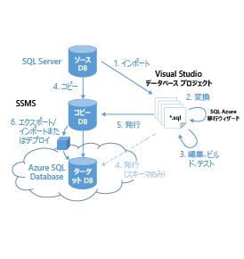

<properties 
   pageTitle="Azure SQL Database への移行" 
   description="Microsoft Azure SQL Database、データベースのデプロイ、データベースの移行、データベースのインポート、データベースのエクスポート、移行ウィザード" 
   services="sql-database" 
   documentationCenter="" 
   authors="pehteh" 
   manager="jeffreyg" 
   editor="monicar"/>

<tags
   ms.service="sql-database"
   ms.devlang="NA"
   ms.topic="article"
   ms.tgt_pltfrm="NA"
   ms.workload="data-management" 
   ms.date="04/15/2015"
   ms.author="pehteh"/>

# 概要
Azure SQL Database V12 は、SQL Server 2014 とのほぼ完全なエンジン互換性を提供します。そのため、SQL Server から Azure SQL Database にデータベースを移行するタスクが大幅に簡略化されます。大量のデータベースの移行は、簡単な移動操作であり、スキーマの変更がほとんど不要で、アプリケーションの再構築もほとんど、もしくはまったく必要としません。データベースの変更が必要な場合も、変更の範囲は限定的です。

仕様では、SQL Database は、SQL Server のサーバー スコープの機能はサポートしていません。これらに依存するデータベースとアプリケーションは、引き続き移行前に再構築する必要があります。SQL Database V12 と SQL Server との互換性は向上していますが、特に大規模で複雑なデータベースの移行では、慎重に計画し、実行する必要があります。

## 概略
1 つ以上のツールを使用して Azure に SQL Server データベースを移行するさまざまな方法があります。迅速で簡単な方法もありますが、準備に時間がかかるものもあります。大規模で複雑なデータベースの移行には、かなり長い時間がかかる場合があることに注意してください。

### 方法 1
***SQL Server Management Studio (SSMS) を使用した互換性のあるデータベースの移行***

SSMS を使用して、Azure SQL Database からデータベースをデプロイします。データベースは直接デプロイすることもできますが、インポートして新しい Azure SQL Database を作成する BACPAC にエクスポートすることもできます。ソース データベースが Azure SQL Database と完全に互換性がある場合に使用します。

### 方法 2
***SQL Azure 移行ウィザード (SAMW) を使用して、ある程度互換性のあるデータベースの移行***

データベースは、SQL Azure 移行ウィザードを使用して処理され、スキーマか、データを含むスキーマを含む移行スクリプトを BCP 形式で生成します。データベース スキーマにアップグレードが必要で、変更をウィザードで処理できる場合に使用します。

### 方法 3
***Visual Studio (VS) と SAMW を使用してオフラインでデータベース スキーマを更新し、SSMS でデプロイする***

オフラインで処理するために、ソース データベースは、Visual Studio データベース プロジェクトにインポートされます。SQL Azure 移行ウィザードは、プロジェクト内のすべてのスクリプトで実行され、一連の変換と修正を適用します。プロジェクトは SQL Database V12 を対象として構築され、残りのエラーが報告されます。これらのエラーは、Visual Studio の SQL Server ツールを使用して手動で解決します。正常に構築されると、プロジェクトはソース データベースのコピーに発行されます。この更新されたデータベースは、方法 1 を使用して、Azure SQL Database にデプロイされます。スキーマのみの移行が必要な場合は、Visual Studio から  Azure SQL Database に直接、発行することができます。データベース スキーマに必要な変更が、SAMW のみで処理できる変更よりも多い場合に使用します。

## 使用する方法を決定する
- 変更することなくデータベースを移行することができると予想される場合は、迅速かつ簡単な方法 1 を使用してください。不明な場合は、方法 1 の説明に従って、データベースからスキーマのみの BACPAC をエクスポートして開始します。エラーなしで、エクスポートが成功した場合は、方法 1 を使用してそのデータとデータベースを移行することができます。  
- 方法 1 のエクスポート中にエラーが発生した場合は、方法 2 で説明したようにSQL Azure 移行ウィザード (SAMW) を使用して、スキーマのみのモードでデータベースを処理します。SAMW がエラーを報告しない場合は、方法 2 を使用できます。 
- SAMW がスキーマに追加の作業が必要であることを報告した場合は、必要な修正が簡単なものでない限り、SAMW と手動で適用したスキーマの変更の組み合わせを使用して Visual Studio のデータベース スキーマをオフラインで修正する方法 3 を使用するのが最善です。ソース データベースのコピーはその場で更新され、方法 1 を使用して Azure に移行されます。

## 移行ツール
使用されるツールには、SQL Server Management Studio (SSMS)、Visual Studio (VS、SSDT) の SQL Server ツール、SQL Azure 移行ウィザード (SAMW)、Azure ポータルが含まれます。

> 以前のバージョンは、SQL Database v12 と互換性がないため、クライアント ツールの最新バージョンをインストールしてください。

### SQL Server Management Studio (SSMS)
SSMS を使用して、互換性のあるデータベースを Azure SQL Database に直接デプロイすることもできますし、BACPAC としてデータベースの論理バックアップをエクスポートし、その後、SSMS を使用してインポートし、新しい Azure SQLDatabase を作成することもできます。

最新バージョンの SSMS  (SQL Server 2013 以降の CU6) を使用するか、ツールの[最新バージョン](http://msdn.microsoft.com/evalcenter/dn434042.aspx)をダウンロードする必要があります。

### SQL Azure 移行ウィザード (SAMW)
SAMW は、既存のデータベースのスキーマのAzure SQL Database との互換性の分析に使用することができます。また多くの場合、スキーマとデータを含む T-SQL スクリプトの生成とデプロイにも使用することができます。変換中に変換できないスキーマ コンテンツが発生した場合、ウィザードはエラーを報告します。このような場合、生成されるスクリプトは正常にデプロイする前にさらに編集することが必要です。SAMW は関数の本文か、通常は、Visual Studio の SQL Server ツールによって実行される検証から除外されたストアド プロシージャを処理します (下記をご覧ください)。これにより、Visual Studio のみの検証では報告されない問題を発見します。SAMW と Visual Studio の SQL Server ツールを組み合わせて使用することにより、複雑なスキーマを移行するために必要な作業の量を大幅に低減できます。

CodePlex の最新バージョンの [SQL Azure 移行ウィザード](http://sqlazuremw.codeplex.com/)を使用してください。

### Visual Studio の SQL Server ツール (VS、SSDT)
Visual Studio の SQL Server ツールを使用して、スキーマ内の各オブジェクトの T-SQL ファイルのセットを構成するデータベース プロジェクトを作成し、管理することができます。プロジェクトは、データベースかスクリプト ファイルからインポートできます。プロジェクトが作成されると、プロジェクトを構築し、スキーマの互換性を検証する Azure SQL Database v12 に移行します。エラーをクリックすると、対応する T-SQL ファイルが開き、編集とエラーの修正が可能になります。すべてのエラーが修正されると、プロジェクトを SQL Database に直接発行して空のデータベースを作成するか、元の SQL Server Database (のコピー) に発行してスキーマを更新することができます。これによって、上記のように SSMS を使用してデータとデータベースをデプロイできます。

Azure SQL Database の最新の更新である V12 には、Visual Studio の最新の SQL Server Database ツールを使用する必要があります。Visual Studio 2013 with Update 4 がインストールされていることをご確認ください。

## 比較
| 方法 1 | 方法 2 | 方法 3 |
| ------------ | ------------ | ------------ |
| Azure SQL Database に互換性のあるデータベースをデプロイする | 変更を含む移行スクリプトの生成と Azure SQL Database での実行 | データベースのインプレース更新と Azure SQL Database へのデプロイ |
||  |  |
| SSMS の使用 | SAMW の使用 | SAMW、VS、SSMS の使用 |
|単純なプロセスでは、そのスキーマに互換性があることが必要です。スキーマは変更されずに移行されます。 | SAMW によって生成される T-SQL スクリプトには、互換性を保証するために必要な変更が含まれています。サポートされていない機能は、スキーマから削除され、ほとんどはエラーとしてフラグが付けられます。 | スキーマは Visual Studio のデータベース プロジェクトにインポートされ、(必要に応じて) SAMW を使用して変換されます。Visual Studio の SQL Server ツールを使用して、追加の更新が行われ、最後のスキーマを使用してその場でデータベースが更新されます。 |
| BACPAC をエクスポートする場合は、スキーマのみの移行を選択できます。 | スクリプト スキーマかデータを含むスキーマにウィザードを構成できます。 | Visual Studio から Azure にスキーマのみを直接発行できます。データベースは、すべての必要な変更によってその場で更新され、スキーマとデータのデプロイとエクスポートが可能になります。 |
| 常にデータベース全体をデプロイするか、エクスポートします。 | 特定のオブジェクトを移行から除外することを選択できます。 | 移行にはオブジェクトの完全な制御が含まれています。 |
| エラーがある場合、出力を変更するためのプロビジョニングはありません。送信元スキーマには互換性が必要です。 | 単一のモノリシック生成されるたスクリプトは、編集が難しい場合があります。スクリプトは、SSMS か Visual Studio の SQL Server Database ツールで開いて編集できます。スクリプトを Azure SQL Database にデプロイする前に、すべてのエラーを修正する必要があります。| Visual Studio の SQL Server Database ツールのすべての機能が使用可能です。スキーマはオフラインで変更されます。 |
| アプリケーションの検証は Azure で行われます。変更することなく移行するには、スキーマを最小にする必要があります。 | アプリケーションの検証は、移行後に Azure で行われます。生成されたスクリプトは、最初のアプリケーションの検証のためにオンプレミスでインストールすることもできます。 | データベースを Azure にデプロイする前に、SQL Server でアプリケーションの検証を実行できます。 |
| Microsoft がサポートしているツール。 | CodePlex からダウンロードするコミュニティ サポート ツール。 | CodePlex からダウンロードする Microsoft がサポートしているツールとオプションで使用できるコミュニティ サポート ツール。 |
| 簡単に構成された 1 つか 2 つの処理手順。 | スキーマの変換、生成とクラウドへのデプロイメントは、単一の使いやすいウィザードで調整されます。 | より複雑な複数の処理手順 (スキーマのデプロイのみの場合は単純)。 |

<!---HONumber=58--> 