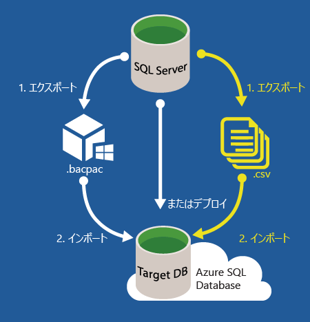

<properties
   pageTitle="SQL Server データベースの SQL Database への移行 | Microsoft Azure"
   description="オンプレミスの SQL Server データベースをクラウド内の Azure SQL Database に移行する方法について説明します。データベース移行ツールを使用すると、データベースの移行前に互換性をテストできます。"
   keywords="データベースの移行, SQL Server データベースの移行, データベース移行ツール, データベースを移行する, SQL データベースを移行する"
   services="sql-database"
   documentationCenter=""
   authors="carlrabeler"
   manager="jhubbard"
   editor=""/>

<tags
   ms.service="sql-database"
   ms.devlang="NA"
   ms.topic="article"
   ms.tgt_pltfrm="NA"
   ms.workload="sqldb-migrate"
   ms.date="06/07/2016"
   ms.author="carlrab"/>

# SQL Server データベースのクラウド内の SQL Database への移行

この記事では、オンプレミスの SQL Server 2005 またはそれ以降のデータベースを Azure SQL Database に移行する方法について説明します。このデータベース移行プロセスでは、現在の環境にある SQL Server データベースのスキーマとデータを SQL Database に移行します (ただし、移行元のデータベースが互換性テストをパスする必要があります)。[SQL Database V12](sql-database-v12-whats-new.md) では、サーバーレベルの操作とデータベースをまたいだ操作を除き、互換性の問題はほとんどありません。データベースやアプリケーションが、[部分的にしかサポートされていない機能またはサポートされていない機能](sql-database-transact-sql-information.md)を使用している場合には、SQL Server データベースの移行前にリエンジニアリングを実施してこれらの非互換性を修正する必要があります。

移行手順を以下に示します。

- **互換性をテストする**: 最初に、データベースと [SQL Database V12](sql-database-v12-whats-new.md) との互換性を検証する必要があります。 
- **互換性の問題がある場合は修正する**: 検証に失敗した場合は、検証エラーを修正する必要があります。  
- **移行を実行する**: データベースに互換性がある場合は、1 つ以上の方法を使用して移行を実行できます。 

SQL Server では、これらの各タスクを実行するための方法がいくつか提供されます。この記事では、各タスクで使用可能な方法の概要を示します。次の図に手順と方法を示します。

  
  
 > [AZURE.NOTE] Microsoft Access、Sybase、MySQL Oracle、DB2 などの SQL Server 以外のデータベースを Azure SQL Database に移行する場合は、[SQL Server Migration Assistant](http://blogs.msdn.com/b/ssma/) チームのブログ記事を参照してください。

## SQL Server データベースと SQL Database の互換性をテストするためのデータベース移行ツール

SQL Database の互換性の問題があるかどうかを確認するには、データベース移行プロセスを開始する前に、次のいずれかの方法を使用します。

> [AZURE.SELECTOR]
- [SSDT](sql-database-cloud-migrate-fix-compatibility-issues-ssdt.md)
- [SqlPackage](sql-database-cloud-migrate-determine-compatibility-sqlpackage.md)
- [SSMS](sql-database-cloud-migrate-determine-compatibility-ssms.md)
- [Upgrade Advisor](http://www.microsoft.com/download/details.aspx?id=48119)
- [SAMW](sql-database-cloud-migrate-fix-compatibility-issues.md)

- [Visual Studio 用の SQL Server Data Tools ("SSDT")](sql-database-cloud-migrate-fix-compatibility-issues-ssdt.md): SSDT では最新の互換性規則を使用して、SQL Database V12 の非互換性を検出します。非互換性が検出された場合は、このツールで直接検出された問題を修正できます。これが、SQL Database V12 の互換性をテストして、問題を修正するための現時点で推奨される方法です。 
- [SqlPackage](sql-database-cloud-migrate-determine-compatibility-sqlpackage.md): SqlPackage は、互換性をテストするためのコマンド プロンプト ユーティリティの一種です。互換性の問題が検出された場合には、問題を含むレポートが生成されます。このツールを使用する場合は、必ず、最新バージョンで最新の互換性規則を使用してください。エラーが検出された場合は、別のツール (SSDT を推奨) を使用して、検出された互換性の問題を修正する必要があります。  
- [SQL Server Management Studio のデータ層アプリケーションのエクスポート ウィザード](sql-database-cloud-migrate-determine-compatibility-ssms.md): このウィザードではエラーが検出され、画面にレポートが表示されます。エラーが検出されない場合は、SQL Database への移行を続行して完了することができます。エラーが検出された場合は、別のツール (SSDT を推奨) を使用して、検出された互換性の問題を修正する必要があります。
- [Microsoft SQL Server 2016 Upgrade Advisor プレビュー](http://www.microsoft.com/download/details.aspx?id=48119): 現在プレビュー段階のこのスタンドアロン ツールでは、SQL Database V12 の非互換性を検出し、レポートを生成します。このツールの最新の互換性規則はまだありません。エラーが検出されない場合は、SQL Database への移行を続行して完了することができます。エラーが検出された場合は、別のツール (SSDT を推奨) を使用して、検出された互換性の問題を修正する必要があります。 
- [SQL Azure 移行ウィザード ("SAMW")](sql-database-cloud-migrate-fix-compatibility-issues.md): SAMW は CodePlex ツールです。Azure SQL Database V11 の互換性規則を使用して、Azure SQL Database V12 の非互換性を検出します。非互換性が検出された場合、問題のいくつかをこのツールで直接修正できます。このツールでは、修正する必要がない非互換性が検出される場合があります。ただし、それは最初の利用可能な Azure SQL Database 移行支援ツールの場合であり、SQL Server コミュニティからこれに関する多くのサポートが得られます。また、このツールでは、ツール自体内から移行を実行することができます。 

## データベース移行に関する互換性の問題の修正

互換性の問題が検出された場合、SQL Server データベースの移行を続行する前にその問題を修正する必要があります。ソース データベースの SQL Server のバージョンと移行するデータベースの複雑さの両方に応じて、発生する可能性のある互換性の問題はさまざまです。ソース データベースの SQL Server のバージョンが古いほど、検出される可能性のある非互換性の数が多くなります。任意の検索エンジンを使用する対象のインターネット検索に加え、以下のリソースを使用します。

- [SQL Server database features not supported in Azure SQL Database (Azure SQL Database でサポートされない SQL Server データベースの機能)](sql-database-transact-sql-information.md)
- [Discontinued Database Engine Functionality in SQL Server 2016 (SQL Server 2016 で廃止されたデータベース エンジンの機能)](https://msdn.microsoft.com/library/ms144262%28v=sql.130%29)
- [Discontinued Database Engine Functionality in SQL Server 2014 (SQL Server 2014 で廃止されたデータベース エンジンの機能)](https://msdn.microsoft.com/library/ms144262%28v=sql.120%29)
- [Discontinued Database Engine Functionality in SQL Server 2012 (SQL Server 2012 で廃止されたデータベース エンジンの機能)](https://msdn.microsoft.com/library/ms144262%28v=sql.110%29)
- [Discontinued Database Engine Functionality in SQL Server 2008 R2 (SQL Server 2008 R2 で廃止されたデータベース エンジンの機能)](https://msdn.microsoft.com/library/ms144262%28v=sql.105%29)
- [SQL Server 2005 で廃止されたデータベース エンジンの機能](https://msdn.microsoft.com/library/ms144262%28v=sql.90%29)

インターネット検索とこれらのリソースの使用に加え、非互換性の問題の最適な修正方法を特定するために使用できる [MSDN SQL Server コミュニティ フォーラム](https://social.msdn.microsoft.com/Forums/sqlserver/home?category=sqlserver)や [StackOverflow](http://stackoverflow.com/) などの別の適切なリソースもあります。

検出された問題を修正するには、以下のデータベース移行ツールのいずれかを使用します。

> [AZURE.SELECTOR]
- [SSDT](sql-database-cloud-migrate-fix-compatibility-issues-ssdt.md)
- [SSMS](sql-database-cloud-migrate-fix-compatibility-issues-ssms.md)
- [SAMW](sql-database-cloud-migrate-fix-compatibility-issues.md)

- [Visual Studio 用の SQL Server Data Tools ("SSDT")](sql-database-cloud-migrate-fix-compatibility-issues-ssdt.md) を使用する: SSDT を使用するには、Visual Studio 用の SQL Server Data Tools ("SSDT") にデータベース スキーマをインポートし、SQL Database V12 デプロイ用のプロジェクトを構築して、SSDT で検出されたすべての互換性の問題を修正してから、ソース データベース (またはソース データベースのコピー) に変更をもう一度同期します。これが、SQL Database V12 の互換性をテストして、問題を修正するための現時点で推奨される方法です。[SSDT の使用に関するチュートリアル](sql-database-cloud-migrate-fix-compatibility-issues-ssdt.md)のリンクをクリックしてください。
- [SQL Server Management Studio ("SSMS")](sql-database-cloud-migrate-fix-compatibility-issues-ssms.md) を使用する: SSMS を使用するには、Transact-SQL コマンドを実行し、検出されたエラーを別のツールを使用して修正します。この方法は、主にソース データベースで直接データベース スキーマを変更する上級ユーザー向けです。 
- [SQL Azure 移行ウィザード ("SAMW")](sql-database-cloud-migrate-fix-compatibility-issues.md) を使用する: SAMW を使用するには、ソース データベースから Transact-SQL スクリプトを生成します。このスクリプトはウィザードで変換され、可能な限り、スキーマに SQL Database V12 との互換性を持たせます。完了すると、SAMW は SQL Database V12 に接続してスクリプトを実行することができます。このツールは、トレース ファイルを分析して互換性の問題の特定も行います。スキーマのみを含むスクリプトを生成することも、BCP 形式のデータを含むスクリプトを生成することもできます。

## 互換性のある SQL Server データベースの SQL Database への移行

互換性のある SQL Server データベースを移行するために、マイクロソフトでは、さまざまなシナリオに合わせていくつかの移行方法を用意しています。許容できるダウンタイム、お使いの SQL Server データベースの規模と複雑さ、Microsoft Azure クラウドへの接続の状態に応じて、方法を選択できます。

> [AZURE.SELECTOR]
- [SSMS の移行ウィザード](sql-database-cloud-migrate-compatible-using-ssms-migration-wizard.md)
- [BACPAC ファイルへのエクスポート](sql-database-cloud-migrate-compatible-export-bacpac-ssms.md)
- [BACPAC ファイルからのインポート](sql-database-cloud-migrate-compatible-import-bacpac-ssms.md)
- [トランザクション レプリケーション](sql-database-cloud-migrate-compatible-using-transactional-replication.md)

移行方法を選択するときに最初に考える必要があるのは、移行中に運用環境からデータベースを取り出すことができるか、という点です。アクティブなトランザクションが発生しているときにデータベースを移行すると、データベースの整合性が損なわれ、データベースが破損する可能性があります。クライアント接続を無効にしたり、[データベース スナップショット](https://msdn.microsoft.com/library/ms175876.aspx)を作成したりするなど、データベースはさまざまな方法で停止できます。

最小限のダウンタイムで移行するには、[SQL Server のトランザクション レプリケーションを使用します](sql-database-cloud-migrate-compatible-using-transactional-replication.md)。この場合、お使いのデータベースがトランザクション レプリケーションの要件を満たしている必要があります。ある程度のダウンタイムが許容される場合、または将来の移行に備えて運用データベースの移行をテストする場合には、次の 3 つの方法のいずれかを検討してください。

- [SSMS 移行ウィザード](sql-database-cloud-migrate-compatible-using-ssms-migration-wizard.md): 小規模から中規模のデータベースの場合、互換性のある SQL Server 2005 またはそれ以降のデータベースの移行は、SQL Server Management Studio の、[データベースの Microsoft Azure Database へのデプロイ ウィザード](sql-database-cloud-migrate-compatible-using-ssms-migration-wizard.md)を実行するのと同じくらい簡単です。
- [BACPAC ファイルへのエクスポート](sql-database-cloud-migrate-compatible-export-bacpac-ssms.md)と [BACPAC ファイルからのインポート](sql-database-cloud-migrate-compatible-import-bacpac-ssms.md): 接続に問題があり (接続がない、帯域幅が狭い、またはタイムアウトの問題が存在する)、データベースが中規模から大規模の場合には、[BACPAC](https://msdn.microsoft.com/library/ee210546.aspx#Anchor_4) ファイルを使用します。この方法では、スキーマとデータを BACPAC ファイルにエクスポートしたうえで、その BACPAC ファイルを SQL Database にインポートします。エクスポートとインポートには、SQL Server Management Studio のデータ層アプリケーションのエクスポート ウィザードか、[SqlPackage](https://msdn.microsoft.com/library/hh550080.aspx) コマンド プロンプト ユーティリティを使用します。
- BACPAC と BCP の併用: より大規模なデータベースの場合、複雑にはなりますが、[BACPAC](https://msdn.microsoft.com/library/ee210546.aspx#Anchor_4) ファイルと [BCP](https://msdn.microsoft.com/library/ms162802.aspx) を使用することで、より高度な並列処理を実現し、パフォーマンスを向上させることができます。この方法では、スキーマとデータを別々に移行します。
 - [スキーマのみを BACPAC ファイルにエクスポートします](sql-database-cloud-migrate-compatible-export-bacpac-ssms.md)。
 - [スキーマのみを BACPAC ファイルから SQL Database にインポートします](sql-database-cloud-migrate-compatible-import-bacpac-ssms.md)。
 - [BCP](https://msdn.microsoft.com/library/ms162802.aspx) を使用してデータをフラット ファイルに抽出し、これらのファイルを Azure SQL Database に[並列ロード](https://technet.microsoft.com/library/dd425070.aspx)します。

	 

## 次のステップ

- [Microsoft SQL Server 2016 Upgrade Advisor プレビュー](http://www.microsoft.com/download/details.aspx?id=48119)
- [最新バージョンの SSDT](https://msdn.microsoft.com/library/mt204009.aspx)
- [最新バージョンの SQL Server Management Studio](https://msdn.microsoft.com/library/mt238290.aspx)

##詳細情報

- [SQL Database V12](sql-database-v12-whats-new.md) [Transact-SQL の部分的にサポートされる機能またはまったくサポートされていない機能](sql-database-transact-sql-information.md)
- [SQL Server Migration Assistant を使用した SQL Server 以外のデータベースの移行](http://blogs.msdn.com/b/ssma/)

<!---HONumber=AcomDC_0608_2016-->