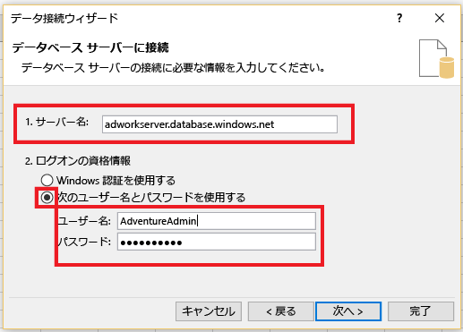
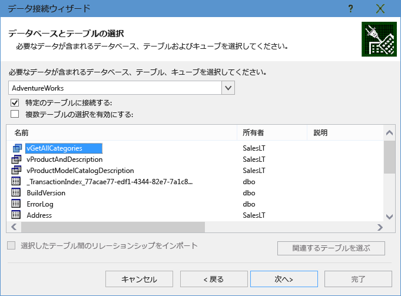
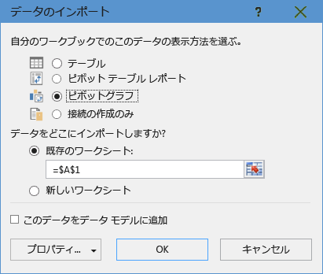
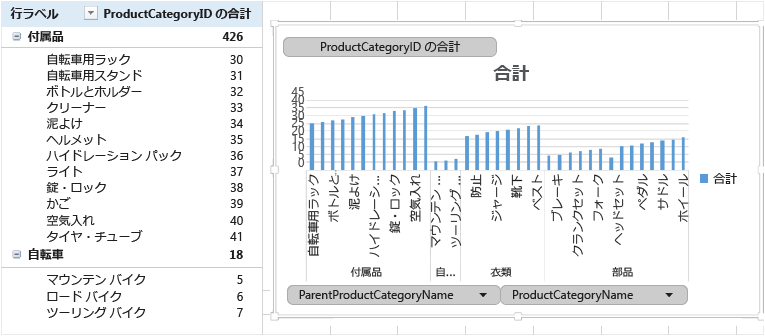

# Excel を Azure SQL データベースの単一データベースに接続してレポートを作成する

Excel を Azure SQL Database の単一データベースに接続し、データをインポートし、データベース内の値に基づいてテーブルとグラフを作成します。 このチュートリアルでは、Excel とデータベース テーブル間の接続をセットアップし、データと Excel の接続情報を格納するファイルを保存して、データベースの値からピボット グラフを作成します。

作業を開始する前に、単一データベースが必要です。 ない場合は、[単一データベースの作成](sql-database-single-database-get-started.md)および[サーバー レベル IP ファイアウォールの作成](sql-database-server-level-firewall-rule.md)に関する記事を参照して、サンプル データを含む単一データベースを数分で作成して実行できます。

この記事では、記事のサンプル データを Excel にインポートしますが、独自のデータでも同様の手順を実行できます。

また、Excel も必要です。 この記事では、 [Microsoft Excel 2016](https://products.office.com/)を使用します。

## Excel を SQL データベースに接続してデータを読み込む

1. Excel を SQL データベースに接続するには、Excel を開き、新しいブックを作成するか、既存の Excel ブックを開きます。
2. ページ上部のメニュー バーで **データ** タブを選択し、**データの取得**、[Azure から]、**Azure SQL データベースから** の順に選択します。 

   

   データ接続ウィザードが開きます。
3. **[データベース サーバーに接続]** ダイアログ ボックスで、接続する SQL データベースの**サーバー名**を <*servername*> **.database.windows.net** 形式で入力します。 たとえば、**msftestserver.database.windows.net** のようにします。 必要に応じて、データベースの名前を入力します。 **[OK]** を選択して資格情報ウィンドウを開きます。 

   ![[データベース サーバー] ダイアログ ボックスに接続する](media/sql-database-connect-excel/server-name.png)

4. **[SQL Server データベース]** ダイアログ ボックスで、左側の **[データベース]** を選択し、接続する SQL Database サーバーの **[ユーザー名]** と **[パスワード]** を入力します。 **[接続]** を選択して **[ナビゲーター]** を開きます。 

   

   > [!TIP]
   > ネットワーク環境によっては、使用しているクライアント IP アドレスからのトラフィックを SQL Database サーバーが許可しない場合に、接続できないことまたは接続を失うことがあります。 [Azure ポータル](https://portal.azure.com/)に移動し、[SQL サーバー]、お使いのサーバー、設定の下のファイアウォールの順にクリックし、使用しているクライアント IP アドレスを追加します。 詳細については、 [ファイアウォール設定の構成方法](sql-database-configure-firewall-settings.md) に関するページを参照してください。

5. **[ナビゲーター]** で、操作するデータベースを一覧から選択し、操作するテーブルまたはビューを選択し (**vGetAllCategories** を選択しました)、 **[読み込み]** を選択して、データベースから Excel スプレッドシートにデータを移動します。

    

## Excel にデータをインポートしてピボット グラフを作成する

接続を確立したので、複数の方法のいずれかでデータを読み込みます。 たとえば、次の手順は、SQL Database に見つかったデータに基づいてピボット グラフを作成します。 

1. 前のセクションの手順に従いますが、 **[読み込み]** を選択する代わりに、今回は **[Load to]** (読み込み先) を **[読み込み]** ドロップダウンから選択します。
2. 次に、ブックでこのデータを表示する方法を選択します。 ここでは **[ピボットグラフ​​]** を選択します。 **[新しいワークシート]** または **[このデータをデータ モデルに追加する]** を選択することもできます。 データ モデルの詳細については、「 [Excel でデータ モデルを作成する](https://support.office.com/article/Create-a-Data-Model-in-Excel-87E7A54C-87DC-488E-9410-5C75DBCB0F7B)」を参照してください。 

    

    ワークシートに、空のピボット テーブルとグラフが作成されました。
3. **[ピボットテーブルのフィールド]** で、表示するフィールドのチェック ボックスをすべてオンにします。

    

> [!TIP]
> 他の Excel ブックおよびワークシートをデータベースに接続する場合、 **[データ]** タブを選択し、 **[最近のソース]** を選択して **[最近のソース]** ダイアログ ボックスを開きます。 作成した接続を一覧から選択して **[開く]** をクリックします。
> ![[最近のリソース] ダイアログ ボックス](media/sql-database-connect-excel/recent-connections.png)

## .odc ファイルを使用して永続的な接続を作成する

接続の詳細を永続的に保存するために、.odc ファイルを作成し、この接続を **[既存の接続]** ダイアログ ボックス内で選択可能なオプションにすることができます。 

1. ページ上部のメニュー バーで **[データ]** タブを選択し、 **[既存の接続]** を選択して **[既存の接続]** ダイアログ ボックスを開きます。 
   1. **[Browse for more]** (参照) を選択して **[データ ソースの選択]** ダイアログ ボックスを開きます。   
   2. **+NewSqlServerConnection.odc** ファイルを選択し、 **[開く]** をクリックして **[データ接続ウィザード]** を開きます。

      ![[新しい接続] ダイアログ ボックス](media/sql-database-connect-excel/new-connection.png)

2. **[データ接続ウィザード]** で、サーバー名と SQL Database 資格情報を入力します。 **[次へ]** を選択します。 
   1. データが含まれるデータベースをドロップダウンから選択します。 
   2. 関心のあるテーブルまたはビューを選択します。 ここでは vGetAllCategories を選択しました。
   3. **[次へ]** を選択します。 

       

3. [データ接続ウィザード] の次の画面で、ファイルの場所、 **[ファイル名]** 、および **[フレンドリ名]** を選択します。 パスワードをファイルに保存することも選択できますが、これによりデータが望ましくないアクセスにさらされる可能性があります。 準備ができたら **[完了]** を選択します。 

    

4. データをインポートする方法を選択します。 ここでは PivotTable の実行を選択しました。 **[プロパティ]** を選択して、接続のプロパティを変更することもできます。 準備ができたら **[OK]** を選択します。 パスワードをファイルに保存しなかった場合、資格情報の入力を求められます。 

    

5. **[データ]** タブを展開して **[既存の接続]** を選択することで、新しい接続が保存されていることを確認します。 

    

## 次の手順

* 高度なクエリと分析に関して、 [SQL Server Management Studio を使用して SQL Database に接続する](sql-database-connect-query-ssms.md) 方法を学習します。
* [エラスティック プール](sql-database-elastic-pool.md)の利点について学習します。
* [バックエンドで SQL Database に接続する Web アプリケーションを作成する](../app-service/app-service-web-tutorial-dotnet-sqldatabase.md)方法を学習します。
