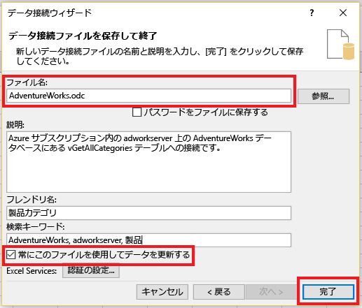

# Excel を Azure SQL データベースに接続し、レポートを作成する

Excel をクラウドの SQL データベースに接続し、データをインポートして、データベース内の値に基づいてテーブルおよびグラフを作成します。 このチュートリアルでは、Excel とデータベース テーブル間の接続をセットアップし、データと Excel の接続情報を格納するファイルを保存して、データベースの値からピボット グラフを作成します。

作業を開始する前に、Azure 内に SQL データベースが必要です。 SQL データベースがない場合は、「 [最初の SQL Database を作成する](sql-database-get-started.md) 」を参照することで、サンプル データを含むデータベースを数分で作成して実行できます。 この記事では、記事のサンプル データを Excel にインポートしますが、独自のデータでも同様の手順を実行できます。

また、Excel も必要です。 この記事では、 [Microsoft Excel 2016](https://products.office.com/en-US/)を使用します。

## Excel を SQL データベースに接続して odc ファイルを作成する
1. Excel を SQL データベースに接続するには、Excel を開き、新しいブックを作成するか、既存の Excel ブックを開きます。
2. ページの上部にあるメニュー バーで、**[データ]**、**[その他のデータ ソース]**、**[SQL Server]** の順にクリックします。
   
   
   
   データ接続ウィザードが開きます。
3. **[データベース サーバーに接続]** ダイアログ ボックスで、接続する SQL データベースの**サーバー名**を <*servername*>**.database.windows.net** 形式で入力します。 たとえば、「 **adworkserver.database.windows.net**」と入力します。
4. **[ログオン資格情報]** の下の **[以下のユーザー名とパスワードを使用する]** をクリックし、SQL データベース サーバーを作成した際に設定した**ユーザー名**と**パスワード**を入力して、**[次へ]** をクリックします。
   
   
   
   > [!TIP]
   > ネットワーク環境によっては、使用しているクライアント IP アドレスからのトラフィックを SQL データベース サーバーが許可しない場合に、接続できないことまたは接続を失うことがあります。 [Azure ポータル](https://portal.azure.com/)に移動し、[SQL サーバー]、お使いのサーバー、設定の下のファイアウォールの順にクリックし、使用しているクライアント IP アドレスを追加します。 詳細については、 [ファイアウォール設定の構成方法](sql-database-configure-firewall-settings.md) に関するページを参照してください。
   > 
   > 
5. **[データベースとテーブルの選択]** ダイアログで、一覧から操作対象のデータベースを選択し、操作するテーブルまたはビューをクリックして (ここでは **vGetAllCategories** を選択)、**[次へ]** をクリックします。
   
    
   
    **[データ接続ファイルを保存して終了]** ダイアログ ボックスが開かれるので、Excel で使用される Office データベース接続 (*.odc) ファイルに関する情報を指定します。 既定値のままにすることも、選択してカスタマイズすることもできます。
6. 既定値のままにする場合は、 **[ファイル名]** に特に注意してください。 **説明**、**フレンドリ名**、**検索キーワード**を使うと、接続対象が覚えやすくなったり、接続が検索しやすくなったりします。 接続時に更新できるように接続情報を odc ファイルに保存する場合は、**[常にこのファイルを使用してデータを更新する]** をクリックし、**[完了]** をクリックします。
   
    
   
    **[データのインポート]** ダイアログ ボックスが表示されます。

## Excel にデータをインポートしてピボット グラフを作成する
接続を確立し、データと接続情報を含むファイルを作成したため、データをインポートする準備ができました。

1. **[データのインポート]** ダイアログ ボックスで、ワークシートにデータを表示するためのオプションをクリックし、**[OK]** をクリックします。 ここでは **[ピボットグラフ​​]**を選択します。 **[新しいワークシート]** または **[このデータをデータ モデルに追加する]** を選択することもできます。 データ モデルの詳細については、「 [Excel でデータ モデルを作成する](https://support.office.com/article/Create-a-Data-Model-in-Excel-87E7A54C-87DC-488E-9410-5C75DBCB0F7B)」を参照してください。 **[プロパティ]** をクリックして、前の手順で作成した odc ファイルに関する情報を調べ、データを更新するためのオプションを選択します。
   
    
   
    ワークシートに、空のピボット テーブルとグラフが作成されました。
2. **[ピボットテーブルのフィールド]**で、表示するフィールドのチェック ボックスをすべてオンにします。
   
    

> [!TIP]
> 他の Excel ブックおよびワークシートをデータベースに接続する場合は、**[データ]**、**[接続]**、**[追加]** の順にクリックし、作成した接続を一覧から選択して、**[開く]** をクリックします。
> 
> 
> 

## 次のステップ
* 高度なクエリと分析に関して、 [SQL Server Management Studio を使用して SQL Database に接続する](sql-database-connect-query-ssms.md) 方法を学習します。
* [エラスティック プール](sql-database-elastic-pool.md)の利点について学習します。
* [バックエンドで SQL Database に接続する Web アプリケーションを作成する](../app-service-web/web-sites-dotnet-deploy-aspnet-mvc-app-membership-oauth-sql-database.md)方法を学習します。

