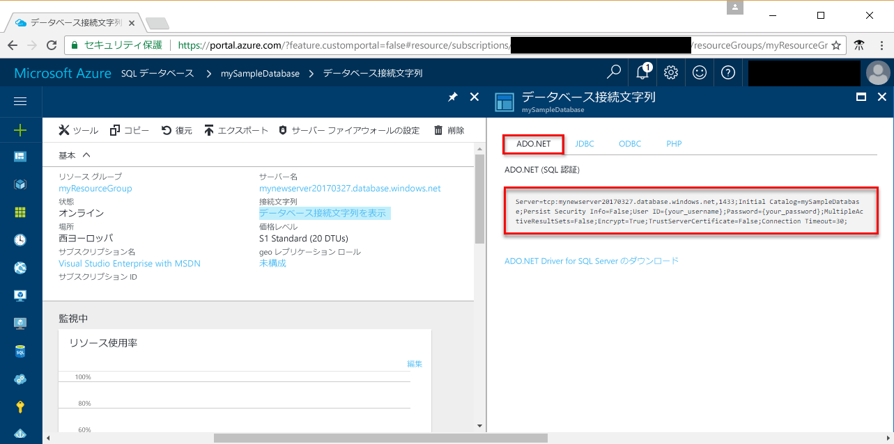

# <a name="use-net-core-c-to-query-an-azure-sql-database"></a>.NET Core (C#) を使用して Azure SQL データベースに照会する

このクイック スタートでは、Azure SQL Database に接続して Transact-SQL ステートメントでデータを照会する C# プログラムを Windows/Linux/macOS 上の [.NET Core](https://www.microsoft.com/net/) を使って作成する方法について説明します。

## <a name="prerequisites"></a>前提条件

このクイック スタートを完了するには、以下のものが必要です。

[!INCLUDE [prerequisites-create-db](../../includes/sql-database-connect-query-prerequisites-create-db-includes.md)]

- このクイック スタートに使用するコンピューターのパブリック IP アドレスに対する[サーバー レベルのファイアウォール規則](sql-database-get-started-portal.md#create-a-server-level-firewall-rule)。

- [ご使用のオペレーティング システムの .NET Core](https://www.microsoft.com/net/core) をインストール済みであること。 

## <a name="sql-server-connection-information"></a>SQL Server の接続情報

[!INCLUDE [prerequisites-server-connection-info](../../includes/sql-database-connect-query-prerequisites-server-connection-info-includes.md)]

#### <a name="for-adonet"></a>ADO.NET の場合

1. **[データベース接続文字列の表示]** をクリックして先に進みます。

2. 完全な **ADO.NET** 接続文字列を確認します。

    

> [!IMPORTANT]
> このチュートリアルを実行するコンピューターのパブリック IP アドレスに対してファイアウォール規則を設定しておく必要があります。 別のコンピューターから実行する場合または別のパブリック IP アドレスがある場合は、[Azure Portal でサーバー レベルのファイアウォール規則](sql-database-get-started-portal.md#create-a-server-level-firewall-rule)を作成してください。 
>
  
## <a name="create-a-new-net-project"></a>新しい .NET プロジェクトの作成

1. コマンド プロンプトを開き、*sqltest* という名前のフォルダーを作成します。 作成したフォルダに移動し、次のコマンドを実行します。

    ```
    dotnet new console
    ```

2. 任意のテキスト エディターで ***sqltest.csproj*** を開き、System.Data.SqlClient を依存関係として追加します。次のコードを使用してください。

    ```xml
    <ItemGroup>
        <PackageReference Include="System.Data.SqlClient" Version="4.4.0" />
    </ItemGroup>
    ```

## <a name="insert-code-to-query-sql-database"></a>SQL Database に照会するコードの挿入

1. ご使用の開発環境または任意のテキスト エディターで **Program.cs** を開きます。

2. その内容を次のコードで置き換えます。サーバー、データベース、ユーザー、パスワードには、実際の値を追加してください。

```csharp
using System;
using System.Data.SqlClient;
using System.Text;

namespace sqltest
{
    class Program
    {
        static void Main(string[] args)
        {
            try 
            { 
                SqlConnectionStringBuilder builder = new SqlConnectionStringBuilder();
                builder.DataSource = "your_server.database.windows.net"; 
                builder.UserID = "your_user";            
                builder.Password = "your_password";     
                builder.InitialCatalog = "your_database";

                using (SqlConnection connection = new SqlConnection(builder.ConnectionString))
                {
                    Console.WriteLine("\nQuery data example:");
                    Console.WriteLine("=========================================\n");
                    
                    connection.Open();       
                    StringBuilder sb = new StringBuilder();
                    sb.Append("SELECT TOP 20 pc.Name as CategoryName, p.name as ProductName ");
                    sb.Append("FROM [SalesLT].[ProductCategory] pc ");
                    sb.Append("JOIN [SalesLT].[Product] p ");
                    sb.Append("ON pc.productcategoryid = p.productcategoryid;");
                    String sql = sb.ToString();

                    using (SqlCommand command = new SqlCommand(sql, connection))
                    {
                        using (SqlDataReader reader = command.ExecuteReader())
                        {
                            while (reader.Read())
                            {
                                Console.WriteLine("{0} {1}", reader.GetString(0), reader.GetString(1));
                            }
                        }
                    }                    
                }
            }
            catch (SqlException e)
            {
                Console.WriteLine(e.ToString());
            }
            Console.ReadLine();
        }
    }
}
```

## <a name="run-the-code"></a>コードの実行

1. コマンド プロンプトで、次のコマンドを実行します。

   ```csharp
   dotnet restore
   dotnet run
   ```

2. 先頭から 20 行が返されることを確認して、アプリケーション ウィンドウを閉じます。


## <a name="next-steps"></a>次の手順

- [Windows/Linux/macOS の .NET Core でのコマンド ラインの使用に関する概要](/dotnet/core/tutorials/using-with-xplat-cli)
- [.NET Framework と Visual Studio で Azure SQL Database に接続してデータベースに照会](sql-database-connect-query-dotnet-visual-studio.md)する方法についての情報を入手します。  
- [SSMS で初めての Azure SQL Database を設計](sql-database-design-first-database.md)する方法や [.NET で初めての Azure SQL Database を設計](sql-database-design-first-database-csharp.md)する方法についての情報を入手します。
- .NET の詳細については、[.NET のドキュメント](https://docs.microsoft.com/dotnet/)を参照してください。
