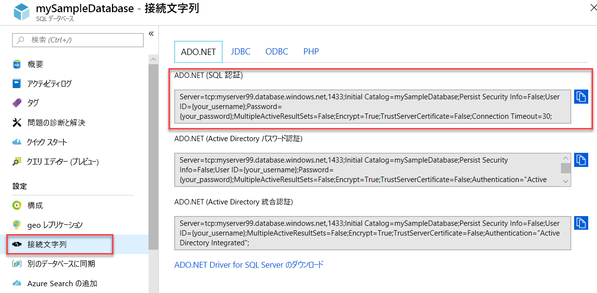

# <a name="quickstart-use-net-core-c-to-query-an-azure-sql-database"></a>クイック スタート:.NET Core (C#) を使用して Azure SQL データベースに照会する

このクイック スタートでは、[.NET Core](https://www.microsoft.com/net/) と C# コードを使って Azure SQL データベースに接続した後、Transact-SQL ステートメントを実行してデータのクエリを行う方法について説明します。

## <a name="prerequisites"></a>前提条件

このチュートリアルには、次のものが必要です。

[!INCLUDE [prerequisites-create-db](../../includes/sql-database-connect-query-prerequisites-create-db-includes.md)]

- お使いのコンピューターのパブリック IP アドレスに対する[サーバーレベルのファイアウォール規則](sql-database-get-started-portal-firewall.md)。

- [お使いオペレーティング システム用の .NET Core](https://www.microsoft.com/net/core) がインストールされていること。 

> [!NOTE]
> このクイック スタートでは、*mySampleDatabase* データベースを使用します。 別のデータベースを使いたい場合は、データベース参照を変更し、C# コードの `SELECT` クエリを変更する必要があります。


## <a name="get-sql-server-connection-information"></a>SQL サーバーの接続情報を取得する

[!INCLUDE [prerequisites-server-connection-info](../../includes/sql-database-connect-query-prerequisites-server-connection-info-includes.md)]

#### <a name="get-adonet-connection-information-optional"></a>ADO.NET の接続情報を取得する (省略可能)

1. **mySampleDatabase** のページに移動し、**[設定]** で **[接続文字列]** を選択します。

2. 完全な **ADO.NET** 接続文字列を確認します。

    

3. 使用する場合は、**ADO.NET** の接続文字列をコピーします。
  
## <a name="create-a-new-net-core-project"></a>新しい .NET Core プロジェクトを作成する

1. コマンド プロンプトを開き、**sqltest** という名前のフォルダーを作成します。 このフォルダーに移動して、次のコマンドを実行します。

    ```cmd
    dotnet new console
    ```
    これにより、初期 C# コード ファイル (**Program.cs**)、XML 構成ファイル (**sqltest.csproj**)、必要なバイナリなど、新しいアプリ プロジェクト ファイルが作成されます。

2. テキスト エディターで **sqltest.csproj** を開き、`<Project>` タグの間に次の XML を貼り付けます。 これにより、依存関係として `System.Data.SqlClient` が追加されます。

    ```xml
    <ItemGroup>
        <PackageReference Include="System.Data.SqlClient" Version="4.6.0" />
    </ItemGroup>
    ```

## <a name="insert-code-to-query-sql-database"></a>SQL Database に照会するコードの挿入

1. テキスト エディターで、**Program.cs** を開きます。

2. その内容を次のコードで置き換え、サーバー、データベース、ユーザー名、パスワードに実際の値を追加します。

> [!NOTE]
> ADO.NET の接続文字列を使用するには、コードでサーバー、データベース、ユーザー名、パスワードを設定している 4 行を、次の行に置き換えます。 文字列で、ユーザー名とパスワードを設定します。
>
>    `builder.ConnectionString="<your_ado_net_connection_string>";`

```csharp
using System;
using System.Data.SqlClient;
using System.Text;

namespace sqltest
{
    class Program
    {
        static void Main(string[] args)
        {
            try 
            { 
                SqlConnectionStringBuilder builder = new SqlConnectionStringBuilder();

                builder.DataSource = "<your_server.database.windows.net>"; 
                builder.UserID = "<your_username>";            
                builder.Password = "<your_password>";     
                builder.InitialCatalog = "<your_database>";
         
                using (SqlConnection connection = new SqlConnection(builder.ConnectionString))
                {
                    Console.WriteLine("\nQuery data example:");
                    Console.WriteLine("=========================================\n");
                    
                    connection.Open();       
                    StringBuilder sb = new StringBuilder();
                    sb.Append("SELECT TOP 20 pc.Name as CategoryName, p.name as ProductName ");
                    sb.Append("FROM [SalesLT].[ProductCategory] pc ");
                    sb.Append("JOIN [SalesLT].[Product] p ");
                    sb.Append("ON pc.productcategoryid = p.productcategoryid;");
                    String sql = sb.ToString();

                    using (SqlCommand command = new SqlCommand(sql, connection))
                    {
                        using (SqlDataReader reader = command.ExecuteReader())
                        {
                            while (reader.Read())
                            {
                                Console.WriteLine("{0} {1}", reader.GetString(0), reader.GetString(1));
                            }
                        }
                    }                    
                }
            }
            catch (SqlException e)
            {
                Console.WriteLine(e.ToString());
            }
            Console.WriteLine("\nDone. Press enter.");
            Console.ReadLine(); 
        }
    }
}
```

## <a name="run-the-code"></a>コードの実行

1. プロンプトで、次のコマンドを実行します。

   ```cmd
   dotnet restore
   dotnet run
   ```

2. 先頭の 20 行が返されることを確認します。

   ```text
   Query data example:
   =========================================

   Road Frames HL Road Frame - Black, 58
   Road Frames HL Road Frame - Red, 58
   Helmets Sport-100 Helmet, Red
   Helmets Sport-100 Helmet, Black
   Socks Mountain Bike Socks, M
   Socks Mountain Bike Socks, L
   Helmets Sport-100 Helmet, Blue
   Caps AWC Logo Cap
   Jerseys Long-Sleeve Logo Jersey, S
   Jerseys Long-Sleeve Logo Jersey, M
   Jerseys Long-Sleeve Logo Jersey, L
   Jerseys Long-Sleeve Logo Jersey, XL
   Road Frames HL Road Frame - Red, 62
   Road Frames HL Road Frame - Red, 44
   Road Frames HL Road Frame - Red, 48
   Road Frames HL Road Frame - Red, 52
   Road Frames HL Road Frame - Red, 56
   Road Frames LL Road Frame - Black, 58
   Road Frames LL Road Frame - Black, 60
   Road Frames LL Road Frame - Black, 62

   Done. Press enter.
   ```
3. **Enter** キーを押してアプリケーション ウィンドウを閉じます。

## <a name="next-steps"></a>次の手順

- [Windows/Linux/macOS の .NET Core でのコマンド ラインの使用に関する概要](/dotnet/core/tutorials/using-with-xplat-cli)
- [.NET Framework と Visual Studio で Azure SQL Database に接続してデータベースに照会](sql-database-connect-query-dotnet-visual-studio.md)する方法について学習します。  
- [SSMS を使用して初めての Azure SQL データベースを設計する](sql-database-design-first-database.md)方法や、[C# と ADO.NET で Azure SQL データベースを設計して接続する](sql-database-design-first-database-csharp.md)方法について学習します。
- .NET の詳細については、[.NET のドキュメント](https://docs.microsoft.com/dotnet/)を参照してください。
