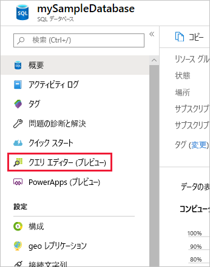
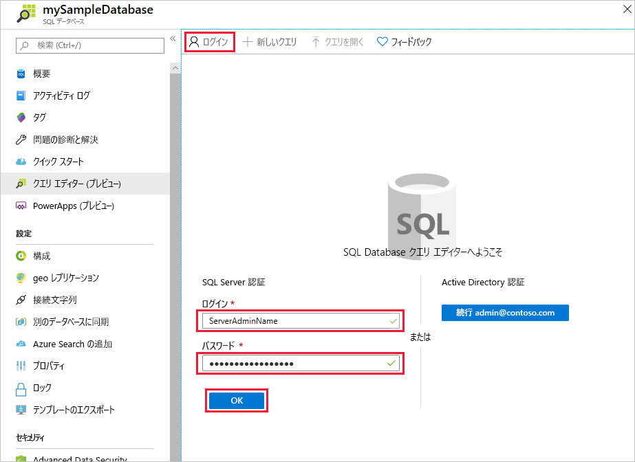
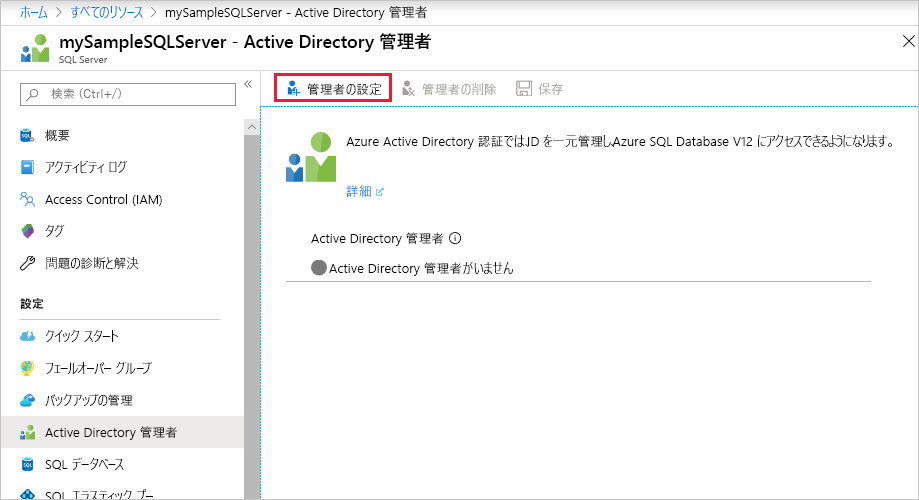
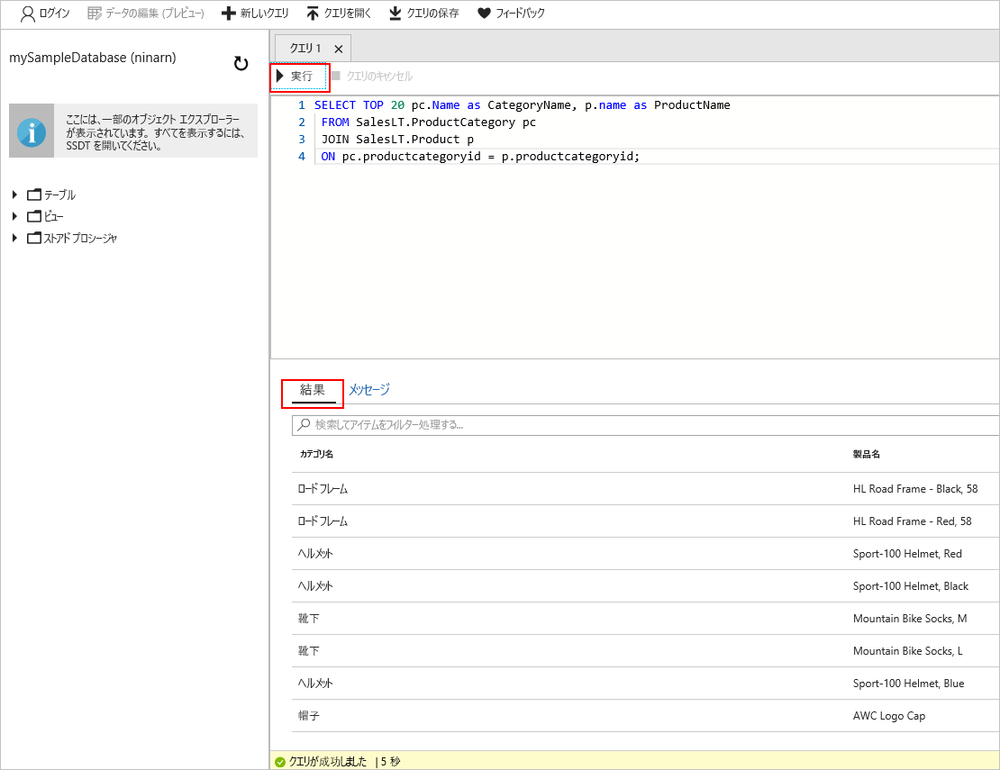

# <a name="quickstart-use-the-azure-portals-sql-query-editor-to-connect-and-query-data"></a>クイック スタート:Azure portal の SQL クエリ エディターを使用した接続とデータの照会

SQL クエリ エディターは、お使いの Azure SQL Database または Azure SQL Data Warehouse で SQL クエリを実行するための簡単な方法を示した Azure portal ブラウザー ツールです。 このクイック スタートでは、クエリ エディターを使用して SQL データベースに接続し、Transact-SQL ステートメントを実行してデータのクエリ、挿入、更新、および削除を実行する方法について説明します。

## <a name="prerequisites"></a>前提条件

このチュートリアルを完了するには、次のものが必要です。

[!INCLUDE [prerequisites-create-db](../../includes/sql-database-connect-query-prerequisites-create-db-includes.md)]

> [!NOTE]
> SQL Server のファイアウォール設定で、**[Azure サービスへのアクセスを許可する]** オプションが **[オン]** に設定されていることを確認します。 このオプションにより、SQL クエリ エディターはデータベースおよびデータ ウェアハウスにアクセスできるようになります。

## <a name="sign-in-the-azure-portal"></a>Azure portal へのサインイン

[Azure Portal](https://portal.azure.com/) にサインインします。

## <a name="connect-using-sql-authentication"></a>SQL 認証を使用して接続する

1. 左側のメニューから **[SQL データベース]** を選択して、**mySampleDatabase** を選びます。

2. 左側のメニューで、**[クエリ エディター (プレビュー)]** を探して選択します。 **[ログイン]** ページが表示されます。

    

3. **[認証の種類]** ドロップダウン メニューから **[SQL Server 認証]** を選択して、データベースの作成に使用するサーバー管理者アカウントのユーザー ID とパスワードを入力します。

     

4. **[OK]** を選択します。


## <a name="connect-using-azure-active-directory"></a>Azure Active Directory への接続

Active Directory (AD) 管理者を構成すると、1 つの ID を使って Azure portal と SQL データベースにサインインできます。 お使いの SQL Server の AD 管理者を構成するには、次の手順に従います。

> [!NOTE]
* 電子メール アカウント (たとえば、outlook.com、gmail.com、yahoo.com など) は、AD 管理者としてまだサポートされていません。 Azure AD でネイティブに作成されたユーザーか、Azure AD にフェデレーションされたユーザーのどちらかを必ず選択します。
* Azure AD 管理者のサインインは、2 要素認証が有効になっているアカウントでは機能しません。

1. 左側のメニューから **[すべてのリソース]** を選択してから、お使いの SQL Server を選択します。

2. お使いの SQL Server の **[設定]** メニューから、**[Active Directory 管理者]** を選択します。

3. AD 管理者ページのツールバーから、**[管理者の設定]** を選択し、ユーザーまたはグループを AD 管理者として選択します。

    

4. AD 管理者ページのツールバーから、**[保存]** を選択します。

5. **mySampleDatabase** データベースに移動して、左側のメニューから **[クエリ エディター (プレビュー)]** を選択します。 **[ログイン]** ページが表示されます。 AD 管理者である場合は、右側にある **[Active Directory シングル サインオン]** の下に、サインインしたことを示すメッセージが表示されます。 
   
6. **[OK]** を選択します。


## <a name="view-data"></a>データの表示

1. 認証されたら、クエリ エディターに次の SQL を貼り付けて、カテゴリごとに上位 20 個の製品を取得します。

   ```sql
    SELECT TOP 20 pc.Name as CategoryName, p.name as ProductName
    FROM SalesLT.ProductCategory pc
    JOIN SalesLT.Product p
    ON pc.productcategoryid = p.productcategoryid;
   ```

2. ツールバーで、**[実行]** を選択して、**[結果]** ウィンドウで出力を確認します。



## <a name="insert-data"></a>データを挿入する

次の [INSERT](https://msdn.microsoft.com/library/ms174335.aspx) Transact-SQL ステートメントを実行して、`SalesLT.Product` テーブルに新しい製品を追加します。

1. 前のクエリを次のクエリに置き換えます。

   ```sql
   INSERT INTO [SalesLT].[Product]
           ( [Name]
           , [ProductNumber]
           , [Color]
           , [ProductCategoryID]
           , [StandardCost]
           , [ListPrice]
           , [SellStartDate]
           )
     VALUES
           ('myNewProduct'
           ,123456789
           ,'NewColor'
           ,1
           ,100
           ,100
           ,GETDATE() );
   ```


2. **[実行]** を選択して、新しい行を `Product` テーブルに挿入します。 **メッセージ** ペインに、**[クエリが成功しました: 影響を受ける行: 1]** と表示されます。


## <a name="update-data"></a>データの更新

次の [UPDATE](https://msdn.microsoft.com/library/ms177523.aspx) Transact-SQL ステートメントを実行して、新しい製品を変更します。

1. 前のクエリを次のクエリに置き換えます。

   ```sql
   UPDATE [SalesLT].[Product]
   SET [ListPrice] = 125
   WHERE Name = 'myNewProduct';
   ```

2. **[実行]** を選択して、`Product` テーブルの指定した行を更新します。 **メッセージ** ペインに、**[クエリが成功しました: 影響を受ける行: 1]** と表示されます。

## <a name="delete-data"></a>データの削除

次の [DELETE](https://msdn.microsoft.com/library/ms189835.aspx) Transact-SQL ステートメントを実行して、新しい製品を削除します。

1. 前のクエリを次のクエリに置き換えます。

   ```sql
   DELETE FROM [SalesLT].[Product]
   WHERE Name = 'myNewProduct';
   ```

2. **[実行]** を選択して、`Product` テーブルの指定した行を削除します。 **メッセージ** ペインに、**[クエリが成功しました: 影響を受ける行: 1]** と表示されます。


## <a name="query-editor-considerations"></a>クエリ エディターに関する考慮事項

クエリ エディターを操作するときは次の点に注意してください。

* クエリ エディターを使用して仮想ネットワークの SQL Server データベースを照会することはできません。

* F5 キーを押してクエリ エディターのページを更新すると、操作中のクエリは失われます。

* クエリ エディターは、`master` データベースへの接続をサポートしません。

* クエリの実行には、5 分のタイムアウトがあります。

* geography データ型に関してクエリ エディターでサポートされるのは円柱投影のみです。

* データベース テーブルおよびビューでは、IntelliSense はサポートされていません。 ただし、エディターでは、既に入力されている名前のオートコンプリートをサポートしています。


## <a name="next-steps"></a>次の手順

Azure SQL Database でサポートされる Transact-SQL の詳細については、「[SQL Database への移行時に Transact-SQL の相違点を解決する](sql-database-transact-sql-information.md)」を参照してください。
