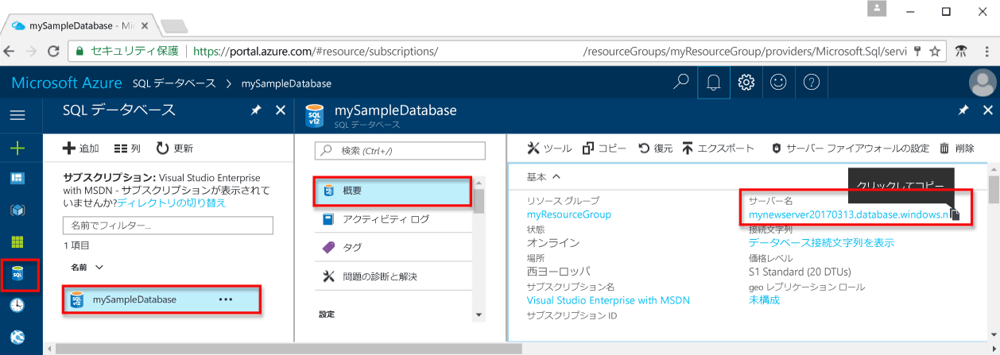

# <a name="azure-sql-database-use-python-to-connect-and-query-data"></a>Azure SQL Database: Python を使って接続とデータの照会を行う

[Python](https://python.org) を使用して Azure SQL Database に接続し、クエリを実行します。 このガイドでは、Python を使用して Azure SQL Database に接続し、照会、挿入、更新、削除の各ステートメントを実行する方法について詳しく説明します。

このクイック スタートでは、次のクイック スタートで作成されたリソースが出発点として使用されます。

- [DB の作成 - ポータル](sql-database-get-started-portal.md)
- [DB の作成 - CLI](sql-database-get-started-cli.md)

## <a name="configure-development-environment"></a>開発環境の設定
### <a name="mac-os"></a>**Mac OS**
ターミナルを開き、python スクリプトの作成先となるディレクトリに移動します。 次のコマンドを入力して、**brew**、**Microsoft ODBC Driver for Mac**、**pyodbc** をインストールします。 pyodbc は、Linux 上で Microsoft ODBC Driver を使用して SQL データベースに接続します。

``` bash
ruby -e "$(curl -fsSL https://raw.githubusercontent.com/Homebrew/install/master/install)"
brew tap microsoft/msodbcsql https://github.com/Microsoft/homebrew-msodbcsql-preview
brew update
brew install msodbcsql 
#for silent install ACCEPT_EULA=y brew install msodbcsql
sudo pip install pyodbc==3.1.1
```

### <a name="linux-ubuntu"></a>**Linux (Ubuntu)**
ターミナルを開き、python スクリプトの作成先となるディレクトリに移動します。 次のコマンドを入力して、**Microsoft ODBC Driver for Linux** と **pyodbc** をインストールします。 pyodbc は、Linux 上で Microsoft ODBC Driver を使用して SQL データベースに接続します。

```bash
sudo su
curl https://packages.microsoft.com/keys/microsoft.asc | apt-key add -
curl https://packages.microsoft.com/config/ubuntu/16.04/prod.list > /etc/apt/sources.list.d/mssql.list
exit
sudo apt-get update
sudo apt-get install msodbcsql mssql-tools unixodbc-dev
sudo pip install pyodbc==3.1.1
```

### <a name="windows"></a>**Windows**
[Microsoft ODBC Driver 13.1](https://www.microsoft.com/download/details.aspx?id=53339) をインストールします。 pyodbc は、Linux 上で Microsoft ODBC Driver を使用して SQL データベースに接続します。 

その後、pip を使用して pyodbc をインストールします

```cmd
pip install pyodbc==3.1.1
```

pip の使用を有効にする手順については、[ここ](http://stackoverflow.com/questions/4750806/how-to-install-pip-on-windows)をご覧ください。

## <a name="get-connection-information"></a>接続情報の取得

Azure Portal で接続文字列を取得します。 その接続文字列は Azure SQL データベースに接続するために使用します。

1. [Azure ポータル](https://portal.azure.com/)にログインします。
2. 左側のメニューから **[SQL データベース]** を選択し、**[SQL データベース]** ページで目的のデータベースをクリックします。 
3. データベースの **[要点]** ウィンドウで、完全修飾サーバー名を確認します。 

    
   
## <a name="select-data"></a>データの選択
[pyodbc.connect](https://mkleehammer.github.io/pyodbc/api-connection.html) 関数と [SELECT](https://msdn.microsoft.com/library/ms189499.aspx) Transact-SQL ステートメントを使用して、Azure SQL Database のデータを照会します。 [Cursor.execute](https://mkleehammer.github.io/pyodbc/api-cursor.html) 関数は、SQL Database に対するクエリから結果セットを取得するために使用できます。 この関数は基本的に任意のクエリを受け取り、 [cursor.fetchone()](https://mkleehammer.github.io/pyodbc/api-cursor.html) を使用して反復処理できる結果セットを返します。

```Python
import pyodbc
server = 'yourserver.database.windows.net'
database = 'yourdatabase'
username = 'yourusername'
password = 'yourpassword'
driver= '{ODBC Driver 13 for SQL Server}'
cnxn = pyodbc.connect('DRIVER='+driver+';PORT=1433;SERVER='+server+';PORT=1443;DATABASE='+database+';UID='+username+';PWD='+ password)
cursor = cnxn.cursor()
cursor.execute("SELECT TOP 20 pc.Name as CategoryName, p.name as ProductName FROM [SalesLT].[ProductCategory] pc JOIN [SalesLT].[Product] p ON pc.productcategoryid = p.productcategoryid")
row = cursor.fetchone()
while row:
    print str(row[0]) + " " + str(row[1])
    row = cursor.fetchone()
```


## <a name="insert-data"></a>データを挿入する
SQL Database では、[IDENTITY](https://msdn.microsoft.com/library/ms186775.aspx) プロパティと [SEQUENCE](https://msdn.microsoft.com/library/ff878058.aspx) オブジェクトを使用して、[プライマリ キーの値](https://msdn.microsoft.com/library/ms179610.aspx)を自動生成できます。 

```Python
import pyodbc
server = 'yourserver.database.windows.net'
database = 'yourdatabase'
username = 'yourusername'
password = 'yourpassword'
driver= '{ODBC Driver 13 for SQL Server}'
cnxn = pyodbc.connect('DRIVER='+driver+';PORT=1433;SERVER='+server+';PORT=1443;DATABASE='+database+';UID='+username+';PWD='+ password)
cursor = cnxn.cursor()
with cursor.execute("INSERT INTO SalesLT.Product (Name, ProductNumber, Color, StandardCost, ListPrice, SellStartDate) OUTPUT INSERTED.ProductID VALUES ('BrandNewProduct', '200989', 'Blue', 75, 80, '7/1/2016')"): 
    print ('Successfuly Inserted!')
cnxn.commit()
```

## <a name="update-data"></a>データの更新
[cursor.execute](https://mkleehammer.github.io/pyodbc/api-cursor.html) 関数と [UPDATE](https://msdn.microsoft.com/library/ms177523.aspx) Transact-SQL ステートメントを使用して、Azure SQL Database のデータを更新します。

```Python
import pyodbc
server = 'yourserver.database.windows.net'
database = 'yourdatabase'
username = 'yourusername'
password = 'yourpassword'
driver= '{ODBC Driver 13 for SQL Server}'
cnxn = pyodbc.connect('DRIVER='+driver+';PORT=1433;SERVER='+server+';PORT=1443;DATABASE='+database+';UID='+username+';PWD='+ password)
cursor = cnxn.cursor()
tsql = "UPDATE SalesLT.Product SET ListPrice = ? WHERE Name = ?"
with cursor.execute(tsql,50,'BrandNewProduct'):
    print ('Successfuly Updated!')
cnxn.commit()

```


## <a name="delete-data"></a>データの削除
[cursor.execute](https://mkleehammer.github.io/pyodbc/api-cursor.html) 関数と [DELETE](https://msdn.microsoft.com/library/ms189835.aspx) Transact-SQL ステートメントを使用して、Azure SQL Database のデータを削除します。

```Python
import pyodbc
server = 'yourserver.database.windows.net'
database = 'yourdatabase'
username = 'yourusername'
password = 'yourpassword'
driver= '{ODBC Driver 13 for SQL Server}'
cnxn = pyodbc.connect('DRIVER='+driver+';PORT=1433;SERVER='+server+';PORT=1443;DATABASE='+database+';UID='+username+';PWD='+ password)
cursor = cnxn.cursor()
tsql = "DELETE FROM SalesLT.Product WHERE Name = ?"
with cursor.execute(tsql,'BrandNewProduct'):
    print ('Successfuly Deleted!')
cnxn.commit()
```

## <a name="next-steps"></a>次のステップ
* [SQL Database の開発の概要](sql-database-develop-overview.md)の確認。
* [Microsoft Python Driver for SQL Server](https://docs.microsoft.com/sql/connect/python/python-driver-for-sql-server/) の詳細。
* [Python デベロッパー センター](/develop/python/)の参照
* [SQL Database の機能](https://azure.microsoft.com/services/sql-database/)すべてを確認します。

